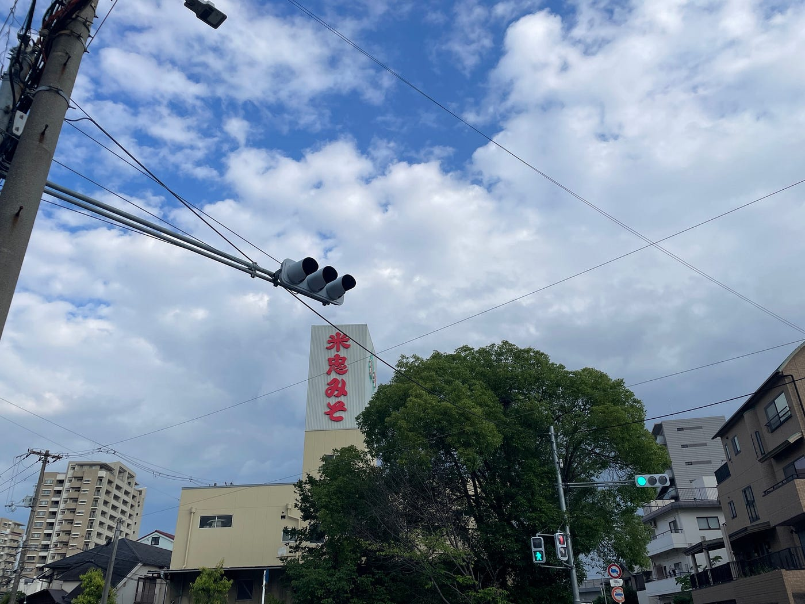
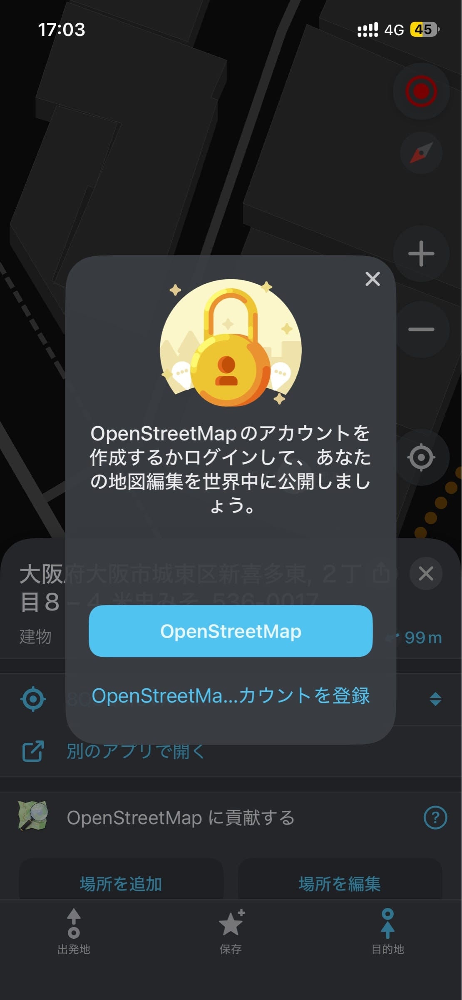
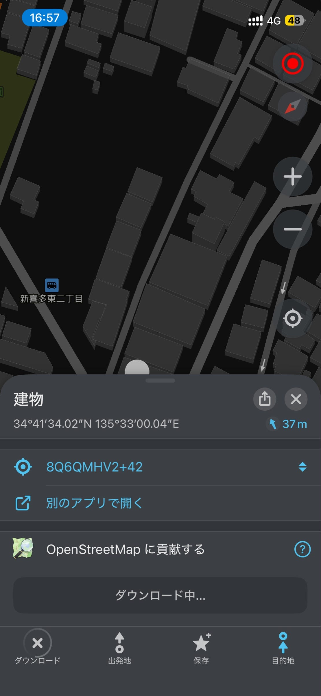
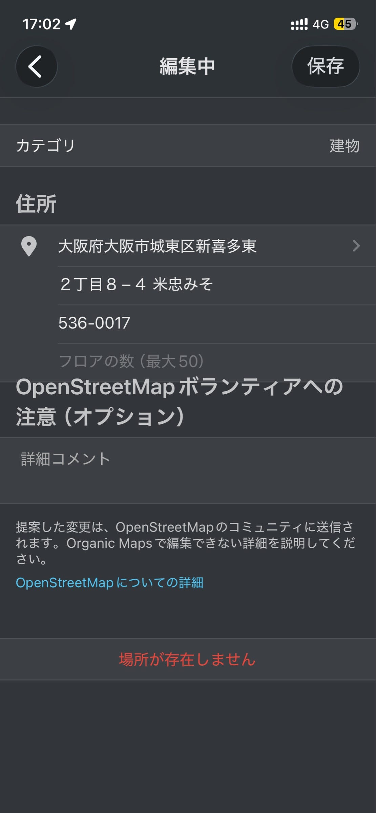
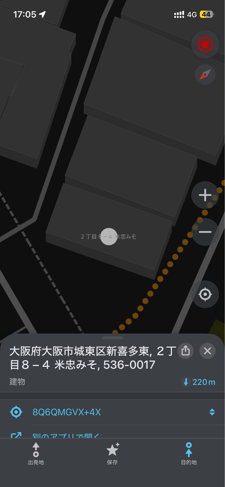
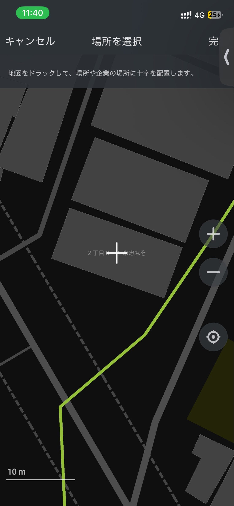
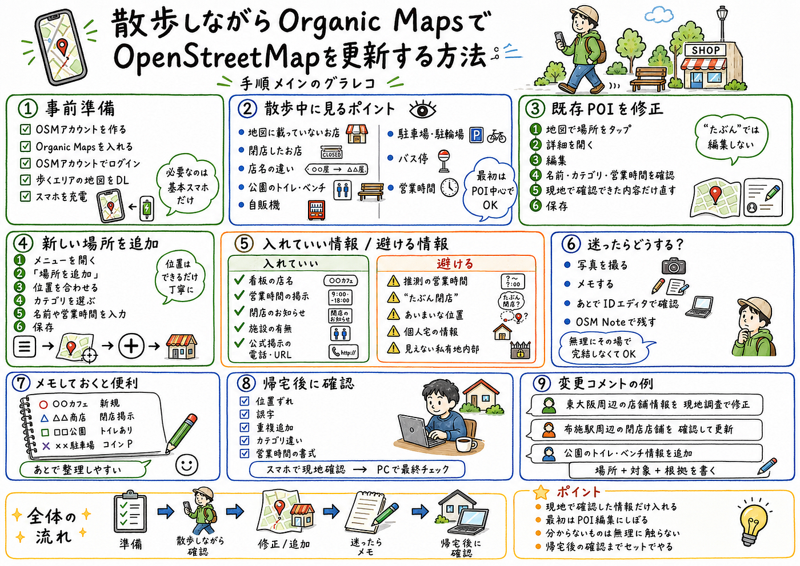

### 散歩しながらOrganic MapsでOpenStreetMapを更新してみる（Youth2）

Youth2の佐藤です！

フィールドワーク会です。

散歩ついでにOrganic Mapsを使ってOpenStreetMapを更新してみました。

OpenStreetMapは、みんなで作る地図です。Organic MapsはそのOSMのデータを使っている地図アプリで、スマホからお店や施設などの情報を追加・修正できます。

今回は、難しい道路編集や建物編集ではなく、散歩中に見つけたお店・施設・閉店情報などを更新する、かなりライトなフィールドワークとしてやってみました。

[https://strava.app.link/YfqAwtDn03b](https://strava.app.link/YfqAwtDn03b)

### まず準備するもの

必要なのは、基本的にはスマホだけです。

事前にやっておくことはこのあたりです。

1. OpenStreetMapのアカウントを作る

1. Organic Mapsをスマホに入れる（大町合宿でも使った？）

1. Organic MapsでOSMアカウントにログインする

1. 歩くエリアの地図をダウンロードしておく

1. スマホの充電をしておく

Organic Mapsはオフラインでも地図が見られるので、先に地図をダウンロードしておくと安心です。散歩中に通信が不安定でも使いやすいです。

### 散歩中に見るポイント

歩きながら見るのは、地図と実際の街のズレです。

たとえば、こんなところを確認します。

- 地図に載っていないお店がある

- 地図上のお店がすでに閉店している

- 店名が変わっている

- 公園にトイレやベンチがある

- 自動販売機がある

- 駐車場や駐輪場がある

- バス停の位置が違う

- 営業時間が現地の掲示と違う

最初は、道路や建物の形を直そうとしなくて大丈夫です。スマホでやるなら、お店や施設などのPOI更新に絞るのがやりやすいです。

### 既にある場所を修正する

地図上にすでに載っている場所を修正する場合は、Organic Mapsでその場所をタップします。

流れはこんな感じです。

1. Organic Mapsを開く

1. 修正したいお店や施設をタップする

1. 詳細画面を開く

1. 編集ボタンを押す

1. 名前、カテゴリ、営業時間などを確認する

1. 現地で確認できた内容だけ修正する

1. 保存する

たとえば、地図では営業中になっているけど、現地では閉店の貼り紙がある場合は、閉店情報として修正します。

逆に、「たぶん閉店してそう」くらいなら、すぐに編集しない方がいいです。OSMは現地で確認できる情報を入れるのが大事です。

### 新しい場所を追加する

地図に載っていないお店や施設を見つけたら、新しく追加できます。

流れはこんな感じです。

1. Organic Mapsのメニューを開く

1. 「OpenStreetMapに場所を追加」を選ぶ

1. 地図上で場所を合わせる

1. カテゴリを選ぶ

1. 名前や営業時間などを入力する

1. 保存する

例:米忠味噌(株)

Organic Mapsの地図を改善しました.

アプリから直接地図に新しい場所を追加したり、既存の場所を編集できます。

https://omaps.app/get











位置はできるだけ丁寧に合わせます。お店の場合は、建物の真ん中よりも入口に近い位置の方が分かりやすいこともあります。

ただ、迷ったら無理にその場で決めなくていいです。メモだけ残して、あとでPCから編集する方が安全です。

### 建物だけで終わらせず、タグを付ける

OpenStreetMapでは、建物の形だけが登録されていることがある。

たとえば、地図上に建物は表示されているが、それが何の施設なのか分からない状態である。

```ini
building=yes
```

この状態では、地図上には建物として表示される。しかし、「味噌工場」「直売所」「カフェ」などの施設としては検索に出にくい。

そこで必要になるのが、タグ付けである。

タグを追加することで、その場所が何であるかをOpenStreetMapに伝えることができる。

### 味噌工場の場合

今回のように味噌工場を登録する場合は、建物に名前と工場としての情報を追加する。

基本形は以下の通りである。

```ini
building=industrial
man_made=works
name=○○味噌
product=food
source=survey
```

それぞれの意味は以下の通りである。

タグ意味`building=industrial`工場・産業用の建物`man_made=works`工場・製造所`name=○○味噌`施設名・会社名`product=food`食品を製造していること`source=survey`現地調査で確認した情報

味噌を製造していることまで明確にしたい場合は、以下のように記述することもできる。

```ini
product=miso
```

ただし、タグとしての安定性を考えると、まずは `product=food` として登録する方が無難である。必要に応じて、説明欄に以下のように補足してもよい。

```ini
description=味噌工場
```

### 建物全体が工場なら、建物にタグを付ける

建物全体が味噌工場として使われている場合は、その建物自体にタグを追加する。

```ini
building=industrial
man_made=works
name=○○味噌
product=food
```

これにより、単なる建物ではなく、「食品を製造している工場」として意味づけることができる。

### 直売所がある場合は別に登録する

工場に直売所がある場合は、工場とは別に登録した方が分かりやすい。

工場本体は以下のように登録する。

```ini
building=industrial
man_made=works
name=○○味噌
product=food
```

直売所は、別のPOIとして以下のように登録する。

```ini
shop=food
name=○○味噌 直売所
```

工場と直売所では役割が異なる。そのため、同じ建物内にあっても、利用者向けの情報としては分けて登録した方が分かりやすい。

### ほかの場所ではどう考えるか

タグ付けでは、「名前」だけでなく「カテゴリ」を入れることが重要である。

場所例のタグカフェ`amenity=cafe`レストラン`amenity=restaurant`コンビニ`shop=convenience`食品店`shop=food`トイレ`amenity=toilets`駐車場`amenity=parking`工場`man_made=works`工場建物`building=industrial`

たとえば、以下のように名前だけを入れても、それが店なのか、工場なのか、公共施設なのか分かりにくい。

```ini
name=○○味噌
```

検索で見つかりやすくするには、名前に加えて、その場所の種類を示すタグを入れる必要がある。

```ini
man_made=works
name=○○味噌
product=food
```

### 現地調査で確認した情報だけを入れる

タグを付けるときは、現地で確認した情報だけを入れる。

入力してよい情報の例は以下である。

- 看板に書かれている名称

- 工場・直売所などの用途

- 営業時間の掲示

- 閉店・移転のお知らせ

- 公式に掲示されている電話番号やURL

一方で、推測による入力は避けるべきである。

避けるべき情報は以下である。

- 推測の営業時間

- 「たぶん工場」程度のあいまいな判断

- 個人宅の情報

- 私有地内部の見えない情報

- ネットで見ただけで現地確認していない情報

OpenStreetMapでは、検証可能な情報を入れることが重要である。




### まとめ

建物だけが登録されている場合、そのままでは「何の建物か」が分からない。

今回のような味噌工場では、建物に `building=industrial` を付け、さらに `man_made=works`、`name=*`、`product=food` を追加することで、工場として意味づけることができる。

直売所がある場合は、工場とは別に `shop=food` のPOIとして追加する。

OpenStreetMapでは、建物の形を描くだけでなく、「そこに何があるのか」をタグで表すことが重要である。

### 入れていい情報・入れない方がいい情報

入力していいのは、現地でちゃんと確認できた情報です。

たとえば、

- 看板に書いてある店名

- 営業時間の貼り紙

- 閉店のお知らせ

- 施設の存在

- 公園のトイレやベンチ

- 公式に掲示されている電話番号やURL

こういうものは更新しやすいです。

逆に、推測で入れるのは避けます。

- たぶん営業時間はこのくらい

- たぶん閉店している

- たぶんこの建物の中にある

- 個人宅っぽい情報

- 私有地の中の見えない情報

分からないものは、編集せずにメモで残すくらいで十分です。

### カテゴリに迷ったら

Organic Mapsでカテゴリを選ぶときに、「これ、どれにすればいいんだ？」となることがあります。

その場合は、無理に近そうなカテゴリを選ばなくてOKです。

たとえば、よく分からない施設を適当に「店」として登録してしまうと、後で修正が必要になります。

迷ったときは、

- 写真を撮る

- メモする

- あとでOpenStreetMapのiDエディタで確認する

- OSM Noteとして残す

くらいが無難です。

### 散歩中にメモしておくと便利

その場で全部編集しようとすると疲れるので、メモを残しながら歩くのがおすすめです。

メモはかなり雑で大丈夫です。

例：

- 〇〇カフェ、新しくできてる

- △△商店、閉店の貼り紙あり

- □□公園、トイレあり

- ××駐車場、コインパーキング

- この店、営業時間あとで確認

あとでブログを書くときにも、このメモがあるとかなり楽です。

### 帰ってから確認する

散歩が終わったら、OpenStreetMapのサイトで自分の編集を確認します。

見るポイントはこのあたりです。

- 位置がずれていないか

- 名前に誤字がないか

- 同じ場所を重複して追加していないか

- カテゴリが変じゃないか

- 営業時間の書き方がおかしくないか

スマホでの編集は手軽ですが、細かい確認はPCの方がやりやすいです。

なので、散歩中はざっくり現地確認、帰宅後にPCでチェック、という流れにするとかなり安定します。

### 変更コメントも書いておく

OSMに編集を反映するときは、何をしたのか分かるコメントを残しておくと親切です。

たとえば、

- 東大阪周辺の店舗情報を現地調査で修正

- 布施駅周辺の閉店店舗を確認して更新

- 公園のトイレ・ベンチ情報を追加

- 散歩中の現地確認に基づきPOIを更新

みたいな感じです。

「修正」だけだと何をしたのか分かりにくいので、場所・対象・根拠を軽く入れるとよいです。

### 今回の流れ

今回やった流れをまとめると、こんな感じです。

1. Organic Mapsを開く

1. 現在地周辺の地図を見る

1. 実際の街と地図を見比べる

1. 間違っているPOIを修正する

1. 地図にないPOIを追加する

1. 迷うものはメモに残す

1. 帰宅後にOSMで確認する

1. 必要ならPCで追加修正する

これだけです。

### まとめ

Organic Mapsを使うと、散歩しながらOpenStreetMapを更新できます。

最初から難しい編集をする必要はなくて、まずはお店、施設、公園設備、閉店情報みたいな分かりやすいものからで十分です。

大事なのは、現地で確認した情報だけを入れること。分からないものは無理に編集しないこと。そして、帰ってから一度確認することです。

散歩がそのまま地図づくりになるので、OSMのフィールドワーク入門としてかなりやりやすい方法だと思います。

#### グラレコ


