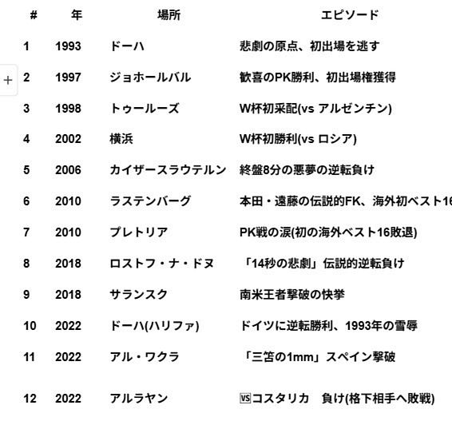
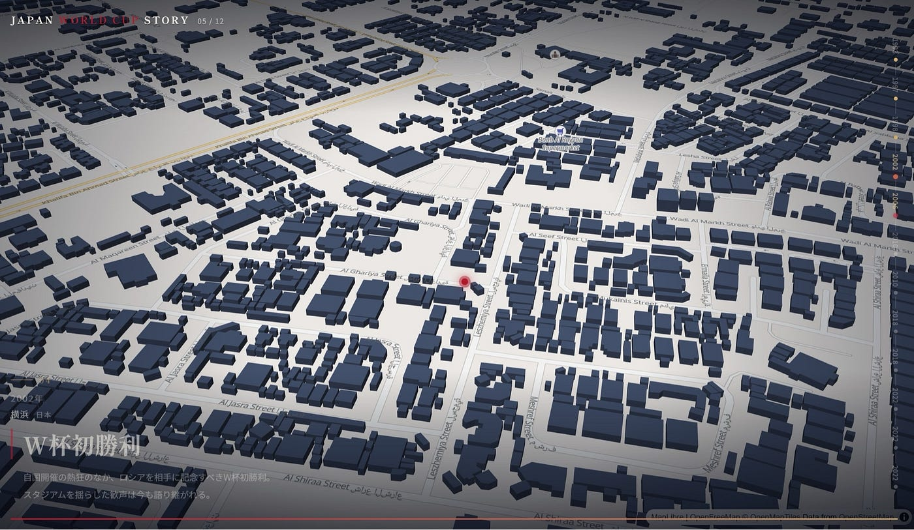
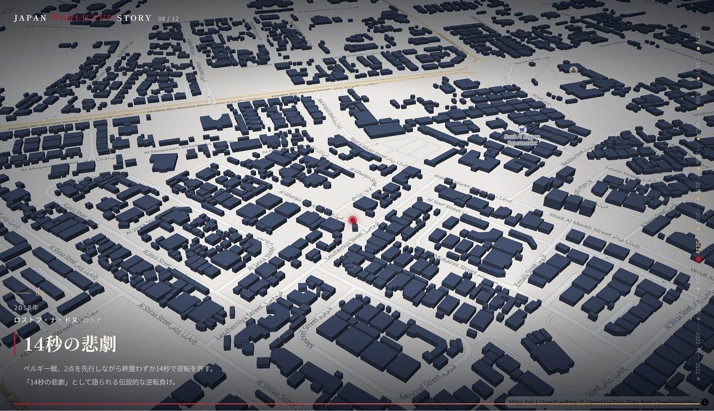
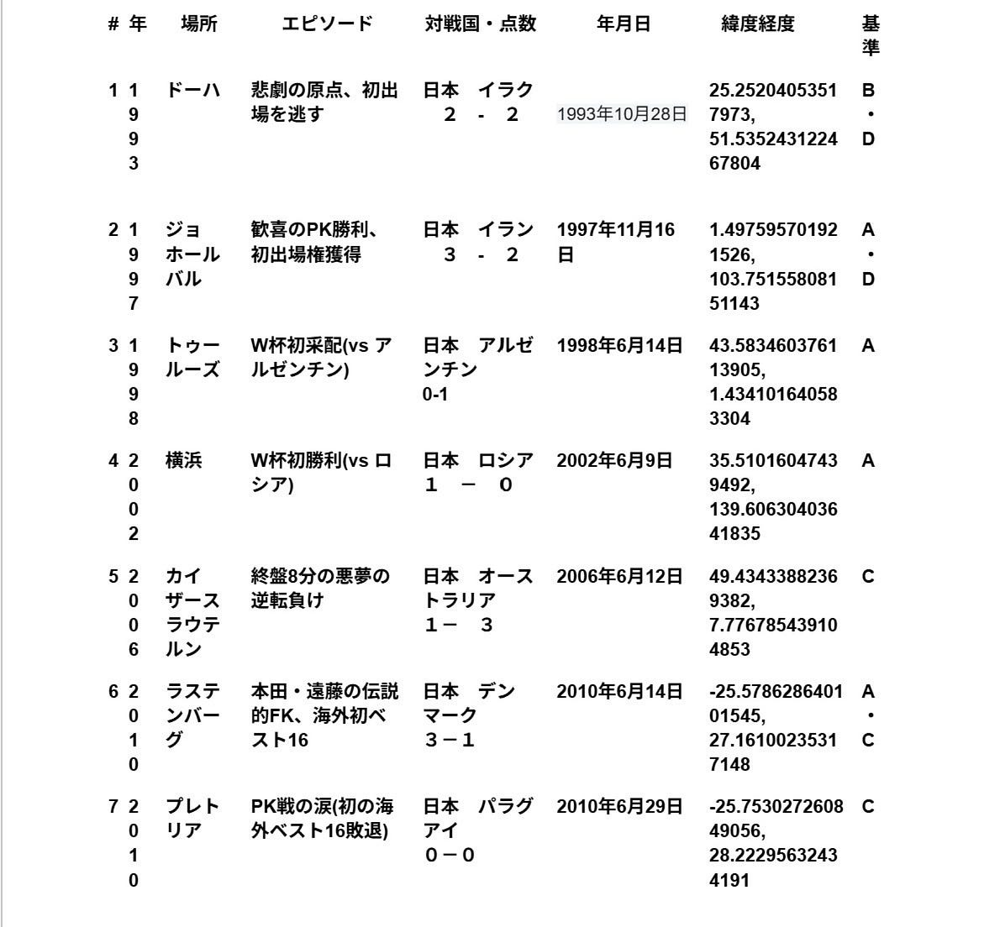
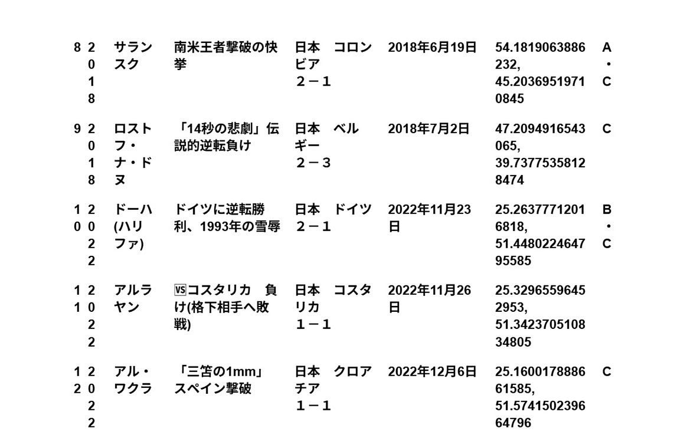
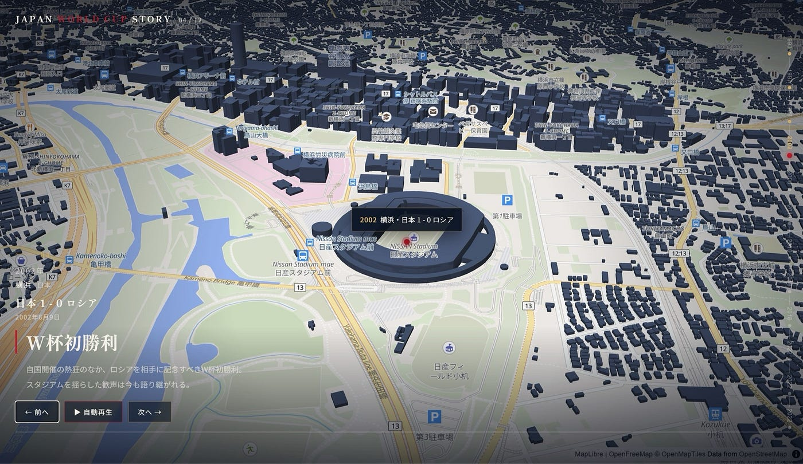
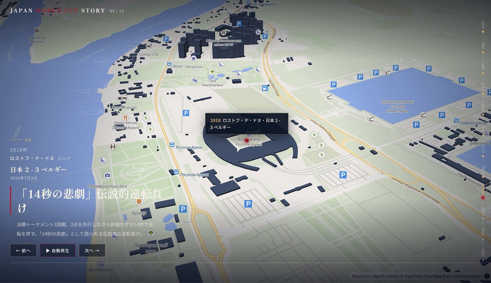
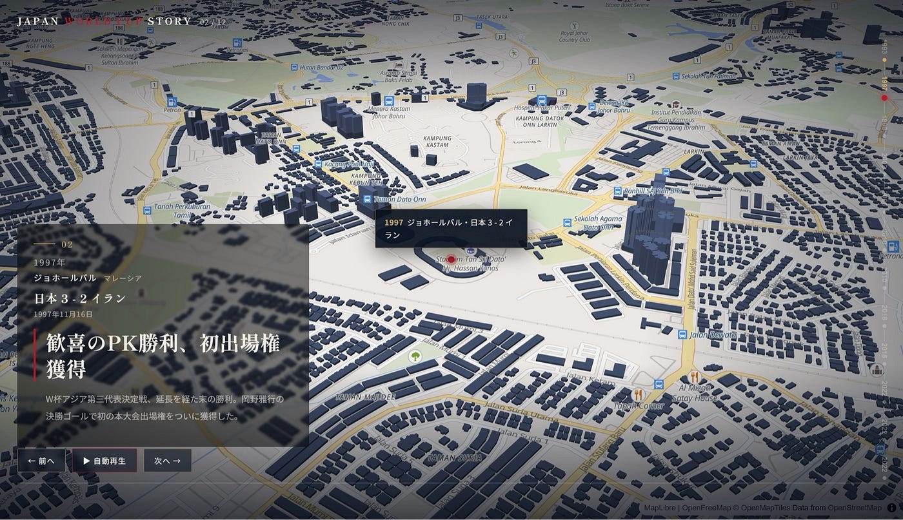
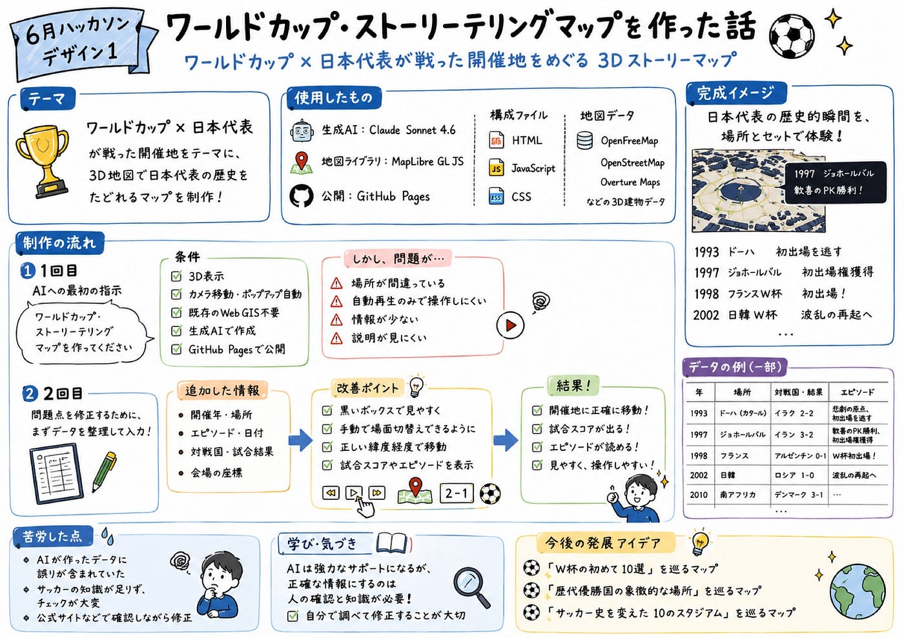

6月ハッカソン［デザイン1］

こんにちは、3年の藤原です。先週末にドローン部であった合宿で初めて横瀬に行ってきました。天候はあいにくの雨でしたが、おいしいごはんを食べてドローンを飛ばしてリフレッシュして帰ってきました。

さて、今回のハッカソンでは、ワールドカップ・ストーリーテリングマップを作るということで私たちのグループテーマはワールドカップ×日本代表が戦った開催地です。

私たちのグループの中にはサッカーに詳しい人がいなくて、テーマ決めから少し苦戦しました。😅

#### 主な作業内容

まず、日本代表が戦った開催地では、テーマがざっくりしすぎているので大会ごとの有名な試合を選出しました。

今回使用した生成AIはClaudeのSonnet 4.6です。

### 1回目

ファーストトライは、上に貼ってある開催地の表の内容を読み取らせ、以下のプロンプトを使って作成しました。

プロンプト内容

> ワールドカップ・ストリーテリングマップを作ってください

> 条件は以下の通りです。

> 3D表現とする

> カメラワークは直下視は原則禁止

> カメラワークは自動的に動き、ポップアップ表示なども自動化する。

> 既存のウェブGISプラットフォームは使わずに、生成AIで作成する

> 公開先は GitHub Pages に置く。

> 使用する JavaScrpit ライブラリは MapLibre GL JS を用いること

> 生成するファイルは html, js, css その他、GitHub Pages の Static サイトとして公開すること

> 使用する 3Dマップは OpenFreeMap もしくは、その他 OpenStreetMap，OvertureMaps などの3d建物データが格納されているデータセットとする

しかし、この時点でできたものを確認してみると、いくつかの問題点がありました。

#### 問題点

- マップに記載されている開催地の場所が誤っている

→かなりやばい

- 自動再生のみで自分たちで手動で動かせない

→戻ったり先に進んだりできないので自分達が見たい場面まで繰り返し戻るのを待つしかなく、かなり不便

- 情報が薄い

→もう少し内容を伝えたい

- 左下の説明が見にくい

などのいくつかの修正点が見つかりました。

### 2回目

1回目に出てきた問題点を修正するために、まず初めに、開催会場の緯度と経度を調べ、その数値を入力しました。

マップに記載する情報を開催年と場所、エピソードだったところをさらに開催日時、相手国、対戦スコア、会場座標を入力することにしました。

また、説明の見にくさを解消するために透明度50%の黒いボックスを追加しました。

そして最後に手動でも操作できるようにするため、プロンプトを次のように作成しました。

#### プロンプト

> 以上の情報を使って、スタジアムの緯度経度、日付、対戦国、勝敗、手動で場面替えが行えるように修正して、作成しなおしてください

と指示しました。

#### 修正後

修正後は会場の場所も正しく表示され、スコアも出てくることでより見やすくなりました。

#### 苦労した点

苦労した点は、やはり問題点で挙げたように自分たちが指示した内容とAIが作り上げたものの内容が絶対に合っていることはなく、誤った情報が含まれてしまったことです。

また、作成している私たち自身も詳しくないサッカーの分野だったので、私たちも作成されたものをひとつひとつ一時停止しながら、場所やスコア、内容について手分けしてワールドカップの公式サイトなどを確認しながら進めました。

#### レポジトリ

[GitHub - furuhashilab/Design1
Contribute to furuhashilab/Design1 development by creating an account on GitHub.github.com](https://github.com/furuhashilab/Design1)

#### 成果物

[日本代表 ワールドカップ・ストーリーテリングマップ
サッカー日本代表のワールドカップにまつわる12の物語を、3Dマップ上の自動カメラワークで辿るストーリーテリングマップfuruhashilab.github.io](https://furuhashilab.github.io/Design1/)

#### グラレコ

AI作成です

