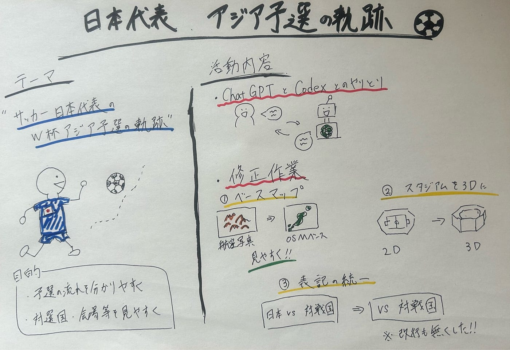

### 【6月ハッカソン】日本代表のアジア予選をストリーテリング

こんにちは、4年の井上です！最近はワールドカップのせいで生活習慣が乱れてしまいとにかく朝起きるのがしんどいです。日常生活に大きな支障が出ない程度に4年に1度のこの祭典を楽しみたいところです。

さて、今回のハッカソンはそのFIFAワールドカップにまつわるハッカソンです。

> ハッカソン内容

今回のハッカソンでは、**AIを活用したストーリーテリングマップ**を作成しました。ハッカソンの具体的な内容については[こちら](https://github.com/furuhashilab/README/issues/42#issuecomment-4714629793)をご覧ください。

> 私たちのテーマ

私たちは、W杯本大会に至るまでの**「日本代表のアジア予選の軌跡」**に注目しました。

日本代表の試合を一つひとつ追いながら、対戦国、試合会場、移動の流れをストーリーとして表現することを目標にしました。特に、「どこで戦ってきたのか」が一目で伝わるようにし、日本代表の予選突破までの道のりをより立体的に見せることを意識しました。また、単に情報を表示するだけでなく、シーンの切り替えやポップアップの表記にもこだわりました。見る人がテンポよく読み進められるように、表記の統一や不要な改行の修正にも取り組みました。

> 活動内容

基本的な活動とし、まずGPT-5.5でプロンプトを作成し、そのプロンプトをCodexに入力することで、ストーリーテリング動画を作成しました。

出来上がった作品をその都度修正しながら完成度を高めていきました。 主な修正内容としては**ベースマップ**と**表記ずれの修正**でした。

まず、ベースマップの修正についてです。当初は航空写真のような見た目になっていましたが、今回はアジア予選の流れや位置関係をわかりやすく見せることを重視し、OSMベースの地図に変更するように指示しました。航空写真はリアルさがある一方で、情報が読み取りにくくなる場合があるため、ストーリーマップとしての見やすさを優先しました。また、スタジアムにアップしていった際の3Dデータ表示にも修正を加えました。プロンプト上では「スタジアムを3Dデータで表示する」と指示していましたが、なかなか思ったように修正されずかなり苦戦しました。作業時間のほとんどはこの部分の修正だった気がしています(笑)

表記ずれに関してはポップアップやシーン切り替え時の表記に注意して修正を加えました。具体的に修正した点としては、「日本代表VS対戦国」という表記になっていましたが、これを「VS 対戦国」という形に統一しました。また、「VS オーストラリア」などの表記が途中で改行されないように調整しました。これによってAI作成動画の違和感を軽減でき、より見やすい動画にすることができました。

ChatGPTとのやり取りを通じて、プロンプトを何度も修正し、少しずつ理想の形に近づけていくことができました。

> 完成品

苦労の結果完成した作品がこちらになります。

[SAMURAI BLUE 2026 — 北中米W杯への軌跡](https://furuhashilab.github.io/Youth2_Hackathon/)

そして、私たちの活動記録をまとめたGitHubリポジトリが[こちら](https://github.com/furuhashilab/Youth2_Hackathon)になります。また、プロンプト作成に用いたChat GPTとのチャット履歴は[こちら](https://chatgpt.com/share/6a393c85-7130-83ee-80d1-d95b53407fcf)になります。

> まとめ・感想

今回は3年生のこうさく君とれあら中心に取り組んでもらったので二人に感想を聞いてみました。

れあら：「難しかった点は、OSMの地図表示から3Dスタジアム表示への切り替えや、カメラワークの動きを一貫して設計するところです。
また、左パネル表示や改行禁止などUIルールが細かく、情報の見せ方を整理するのが大変でした。」

こうさく：「今回のハッカソンを通じて、AIは抽象的な指示だけでは意図通りに動かず、秒数やフォント、色などを具体的に指定することが重要だと学びました。また、細かな条件まで言語化する難しさを実感できる良い経験になりました。」

今回のハッカソンでは、「日本代表の今大会のアジア予選の軌跡」をテーマに、ストーリーマップの改善に取り組みましたが、地図を使って試合会場や対戦国をたどることで、日本代表が本大会に向けて歩んできた道のりを、よりわかりやすく表現できたと思っています！

活動を通じて、AIを活用した制作では、曖昧な指示ではなく、目的や条件を具体的に伝えることが重要だと感じました。特に地図表現や3D表示のように、データや表示環境が関わるものでは、プロンプトの工夫だけでなく、技術的な前提を理解することが必要だと痛感しました。

最後にグラレコです。

