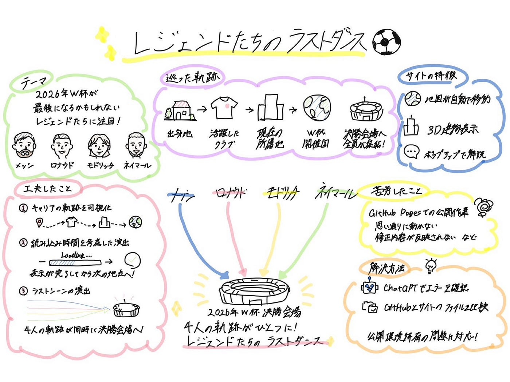

## VF6月ハッカソン

こんにちは！3年の野中です。

今回のハッカソンでは、ワールドカップ・ストーリーテリングの制作を行いました。

私たちVFは｢レジェンドたちのラストダンス｣をテーマとして、メッシ、ロナウド、モドリッチ、ネイマールなど、サッカー界を代表する選手たちの軌跡を巡りました。

> テーマ

今回私たちが注目したのは「2026年ワールドカップが最後の大会になるかもしれない選手たち」です。

- 選手の出身地

- 活躍したクラブの所在地

- 現在の所属地

- ワールドカップ開催国

以上のような軌跡を巡り、最終的には今大会の決勝戦会場に全員が集まるというストーリーにしました。

今回使用したAIはOpenAICodex GPT5.5です。

制作したサイトでは、地図上をカメラが自動で移動しながら各地点を巡ります。

各地点では説明文やポップアップが表示され、選手たちのキャリアやその場所との関わりを知ることができます。

また、OpenFreeMapのデータを利用し、建物を3D表示することで、より臨場感のある表現にすることができました。

> 工夫したこと

1. 4人のキャリアの軌跡を可視化したこと

単に出身地を紹介するだけではなく、それぞれの選手が歩んできたキャリアを線で結びながら表現しました。これにより、選手がどのような道を歩み、世界的なスターへと成長していったのかを視覚的に理解できます。

2. 読み込み時間を考慮した演出

3Dマップはデータ量が多く、地点によっては建物の読み込みに時間がかかる場合があります。そこで、マップの読み込み状況を考慮し、表示が完了してから次の地点へ移動するよう工夫しました。これにより、建物が表示される前にシーンが切り替わってしまう問題を防ぎ、より快適に閲覧できるようにしました。

3. 「ラストダンス」を表現するラストシーン

ストーリーの最後では、4人それぞれのキャリアを表す線が同時に2026年ワールドカップ決勝会場へ集結します。異なる国やクラブで活躍してきた4人が、最後に同じ舞台へ向かう姿を表現することで、「レジェンドたちのラストダンス」というテーマを印象的に締めくくることができました。

> 苦労したこと

今回苦労したのは、GitHub Pagesでの公開作業でした。

サイトでは正常に動作しているにもかかわらず、GitHub Pagesでは期待通りに動作しない場面が何度もありました。

特に、

- 思い通りに動かない

- 修正内容が反映されない

などといった問題に苦戦しました。

> 解決方法

問題が発生した際には、ChatGPTを利用してエラー内容を確認しました。

コードに誤りや不足している点がないか、しっかりと保存・アップロードできているかなどの確認を、AIを使用しながら行いました。

また、GitHub上のファイルとストーリーテリングサイトのファイルを比較しながら作業を進めることで、公開環境特有の問題にも対応することができました。

> ストーリーテリング

完成したものは[こちら](https://furuhashilab.github.io/WorldCup2026_LegendsHistory/)です！

> グラレコ

