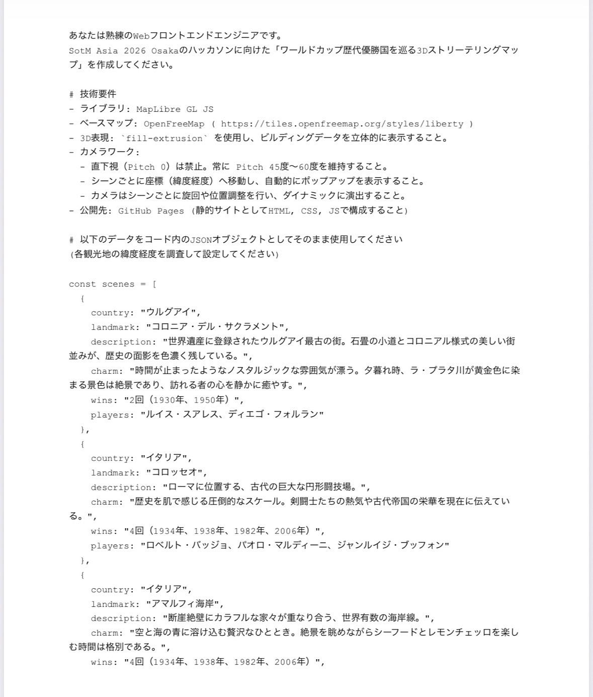
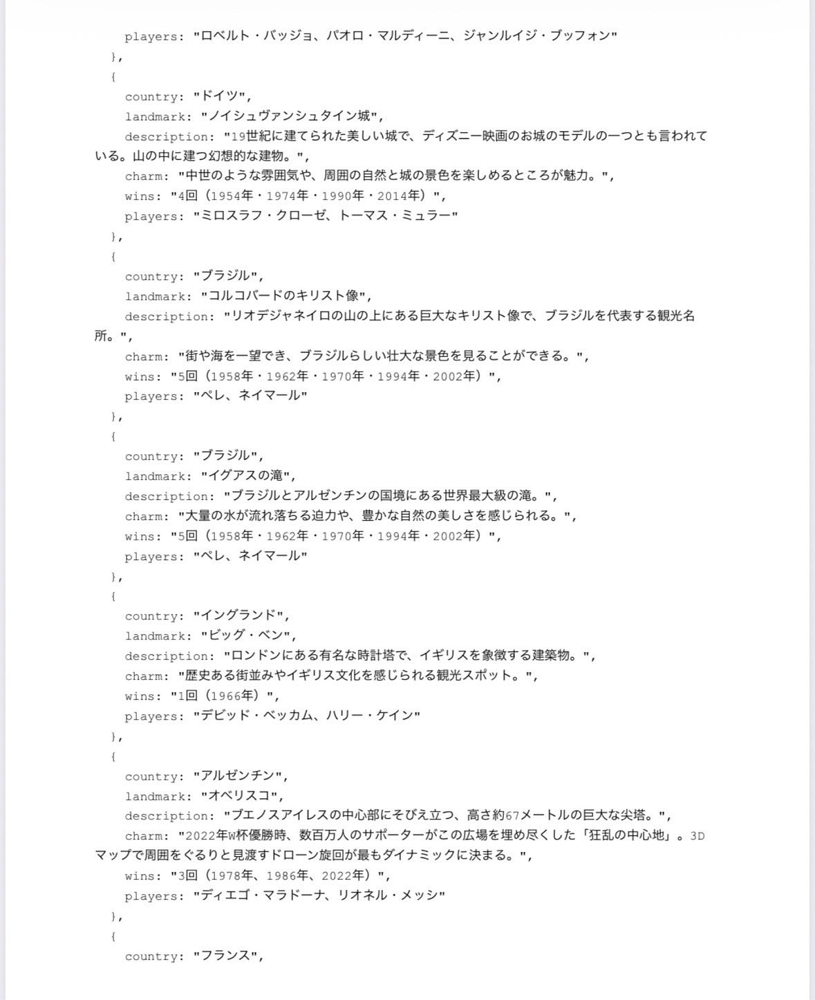
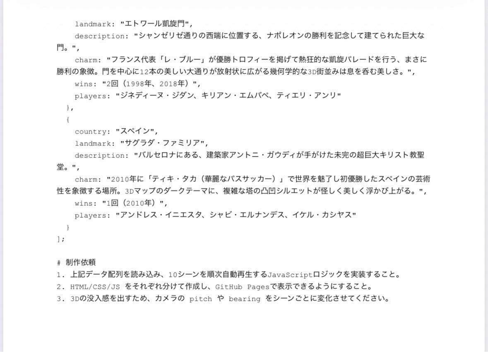
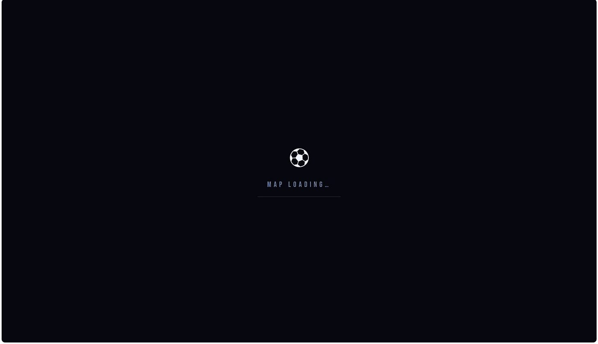
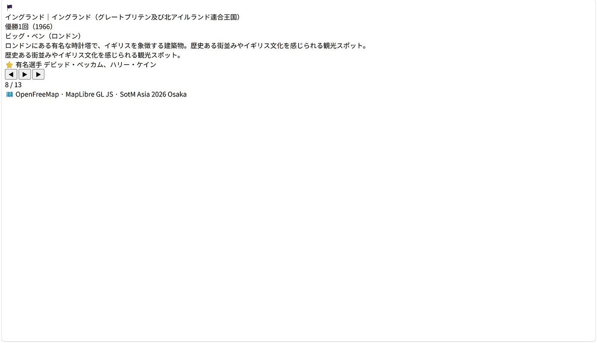
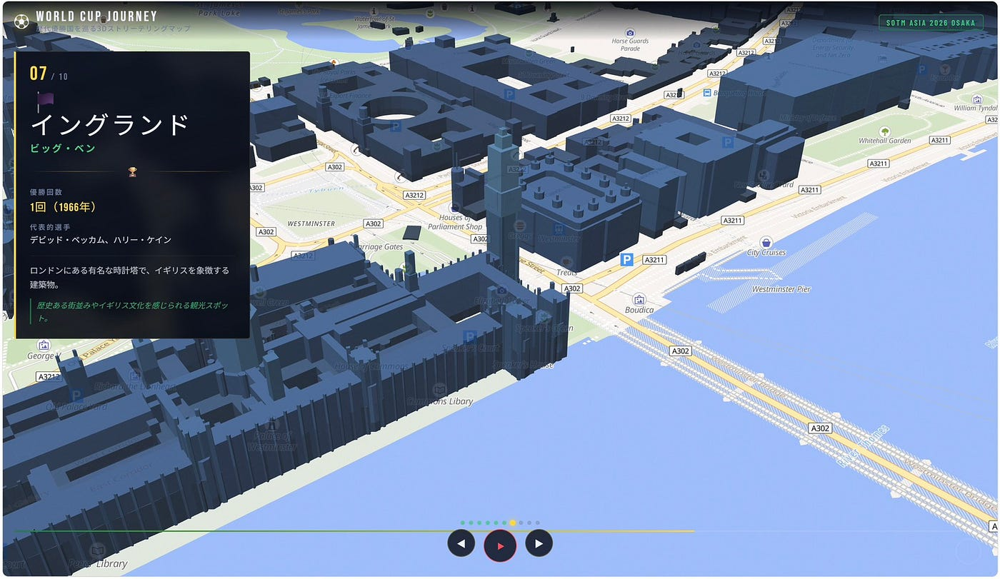
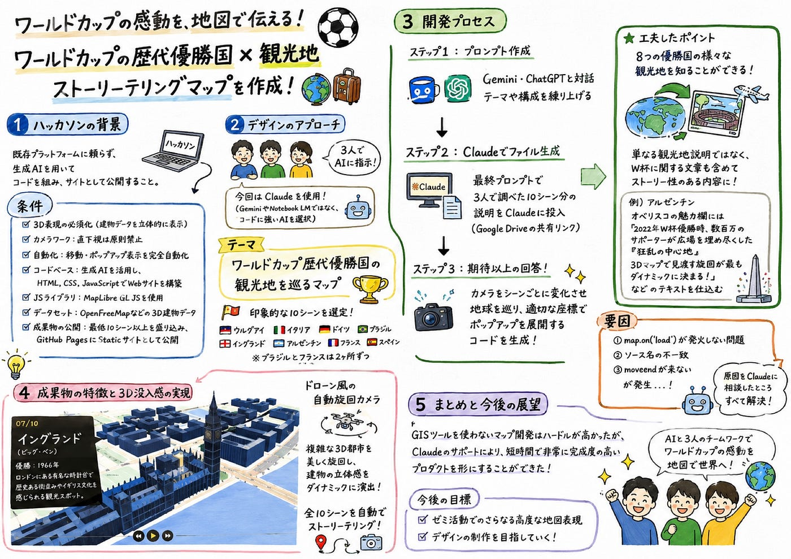

### ６月 ハッカソン デザイン２

こんにちは、デザイン2のみわです！

今回のハッカソンでは、ワールドカップのストリーテリングマップを作成することになりました！⚽️

私たちデザイン2は、主にClaudeを使用し、「ワールドカップの歴代優勝国✖︎観光地」をテーマにストーリーテリングを行いました！🌍🧳

サッカーをあまり詳しく知らない人でも、観光地とセットで知ることで、よりイメージがわきやすくなります！

以下が制作の流れです！

1. ハッカソンの背景

今回提示されたハッカソンの要件は、既存のプラットフォームに頼らず、生成AIを用いてコードを組み、サイトとして公開するというものでした。

> 具体的な条件は以下の通りです⬇️
・3D表現の必須化：建物データを立体的に表示する
・カメラワーク：直下視は原則禁止
・自動化：各シーンへの移動、およびポップアップ表示を完全に自動化
・コードベース：生成AIを活用し、HTML、CSS、JavaScriptで構成されたWebサイトを構築
・JavaScriptライブラリ：MapLibre GL JS を用いる
・データセット：OpenFreeMapなど、3D建物データが格納されているデータセットを利用する
・成果物の公開：最低10シーン以上を盛り込み、GitHub PagesにStaticサイトとして公開する

2. デザイン2のアプローチ

私たちは、メンバー3人でAIに指示する内容を考え、プロンプトをブラッシュアップしました。今回は前回使用していたGeminiやNotebook LMではなく、Claudeというコードに強いAIを使用しました✍️

※ 今回はClaudeのプロ版ではないバージョンを使用しました。

Claude＝Sonnet 4.6, 2026 – 6 – 20~23

**完成した構成**
まず、歴代のワールドカップ優勝国（**ウルグアイ、イタリア、ドイツ、ブラジル、イングランド、アルゼンチン、フランス、スペイン**）の中から10個の印象的なシーンを選定することが決まりました。（ブラジルとイタリアは2ヶ所選びました。）また、各国の象徴的な観光地やその魅力、W杯の優勝年、有名選手などの情報をみわ、もえさん、ゆうかさんで手分けして集めました。

3. 開発プロセス

**ステップ1**：プロンプトを作成
まずはGeminiやChat GPTを対話パートナーにしてテーマや構成を練り上げました。

**ステップ2**：Claudeによるファイル生成
最終的に完成させたプロンプト(↑)で、3人で調べた10シーン分の説明をClaudeに投入（Claudeの共有リンク）。

Claudeへ上記プロンプト投げ、ファイルが生成されました。カメラをシーンごとに変化させながら、自動で地球を巡り、適切な座標でポップアップを展開するコードが完成しました。

工夫したポイント：8つの優勝国の様々な観光地や情報を知ることができる！

単なる観光地説明だけでなく、ワールドカップに関する文章も含まれています。例えば、アルゼンチンの「オベリスコ」の魅力欄には、『2022年W杯優勝時、数百万人のサポーターがこの広場を埋め尽くした「狂乱の中心地」。3Dマップで見渡す旋回が最もダイナミックに決まる』といったテキストを仕込むなど工夫しました。

この調子で、用意したデータを取り入れて、プロンプトを完成させたは良いものの、ここでまさかの問題発生。。。

ずっとローディングの状態で動かなくなってしまいました涙

要因⬇️

上の2枚の要因が自力では全く分からなかったため、

Claudeに聞いてみたところ、

①map.on(‘load’)が発火しない問題がメインの原因

②ソース名の不一致

③moveendが来ない

が挙げられました。

結果として、上記の要因と一緒にClaude に新しく提案してもらったファイルを読み込んだところ上手く行きましたが同じような不備が目つかり次第、この要因が正しいのか解明しようと思います。

4. 成果物の特徴と3D没入感の実現

ドローン風の自動旋回カメラ： フランスのエトワール凱旋門や、スペインのサグラダ・ファミリアなど、複雑な3D都市シルエットを持つ場所では、カメラが自動で美しく旋回し、建物の立体感をダイナミックに浮かび上がらせます。

また、優勝した年代順に並べることで、ストーリー性を感じられるようにしました。

[World Cup Journey - 3D Storytelling Map
inadayuka.github.io](https://inadayuka.github.io/Design2/)

5. まとめと今後の展望
既存のGISツールを使わないストーリーテリングマップの開発という、一見するとハードルの高い課題でしたが、メンバーでの案の出し合いと Claudeでの生成によって、形にすることができました！

チームメンバーの協力がなければここまで辿りつけませんでした涙もえさん、ゆうかさんありがとうございます😭

今後のゼミ活動でもさらに高度な地図表現やデザインの制作を目指していきたいです！

グラレコ

