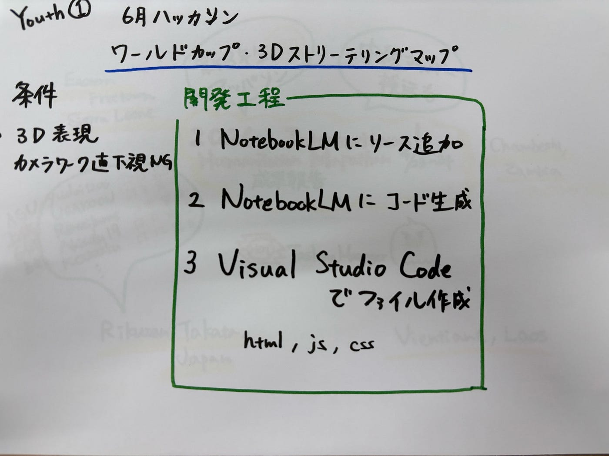

### 【Youth①6月ハッカソン】ワールドカップ・3Dストリーテリングマップ

こんにちは、Youth①の岡村です。

この週報では、ハッカソンの成果報告をします。

#### 今回のハッカソンの概要

> 「6月 ワールドカップ・ストリーテリングマップを作る」

> 「条件」

> 3D表現とする

> カメラワークは直下視は原則禁止

> カメラワークは自動的に動き、ポップアップ表示なども自動化する。

> 既存のウェブGISプラットフォームは使わずに、生成AIで作成する

> 公開先は GitHub Pages に置く。

> 使用する JavaScrpit ライブラリは MapLibre GL JS を用いること

> 生成するファイルは html, js, css その他、GitHub Pages の Static サイトとして公開すること

> 使用する 3Dマップは OpenFreeMap もしくは、その他 OpenStreetMap，OvertureMaps などの3d建物データが格納されているデータセットとする

> ワールドカップに関連するテーマの表現であればなんでも良い。

> カメラシーンは最低10シーン以上とする

> 参考情報

> SotM Asia 2026 Osaka
[https://stateofthemap.asia/](https://stateofthemap.asia/)

私たちYouth①は、主に[NotebookLM](https://www.genspark.ai/?utm_source=yahoo&utm_medium=cpc-search&utm_campaign=JP-jp-competitors-insertion&utm_term=competitors-insertion&yclid=YSS.1001372507.EAIaIQobChMI_b2XmoqclQMVikgsBR1JOhpUEAAYASAAEgJD8vD_BwE&sa_p=YSA&sa_cc=1001372507&sa_t=1782173653743&sa_ra=0A)を使用し、2026 FIFAワールドカップ出場国の一つであるカーボベルデに焦点を当て、ストーリーテリングを行いました。

#### 完成品

・デモサイト [https://furuhashilab.github.io/Youth1/](https://furuhashilab.github.io/Youth1/)
・GitHub [furuhashilab/Youth1](https://github.com/furuhashilab/Youth1)

#### 開発工程

**ステップ1**：NotebookLMにソースを追加
MapLibre GL JSとカーボベルデの情報が書かれたウェブページをソースとして追加しました。

**ステップ2**：NotebookLMにコードを生成してもらう
追加したソースだけをもとに生成してくれるので、今回のハッカソンの条件にあったコードを生成してくれました。
ChatGPTに同様のプロンプトでお願いしても、OpenStreetMapをベースにコーディングできなかったり、コーディング自体にエラーがでたりしました。

**ステップ3**：Visual Studio Codeでファイル作成
html, js, cssのファイルを作成しました。

#### 取り組んだ感想

課題の条件として、既存のプラットフォームを使用せず、生成AIを用いてコードを書かなければいけなかったので、難しかったです。
まずは、どのAIを使うか、というところからのスタートでした。
次に、生成してもらったコードをどこにコピペし、ファイルを作成するか。
今回は、NotebookLMにコードを書いてもらい、Visual Studio Codeでファイル作成を行いましたが、Codexを使用すれば、よりスムーズにコードを生成してもらうことができたのではないかと思っています。

というのも、Codexは、AIコーディングツールと言われているので。
しかし、私のPCを修理に出していることもあり、学校のPCでの作業だったので、Codexが使用できませんでした。（PCにアプリをインストールしないと使えないが、学校のPCには、アプリインストールの制限がかかっている。）ゼミ室のPCでCodex利用すればよかったのかもしれないが、、、

#### とはいえ、今回の経験を通じて、NotebookLMのほうがChatGPTよりも要件に合ったコードを生成してくれることを実感できたのは、大きな収穫でした。

#### AIコーディングツールの比較でまとまっている記事

[AIコーディングツール徹底比較2026 — Claude Code・Codex・GitHub Copilot、現場で使って分かった選び方 #ClaudeCode — Qiita](https://qiita.com/NakajimaSH/items/624e35eb77bca83c1f0f)

#### グラレコ

