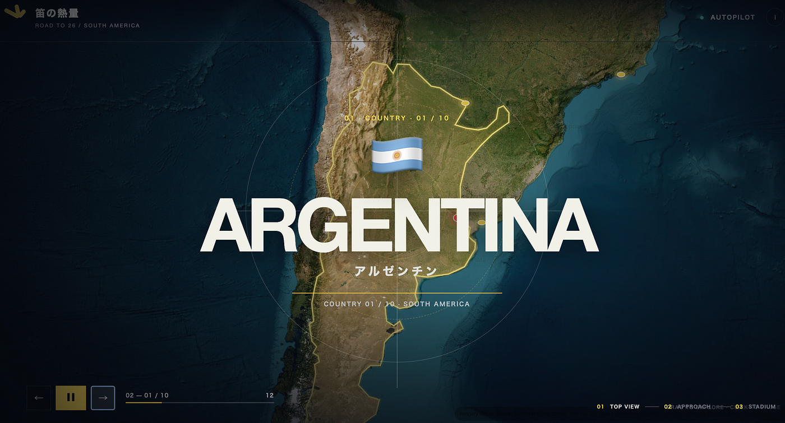
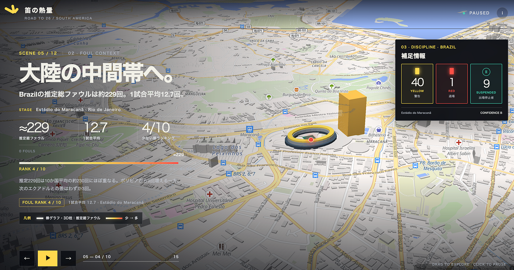
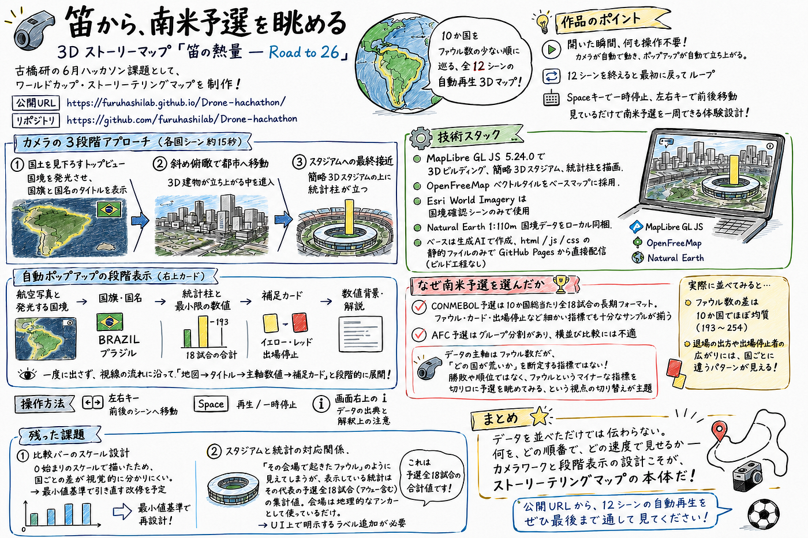

### 笛の熱量 — Road to 26

こんにちは。ドローン部ハッカソンメンバーの佐藤愛妃です。

今回のハッカソンはFIFAワールドカップ予選で鳴ったホイッスルに注目してストーリーテリング作りました！

> _2026 FIFAワールドカップ南米予選のファウル・カード・出場停止データを巡る、全12シーンの3Dストーリーマップ。_

**公開URL:** [https://github.com/furuhashilab/Drone-hachathon](https://github.com/furuhashilab/Drone-hachathon)

**作品URL(GitHub pages)**: [https://furuhashilab.github.io/Drone-hachathon/#scene-1](https://furuhashilab.github.io/Drone-hachathon/#scene-1)

ChatGPTにプロンプト作らせる→CodexとCloudeで同時並行作品作り→比較→Codexを採用

### 目次

- [1. なぜこのテーマか](https://claude.ai/chat/7a3d24e6-2b44-4f61-92f4-e601ef83b193#1-%E3%81%AA%E3%81%9C%E3%81%93%E3%81%AE%E3%83%86%E3%83%BC%E3%83%9E%E3%81%8B)

- [1.1 主題](https://claude.ai/chat/7a3d24e6-2b44-4f61-92f4-e601ef83b193#11-%E4%B8%BB%E9%A1%8C)

- [1.2 なぜ南米予選か](https://claude.ai/chat/7a3d24e6-2b44-4f61-92f4-e601ef83b193#12-%E3%81%AA%E3%81%9C%E5%8D%97%E7%B1%B3%E4%BA%88%E9%81%B8%E3%81%8B)

- [2. 公開](https://claude.ai/chat/7a3d24e6-2b44-4f61-92f4-e601ef83b193#2-%E5%85%AC%E9%96%8B)

- [3. 技術構成](https://claude.ai/chat/7a3d24e6-2b44-4f61-92f4-e601ef83b193#3-%E6%8A%80%E8%A1%93%E6%A7%8B%E6%88%90)

- [3.1 ライブラリとデータ](https://claude.ai/chat/7a3d24e6-2b44-4f61-92f4-e601ef83b193#31-%E3%83%A9%E3%82%A4%E3%83%96%E3%83%A9%E3%83%AA%E3%81%A8%E3%83%87%E3%83%BC%E3%82%BF)

- [3.2 演出仕様](https://claude.ai/chat/7a3d24e6-2b44-4f61-92f4-e601ef83b193#32-%E6%BC%94%E5%87%BA%E4%BB%95%E6%A7%98)

- [3.3 操作](https://claude.ai/chat/7a3d24e6-2b44-4f61-92f4-e601ef83b193#33-%E6%93%8D%E4%BD%9C)

- [4. 国ごとの傾向](https://claude.ai/chat/7a3d24e6-2b44-4f61-92f4-e601ef83b193#4-%E5%9B%BD%E3%81%94%E3%81%A8%E3%81%AE%E5%82%BE%E5%90%91)

- [4.1 量の比較](https://claude.ai/chat/7a3d24e6-2b44-4f61-92f4-e601ef83b193#41-%E9%87%8F%E3%81%AE%E6%AF%94%E8%BC%83)

- [4.2 質の多様性](https://claude.ai/chat/7a3d24e6-2b44-4f61-92f4-e601ef83b193#42-%E8%B3%AA%E3%81%AE%E5%A4%9A%E6%A7%98%E6%80%A7)

- [5. データ](https://claude.ai/chat/7a3d24e6-2b44-4f61-92f4-e601ef83b193#5-%E3%83%87%E3%83%BC%E3%82%BF)

- [5.1 統計データ出典](https://claude.ai/chat/7a3d24e6-2b44-4f61-92f4-e601ef83b193#51-%E7%B5%B1%E8%A8%88%E3%83%87%E3%83%BC%E3%82%BF%E5%87%BA%E5%85%B8)

- [5.2 地図・ベースデータ](https://claude.ai/chat/7a3d24e6-2b44-4f61-92f4-e601ef83b193#52-%E5%9C%B0%E5%9B%B3%E3%83%99%E3%83%BC%E3%82%B9%E3%83%87%E3%83%BC%E3%82%BF)

- [5.3 ファウル数の集計方法](https://claude.ai/chat/7a3d24e6-2b44-4f61-92f4-e601ef83b193#53-%E3%83%95%E3%82%A1%E3%82%A6%E3%83%AB%E6%95%B0%E3%81%AE%E9%9B%86%E8%A8%88%E6%96%B9%E6%B3%95)

- [5.4 カード集計](https://claude.ai/chat/7a3d24e6-2b44-4f61-92f4-e601ef83b193#54-%E3%82%AB%E3%83%BC%E3%83%89%E9%9B%86%E8%A8%88)

- [5.5 出場停止者の集計](https://claude.ai/chat/7a3d24e6-2b44-4f61-92f4-e601ef83b193#55-%E5%87%BA%E5%A0%B4%E5%81%9C%E6%AD%A2%E8%80%85%E3%81%AE%E9%9B%86%E8%A8%88)

- [5.6 信頼度ラベル](https://claude.ai/chat/7a3d24e6-2b44-4f61-92f4-e601ef83b193#56-%E4%BF%A1%E9%A0%BC%E5%BA%A6%E3%83%A9%E3%83%99%E3%83%AB)

- [6. スタジアムの扱い](https://claude.ai/chat/7a3d24e6-2b44-4f61-92f4-e601ef83b193#6-%E3%82%B9%E3%82%BF%E3%82%B8%E3%82%A2%E3%83%A0%E3%81%AE%E6%89%B1%E3%81%84)

- [6.1 会場選定](https://claude.ai/chat/7a3d24e6-2b44-4f61-92f4-e601ef83b193#61-%E4%BC%9A%E5%A0%B4%E9%81%B8%E5%AE%9A)

- [6.2 重要な注意:統計と会場の対応関係](https://claude.ai/chat/7a3d24e6-2b44-4f61-92f4-e601ef83b193#62-%E9%87%8D%E8%A6%81%E3%81%AA%E6%B3%A8%E6%84%8F%E7%B5%B1%E8%A8%88%E3%81%A8%E4%BC%9A%E5%A0%B4%E3%81%AE%E5%AF%BE%E5%BF%9C%E9%96%A2%E4%BF%82)

- [6.3 シーン順序とカメラ構成](https://claude.ai/chat/7a3d24e6-2b44-4f61-92f4-e601ef83b193#63-%E3%82%B7%E3%83%BC%E3%83%B3%E9%A0%86%E5%BA%8F%E3%81%A8%E3%82%AB%E3%83%A1%E3%83%A9%E6%A7%8B%E6%88%90)

- [6.4 段階表示](https://claude.ai/chat/7a3d24e6-2b44-4f61-92f4-e601ef83b193#64-%E6%AE%B5%E9%9A%8E%E8%A1%A8%E7%A4%BA)

### 1. なぜこのテーマか

### 1.1 主題

ワールドカップ予選を語る時、主役はいつも勝敗・順位・得点です。本作は「勝敗ではなく、ファウルから予選を眺める」という視点の切り替えを試みました。

ファウル数を「強さ」や「荒さ」の客観指標として断定するのではなく、**勝敗の裏側にあるプレーの質感を読み解くための、ひとつの切り口**として扱います。

### 1.2 なぜ南米予選か

南米予選(CONMEBOL)を舞台に選んだ理由はデータの構造です。

- 10か国総当たり、各代表が**全18試合**(ホーム9・アウェー9)

- ファウル・カード・出場停止のような細かい指標でも、国ごとの傾向を比較できるサンプルが揃う

- 日本が参加する **AFC予選はグループ分割**があり、こうした横並びの比較には適さない

### 2. 公開

GitHub Pages: **[https://furuhashilab.github.io/Drone-hachathon/#scene-1**](https://furuhashilab.github.io/Drone-hachathon/#scene-1)

依存するビルド工程はありません。静的ファイルをリポジトリ直下から配信します。

### 3. 技術構成

### 3.1 ライブラリとデータ

種類 採用 地図ライブラリ MapLibre GL JS 5.24.0 ベースタイル OpenFreeMap / OpenStreetMap ベクトルタイル 衛星画像 Esri World Imagery(国境確認時のみ) 国境ポリゴン Natural Earth 1:110m(ローカル同梱)

### 3.2 演出仕様

- **12カメラシーン**:各国の直前に国土確認シーンを挟み、都市・スタジアムへ段階的に傾けて接近

- **自動化**:カメラ移動・ポップアップ表示・ループ再生

- **3D表現**:主要予選会場を舞台にした簡略3Dスタジアム、3D建物、ファウル数に限定した統計柱

### 3.3 操作

キー 動作 `←` `→` 前後のシーンへ移動 `Space` 再生 / 一時停止 右上の `i` データ出典と解釈上の注意を表示

### 4. 国ごとの傾向

### 4.1 量の比較

ファウルの「量」だけを比較すると、10か国は **193〜254回** の範囲に収まり、差はわずか **61回**。一見、均質に見えます。

### 4.2 質の多様性

しかし指標を分解すると、各代表が異なる「懲戒の性質」を持っていることが見えてきます。

#### 代表/推定ファウル/特徴

**アルゼンチン** ≈193(最少) 退場3枚はすべて一発退場。少ない衝突が決定的な局面に直結する。

**ウルグアイ** 238(平均13.2) イエロー38枚と上位だが退場0。荒れても一線を越えない。

**ベネズエラ** 239 イエロー42枚で予選最多。退場は1枚に留まる。警告の蓄積で輪郭が描かれる。

**ボリビア** 220 退場4枚で予選最多、すべて直接退場。処分が瞬間に集中する。

**コロンビア** ≈254(最多) 一発退場は0。量はあるが質は穏やか。

**チリ** 214 出場停止者12人で最多。処分が広い範囲の選手に分散している。

> _量での比較では国の輪郭は見えない。質を分解した時に、はじめて個性が立ち上がります。_

### 5. データ

統計データは公開されている以下の出典を集計したものです。会場別ではなく代表単位の集計値で、本予選(2026 FIFA World Cup qualification — CONMEBOL)を対象としています。

### 5.1 統計データ出典

- **FIFA 公式 / CONMEBOL Standings** [https://www.fifa.com/en/tournaments/mens/worldcup/canadamexicousa2026/qualifiers/conmebol/standings](https://www.fifa.com/en/tournaments/mens/worldcup/canadamexicousa2026/qualifiers/conmebol/standings)

- **AiScore 大会別チーム統計(Team Fouls)** [https://m.aiscore.com/tournament-cm-clasif%2C-conmebol/r1edq09i0fyqxgo/teamfouls](https://m.aiscore.com/tournament-cm-clasif%2C-conmebol/r1edq09i0fyqxgo/teamfouls)

- **Wikipedia: 2026 FIFA World Cup qualification (CONMEBOL) — Discipline** [https://en.wikipedia.org/wiki/2026_FIFA_World_Cup_qualification_(CONMEBOL)#Discipline](https://en.wikipedia.org/wiki/2026_FIFA_World_Cup_qualification_(CONMEBOL)#Discipline)

### 5.2 地図・ベースデータ

- **OpenFreeMap**(ベクトルタイル) [https://openfreemap.org/](https://openfreemap.org/)

- **Esri World Imagery**(国境確認シーンのみ) [https://www.esri.com/en-us/arcgis/products/arcgis-living-atlas](https://www.esri.com/en-us/arcgis/products/arcgis-living-atlas)

- **Natural Earth 1:110m**(国境ポリゴン、ローカル同梱) [https://www.naturalearthdata.com/](https://www.naturalearthdata.com/)

### 5.3 ファウル数の集計方法

CONMEBOL予選では各代表が **全18試合(ホーム9・アウェー9)** を戦います。総ファウル数は AiScore が公開している「1試合平均ファウル数」を集計し、次の式で推定しています。

```typescript
推定総ファウル = 1試合平均ファウル × 18(四捨五入)
```

例:Argentina は 1試合平均 10.7 ファウル × 18試合 ≈ 193 ファウル。

会場別の細かなファウル数は公開ソースで取得できなかったため、代表単位での全予選集計値を採用しました。

### 5.4 カード集計

AiScore の大会別チーム統計を直接転記しています。

- `straightRed`:一発退場

- `red`:通常の退場(2枚目イエローによる退場を含む)

両者を区別して保持しています。

### 5.5 出場停止者の集計

予選期間中に少なくとも一度、警告累積または退場によって出場停止処分を消化した**ユニーク選手の人数**です。Wikipedia の Discipline 表を一次根拠として集計しました。

### 5.6 信頼度ラベル

ラベル 意味 **B** AiScore と Discipline 表の両方で値が一致 **C** AiScore の集計と Wikipedia の Discipline 表で値に不一致あり

本予選で **C** に該当するのは **Bolivia / Paraguay** の2か国です。両者は直接退場の記録に食い違いがあり、本作では AiScore 側の値を採用しつつ、不確実性が高いことを明示する目的で C と表記しています。

### 6. スタジアムの扱い

### 6.1 会場選定

各代表のシーンは、ホーム9試合で **最も使用回数が多かった会場** へ移動します。

- ブラジル:マラカナとマネ・ガリンシャが各2試合で同率のため、マラカナを採用

### 6.2 重要な注意:統計と会場の対応関係

スタジアムはOpenStreetMapで確認した実位置に配置していますが、形状は表示の安定性と軽量化を優先した簡略3Dモデルです。

> _**表示されるファウル・カードは会場別ではなく、代表の予選全18試合(アウェー含む)の統計です。スタジアムは地理的なアンカーとして使っており、会場別の出来事を示すものではありません。_**

### 6.3 シーン順序とカメラ構成

国別シーンは推定総ファウルの少ない順に進みます。

```typescript
Argentina → Chile → Bolivia → Brazil → Ecuador
  → Peru → Uruguay → Venezuela → Paraguay → Colombia
```

各国への遷移は3段階で構成されます。

1. 国土を見下ろすトップビュー + 国旗・国名のタイトル表示



2. 都市への斜め移動

3.スタジアムへの最終進入



トップビュー以外のシーンでは斜めカメラを維持します。

フォーカス時の3D柱とカード内グラフは **ファウル数だけ** を表示し、イエロー、レッド、出場停止、会場使用数は自動ポップアップにまとめています。

### 6.4 段階表示

情報は一度に表示せず、約15秒の中で次の順に段階的に展開します。

1. 航空写真と発光する国境

1. 国旗・国名

1. ファウル柱と最小限の3数値

1. イエロー・レッド・出場停止の3カード

1. 数値背景

補足カードは画面右上へ固定し、スタジアムと左側グラフを避けます。

出典リンクと解釈上の注意は、画面右上の `i` から確認できます。

### グラレコ



GPT-5.5
