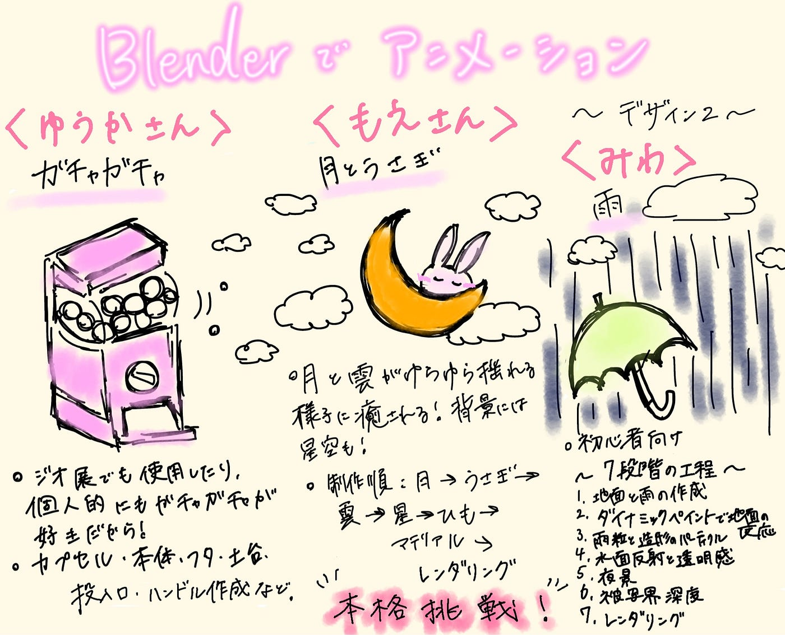

## Blenderでアニメーションに挑戦【デザイン2】

こんにちは、4年の稲田です。今週は、これから作りたいアニメーションを考えました。それぞれが気になった解説動画とその理由、今後について投稿しようと思います。前回と同様に、どんな手順で作るかも記載します。

夏休みまで残りのゼミが数回となり、ハッカソンもあることを考えると、アニメーションにいきつくまでに夏を跨いでしまうことも予想できますが、これから3人でまた頑張っていきます。

【ゆうか】

私はガチャガチャのモデリングとアニメーションに挑戦しようと思います。理由としては、ジオ展で使用したり、個人的にもガチャガチャが好きで回す機会が多いことから、Blenderでアニメーションにしてみたいと思ったためです。

参考にする動画はこちらです。

動画で流れを見たところ、

・カプセル・本体・フタの作成

・土台・投入口・ハンドルの作成

・マテリアル設定や色分け

・ハンドル・かき混ぜるアニメーションの設定

・ライトやカメラの設定とレンダリング

大まかにこのような工程で進んでいたので、私もこの流れで完成させられるよう努めます。

【もえ】

私は以下の動画を参考にして、月のうさぎのアニメーション作品を作ることにしました。

月と雲がゆらゆら揺れている様子が癒されるのと、背景の星空が可愛いので選びました。

流れとしては、月、うさぎ、雲、星、ひもの順番にモデリングをし、それぞれのマテリアルを設定、最後に背景やアニメーション、レンダリングの設定をするというふうに進めていく予定です。

今回でBlenderの作品を作るのは2回目なのですが、アニメーションに挑戦するのは初めてなので、少しずつ丁寧に取り組んでいきたいです。

【みわ】

今回は以下の動画を参考にして、雨のアニメーションを作ってみようと思います。

今回は初めてのアニメーションなので、まずは初心者向けの動画を使用してみました！🙌🏻

以下の段階を踏んでこのアニメーションを作成します！

1. 地面と雨の発生源（天井）の作成

2.ダイナミックペイントによる地面の反応設定

3. 雨粒の造形とパーティクル設定

4. 水面の反射と雨粒の透明感（シェーディング）

5. 環境テクスチャによる夜景の追加

6. 被写界深度（ボケ味）とフォグ（霧）の追加

7. 動画形式でのレンダリング設定

前回のモデリングよりもさらにパワーアップした作品になるので、丁寧かつ慎重に作成していこうと思います！

まとめ

アニメーションを本格的に始めるのは今回が初めてで、上手くできるか少し不安ですが、わからない時も動画を何度も見返したり、メンバーやAIと教え教わり合ったりしながら進めていきます！

グラレコ

