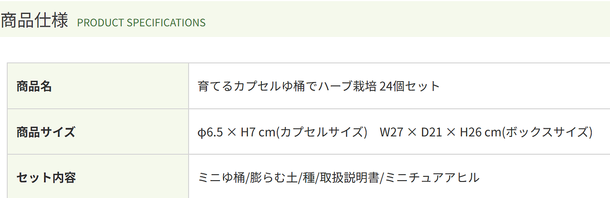
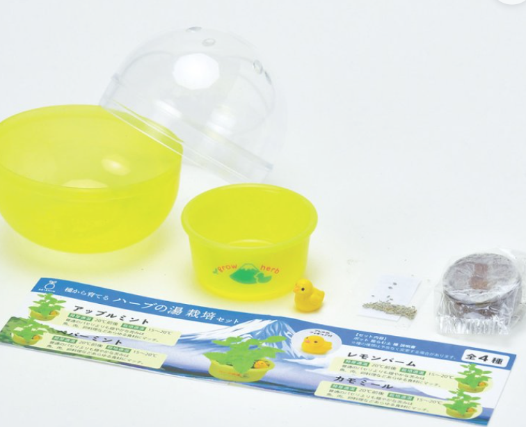
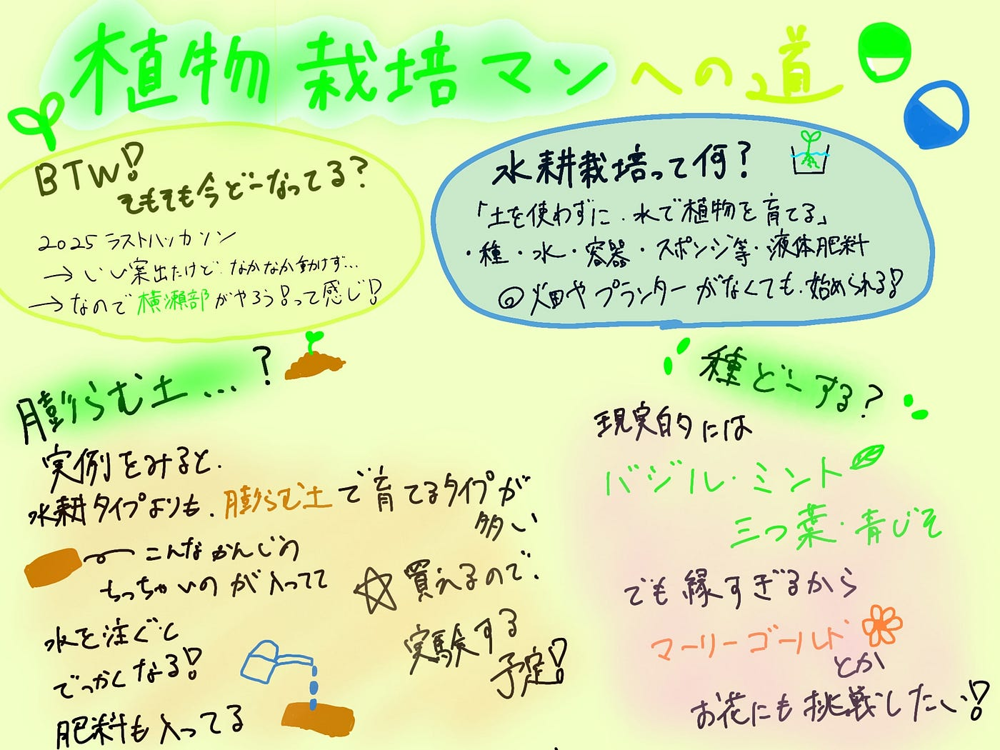

### 【6/30横瀬部週報】植物栽培マンへの道

こんにちはー横瀬部の荒川です。

今週も1000円ガチャの中身を考えていくよ！

バンダナに1000円は高いねーという話になったので、一旦去年のハッカソンで話に出た、植物栽培キットをもう一度考えてみます。

[ついに今年度最後のハッカソン、、武甲山をモチーフにしたガチャデザインを考えてみた！ — Furuhashi(mapconcierge)Lab. — Medium](https://medium.com/furuhashilab/%E3%81%A4%E3%81%84%E3%81%AB%E4%BB%8A%E5%B9%B4%E5%BA%A6%E6%9C%80%E5%BE%8C%E3%81%AE%E3%83%8F%E3%83%83%E3%82%AB%E3%82%BD%E3%83%B3-011428cac9a9)

その前に、三年生を思いっきり置いてきぼりにしてずっとお話を進めてしまっている気がするので、ここまでの経緯を喋ります。

スタート: _2025年度ラストハッカソン「横瀬町に置く1000円ガチャの中身を考えよう！」_

結局今の横瀬部がやってるのは、このハッカソンの続きです。ハッカソンの中で良い案はいくつか出たものの、年度最後ということもあり、行動に移すことがなく2026年度を迎えました。

で、そのハッカソンで結構いいね！となり、先生が実験を進めてくれていたのが、今回ちゃんと考える**「水耕栽培キット」**です。

ちなみに、この前[この記事](https://medium.com/furuhashilab/%E3%81%A4%E3%81%84%E3%81%AB%E4%BB%8A%E5%B9%B4%E5%BA%A6%E6%9C%80%E5%BE%8C%E3%81%AE%E3%83%8F%E3%83%83%E3%82%AB%E3%82%BD%E3%83%B3-011428cac9a9)見返していたら、「正気か？」という案がたくさんあったので、三年生はぜひ覗いて当時のメンバー（ゆーか・もえ・りと・れんせー）をいじってあげてください。

#### 水耕栽培って何？

水耕栽培は、ざっくり言うと「土を使わずに、水で植物を育てる方法」です。
土の代わりに水の中へ栄養を入れて、そこから植物がぐんぐん育っていきます。

しかも、部屋の中でもできるし、土で汚れる心配も少なめ。
バジルやミントみたいなハーブなら、ちょっとしたスペースでも育てやすいので、「植物育ててみたいけど、土とか準備するのはめんどい…」という人にもぴったりです。

必要なものはこんな感じです。

- 植物の種

- 水

- 容器

- スポンジやキッチンペーパー

- 液体肥料

- 日当たりのいい場所、または植物用ライト

つまり、ガチな畑やプランターがなくても、わりと気軽に始められる栽培方法です。

です！By ChatGPT-5.5

ガチャガチャで販売するため、水耕栽培のこの”手軽さ”に目を付けました。

#### ガチャの実例

実際どんな例があるのか調べました。

[育てるカプセル湯桶でハーブ栽培｜ゆ桶で育てるハーブ・香りも楽しめます](https://seishin-plus.ocnk.net/product/518)

ここでおやおやタイムです。

膨らむ土、、、？水耕栽培、、、。

なんか聞いたことのない単語がありました。「まあ他の例探すかー」と思って探したところ、

#### なんか膨らむ土タイプばっか！

水耕栽培も確かにありました（でんじろう先生のガチャガチャとか）。でもやっぱり膨らむ土タイプが多く、素人ながら理由を考えてみます。

#### 膨らむ土タイプの強み

> _①説明が簡単_

カプセルの中に入るものは、「種・鉢・膨らむ土・説明書」です基本的系には。それに対して水耕栽培では、「種・鉢・種を置くためのスポンジ等・肥料・説明書」になりそうです。説明書はQRコードで誘導するのがよさそうです。土での栽培は、ほとんどの人がイメージしやすいのに対し、水耕栽培は肥料や水の管理が重要となるようです。

栽培のイメージがしやすいのは、膨らむ土タイプの強みかなと思います。

> _②肥料の管理が簡単_

①に関連しますが、膨らむ土タイプには最初から肥料が含まれているようで、種を植えた後は水をあげて待つだけのようです。

水耕栽培では、肥料を水に混ぜる手間があり、比較するとどうしても膨らむ土タイプは簡単だなと感じます。

一先ずこんなところかなと思います。膨らむ土タイプの仕様感を確かめてみないと何とも言えないところなので、まずは実験ですこちらも。ちなみに膨らむ土はめっちゃ安いです。

[園芸ネット本店｜ジフィーセブンシー ペレット（30mm×50mm） 15個入り の通販【公式】](https://www.engei.net/products/detail?id=210730)

#### 何の種がいいかな

ここからは、実際に売るとしたら何の種がいいかなーと理想を語ります。

まず現実的なところから話すと、先生が実験してくれている、**バジル**。その他にも**ミント**なんかあったら素敵じゃない？**三つ葉**も現実的です。**青じそ**も相性が良いみたいですが、私が苦手なので除外しちゃおうかなハハ。

現実的にはこの4種類になりそうですが、緑過ぎるのでお花とか無理なのかなと思って調べたところ、[この商品](https://seishin-tougei.com/product/gd1067_saisenmaneki/)のラインナップにはマリーゴールドがあり、種類によっては可能なようです。横瀬なので理想は芝桜ですが、現実的な種は何だろなというところも、膨らむ土の実験と並行して進めようと思います。

今週はここまでにします。容器はやっぱり武甲山とか、横瀬周辺地域にちなんだ形にしたいので、そちらのデザイン作成にも取り掛からないとだなー。がんばろーう！

