### [完成？]Blendeeでカービィを作ろう

こんにちは！デザイン部1の滝沢です！「Blenderでカービィを作ろう」3週目です！今回はカービィ完成に向けて作業を進めていきました！

みひろ

こちらが完成品です！いかがでしょうか。。？

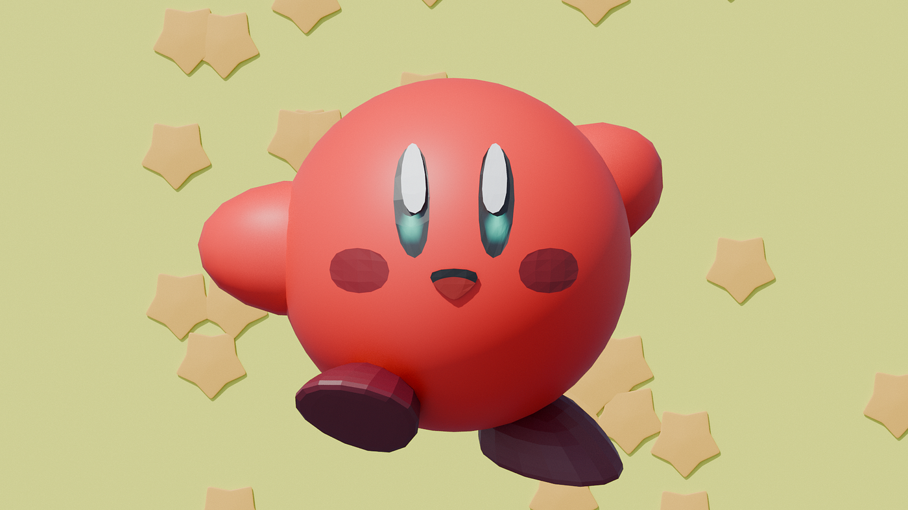

今回の制作では、参考にした動画と自分が使用したBlenderのバージョンが異なっていたため、少し手こずる部分はありましたが、それなりにうまくできたのではないかと思います。（評価はポジティブにいきましょう（笑））

特に苦労した点は、Blenderのバージョンの違いによって機能名や表示方法が異なっていたことです。例えば、「ポイント配置」が「面にポイント配置」、「ポイントにインスタンス」が「ポイントにインスタンス作成」、「属性ランダム化」が「ランダム値」へと変更されており、チュートリアル動画と現在の画面表示が異なっていたため、機能を探すのに時間がかかりました。（今回使用したBlenderのバージョンは5.12で、参考にした動画のバージョンは2.9でした。）

また、自分で新しい機能を追加しなければならず、例えば、星を平面に表示させるために「オブジェクト情報」の機能を追加しました。

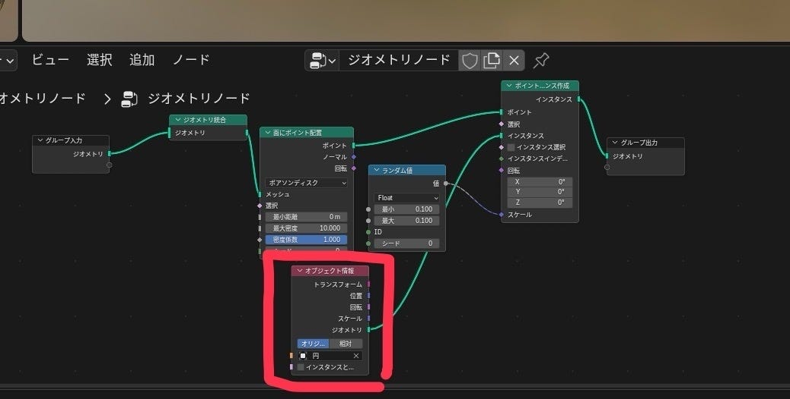

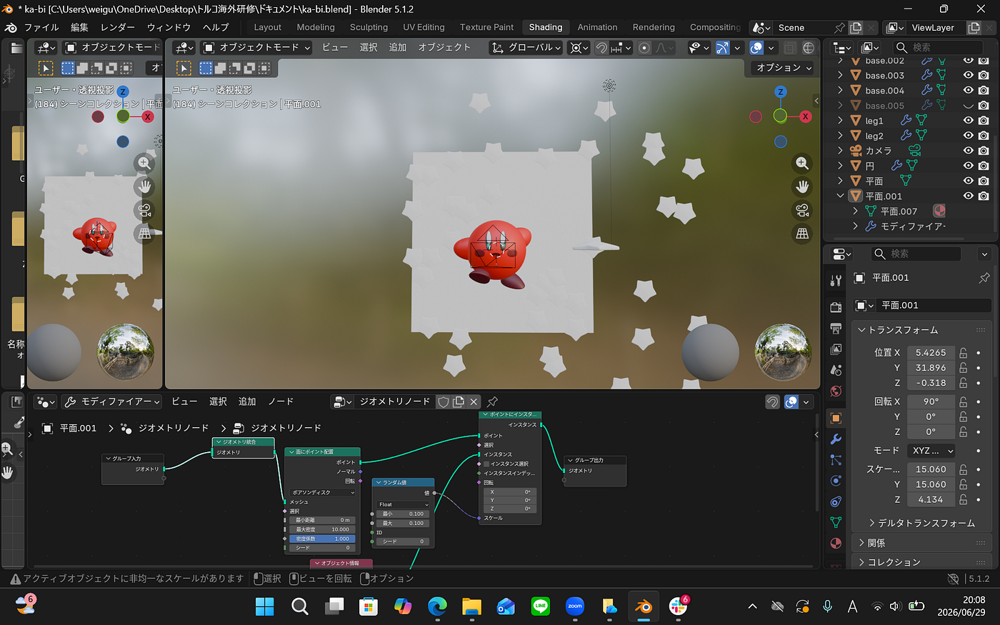

今回は最新版のBlenderで制作を進めましたが、初めて学習する際には、あえて参考動画と同じバージョンを使用して作業するのも、効率よく学ぶための一つの方法だと感じました。今後は、バージョンの違いにも柔軟に対応しながら、操作に慣れていきたいと思います。

**ちはな**

まず、今回の完成形がこんな感じになります！

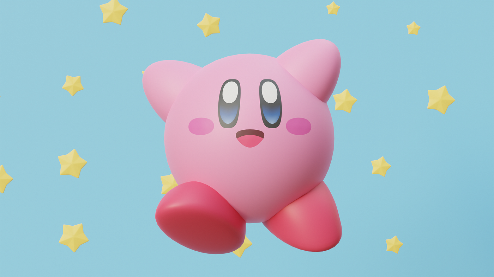

中々うまくできたと思います！

背景を作った後、顔の比率や色合いに違和感があったので、少し手直ししました！

背景の星を作る段階でベベルをかける(角を丸める)作業があったのですが、なぜかかからないという問題が発生しました。

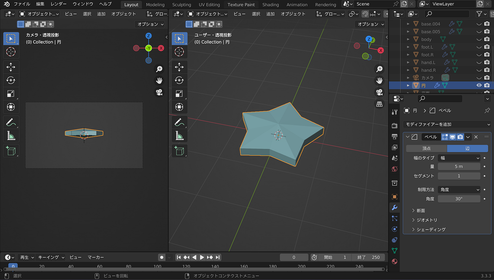

色々調べたところ、ほとんど同じ場所に複数の頂点が重なっている場合があり、この状態ではベベルがかからないらしいです。

複数の頂点が重なっている場合は編集モードで頂点を選択してみると、隣り合う辺がオレンジにならないのでそこで見分けられるとか……

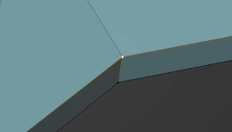

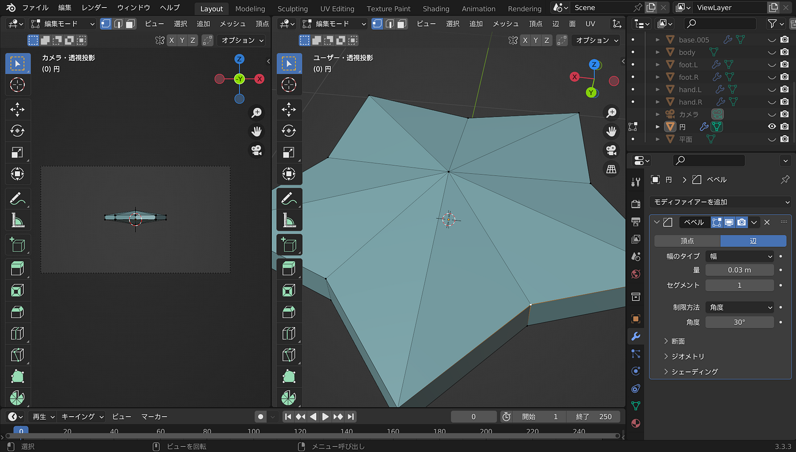

解決法としては、頂点を選択してM(Margeの頭文字)→「距離で」を選択すれば一つにまとめられるそうです。

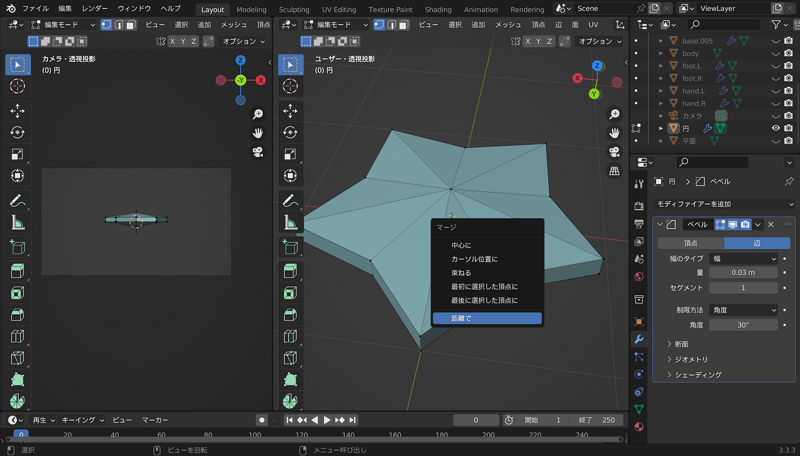

右上の自動マージにチェックを入れると、しきい値以下の距離に頂点が出来たときに自動的に先ほどの作業を行ってくれるらしいのでオンにしておくことをおすすめします。

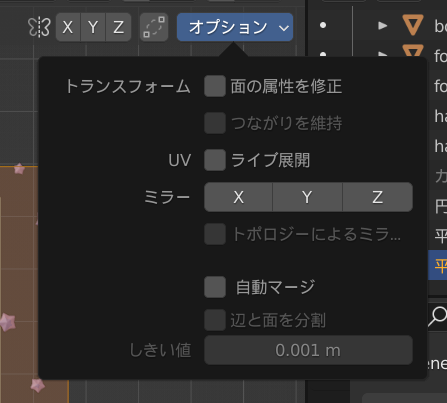

作業を行うと無事にベベルがかかりました。

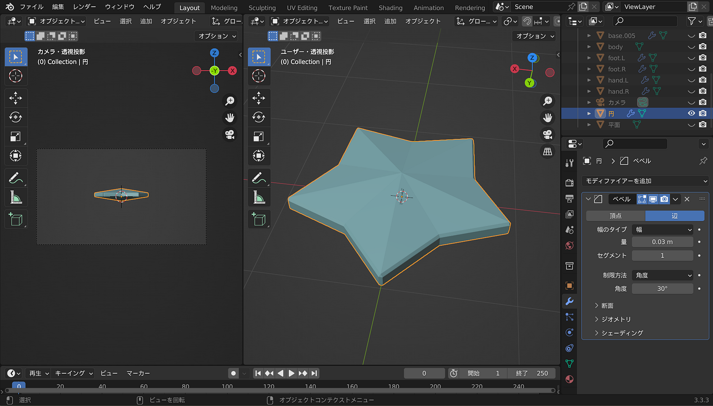

昨年クマのキャラクターをBlenderで作ったときにはレンダリングにかなり時間がかかった印象があったのですが、今回は意外と短かったです。(テクスチャが複雑でないのが影響してそう)

何はともあれ無事に完成できて良かったです！

**みあ**

完成形はこちらになります

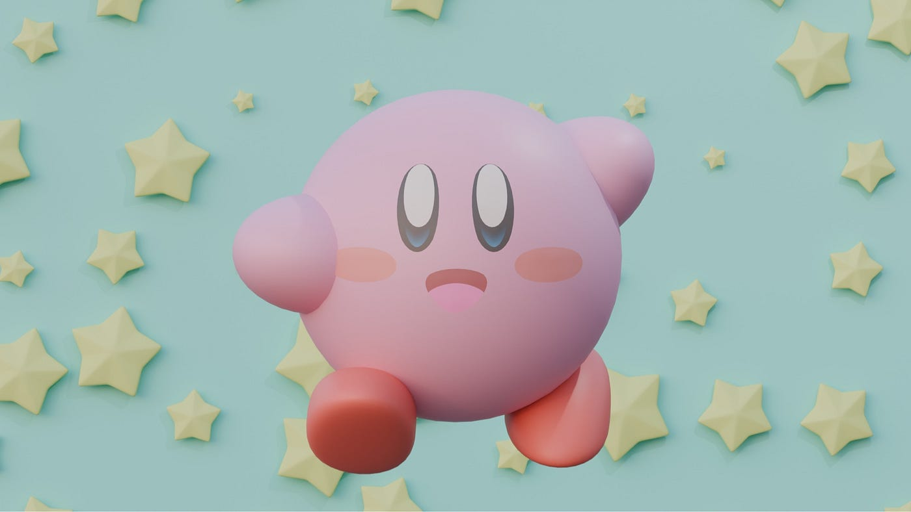

動画とバージョンが違くて苦戦した部分もありましたが、何とか完成形までたどりつきました！

完成してみると、口のピンクの部分があまり肌の色と差がなくて見にくくなってしまったのがちょっと残念です😭時間ある時に直します！

**かのこ**

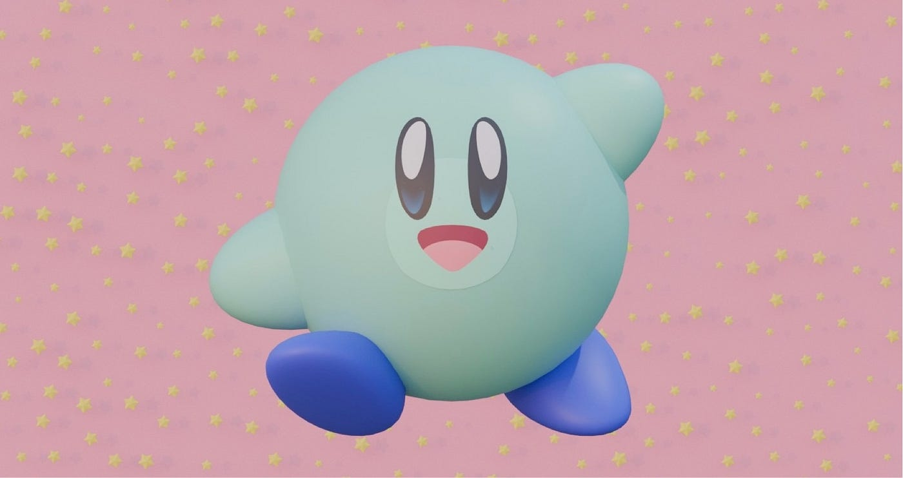

仕上げの作業に入っていったのですが、今回も前回と同じようにお手本動画とのバージョンの違いにより、選択できない項目があったり、他の場所に置き換わっていることが多く、なかなか動画通りに進まず苦戦しまた。

お手本動画では「ポイント配置」「ポイントインスタンス」というノードが使用されていましたが、自分のBlender 5.1では見つからず、調べるとBlender 5.1ではジオメトリノードの名称や構成が大きく変更されていました。困ったなぁと思っていたら、動画の概要欄に更新されたバージョンがなんと公開されていました！なのでそちらの部分を参考にしながらまた新たにジオメトリノードを作成し直しました！

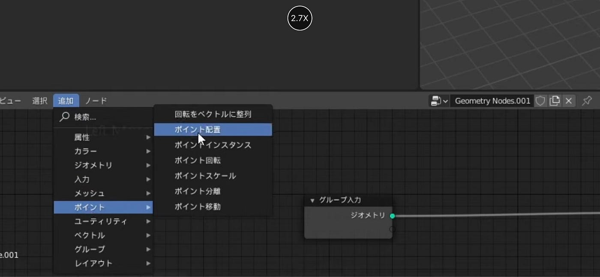

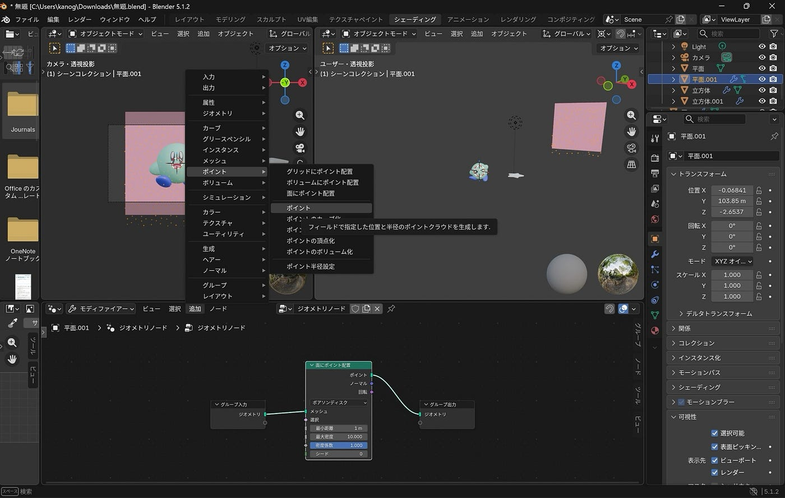

前回に引き続きカービィを作ていたのですが、今回はラスト回とういうのもあって今までで一番スムーズに進めることができて少し自分の成長を感じられて嬉しかったです！

#### グラレコ

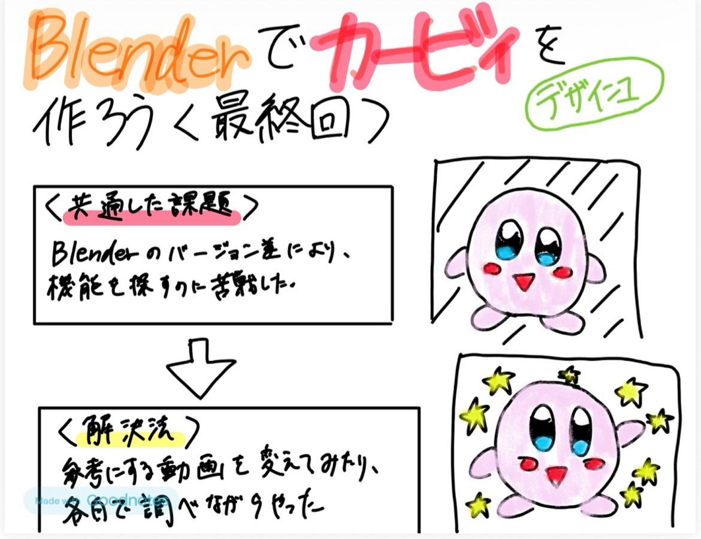
