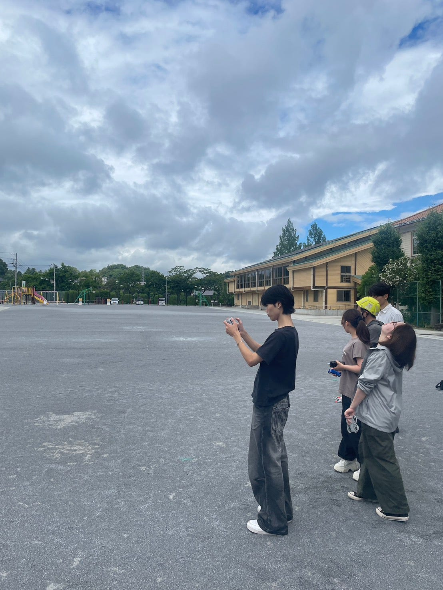
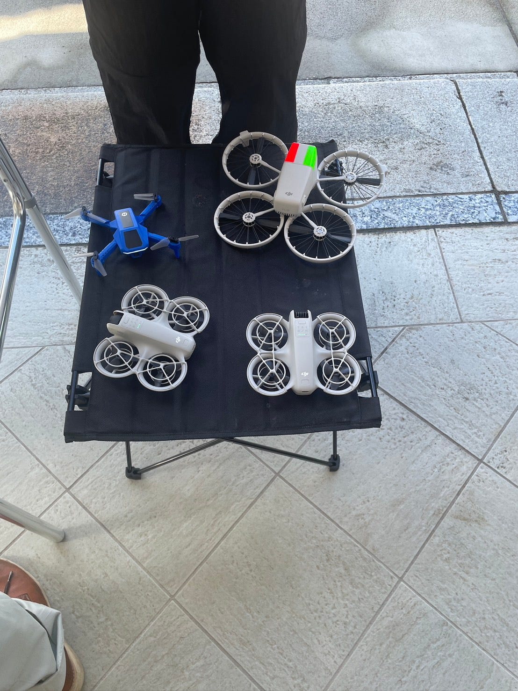
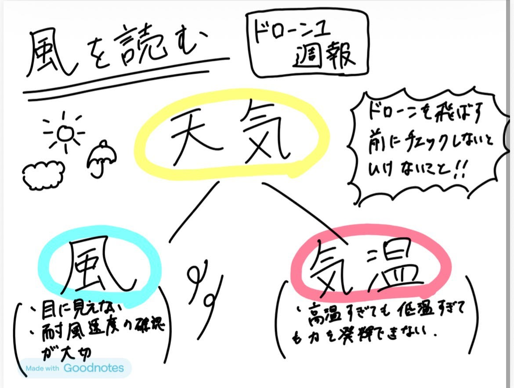

### 風を読む

お疲れ様です！ドローン部１の中川です！

6/20、6/21は待ちに待ったドローン合宿でした！

……が、初日はまさかの雨☔️

前回の週報では「飛ばす前に法律や飛行ルールを確認しましょう！」なんて書いていましたが、初日はそもそも飛ばせませんでした、、、

やっぱりドローンは天気に左右されるんだなと改めて実感しました！

そして二日目は打って変わって快晴！無事に飛ばすことはできたのですが、今度は日差しが強い！☀

画面も見づらいし、ずっと空を見上げているので思っていた以上に眩しく、サングラスは必須だなと思いました😎

そんな合宿を終えて感じたのが、

「法律や飛行ルールを知っていても、天気を確認しなければ飛ばせない。」

という当たり前だけど大切なこと。

ということで今回は、ドローンを飛ばす前に私たちがみるべき 「気象情報」についてまとめていきます！

それでは早速いきましょう！

#### まずは天気予報☀

まず確認するのは、もちろん天気予報。

「そんなの当たり前じゃん！」と思うかもしれませんが、意外とサイトによって予報が違ったりするんですよね。

個人的には**[ウェザーニュース](https://weathernews.jp)のピンポイント天気**が一番当たりやすい印象があります。ちなみに、ウェザーニュースの今の代表取締役会長は青山学院大学出身なんです！みなさんもアプリいれましょ～。

地域ごとの予報が一時間ごとに見られるので、「午前中だけ雨」「15時頃から風が強くなる」といった変化も把握しやすいです。

もちろん100％当たるわけではありませんが、飛行日が近づいたら数日前から確認しておくと安心です。

実際、今回の合宿も「雨かも？」という予報が出ていたので期待半分で向かいましたが、初日はしっかり雨でした。

#### 一番重要なのは風

個人的には、雨よりも重要なのが**風**だと思っています。雨は観天望気をしていれば避けることができますが、風は見えません。

地上では「あまり風が吹いてないな」と思っても、ドローンが飛ぶ高さでは全然違うことがあります。

そのため、私は**[Windy**](https://www.windy.com/?36.765,139.527,5)などを使って、上空の風まで確認することをおすすめします！

なぜかというと、上空へ行くほど建物や木などの障害物が少なくなるため、風が強くなりやすいからです。

地上では風速2m/sでも、上空では5〜6m/sなんてことも珍しくありません。特に、軽量な機体は風の影響を受けやすいので、地上の風だけで判断するのは少し危険です。

#### 自分の機体がどこまで飛べるのか知っておこう✈

ドローンごとに耐えられる風速は異なります。

前回のドローン合宿でも、

・DJI Neo
・DJI Mini 3 Pro
・DJI Flip
・LitoX1

など、いろいろな機体を使用していますが、それぞれ性能が違います。

メーカーが公表している**最大耐風速度**を事前に確認し、「自分の機体ならどこまで安全に飛ばせるのか」を把握しておくことが大切です。

もちろん、メーカーが「飛行可能」としている風速ギリギリまで飛ばす必要はありません。少しでも不安を感じたら飛ばさない。

この判断が、一番安全だと思います！

#### 気温にもご注意

今回の合宿ではそこまで気になりませんでしたが、真夏や真冬は気温にも注意が必要です。

機体によっては動作環境温度が決まっており、高温や低温では性能が制限される場合があります。

また、以前**[リトさんが書いていた記事**](https://medium.com/furuhashilab/%E3%83%89%E3%83%AD%E3%83%BC%E3%83%B3%E3%81%A9%E3%82%8C%E8%B2%B7%E3%81%86-bedc9472a3b2)でも紹介されていましたが、高高度を飛行する場合は地上と上空で気温が大きく異なることがあります**。**

#### まとめ

飛行前の気象確認で意識するべきなのは、以下の4つです。

☑ウェザーニュースのピンポイント天気で当日の天気を確認する

☑Windyなどで上空の風速・風向を確認する

☑自分の機体の耐風性能を把握しておく

☑気温や動作環境温度も確認する

法律や飛行ルールももちろん大切ですが、どれだけ準備していても天候には勝てません。

「今日はやめておこう」と判断することも、安全運航の大切な技術の一つだと思います！

#### グラレコ

