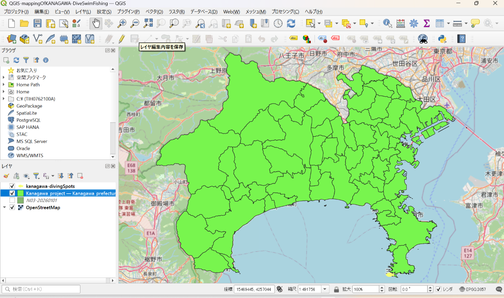
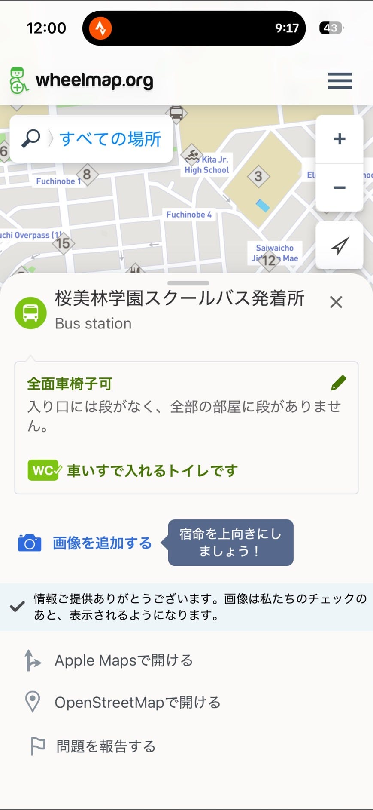
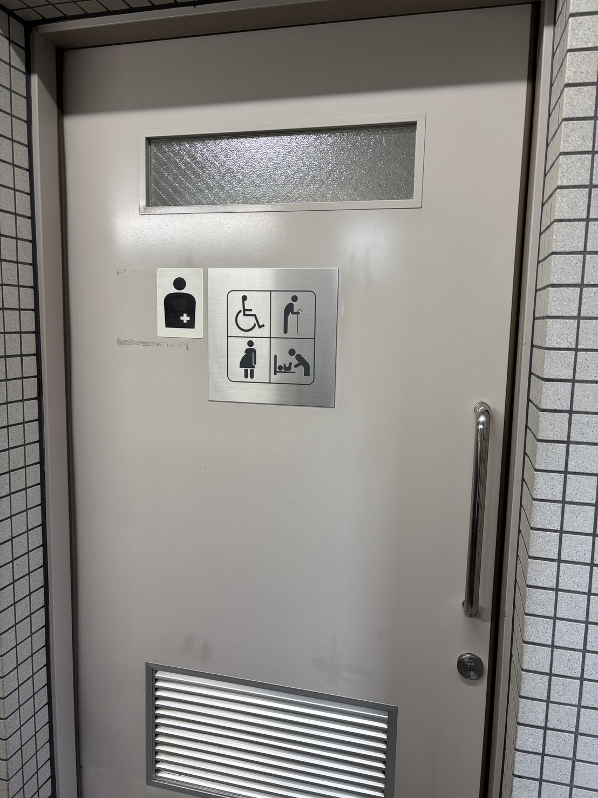
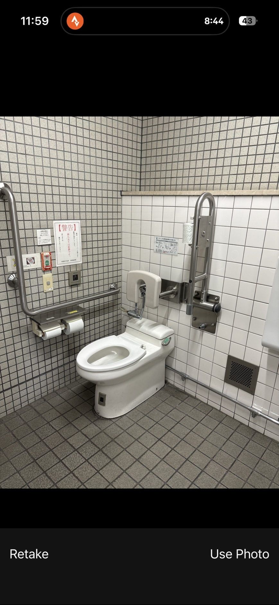
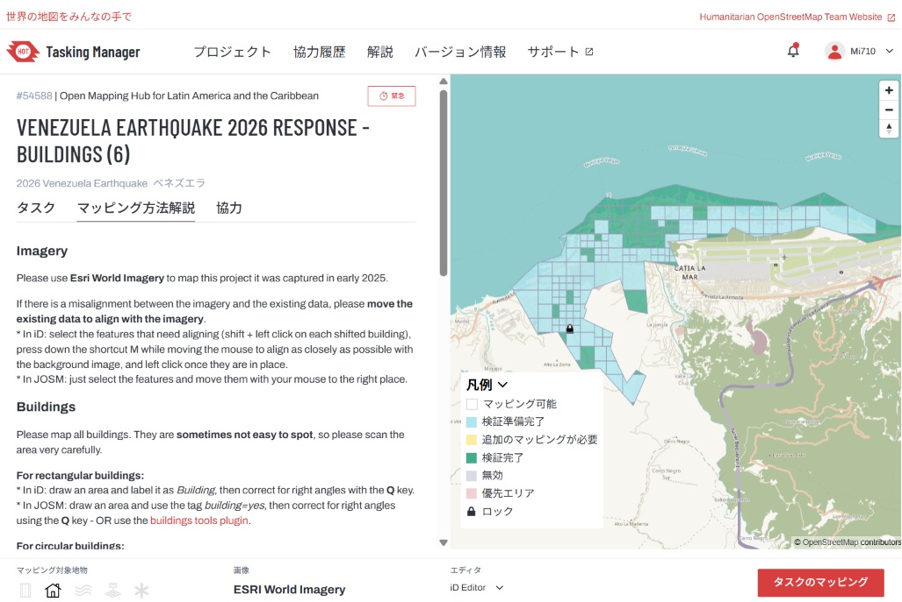
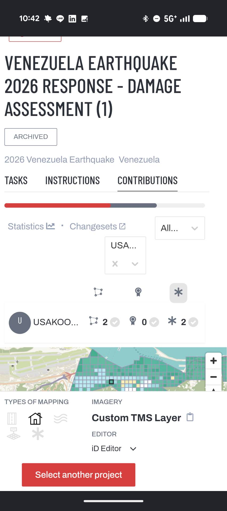
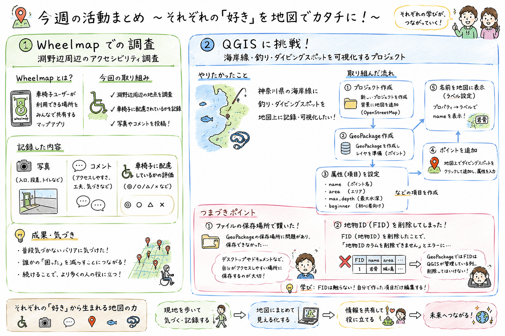

### 【Youth1 6/30週報】個人活動

Youth1の田邊です。今週は各々やりたいことに専念しました。

3年生は前から気になっていたQGISに挑戦し、ふうか先輩は「State of the Map Asia 2026」でも使うことが予定されている、Wheelmapでマッピングし、ひなこ先輩はHot Tasking Managerでベネズエラのマッピングをしました。

### QGIS

操作は、基本ChatGPTに相談しながら学びました。とにかくやれることが多く、QGISへの理解度を深めるためには実際になにか形にするべきだという回答を受けたので、神奈川県におけるマリンスポーツの活性化を目的とした、ダイビング、釣り、遊泳スポットのマッピングと題して活動を行いました。はじめに背景地図にOpenStreetMapを設定し、国土数値情報ダウンロードサービス（[国土数値情報ダウンロードサイト](https://nlftp.mlit.go.jp/ksj/)）から、神奈川県の海岸線データをダウンロードします。これをベクタレイヤとしてQGISに読み込み、属性テーブルから神奈川県のみを抽出します。新しいGeoPackageレイヤを作成し、属性に地名やメモを記載できるようなものを追加していきます。今回はダイビングスポットを追加したので、最大深度、見られる生物、地形、流れ、シーズン、エントリー方法、近くのダイビングショップなどの情報を入力できるようにしました。（参考：[ダイビングポイント案内 | 城ヶ島ダイビングセンター — 城ヶ島ダイビングセンター](http://jdc-net.jp/fun-diving/diving-point/)）

この一連の操作で一番難しかったのは、ファイルの管理です。最初、神奈川県の海岸線データが入っているファイルと同じところにQGISの保存をしなかったために毎回作ったデータが読み込まれませんでした。あとは、海洋学の専門用語や生物名に対して、予測変換とGoogle検索がとても弱く、時間がかかる場面が多かったです。実際にタイで海洋生物学の授業を受講し、知らない固有名詞が出て、それをGoogleで日本語で調べても英語で書かれた論文に飛ばされる事が多く、ひとつ調べたいだけなのに論文読まされるなんてこともありました。次週以降は予測変換に海洋生物名を登録します。そしてマップ上の地点に写真やURLなどを追加して、どんなサイトよりも情報量を多くし、この地図の専門性を高め、将来的に多くの人にとって有効なものにしたいと考えてます。GBIF([https://www.gbif.org/](https://www.gbif.org/))というサイトが生物分布の検索を国内、世界ですることができ、それをどうにかしてQGISマップ上に落とし込むことができたら幅が広がるし、他にもハザードマップをダウンロードすればマリンスポーツ以外での活用もできるとおもったのでこれからしばらくQGIS触ろうかと思いました。

### **Wheelmap**

淵野辺周辺の写真と、車椅子に優しい環境であるかについてのコメントを追加しました。 https://strava.app.link/6F9ji7SLl4b

淵野辺駅前のトイレやエスポット、桜美林大学行きのバス発着所などを調査したところ、全面的に車椅子に対応していることがわかりました。ただし、Wheelmapの長所であり、短所でもある、誰でもコメントを残し、誰でもその地点が車椅子に対応しているかどうかの評価をすることができるということによってやりがいがありません。Hot Tasking Managerなどとも異なり、ランキングが上がるわけでもなく、地図上に自分が記録を残したと表示されることもありません。僕も家の周りのみWheelmapに挑戦したのですが、写真の追加をするべきだし、実際に言ってみないとわからないことが多いと思うのでなにか目標活動を進めたいと思いました。

### Hot Tasking Manager

6/24に今世紀最大ともいわれるほどのM7以上の地震がベネズエラを襲い、少なくとも1450人の方がなくなり、3150人が怪我をし、5万人近くの人々が行方不明だそうです。主に首都、北海岸付近での被害が多く、その部分のマッピングが課題となっています。すでに全区域のマッピングが終了しており、現在は検証を進めているところです。

