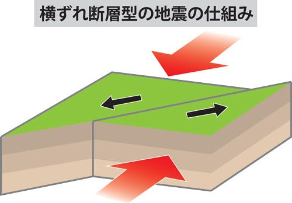
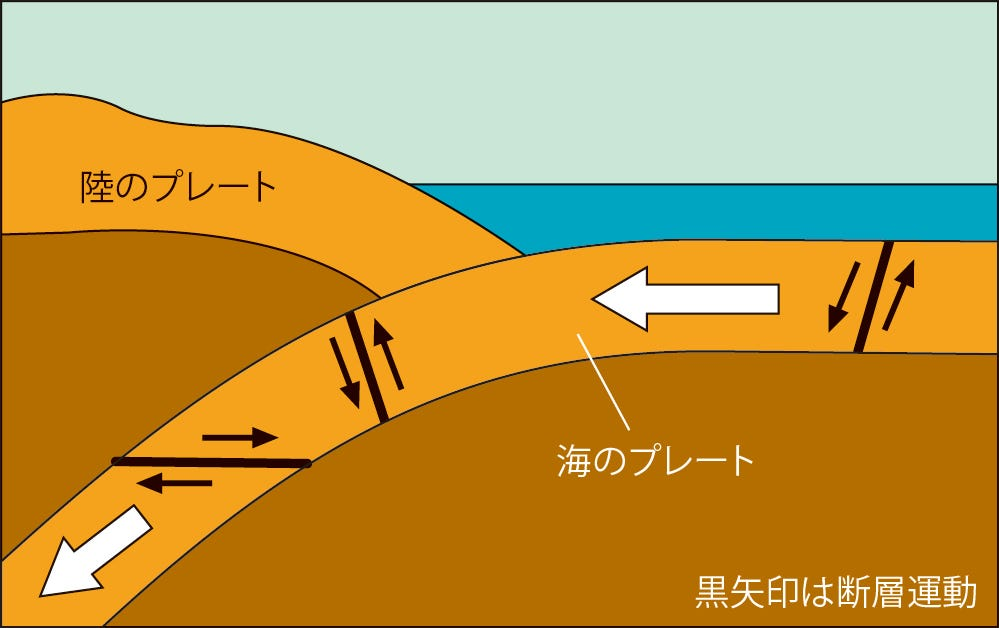
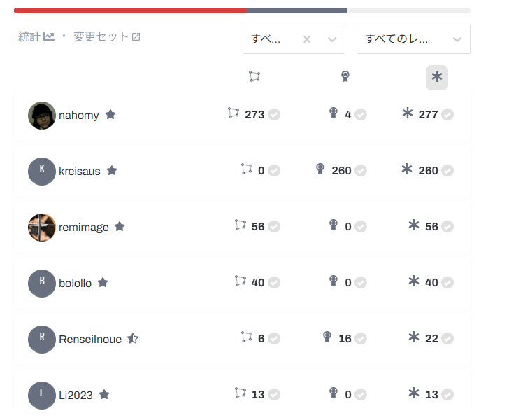
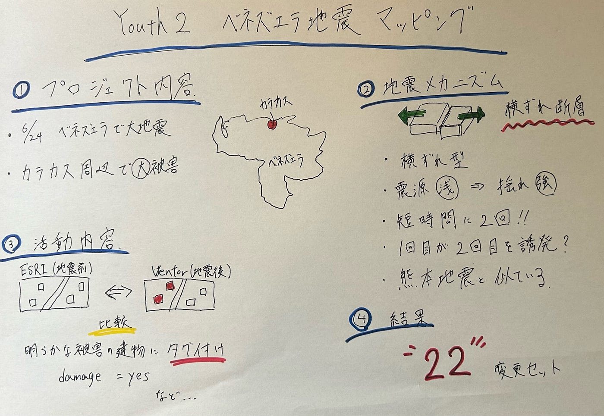

### 【youth2週報】ベネズエラ地震マッピング記録

こんにちは、四年の井上です。この週報を書いているときはまだ日本対ブラジルのキックオフ前なので、一発予言を書いておきます。今回の対戦結果は１‐１（PK：４ー３）で日本の勝利です！日本の得点者は”前田大然選手”です。もし正解したら古橋先生焼肉奢ってください！

さて、今回は先日発生したベネズエラ地震のプロジェクトが立ち上がったという事で早速マッピングしてきたのでその報告になります。

> _**プロジェクト内容_**

今回取り組んだのは、[ベネズエラ地震に関する建物被害マッピング](https://tasks.hotosm.org/projects/54357)のプロジェクトです。

2026年6月24日、ベネズエラで大きな地震が相次いで発生し、首都カラカス周辺や北部沿岸地域を中心に大きな被害が出ました。プロジェクトでは、被災地域の建物データを充実させることに加え、明らかな被害が確認できる建物に対して、被害情報のタグを付与することが目的とされています。

実際の作業では、地震後に撮影された**Vantorのカスタム画像**と地震前の画像である**ESRI World Imagery**を比較し、建物の輪郭や被害状況を確認しました。

被害が確認できた建物には、以下のようなタグを付与しました。

① damage=yes
② damage:VenEarthquake=2026–06–26
③ source:damage=Vantor

それぞれの意味は①地震被害の有無、②被害日、③被害判定の画像ソースです。

今回の地震のメカニズム

今回のベネズエラ地震は**横ずれ断層型地震**とされています。日本でよく聞く南海トラフ地震のような「沈み込み型地震」とは異なるメカニズムの地震です。おそらく中学理科で習ったと思いますが、皆さんちゃんと覚えているでしょうか？二つの地震の違いは下のイラストのとおりです。思い出せたでしょうか？

また、今回大きな被害が発生して原因として、地震が比較的浅い場所で発生したため、地表に強い揺れが伝わりやすかったことが考えられます。さらに、2つの大きな地震が短い時間差で発生したことも特徴です。最初の地震によって周辺の断層に力が加わり、その後の2つ目の大きな地震を誘発した可能性があるとされています。

日本でも、同じように横ずれを主体とする活断層による地震は起こります。有名なのは2016年の熊本地震です。この地震も横ずれ断層地震で、観測史上初めて震度7を二度記録した地震として知られています。

日本も地震が多い国ですが、ベネズエラでもプレート境界に起因する大きな地震が発生することを知り、地震災害は世界共通の課題であると改めて感じました。

> _**活動内容_**

今回のマッピングでは、建物に明らかな損傷が見られる場合には、指定された被害タグを追加することが目的でした。

しかし、なかなか明らかな損傷が見られる建物を見つけることができませんでした。怪しい建物があっても影で見えづらかったりして確信をもって被害タグをつけることができませんでした。明らかな被害がなかなか見つからないことへの喜ばしい気持ちと同時に、見つけられないことへの申し訳なさで複雑な気持ちでした。ちなみに、何度もCtrl+Bで画像を切り替えていたせいで左手の小指が変な疲れ方をしました。お疲れ左小指。

> _**結果_**

今回の活動では、合計で**22セット**の変更を行うことができました。

変更セット200越えの化け物を除けば貢献数3位なので必要最低限は貢献できたのかなと思います。

> _**感想・まとめ_**

今回のプロジェクトは「明らかに被害がある」と判断できるものだけをタグ付けする必要があり、慎重さがいつも以上に求めらるプロジェクトでした。災害対応のマッピングでは、早さだけでなく、正確さや一貫性も重要だと改めて痛感したため、今後の活動ではこの正確性という部分に注意して取り組みたいと思います。

最後にグラレコです。

