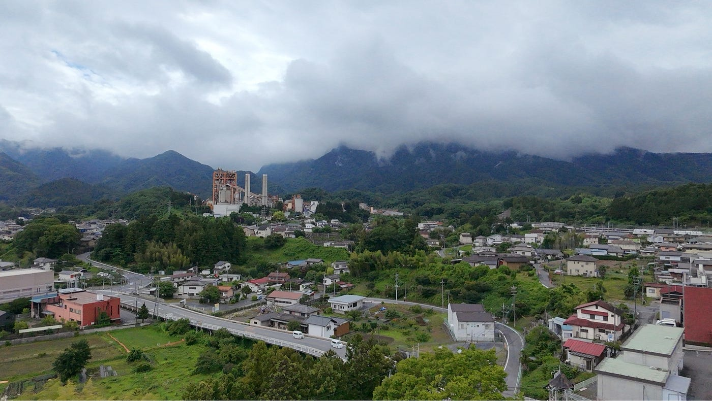
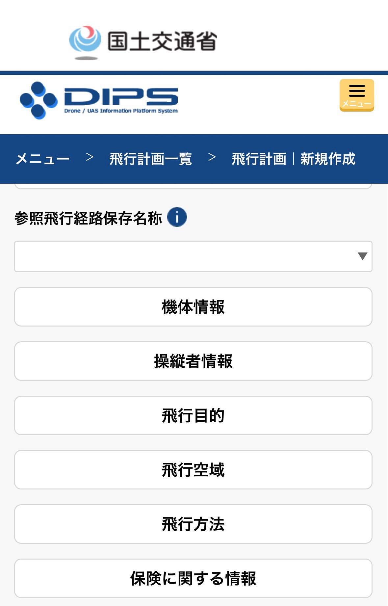
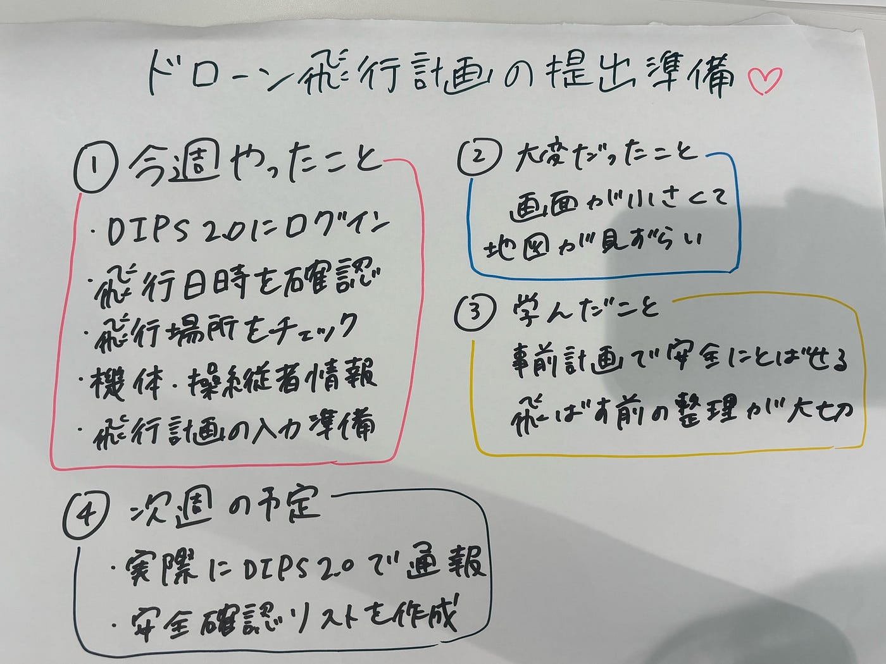

### ドローン飛行計画をマスターしよう編

こんにちは！ドローン部3年生、加藤れあらです！

6/21、横瀬町で行われた防災訓練でドローン飛行の実践経験を積んできたので、つぎにつながるようにまとめました！

こちらドローンで撮影した、みんながドローンを操縦している様子の写真です。

### 今週の活動内容

今週は、ドローンを安全に飛ばすために、**DIPS 2.0で飛行計画を提出する準備**を進めました。
飛行計画では、飛ばす日時・場所・経路・高度などを事前に国土交通省へ通報する必要があります。特定飛行を行う場合、飛行計画を出さずに飛ばすと罰則の対象になるため、今回は一つずつ確認しながら丁寧に進めました。([国土交通省](https://www.mlit.go.jp/koku/operation.html?utm_source=chatgpt.com))

### 今週やったこと

まず、スマホでDIPS 2.0にログインして、飛行計画の提出に必要な情報を確認しました。
画面が少し細かくて最初は大変でしたが、落ち着いて見ると、入力する内容は大きく分けて「いつ・どこで・どの機体で・誰が・どのように飛ばすか」だとわかりました。

具体的には、飛行予定日、飛行場所、使用するドローン、操縦者情報、飛行高度、飛行目的などを整理しました。DIPS 2.0は、無人航空機に関する手続きを行うための公式システムとして案内されています。([OSSポータル](https://www.ossportal.dips.mlit.go.jp/?utm_source=chatgpt.com))

### スマホでやってみた感想

スマホでも作業はできそうですが、地図を見ながら飛行範囲を確認するところは少し見づらいと感じました。また、飛行エリアを指定する時に、スマホからだと訂正できず、フリーズしてしまいスマホ作業だと限界があることがわかりました。
特に、飛行エリアを細かく確認したり、周辺に空港・人が集まりそうな場所・建物がないかを見る作業は、スマホだと拡大と移動を何回もする必要がありました。

なので、スマホでやる場合は、先にメモ帳などに必要情報をまとめておくと楽だと思いました。

### スマホで進めるときのやさしい手順

1. **DIPS 2.0にログインする**
まずはスマホのブラウザからDIPS 2.0を開いてログインします。

1. **飛ばす場所を確認する**
地図で、飛行場所・周辺施設・人が入りそうな場所を確認します。

1. **飛行日時を決める**
天気、風、人通り、明るさを考えて、無理のない日時にします。

1. **機体と操縦者情報を見る**
登録した機体や操縦者情報が正しく入っているか確認します。

1. **飛行計画を入力する**
日時、場所、飛行範囲、高度、目的などを入れていきます。

1. **提出前にもう一度チェックする**
日付・場所・高度を間違えると危ないので、最後にゆっくり確認します。

### 大変だったこと

DIPS 2.0の入力項目が多く、最初は「どこからやればいいの？」と少し不安になりました。
でも、飛行計画は難しい書類というより、ドローンを安全に飛ばすための**準備リスト**のようなものだと考えると、少し気持ちが楽になりました。

また、特定飛行を行う場合は、飛行計画だけでなく飛行日誌の作成も必要になるため、飛行後の記録まで意識しておく必要があるとわかりました。([国土交通省](https://www.mlit.go.jp/koku/koku_fr10_000042.html?utm_source=chatgpt.com))

### 学んだこと

今回の作業を通して、ドローンは「飛ばせたらOK」ではなく、事前の確認や記録がとても大切だと感じました。
飛行計画を作ることで、自分の飛行内容を客観的に見直せるので、安全管理の練習にもなると思いました。

### 次週の予定

次週は、実際に飛行計画をDIPS 2.0で通報し、当日の安全確認リストも作成する予定です。
あわせて、飛行後に記入する飛行日誌についても、どの項目を書けばよいか確認しておきたいです。

### ひとこと

スマホでの飛行計画提出は、少し細かくて大変だけど、ひとつずつ進めればできそうだと感じました。
安全に飛ばすための大事な準備として、焦らずていねいに取り組みたいです。

_今回はスマホでDIPS 2.0を確認しながら、飛行計画の提出準備を行いました。画面が少し小さく、地図の確認には時間がかかりましたが、必要な情報を事前にメモしておくことで、スムーズに進められると感じました。
ドローンを飛ばす前の準備は少し大変ですが、安全に飛ばすための大切なステップなので、ひとつずつ丁寧に確認していきたいです。_

#### グラレコ

