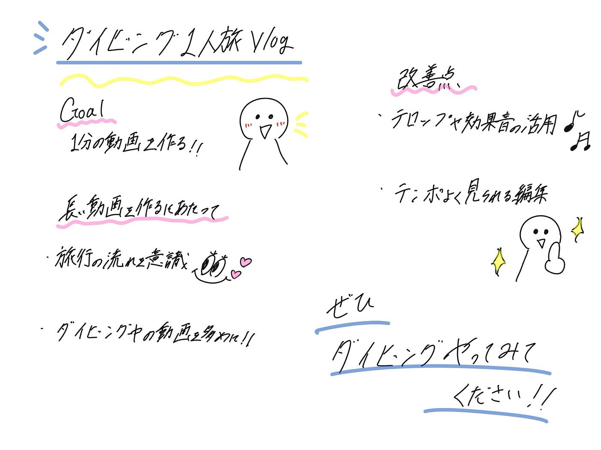

## 【VF週報】留学中の日常vlog

こんにちは！中溝です。今回は、マレーシア留学中に行ったダイビングの一人旅をVlogにまとめました。初めての一人旅だったこともあり、動画にしたいと思いながらもなかなか手をつけられていませんでしたが、この機会に作ることができてよかったです✨

前回に引き続き、読み上げ機能を使って音声動画を作成しました。今回は少し長めの作品に挑戦し、1分前後の動画を作ることを目標にしました。

> 長い動画を作るにあたって

長めの動画でも視聴者が飽きずに見られるよう、旅行の流れが伝わりやすい時系列の構成にしました。また、ダイビングの魅力が伝わるよう海中の映像を多く取り入れ、読み上げ機能を活用して映像だけでは伝わりにくい感情や体験を補足しました！

> 改善点

今回は基本的な編集が中心だったため、次回はテロップや効果音の活用にも挑戦したいです🙌🏻 著作権の問題があるため、フリー素材を探して活用しながら、より完成度の高い動画を作りたいです。

> Tiktok のリンク

動画は[こちら](https://www.tiktok.com/@furuhashilab?_r=1&_t=ZS-97cwWMol2TU)から！！

> グラレコ

