こんにちは、4年の安生です。デザイン部2は、今週からアニメーション作品の制作がスタートしました！それぞれの進捗を報告していきます。

【ゆうか】

私は前回紹介したガチャガチャのアニメーションに取り組むべく、まずはガチャガチャのカプセルや本体などのモデリングを開始しました。

今週の成果としては、

①カプセル・本体(フタやカプセルが入る部分)の作成

②土台の作成、スムーズシェードをかけるところまで進みました。

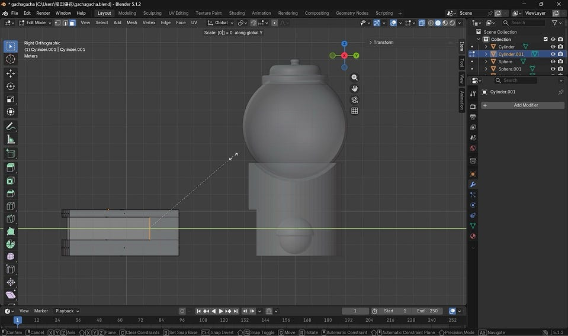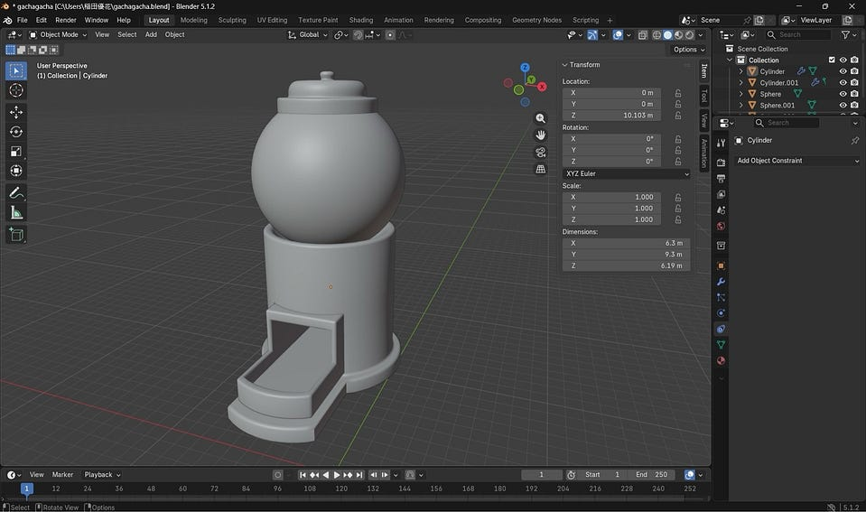

✨透過表示(Alt＋z)で内側までとても見やすくなる！✨

今回難しかったのは、土台や本体にベベルをかける作業(角を削ってリアルにする)(ctrl＋b)です。

Shift(同時に押す)＋Alt(一周押す)＋クリックを駆使しながら、なるべく他の線を押さないよう気をつけつつ動画と同じ部分を選択していきました。

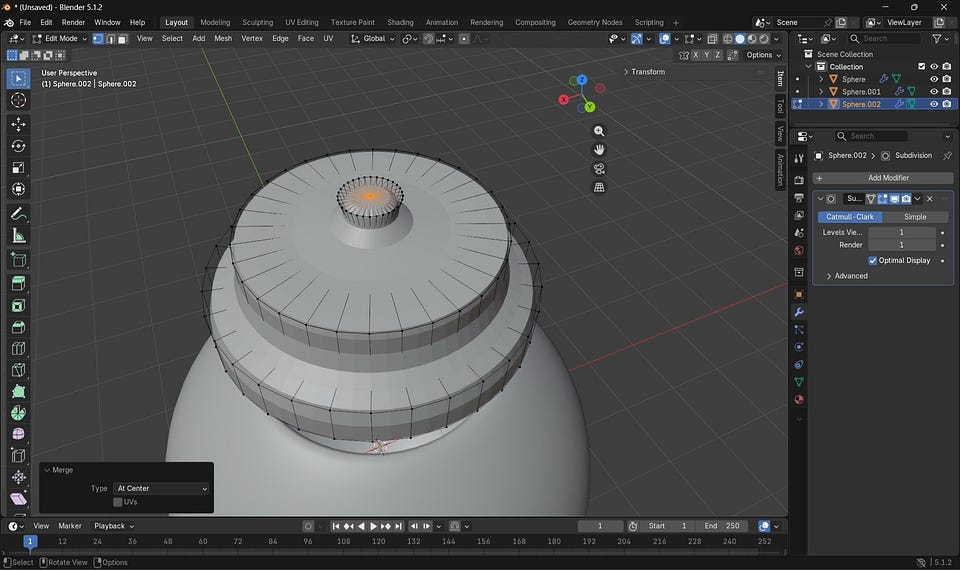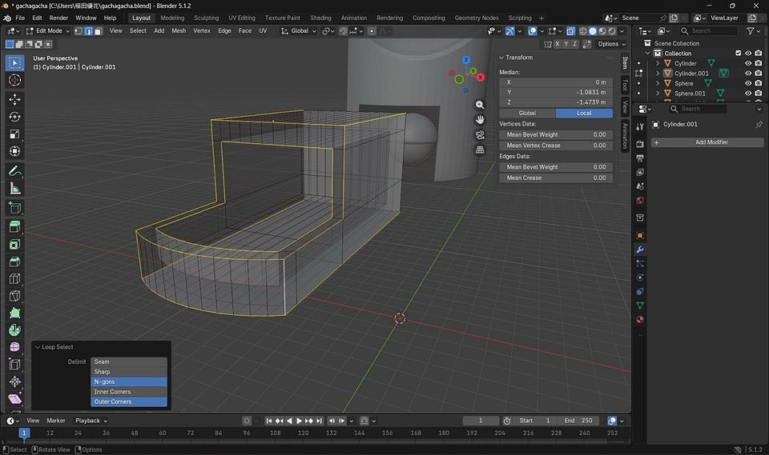

押し間違えるとctrl＋zで1つ前に戻るため押し疲れました🌀

しかし、ベベルをしっかりとかけることにより、角のカクカクが、一気に滑らかでリアルな形に変わるため、大切な作業だと実感しました。

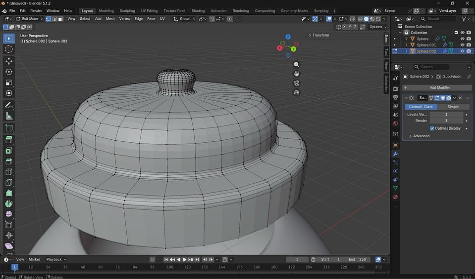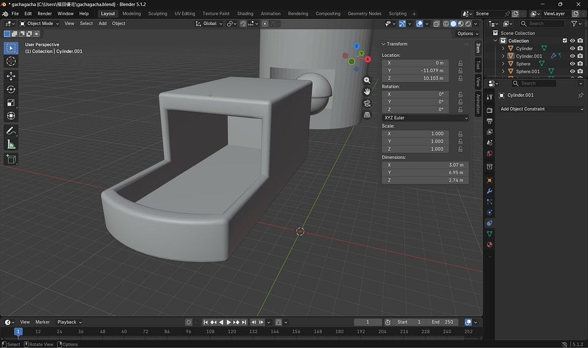

来週はハンドルの作成から進めていきます！

【みわ】

私は前回紹介した雨のアニメーションに取り組みました！

今回やった手順がこちらです！

1. 平面を追加して拡大し、それを複製して上空に配置することで雨を降らす天井を作成
2. 地面の細分化➡️地面となる平面を編集モードで細分化することで、後の波紋の精度を向上させる！
3. 雨粒オブジェクトの作成
4. 雨の表示設定

天井のパーティクル設定の「レンダー」項目で、レンダリング方法を「オブジェクト」に変更し、作成した雨粒を指定。

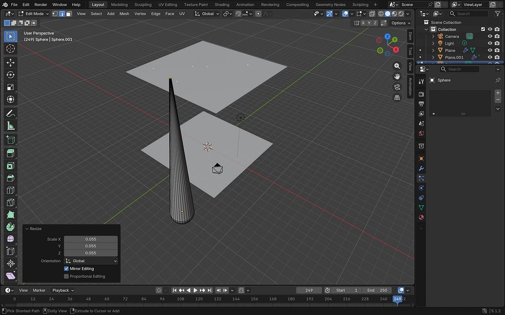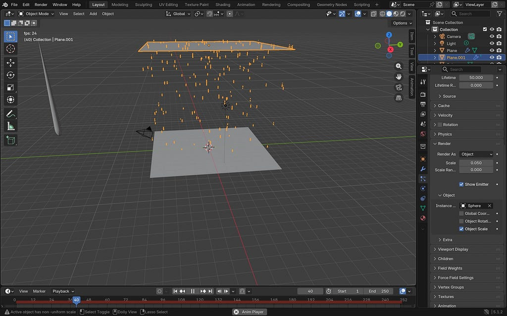

5. 波紋の設定

地面のダイナミックペイント設定で、表面（サーフェス）タイプを「波」に変更しました！これで、雨粒が当たった箇所に波紋が広がるようになり、より雨が降った地面を表現できました！

📍地面にスムーズシェードを適用し、見た目を滑らかに！（前回のケーキ作成でも使った滑らかな物体づくり！）

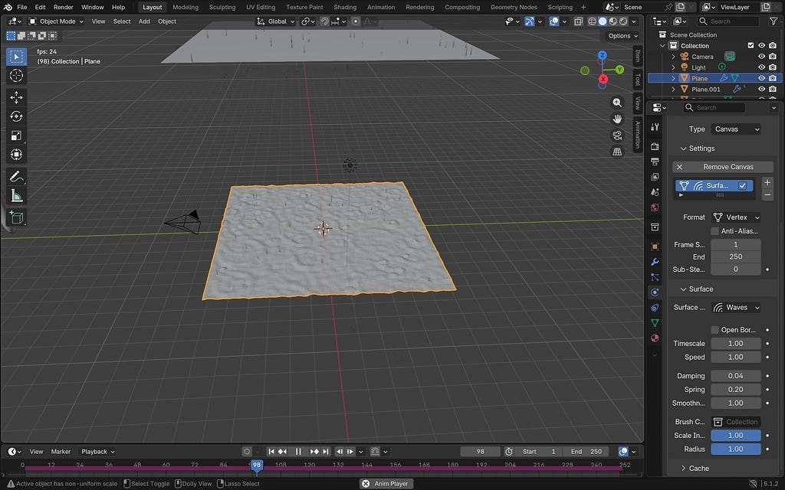

今回は雨が降って地面に落ちていくまでの表現が出来たのでアニメーションにして動かしながら作業するのが楽しかったです。

【もえ】

私は月のうさぎのアニメーションの作品を作り始めました。

今回は、月とうさぎのベースを制作し、どちらも“ラウンドキューブ”というメッシュを使いました。

今回のポイントは、うさぎの耳を参考動画のものより短くすることで、丸くて柔らかい雰囲気になるように工夫したことです。

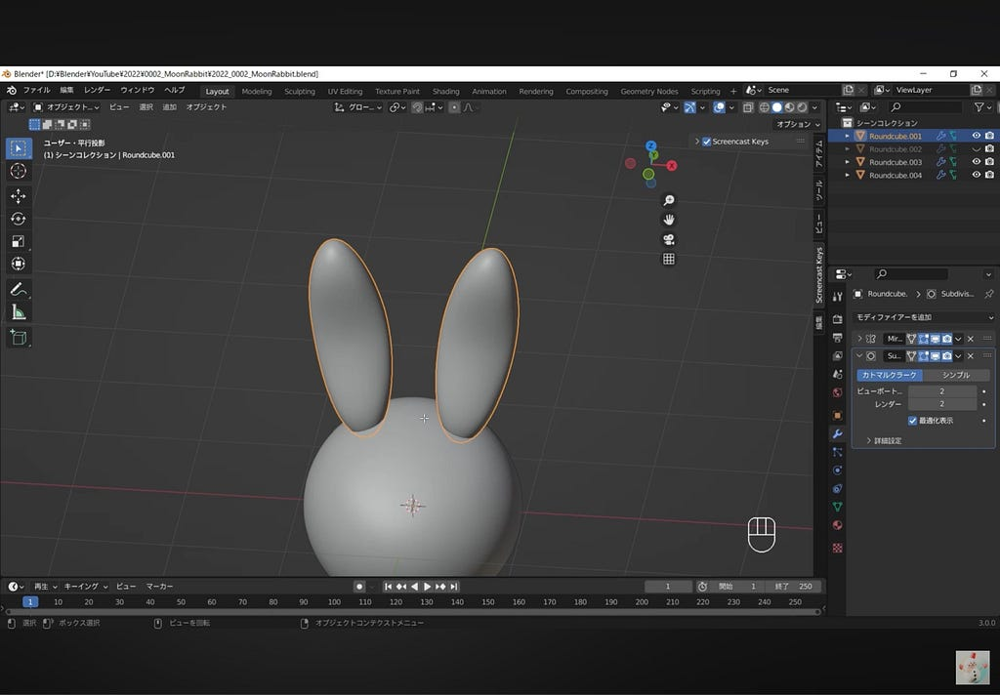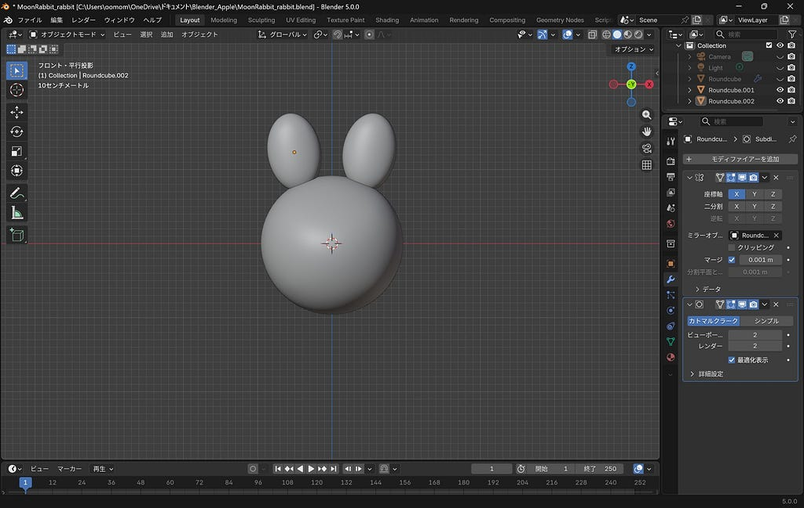

左：参考動画のもの 右：耳を丸く作った

以下の写真のように、プロポーショナルサイズ（周りに出ているグレーの円の大きさ）をマウスのホイールで調整しながら形作ることで、自分好みのカーブをつけることができました。左右の耳は、ミラーという機能を使って対称の位置に複製しています。

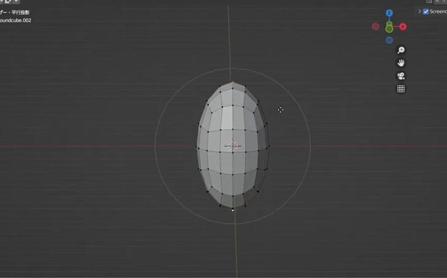

プロポーショナルサイズの調整

また、前回制作した作品同様、サブディビジョンサーフェスやスムーズシェードを設定しました。それに加えて、プロポーショナル編集に“スムーズ”を選択することで、より滑らかな面にすることを心がけました。

次回は、うさぎの耳の模様や顔のパーツをつけて、月の上にうさぎを乗せる工程に取りかかる予定です。

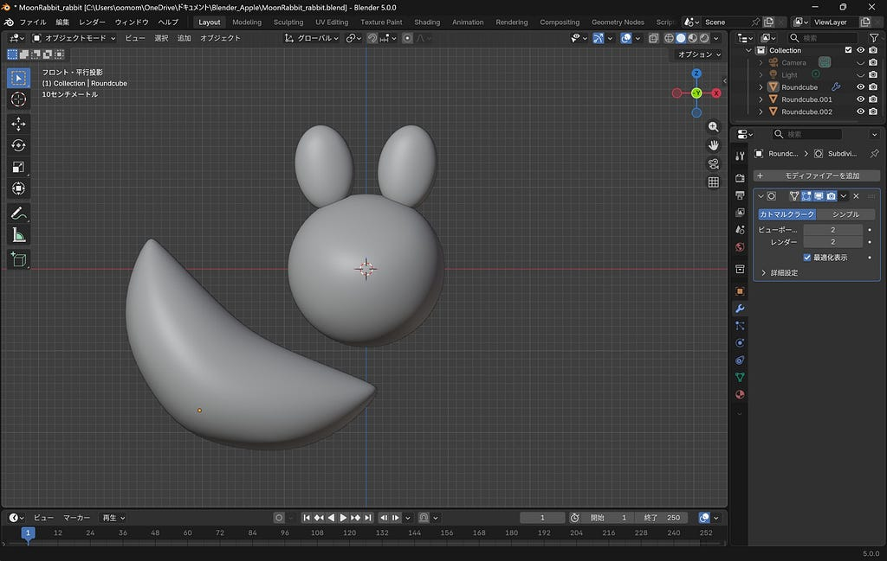

3人それぞれ違った作業工程やポイントがあるので、お互いの作品を見るのもとても楽しいです。前回の作品で得た知識を活かしながら、引き続き頑張っていきます！

グラレコ

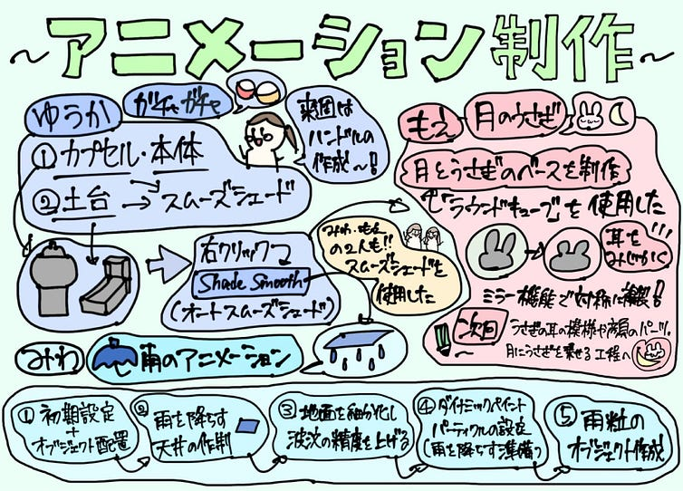

ゆうか

---

[アニメーション制作スタート！](https://medium.com/furuhashilab/%E3%82%A2%E3%83%8B%E3%83%A1%E3%83%BC%E3%82%B7%E3%83%A7%E3%83%B31%E5%91%A8%E7%9B%AE-0f3b636180d9) was originally published in [Furuhashi(mapconcierge)Lab.](https://medium.com/furuhashilab) on Medium, where people are continuing the conversation by highlighting and responding to this story.
