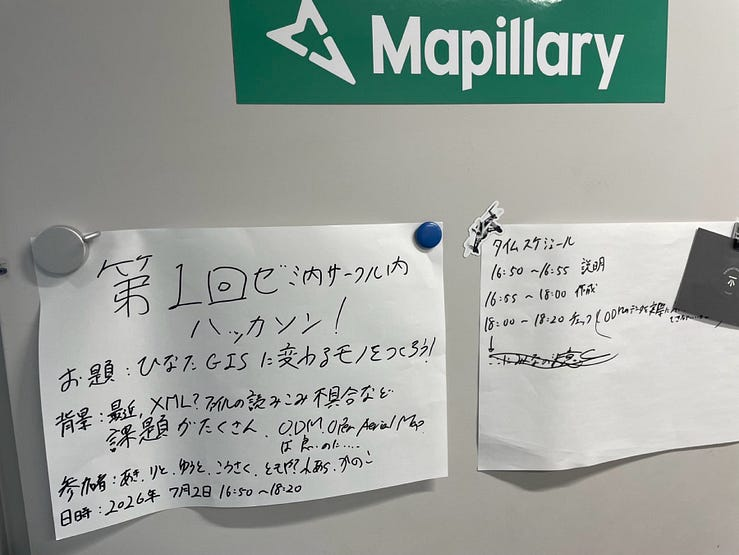
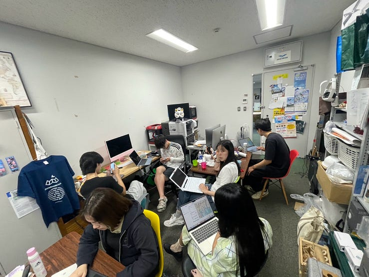
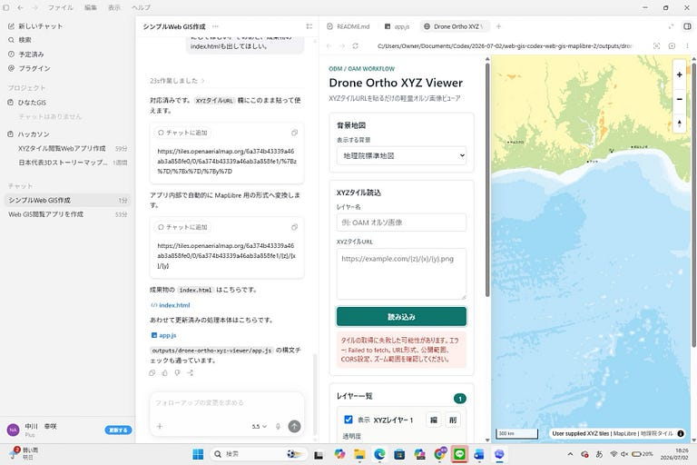
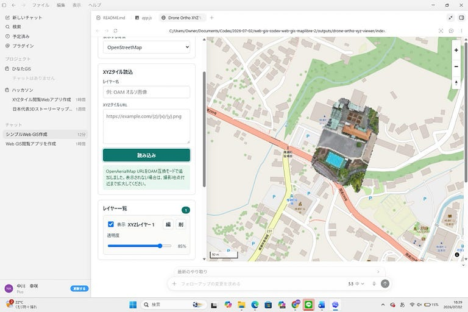
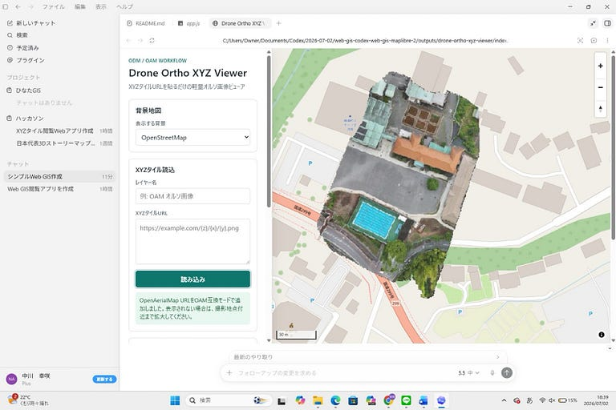
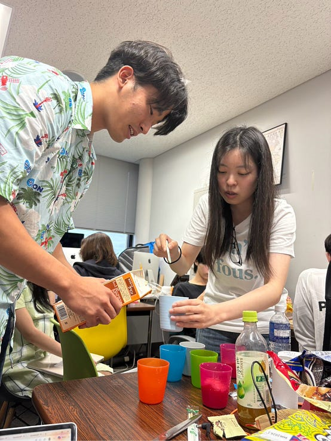
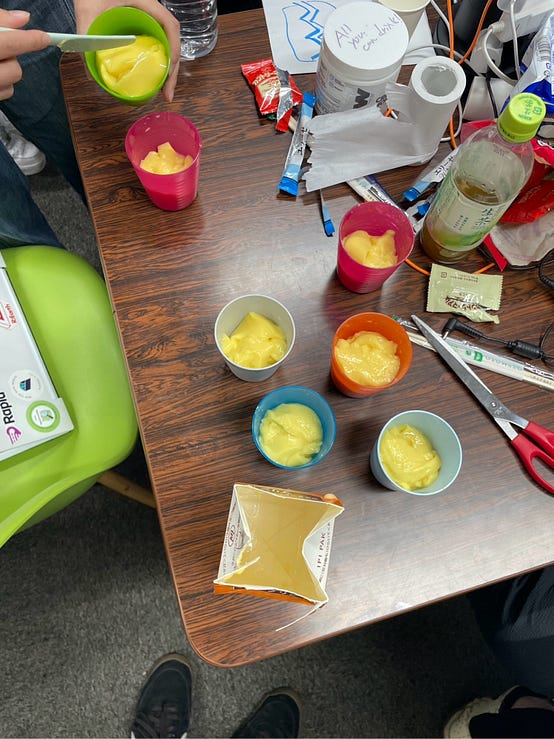
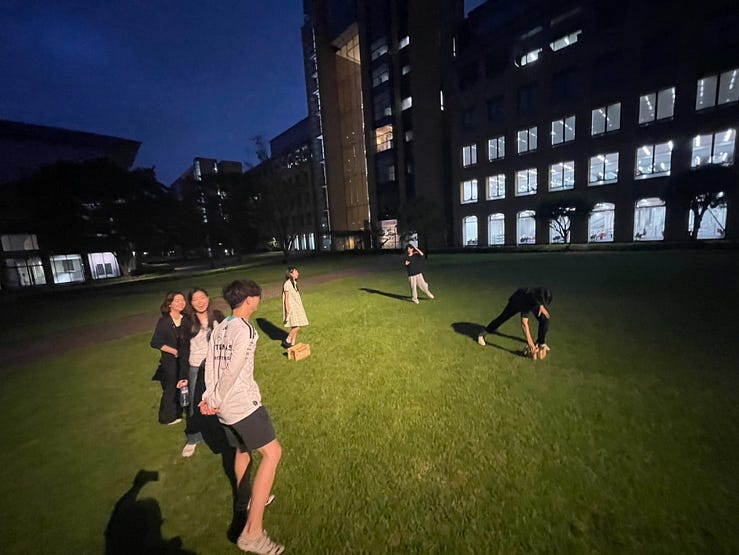
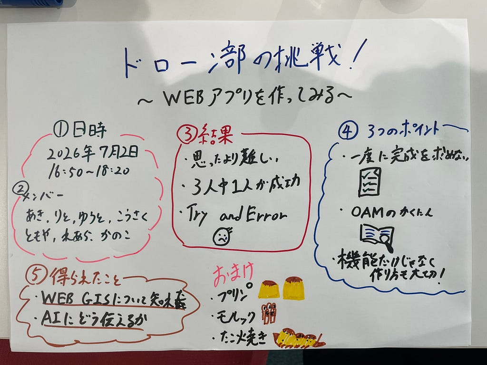

## 〜WEBアプリを作ってみる〜

こんにちは。ドローン部１の藤原です。

最近、夏休みに香港・マカオ旅行に行くことが決まり、人生初のカジノ🎰に行ってみようとしています！でも、ただ行くだけじゃ大負けしてマイナスになりそうなので最近YouTube でカジノの遊び方などを見て勉強中です(笑)。もし、ゼミ内でカジノに行ったことがある人がいたら遊び方やアドバイスをお願いします！

#### みんなで集合！いざ開始！

さて、今回ドローン部では、ひなたGISの代わりとなるようなWeb GISアプリの開発に取り組むために先週の木曜日の5限にゼミ室に集合してみんなで取り組みました。

#### 始めてみたものの、、、

しかし、開発は思っていた以上に難しく、多くのトラブルに直面しました。今回の課題では一人一つアプリの開発を行いましたが、最終的に思うように動作するところまで完成させることができたのは、ドローン部１のメンバー３人のうち１人(幸咲)だけでした。それほど、短期間でGISアプリを開発することはたとえAI が使えるからといって簡単ではないんだと実感しました。

#### AI開発で成功を左右したのは「何を作るか」ではなく「どう作るか」だった

今回、りとさんはClaude Code を使用し、私と幸咲はChatGPT のCodexを使用しました。同じ目的で作成したプロンプトでも、Codex では開発に成功した一方、Claude Code では期待した結果を得ることができませんでした。

そこで両方のプロンプトを比較したところ、成功と失敗を分けたのは主に3つのことが要因として考えられます。

#### ①進め方

最も大きな違いは、開発の進め方でした。

りとさんのClaude Code用のでは、一つの機能を実装して動作確認してから次へ進む流れが細かく決められていました。

一方、Codex用プロンプトでは、地図表示・レイヤー管理・GeoJSON・URL共有など多くの機能を一度に実装するよう指示していました。その結果、全体を完成させることを優先させる指示になりました。

一見、細かい指示をしていたClaude Code の方が成功しそうでしたが、Codexの指示で出した方が成功するという意外な結果になりました。

#### ②タイル形式

今回特に重要だったのが、OpenAerialMapのタイル形式です。

Claude Codeの方ではうまく作れず、Codex はpingでしか読み込めない状態になってしまい、その後Codex の方では実際に使うURLをプロンプトに埋め込んでそれでも使えるように指示して成功しました。

エラーが起きてしまった。

修正後

⇧途中で疲れてきてみんなでプリンで糖分補給(用意はりとさんとあきさんがしてくれました←大感謝)

#### 今回の活動で得られたもの

私や璃音先輩は完成には至らなかった部分も多くありましたが、実際に自分たちでWeb GISを開発した経験を通して、地図アプリがどのような仕組みで動いているのかを理解する貴重な機会になりました。

#### おまけ

ずっとやってたらトークンや集中力が切れてしまったので、気晴らしにみんなで初モルックやりました！

1位　あきさん＆ともや

2位　りとさん＆こうさく&ゆうと

3位　れあら＆かのこ

の結果でした！やってみたらめっちゃ面白かったです。

#### 成果物

[Drone Ortho XYZ Viewer](https://kousakunakagawa.github.io/drone-ortho-xyz-viewer/)

#### グラレコ

プリンめっちゃ上手‼️

---

[ドローン部の挑戦！](https://medium.com/furuhashilab/%E3%83%89%E3%83%AD%E3%83%BC%E3%83%B3%E9%83%A8%E3%81%AE%E6%8C%91%E6%88%A6-4db7e46a76e5) was originally published in [Furuhashi(mapconcierge)Lab.](https://medium.com/furuhashilab) on Medium, where people are continuing the conversation by highlighting and responding to this story.
