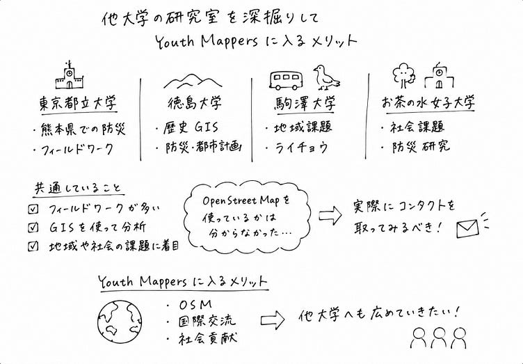

## すYouth2週報　他大学の研究室を深掘りし、YouthMappersに所属するメリットを考えてみた件

こんにちは三年の加藤です。

### 前回の記事の振り返り

前回は、ゆうだいさんが日本国内でGISや地理空間情報を学べる大学・研究室について調査しました。

今回は、前回紹介した研究室についてさらに詳しく調べるとともに、他大学へYouthMappersを紹介する際にはどのような魅力を伝えるべきかを考えてみました。

### 他大学の研究室を深掘りしてみる

* 東京都立大学

東京都立大学地理情報学研究室の過去の研究を調べると、熊本県を対象とした地域調査や防災に関する研究が多く行われていました。現地でのフィールドワークを通してデータを収集し、その結果をGISで分析するという研究スタイルが特徴的です。

* 徳島大学

徳島大学空間情報科学研究室では、GISを活用したさまざまな研究が行われています。特に、夏目先生は歴史空間研究に取り組んでおり、過去の土地利用や災害履歴をGISで分析して現代の防災や都市計画に役立てるという考え方を紹介されていました。

* 駒澤大学

駒澤大学では、GISを活用して地域社会や自然環境の課題を分析する研究が行われています。例えば、群馬県桐生市を事例にしたフードデザート問題の研究では、高齢者人口密度や生鮮食品店のデータをGISで解析し、買い物が困難な地域を推定していました。さらに、住民へのアンケート調査も行い、高齢者の買い物行動や交通手段の課題を明らかにしていました。

また、日本アルプスのライチョウを対象にした研究では、現地で植生調査を行い、GISを使って植生分布や地形データとの関係を分析していました。この2つの研究から、駒澤大学ではGISによる空間分析だけでなく、アンケートや現地調査を組み合わせながら、地域や自然環境の課題を考えていることが分かりました。

・お茶の水女子大学

お茶の水女子大学では、防災や都市計画、地域コミュニティ、福祉、教育など、社会課題をテーマとした研究が多く行われていました。例えば、東京都23区の学校跡地活用や能登半島地震における学生ボランティアの役割、災害地名と災害リスクの認識、都市部における高齢者や下肢不自由者の外出行動など、地域社会に密着した研究が数多く見られました。

### 調査して見えてきたこと

4大学を調査してみると、どの研究室もGISを活用しているという共通点がありました。一方で、都市計画や防災、環境、地域活性化など、研究テーマや活動内容にはそれぞれ特色があることも分かりました。

### YouthMappersに所属するメリットとは？

他大学YouthMappersを紹介する際には、次のような魅力を伝えられるのではないかと考えました。

* OpenStreetMapを活用した実践的なマッピング活動ができる
* 世界中の学生と交流し、国際的なネットワークを築ける
* 災害支援や地域課題の解決など、社会貢献につながる活動に参加できる
* GISや地図作成の実践的なスキルを身に付けられる

### まとめ

今回の調査を通して、4つの大学がそれぞれ異なる視点からGISや地理学を活用した研究を行っていることが分かりました。一方で、OpenStreetMapを実際に研究や授業でどの程度活用しているのかについては、公開されている情報だけでは確認することができませんでした。そのため、今後は実際に研究室へコンタクトを取り、活動内容やOpenStreetMapとの関わりについて話を伺ってみたいと考えています。

また他大学へYouthMappersを広めるためには、研究内容だけではなく、学生がどのような経験や成長を得られるのかという視点で魅力を発信していくことが大切だと感じました。これからも他大学の活動を調査しながら、YouthMappersの魅力をより分かりやすく伝えていきたいと思います。

---

[Youth2週報　他大学の研究室を深掘りし、YouthMappersに所属するメリットを考えてみた件](https://medium.com/furuhashilab/youth2%E9%80%B1%E5%A0%B1-%E4%BB%96%E5%A4%A7%E5%AD%A6%E3%81%AE%E7%A0%94%E7%A9%B6%E5%AE%A4%E3%82%92%E6%B7%B1%E6%8E%98%E3%82%8A%E3%81%97-youthmappers%E3%81%AB%E6%89%80%E5%B1%9E%E3%81%99%E3%82%8B%E3%83%A1%E3%83%AA%E3%83%83%E3%83%88%E3%82%92%E8%80%83%E3%81%88%E3%81%A6%E3%81%BF%E3%81%9F%E4%BB%B6-49d9723c44bb) was originally published in [Furuhashi(mapconcierge)Lab.](https://medium.com/furuhashilab) on Medium, where people are continuing the conversation by highlighting and responding to this story.
