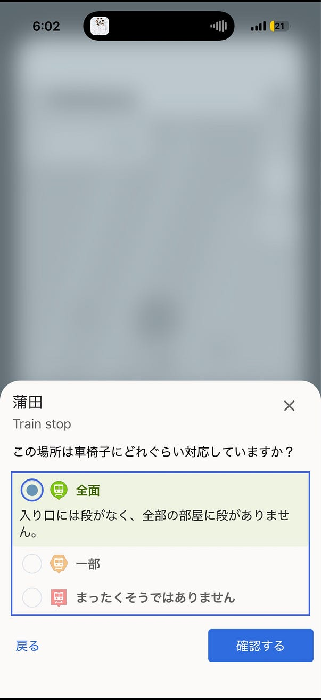
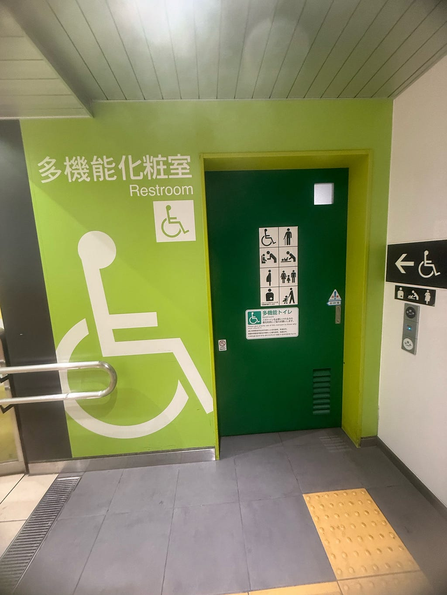
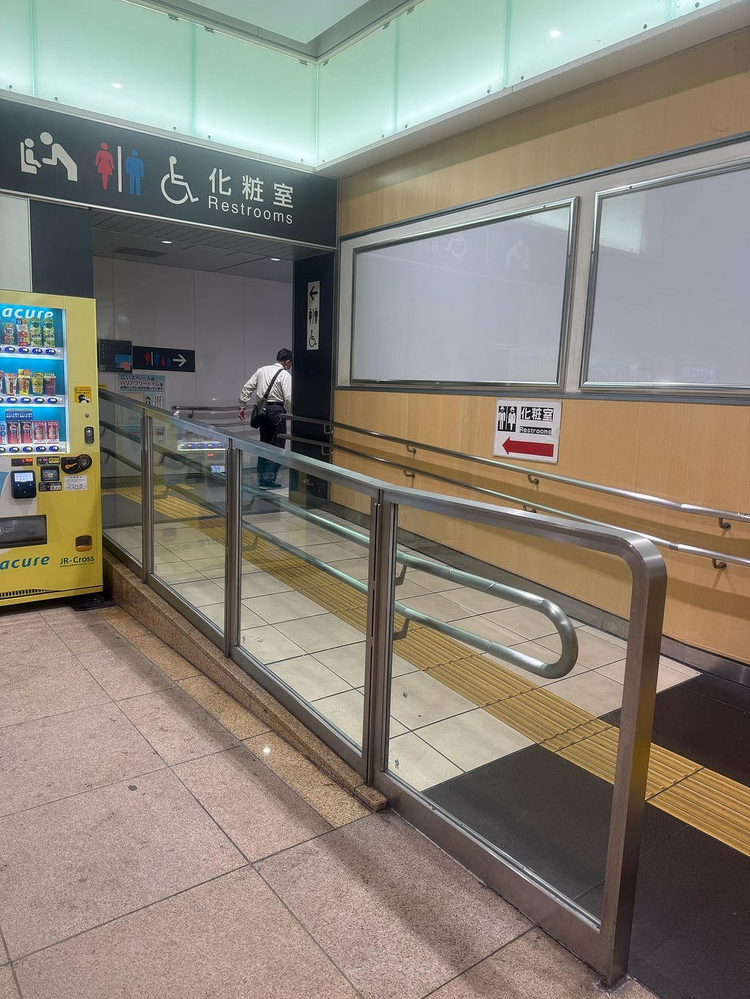
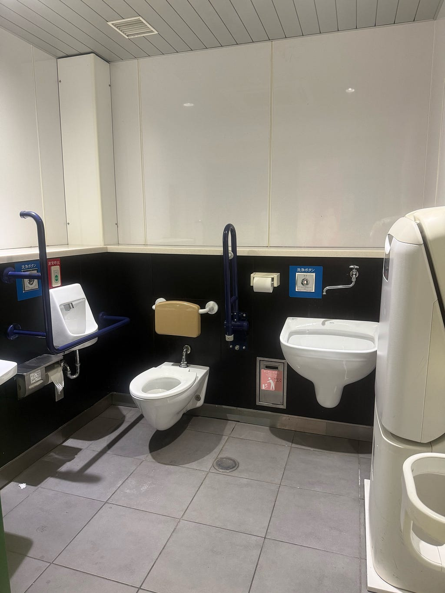
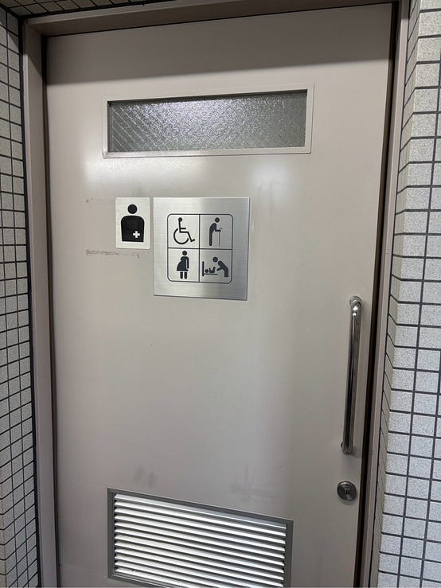
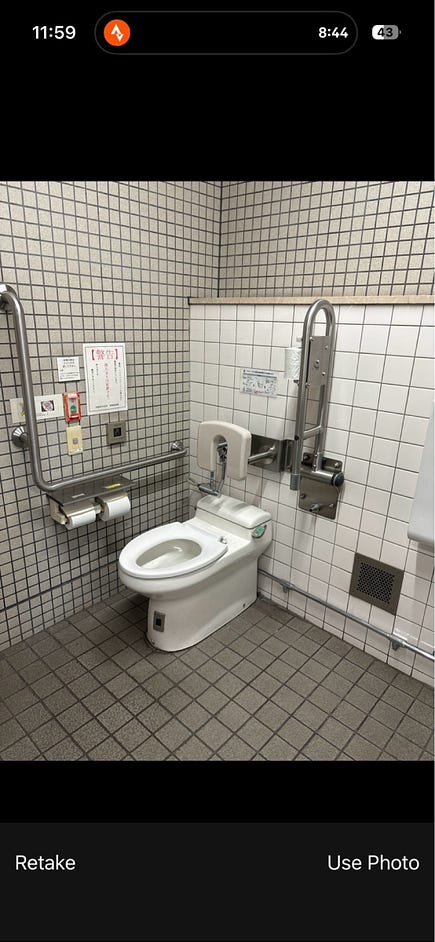
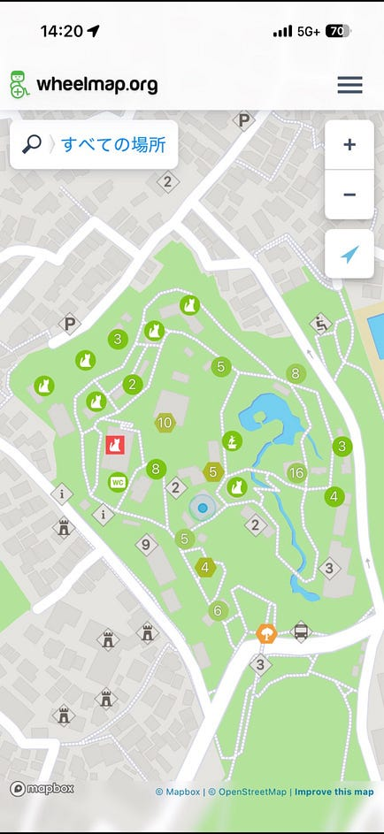
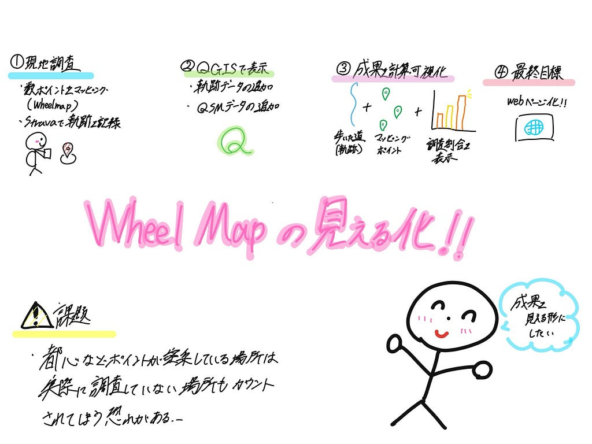

こんにちは。中溝です。今後2週間ほどかけて、Wheelmapでの活動成果を可視化する仕組みの検証を進めていきたいと考えています。現在のWheelmapでは、自分がどれだけマッピングに貢献したのかが分かりにくく、活動の成果を実感しづらいという課題があります。そこで、まずはマッピングと同時にStravaやYAMAPで移動軌跡を記録し、そのデータを活用して成果を見える化できないかと考えました。

具体的には、取得した移動軌跡をQGISに取り込み、QuickOSMを用いて取得したOpenStreetMapのデータと重ね合わせ、自分が歩いた軌跡とマッピング対象のポイントを関連付けることで、「どのエリアでどれだけマッピングしたのか」を可視化することを目指しています。QuickOSMはOverpass APIを利用してQGIS上でOSMデータを取得できるプラグインであり、このような検証に活用できると考えています。(QGISプラグイン) 将来的にはGitHub上でWebページ化し、活動成果を誰でも確認できる仕組みの構築も視野に入れています。

今回の活動では、私は蒲田駅周辺、ふうかさんは淵野辺駅周辺、みなとくんは横浜市立野毛山動物園でWheelmapのマッピングを実施し、あわせてStravaで移動軌跡を記録しました。StravaのGPS軌跡はOpenStreetMapと組み合わせた活用事例も多く、今回の成果可視化にも応用できる可能性があります。(OpenStreetMap)

> さくら

蒲田駅周辺でWheelmapをやりました。蒲田駅周辺のマッピングでは、駅構内の情報不足が課題として見られました。例えば、実際には存在する南口改札の情報がWheelmap上に反映されておらず、利用者が必要な情報を得にくい状況でした。駅は改札や出入口ごとにバリアフリー環境が異なるため、より詳細な情報の登録と継続的な更新が必要であると感じました。

Stravaの記録

https://strava.app.link/Z6Z4xI2Xy4b

> ふうかさん

淵野辺駅周辺では、駅前のトイレやエスポット、桜美林大学方面のバス発着所などを調査しました。調査した地点はいずれも車椅子で利用可能であり、Wheelmap上の情報と現地の状況がおおむね一致していることを確認できました。一方で、活動を進める中で、Wheelmapでは自分の貢献が見えにくいという課題も感じました。誰でも地点の評価やコメントを追加できることはWheelmapの大きな特徴ですが、自分がどれだけマッピングに貢献したのかが分かりにくく、継続的な活動へのモチベーションにつながりにくいと感じました。

Stravaの記録

https://strava.app.link/6F9ji7SLl4b

> みなとくん

横浜市立野毛山動物園でwheelmapやりました。1箇所に何個もピクニックテーブルがある場所などは完全にマッピングしてないです。あと、昔居た動物がまだ残ってて、新しく展示されてる動物が反映されてなかったりしたので更新頻度をあげるか、ユーザーが地点を追加できるようにするべきだと思いました。その時にポケモンGOみたいに一定レベルに達していることを条件にすれば、ユーザーランクを追加するきっかけになると思いました。

Stravaの記録

https://strava.app.link/S2rWN4Dwu4b

> グラレコ

---

[【Youth①.Wheelmapの成果を見える化したい！移動軌跡を活用した可視化の検証】](https://medium.com/furuhashilab/youth%E2%91%A0-wheelmap%E3%81%AE%E6%88%90%E6%9E%9C%E3%82%92%E8%A6%8B%E3%81%88%E3%82%8B%E5%8C%96%E3%81%97%E3%81%9F%E3%81%84-%E7%A7%BB%E5%8B%95%E8%BB%8C%E8%B7%A1%E3%82%92%E6%B4%BB%E7%94%A8%E3%81%97%E3%81%9F%E5%8F%AF%E8%A6%96%E5%8C%96%E3%81%AE%E6%A4%9C%E8%A8%BC-c092f89f87b6) was originally published in [Furuhashi(mapconcierge)Lab.](https://medium.com/furuhashilab) on Medium, where people are continuing the conversation by highlighting and responding to this story.
