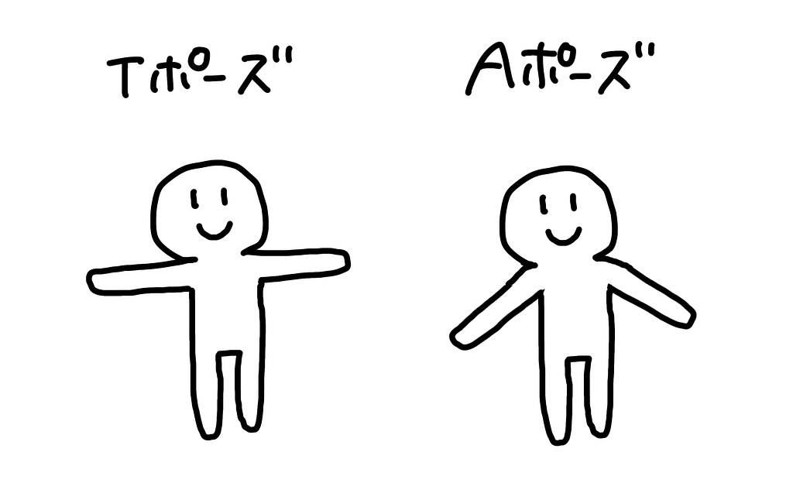
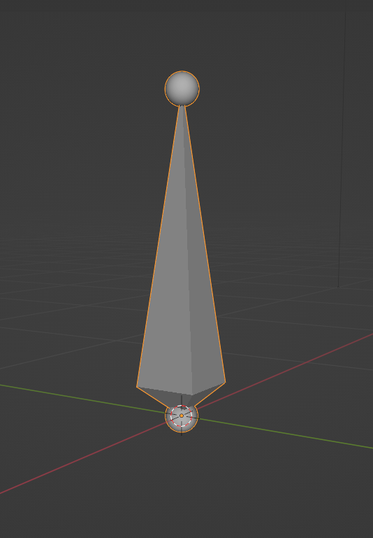
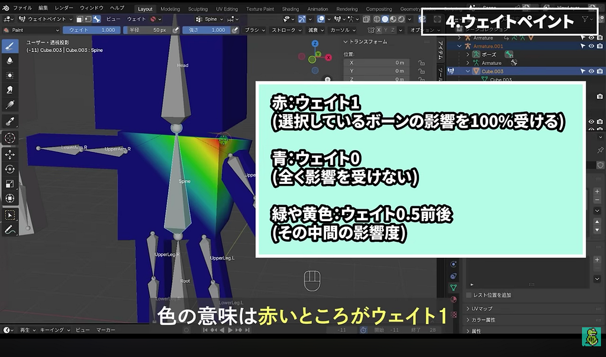
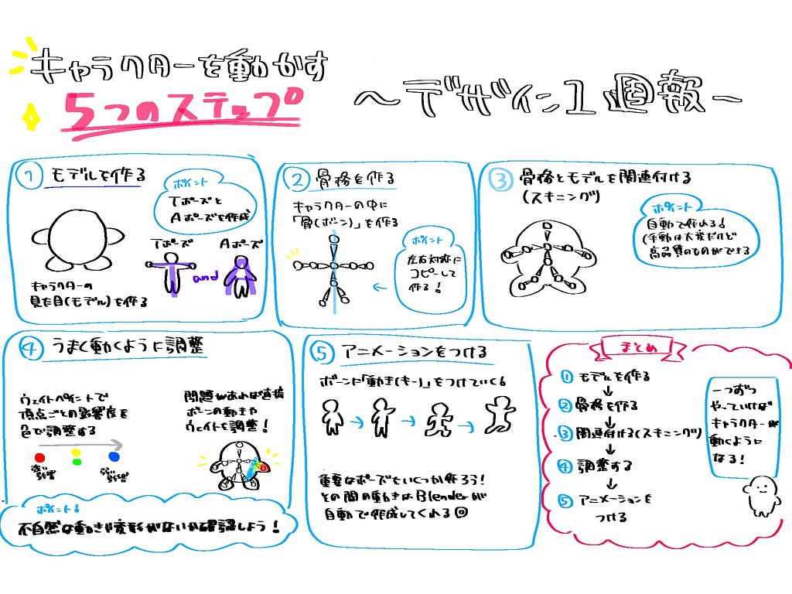

### Blenderでアニメーションを付ける方法を学ぼう！【デザイン部１週報】

こんにちは、臼井です。

今週は、キャラクターを動かす動画を自分たちで実践する「前に」アニメーションを付ける手順の全体を、動画を見て一度確認しようと思います！

<https://medium.com/media/e67958b68af82394946f74667f95714f/href>

参考にする動画は↑です！

キャラクターを動かすには、大きく分けて５つのステップがあるようです。

１、モデルを作る

２、骨格を作る

３、骨格とモデルを関連付ける

４、うまく動くように調整

５、アニメーションをつける

１のモデリングについては、以前の週でカービィのモデリングをしたのでなんとなく分かりますが、他の手順については全くやったことがありません！

実際に作る前に一つ一つ手順を確認し、気を付けるべき点を押さえておきましょう。

#### １、モデルを作る

今までやってきた手順なので一番理解しやすそうです。

ただし、いくつか注意点があります。

まず、キャラクターを作るときはTポーズまたはAポーズでつくる事です。

TポーズとAポーズはどちらもアニメーションを付ける前に、デフォルトとなるポーズです。

Tポーズは文字通り、体が「T」の形に見える、腕を水平に伸ばしたポーズで、Aポーズは腕を軽く下に下ろしたポーズです。

TポーズとAポーズ

Tポーズは、モデリングがしやすい、リグが組みやすいなどのメリットがあり、腕を下げたときに破綻しやすいといったデメリットがあります。

Aポーズは、逆にモデリングやリグが組みにくい一方、Tポーズよりも自然なポーズなので、後々自然に動かしやすいといったメリットがあります。

以前はTポーズが主流でしたが、Aポーズも使われるようになってきたそうです。

今回の動画ではTポーズを採用しているのと、モデリングのしやすさから初心者にはTポーズがおすすめらしいので、まずはTポーズから作ってみようと思います。

あとは、肘・膝といった関節を曲げるためにはメッシュの分割が必要です。モデリングの段階で分けておきましょう。

また、キャラクターを一つのオブジェクトに統合する必要があるようです。パーツごとに作る→統合の流れで作りましょう。

#### ２、骨格を作る

左(右)半身の骨格を作り、左右対称にコピーして作ります。

まずは、ボーンについて軽く理解しておきましょう。

ボーン

ボーンの根元の太い方はヘッド、先端の細い方をテールといいます。この２つを繋ぐことでボーンの向きや長さが決まります。

骨格を作るときは、根元のヘッドを関節に置くのが基本です。例えば頭にボーンを入れるなら首にヘッドを持ってきます。

ボーンはヘッドを基準に回転するので、関節の位置に置くのが自然な動きを作る上で大切です。

次に親子関係です。

ボーンを作るときに押し出して新たなボーンを作ると、元のボーンが「親」、押し出して作った方が「子」になります。

ポーズを作るときに「親」を動かすと、連動して「子」もついてきますが、「子」を動かしても「親」は動きません。

例えば、体を傾けた場合頭もそれについてきますが、頭を傾けても体が動かない、という仕組みを「親」を体、「子」を頭にすることで作るとこができます。

#### ３、骨格とモデルを紐づける(スキニング)

先ほどの手順で骨格を作りましたが、これではまだモデルと別々に存在しています。この手順を踏むことで骨格を動かすとモデルも動くようになります。

自動でやる方法と手動でやる方法がありますが、今回は自動で簡単に終わらせます。

手動では品質が高い物を作れますが、膨大な時間がかかります……

一方、自動で作れば品質はまあまあですが簡単に作ることができます。

軽く仕組みを解説すると、それぞれの頂点に対してウェイトが自動で割り当てられました。ウェイトとは頂点ごとに設定された影響度＝ボーンからどのくらい影響を受けるかということです。

今回の場合なら、腕の中間のある頂点は上腕のボーンが動いたときに70％影響を受け、前腕が動いたときにも20％の影響を受ける、といった具合です。

手動で行う場合は、それぞれの頂点を選んで自分でひとつずつ設定する作業が必要になります。

ここまで終われば、とりあえずキャラクターにポーズをとらせることが可能になります！

#### ４、うまく動くように調整

スキニングは自動で簡単に終わらせられますが、意図しない動作をすることもあります。

例えば、脚だけ動かしたいのに足につられて体も動いてしまう、などです。

この場合、余計なウエイトが割り当てられていることが原因なので、本当についていってほしいボーンのウエイトを高くすることで解決できます。

ただ、これは簡単なモデルの場合はいいですが、頂点が多い複雑なモデルになると手間がかかります。

そこでウェイトペイントを使うことで頂点ごとの影響度を色で塗ってまとめて調整できます。

ウェイトペイントモードでは、赤→選択したボーンの影響を100％受ける、青→全く影響を受けない、中間の色→中程度の影響を受けるといううように色で影響度を確認できます。

参考動画より引用

これで色を塗るようにウェイトを設定することができます。

#### ５、アニメーションを付ける

最後にアニメーションです。

動きを作るときは重要なポーズをいくつか作って、その間はBlenderに自動で補完してもらいます。

参考にする動画ではお辞儀のアニメーションをつけていました。この時は、最初の直立ポーズ、少し反動をつけるために仰け反ったポーズ、前に倒れたときのポーズを作っていました。

後は細かいポーズの調整や、タイミングを調整して自然な動きにしていきます。

以上で完成になります！

いかがだったでしょうか。

私は今回動画を見て、アニメーションを作る作業のイメージが湧きました。

次回は最初のモデリングと骨格を作る２の手順まで行いたいと考えています。

また実際に作ってみると難しい点もあると思いますが、諦めずに最後まで終わらせたいです！

グラレコ

---

[アニメーションを付ける方法を学ぼう！【デザイン部１週報】](https://medium.com/furuhashilab/%E3%82%A2%E3%83%8B%E3%83%A1%E3%83%BC%E3%82%B7%E3%83%A7%E3%83%B3%E3%82%92%E4%BB%98%E3%81%91%E3%82%8B%E6%96%B9%E6%B3%95%E3%82%92%E5%AD%A6%E3%81%BC%E3%81%86-%E3%83%87%E3%82%B6%E3%82%A4%E3%83%B3%E9%83%A8%EF%BC%91%E9%80%B1%E5%A0%B1-ef5c3d94f2f3) was originally published in [Furuhashi(mapconcierge)Lab.](https://medium.com/furuhashilab) on Medium, where people are continuing the conversation by highlighting and responding to this story.
