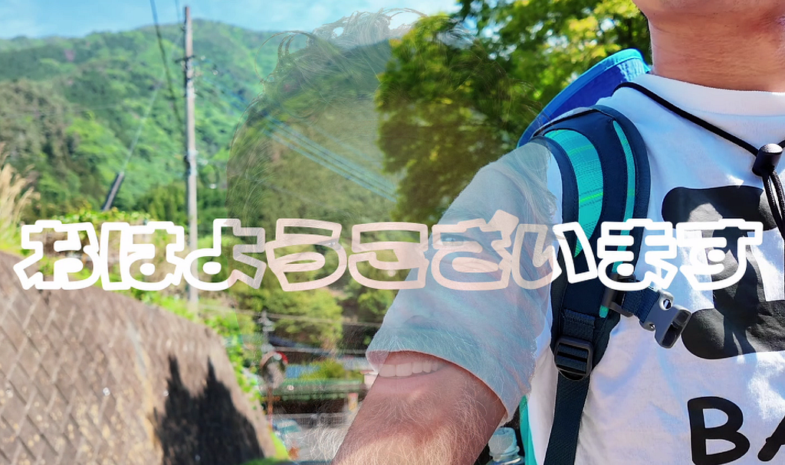

こんにちは！七夕ですねー。短冊をまだ書いてない荒川はその辺の木に後でぶら下げておくので、相模原民のみんなは探してみてねー。

今週はYouTubeに投稿予定のVlogを作成したのでその報告です。

4年になってよっしゃ時間あるぜーと思ってバイトの時間を増やしたら、なかなかまとまった時間を取れずに、編集素材が3本ぐらい溜まってきましたトホホ。ゼミ紹介動画でチーム3年生も編集に慣れてくると思うので、後期からは本格的にYouTube編集に着手したいなと思います。

私はいつもDaVinci Resolveを使っているのですが、最近始めたバイトでは、Adobe Premiere ProやCapCutの有料版を使っています。DaVinci Resolveで編集を始めた人間なので、ダビンチが一番使いやすいだろ！と排他的な考えを持っていたのですが、Premiere Proとっても使いやすい。さすが有料ツール。CapCutも、有料版だとストレスなく使えてとってもいいなと思います。操作も直感的なので、動画の完成イメージ次第でソフトを変えてみてもいいなーと思いました。

はい。この辺から本題に入ります。今回編集したのが、5/20に（一応）山ッ部初活動としていった、山梨の本社ヶ丸に登った際のVlog動画です。結構自由に撮影した動画で、素材繋ぎ合わせて何とか1本の動画になりました。

この記事のタイトルにもある通り、まずは謝らせてください。編集がつい楽しくなっちゃって。

バイトで色んなエフェクトやアニメーションを触るんですけど、雰囲気や全体の流れを崩さないようにする必要があるんですねもちろん。そこで荒川はどうなるかというと、「なんだこれ！おもろ！」と思った素材が使えずにムズムズしますね？

ということで、今回は使いたいアニメーションを使って編集を進めていたら楽しくなってきちゃって、なんか癖の強い動画が出来上がりました。

#### 完成動画

<https://medium.com/media/30d26ce8697a33c65582f81c58a9acf0/href>

今回の動画で工夫(？)した点を少し話すと、AIを積極的に使うことを意識してみました。またバイト先の話なんですけど、AIを使うとかなんとかというお話が聞こえてきて（それはCG系の動画のお話だったので、今回の動画とはあまり関係ないですが）、「動画にAIってどんな感じに使うんだ？」と思ってまずは自分なりの使い方を意識して今回は作成しました。

今回は動画で使う画像素材の出力でAI(ChatGPT5.5）を使用してみました。これは普段からやったりしますが、なんかイメージ写真・画像入れたいなーなんて思ったときに、素材を探す手間が省けるので結構ありだなと思ってます。

また、音声ファイルの出力ってどうなんだ？と思いとりあえずChatGPT5.5で試しましたが、やっぱり苦手みたいでした。これに関しては、[CapCutのテキスト読み上げ機能](https://www.capcut.com/ja-jp/tools/text-to-speech)がかなり便利なので使うとしたらこれですね。今回の動画でも一か所使用しているシーンがあるので探してみてね。

今回はこんなところです。チャンネル名も変えたのでチェックしてみてください！

---

[【許してください】癖が強いVlogになってしまいました。](https://medium.com/furuhashilab/%E8%A8%B1%E3%81%97%E3%81%A6%E3%81%8F%E3%81%A0%E3%81%95%E3%81%84-%E7%99%96%E3%81%8C%E5%BC%B7%E3%81%84vlog%E3%81%AB%E3%81%AA%E3%81%A3%E3%81%A6%E3%81%97%E3%81%BE%E3%81%84%E3%81%BE%E3%81%97%E3%81%9F-6ed9b3898bbe) was originally published in [Furuhashi(mapconcierge)Lab.](https://medium.com/furuhashilab) on Medium, where people are continuing the conversation by highlighting and responding to this story.
