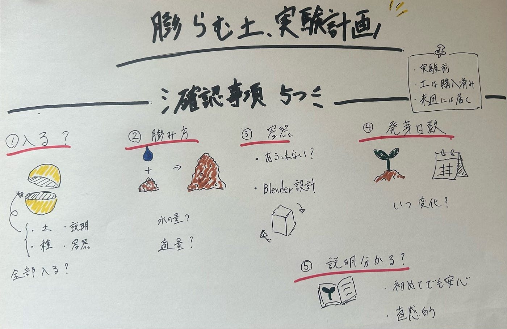

### 【YOKOZE部週報】植物栽培マン、ガチャから芽を出すための作戦会議

こんにちは、4年の井上です。横瀬部と関係なさすぎるのですが、今年のミスター慶応コンテストにうちの高校の同級生が出場することになりました。かっこいいな‼って思ってくれたそこのあなたは、彼の[Instagram](https://www.instagram.com/mr.keio5_2026?utm_source=ig_web_button_share_sheet&igsh=ZDNlZDc0MzIxNw%3D%3D)、[TikTok](https://www.tiktok.com/@mr.keio5_2026?is_from_webapp=1&sender_device=pc)をフォローしてあげてください。ぜひよろしくお願いします。

> _**はじめ_**

さて、先週は、1000円ガチャの中身として「植物栽培キット」を考え、水耕栽培タイプと膨らむ土タイプを比較しました。その結果、扱いやすさや説明のしやすさ、ガチャカプセルとの相性を考えると、膨らむ土タイプが有力なのではないかという話になりました。

ということで、今週は、その**膨らむ土タイプを実際に試すための実験計画**を立てました。

まだ実物を使った実験はできていませんが、膨らむ土はすでに購入し、届く予定です。土が届くのを楽しみにするのは、人生で初めてです。

> _**実験で確認したいこと_**

実験で何を確認すべきかチャットGPTやGoogle君と相談しながら絞り込みました。

今回の実験で確認したいことは、大きく分けて5つあります。

#### 1．乾燥状態の膨らむ土がガチャカプセルに入るかどうか

1000円ガチャの商品にするためには、土だけでなく、種や説明書、簡単な容器もカプセルの中に入れる必要があります。そのため、商品として成立させるためにまずは必要なものが無理なく収まるのかを確認しなければなりません。

#### 2．水を入れたときにどれくらい膨らむのか

膨らむ土は、水を含むことで大きくなるのが特徴ですが、実際にどのくらい膨らむのかは試してみないと分かりません。水の量によって膨らみ方が変わるのか、どのくらいの水が適量なのかを確認したいです。

#### 3．容器から土があふれないかどうか

購入者が家で簡単に使える商品にするためには、使いやすさが重要です。水を入れた瞬間に土があふれてしまうと、植物栽培キットというより、ちょっとした土砂災害キットになってしまいます。

ただ、この点を確認するためにはそもそも容器が決まってないといけないのですが、決定していません。実験と並行して、Blenderを使った設計に取り組みたいと思います。デザイン部の方々ご指導のほどよろしくお願いいたします🥺

#### 4．発芽までの日数

植物栽培キットとしては、芽が出るまでの時間も大切で、なかなか芽が出ないと、育てている人が不安になってしまうでしょう。何日くらいで変化が見えるのかを確認すべきだと考えました。

#### 5．説明書の分かりやすさ

膨らむ土タイプの魅力は、比較的簡単に始められそうな点です。しかし、実際には水の量や置き場所、日当たりなど、最低限の説明は必要になると考えています。実験を通して、どのような説明があれば初めての人でも安心して育てられるのかを整理し、完成した説明書を何も知らない人に読んでもらうことで直観的に分かる説明書になっているか確認したいと思います。

> _**感想・まとめ_**

今週は、実際に膨らむ土を使った実験を行う前段階として、何を確認すべきかを整理しました。まだ実験は始まっていませんが、膨らむ土を購入し、届く準備は整っています。次回以降は、実際に土を膨らませながら、植物栽培キットとして本当に成立するのかを検証していきたいです。

最後にグラレコです。

