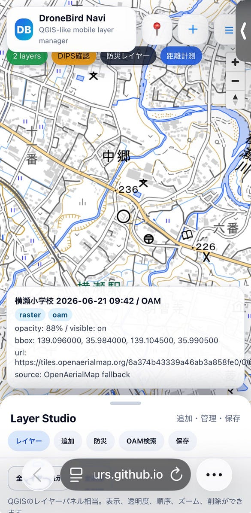
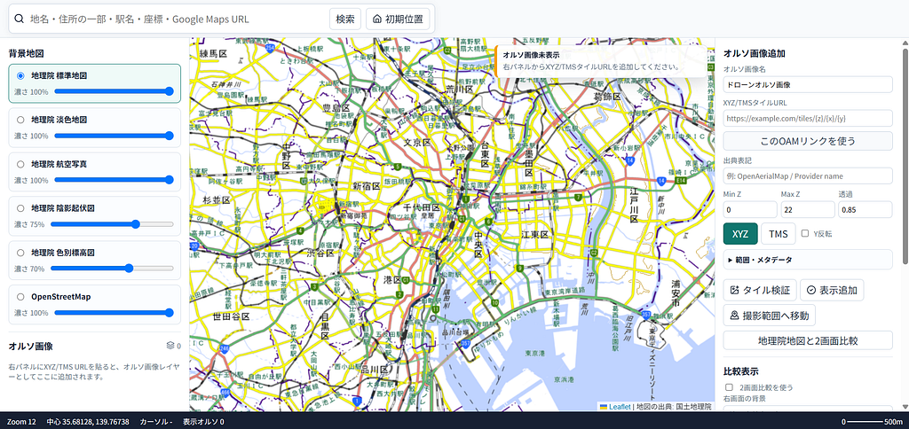
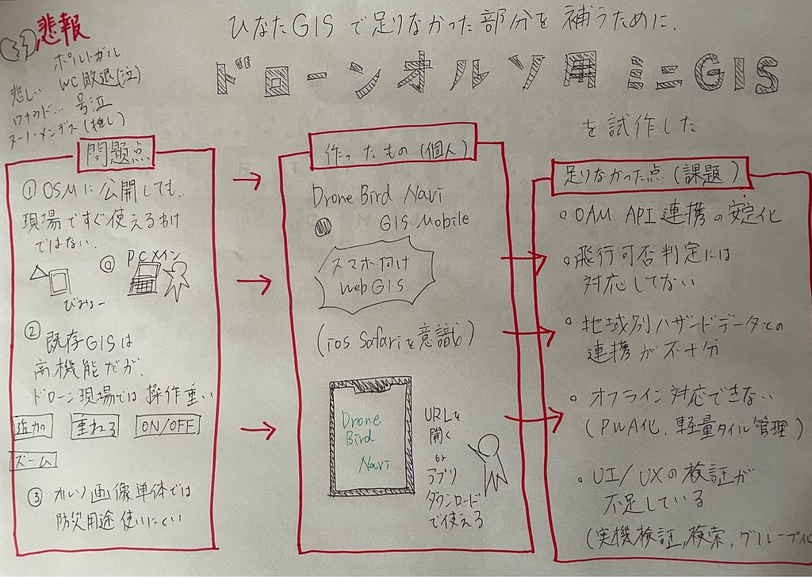

### [ポルトガル]ひなたGISで足りなかった部分を補うために、ドローンオルソ用のミニGISを試作した[敗退。感動をありがとう]

ポルトガル敗退で沈んでいる佐藤愛妃です。ロナウドお疲れ様でした(´;ω;｀)

推しヌーノメンデスが怪我後退だから、心配  
つぎのWCもロナウド出てほしい泣 切実に… 引退しないでほしい

Siuuuuuuuuuuuuuuuuuuuuuuuuuuuuuuuuuuuuuuuuuuuuuuuuuuuuuuuu

### 今朝のレポート

**直近の戦績**

* グループリーグを突破したものの、7月6日の決勝トーナメント1回戦にてスペインに0–1で惜敗し、ベスト16での敗退となりました。

**クリスティアーノ・ロナウド選手の動向**

* 41歳で迎えた今大会において、史上初となるW杯6大会連続ゴールを記録する偉業を達成しました。ただし、本人が「2026年が最後」と明言しているため、次大会（2030年）への出場は事実上ありません。

**レジェンドと次世代の有望株**

* C・ロナウドやエウゼビオ、ルイス・フィーゴといったレジェンドの系譜を継ぐ存在として、今大会メンバーのジョアン・ネヴェス（MF）やフランシスコ・コンセイソン（FW）などの若手が、今後のポルトガル代表を牽引する逸材として期待を集めています。

### 💡 私の推し、ヌーノ・メンデスはここが凄い！

* **世界最高峰の「快速」と推進力** 彼の最大の武器は、圧倒的な加速力とトップスピードです。左サイドを爆発的なスピードで駆け上がり、一瞬で相手ディフェンダーを置き去りにするドリブルは爽快感抜群。現代サッカーで最も価値の高い「1人で局面を打開できるサイドバック」です。
* **若くして「名門PSG」の主力** まだ24歳という若さ（2002年生まれ）でありながら、フランスの超名門パリ・サンジェルマン（PSG）で不動の左サイドバックとして活躍。並み居るワールドクラスのスターたちの中でも、その実力は群を抜いています。
* **攻守のポテンシャルの高さ** 攻撃時のクロスやインナーラップ（内側への走り込み）のセンスはもちろん、身体能力が高いため守備の対人能力も強力。怪我に苦しむ時期もありましたが、ピッチに立った時の存在感は圧倒的です。

激推し✌


2026/07/07ヌーノメンデス


2026/07/07フランシスコ・コンセイソン

### 概要

ドローンで撮影した画像をオルソ化し、OpenAerialMapに公開すると、Web上で共有できる状態になる。  
しかし、公開したデータを現場で使うには、タイルURLの取得、GISへの追加、レイヤー管理、ハザード情報との重ね合わせなどが必要になる。

今回、ひなたGISやQGISのような既存GISを使う中で感じた課題をもとに、OpenAerialMapに公開したドローンオルソ画像をスマホ上で扱うためのミニGISを試作した。

完成品ではなく、挙動確認も十分ではない。  
目的は、問題点を整理し、その一部をWebアプリとして試験的に解決してみることである。

### 問題点

### 1. OAMに公開しても、現場ですぐ使えるわけではない

OpenAerialMapに画像を公開すると、データ自体は共有できる。  
しかし、実際に使うには、OpenAerialMapのURLやXYZタイルURLを確認し、それをGISに追加する必要がある。

この作業はGISに慣れている人なら可能だが、現場で毎回行うには少し手間がかかる。

特にスマホでは、外部タイルの追加、表示範囲の調整、レイヤーのON/OFF、透明度調整などが直感的に行いにくい。

### 2. 既存GISは高機能だが、ドローン現場では操作が重い

ひなたGISやQGISは高機能で便利だが、ドローン現場で必要な操作は比較的限定されている。

今回想定した主な操作は以下である。

* オルソ画像を追加する
* ハザードや地形情報を重ねる
* レイヤーの表示・非表示を切り替える
* 透明度を調整する
* 表示範囲を合わせる
* 現在地や座標を確認する
* GeoJSONで現地情報を追加する

つまり、汎用GISの全機能ではなく、ドローンオルソを現場で扱うための最小限のGIS機能が必要だった。

### 3. オルソ画像単体では防災用途に使いにくい

ドローンオルソ画像は、単体で見るだけでは状況把握に限界がある。  
防災訓練や災害対応で使うには、洪水、傾斜、陰影、避難所、現地確認ポイントなどと重ねて見る必要がある。

そのため、画像表示だけでなく、複数レイヤーを扱える仕組みが必要だった。

### 作ったもの

今回試作したのは、**DroneBird Navi QGIS Mobile** というスマホ向けWebGISである。

主な目的は、OpenAerialMapに公開したドローンオルソ画像を、スマホ上で追加・重ね合わせ・確認できるようにすることだった。

**あき**

[GitHub - akidinosaurs/dronebird-navi-qgis-mobile](https://github.com/akidinosaurs/dronebird-navi-qgis-mobile)

**ゆうと**

[GitHub - YutoKyoto/civic-light-web-gis](https://github.com/YutoKyoto/civic-light-web-gis)

**ともや**

[GitHub - mapbytomoya/orthophoto.tileviewer](https://github.com/mapbytomoya/orthophoto.tileviewer)

↓わたしがつくってみたミニアプリ  
ios safari対応、PC対応のUIは未完成



↓ゆうと作 一部紹介



### 解決方法

### 1. QGIS風のレイヤー管理を実装した

単なる地図ビューアではなく、QGISのレイヤーパネルに近い操作をスマホWeb上で実装した。

実装した機能は以下である。

* レイヤー追加
* 表示ON/OFF
* 透明度調整
* レイヤー順序変更
* レイヤー範囲へズーム
* レイヤー情報表示
* URLコピー
* レイヤー削除

これにより、オルソ画像、背景地図、ハザード情報、GeoJSONを複数重ねて扱えるようにした。

### 2. OpenAerialMap URL / IDから追加できるようにした

OpenAerialMapのURLまたはImage IDを入力すると、APIから情報取得を試すようにした。

ただし、OAM APIのレスポンス形式やCORSの状態によっては、必ずしも安定して取得できない。  
そのため、XYZ / TMSタイルURLを直接追加できる機能も用意した。

これにより、自動取得が失敗した場合でも、手動でタイルURLを追加して表示できる。

### 3. 防災・地形レイヤーを追加した

ドローンオルソを現場判断に使いやすくするため、防災・地形系のレイヤーをプリセットとして追加した。

追加したレイヤーは以下である。

* GSI標準地図
* GSI淡色地図
* 洪水浸水想定区域
* 傾斜
* 陰影起伏図
* 避難所サンプルGeoJSON

オルソ画像とこれらのレイヤーを重ねることで、画像単体よりも状況を確認しやすくなる。

### 4. GeoJSON追加に対応した

避難所、被害箇所、調査地点、現地メモなどを追加できるように、GeoJSONに対応した。

対応した追加方法は以下である。

* GeoJSON URL
* GeoJSONの直接貼り付け
* GeoJSONファイル読み込み

これにより、現地で作成した点・線・面データを重ねる入口を用意した。

### 5. iOS Safariで使えるWebアプリとして設計した

今回は専用アプリではなく、静的HTMLとして実装した。

理由は、GitHub Pagesなどに置けばURLだけで開けるようにしたかったためである。  
現場で使う場合、インストールが必要なアプリよりも、URLを共有してすぐ開けるWebアプリの方が扱いやすい。

iOS Safariを意識して、以下を入れた。

* スマホ向けボトムシートUI
* safe-area対応
* 現在地取得
* 地図クリックによる座標表示
* 距離計測
* localStorageによるプロジェクト保存
* JSONエクスポート / インポート

### 足りなかった点

### 1. OAM API連携の安定化

OAM URLから自動でタイル情報を取得する部分は、まだ安定していない。  
APIのレスポンス形式、TMS情報の有無、CORS、bboxの扱いなどをさらに確認する必要がある。

現時点では、XYZ / TMSタイルURLの直接追加機能で補完している。

### 2. 飛行可否判定には対応していない

このアプリは、公式なドローン飛行可否判定ツールではない。

DIPS2.0、NOTAM、空港周辺、DID、緊急用務空域、重要施設周辺、土地管理者の確認などは別途必要である。

今回の対象は、飛行前の許可判断ではなく、撮影後のオルソ画像を現場で確認・重ね合わせる部分である。

### 3. 地域別ハザードデータとの連携は不十分

今回はGSIタイルとサンプルGeoJSONを中心にした。  
自治体ごとの避難所データや詳細なハザードマップとの連携はまだ行っていない。

今後は、国土数値情報や自治体オープンデータと接続できるようにする必要がある。

### 4. オフライン対応ができていない

災害時を想定する場合、通信が不安定でも使えることが重要になる。

しかし、今回の試作は外部タイル、MapLibre CDN、OAM、GSIタイルに依存している。  
オフライン対応には、PWA化、Service Worker、事前キャッシュ、軽量タイル管理が必要になる。

### 5. UI/UXの検証が不足している

スマホ向けUIとしてボトムシートやレイヤーパネルを作ったが、実機での十分な検証はできていない。  
レイヤーが増えた場合の検索、グループ化、凡例表示、サムネイル、履歴管理なども未実装である。

### GitHub Pages公開で詰まった点

今回、作品をGitHub Pagesで公開しようとしたが、設定で少し詰まった。

想定していた流れは以下である。

1. GitHubでpublic repositoryを作る
2. index.html をリポジトリのrootに置く
3. Settings を開く
4. Pages を開く
5. Sourceを Deploy from a branch にする
6. Branchを main にする
7. Folderを /root にする
8. Saveを押す
9. 数分後に公開URLが発行される

公開URLは通常、以下の形式になる。

```
https://ユーザー名.github.io/リポジトリ名/
```

今回の場合は、以下のURLを想定していた。

```
https://akidinosaurs.github.io/dronebird-navi-qgis-mobile/
```

ただし、Pagesの設定画面でBranchやFolderの選択がうまく進まず、公開までは完了できなかった。

### CodexとGitHub連携を使ってみた感想

CodexにGitHub連携を任せれば、リポジトリ作成や公開設定まで自動化できると思っていた。

しかし、実際にはGitHub Pagesの設定、リポジトリ権限、Branch設定、Actions設定などで詰まる部分があり、試行錯誤しているうちにクレジットをかなり消費した。

今回感じたのは、定型的な公開作業については、AIに何度も試行錯誤させるより、自分で手順を理解して手作業で進めた方が安く済む場面もあるということだった。

特にGitHub Pagesのような作業は、一度手順を覚えれば繰り返し使える。  
今後は、公開部分については手作業の流れも整理しておきたい。

### まとめ

今回作ったものは完成品ではない。  
挙動確認も十分ではなく、OAM連携やGitHub Pages公開にも課題が残った。

ただし、問題意識は明確だった。

OpenAerialMapに公開したドローンオルソ画像を、現場でそのまま使うにはまだ手間がある。  
ひなたGISやQGISは高機能だが、ドローン現場で必要な操作だけをスマホ向けに軽く切り出す余地がある。

今回の試作では、以下を一部実装した。

* OAM URL / IDからのレイヤー追加
* XYZ / TMSタイル追加
* QGIS風のレイヤー管理
* 防災・地形レイヤーの重ね合わせ
* GeoJSON追加
* iOS Safariを意識したUI

今後の課題は、OAM連携の安定化、GitHub Pages公開、実機検証、地域別ハザードデータとの接続である。

**グラレコ**



---

[ひなたGISで足りなかった部分を補うために、ドローンオルソ用のミニGISを試作した](https://medium.com/furuhashilab/%E3%81%B2%E3%81%AA%E3%81%9Fgis%E3%81%A7%E8%B6%B3%E3%82%8A%E3%81%AA%E3%81%8B%E3%81%A3%E3%81%9F%E9%83%A8%E5%88%86%E3%82%92%E8%A3%9C%E3%81%86%E3%81%9F%E3%82%81%E3%81%AB-%E3%83%89%E3%83%AD%E3%83%BC%E3%83%B3%E3%82%AA%E3%83%AB%E3%82%BD%E7%94%A8%E3%81%AE%E3%83%9F%E3%83%8Bgis%E3%82%92%E8%A9%A6%E4%BD%9C%E3%81%97%E3%81%9F-62f96725281c) was originally published in [Furuhashi(mapconcierge)Lab.](https://medium.com/furuhashilab) on Medium, where people are continuing the conversation by highlighting and responding to this story.
