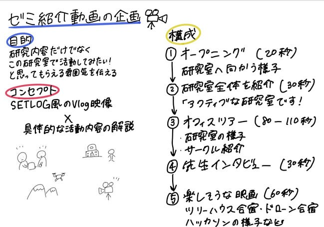

## 頑張るぞ三年だけのハッカソン❤️‍🔥

こんにちは３年のカトウです。

今回は初めての3年生だけのハッカソンです。先輩に頼ってばかり、いつまでも気分は1女の私ですが今回は3年生で一致団結して頑張っていきたいと思います🎶えいえいおー✊🏻

### ゼミ紹介動画の企画について

今回の動画では、研究内容を説明するだけではなく、**「この研究室で活動してみたい！」**と感じてもらえるような雰囲気を伝えることを目標としています。

企画のベースとして考えているのは、今流行りのSETLOGのようなVlog風の映像です。学生同士の自然な会話や作業風景、フィールドワークの様子をテンポよく見せることで、研究室の日常や楽しさを表現したいと考えています。

一方で、Vlogだけでは研究室の活動内容が十分に伝わらず、雰囲気だけの紹介になってしまうという課題も感じました。そのため、映像の合間にテロップやナレーションを入れ、研究内容や活動について簡潔に解説する構成にする予定です。**「SETLOG風」と「研究室紹介」**を組み合わせた動画にすることで、楽しさと分かりやすさの両方を伝えられるよう工夫したいと考えています。

### 動画の流れ案

**1.オープニング：通学・待ち合わせ（目役20秒）**

2年生役が大学に来るところからスタート。

雰囲気としては、今日は古橋研の内見に来ました」みたいなVlog風。

**2**. **エレベーター・移動中：研究室全体を紹介（目役30秒**）

ここで、古橋研の大枠を説明。

「大まかに言うと、アクティブな研究室です！」っていう入り方はかなり分かりやすい。

**3. 研究室に到着：オフィスツアー（目安80–110秒）**

研究室に入ったら、内見Vlogっぽく、

* 作業している人
* PCを触っている人
* ドローンや機材
* 相談している様子
* サークル紹介（目安60–90秒）

**4. 先生インタビュー（目安30秒）**

「先生から見て、古橋研はどんな研究室ですか？」

「古橋研の好きなところはどこですか？」

「来年入ってくる学生に一言お願いします」

先生の言葉が入ると、動画全体が締まる。

**5. 最後：楽しそうな映像で締める（目安60秒）**

* ツリーハウス
* 合宿
* ドローン映像
* みんなで活動している様子

### **今後の予定**

今後は必要な撮影カットを整理し、実際の活動風景の撮影を進めながら編集方法を検討していきます。先生や研究室メンバーから意見をいただき、古橋研究室の魅力がより伝わる動画へブラッシュアップしていきたいと思います。

**7月14日にやること**

・2年生役を決める

・紹介する人役を決める

・それぞれのサークル説明の動画（10秒くらい？）

・校門からの動画

・先生インタビュー

グラレコ

---

[ゼミ紹介動画作成🎥🎞️](https://medium.com/furuhashilab/%E9%A0%91%E5%BC%B5%E3%82%8B%E3%81%9E%E4%B8%89%E5%B9%B4%E3%81%A0%E3%81%91%E3%81%AE%E3%83%8F%E3%83%83%E3%82%AB%E3%82%BD%E3%83%B3-4e24bc18741d) was originally published in [Furuhashi(mapconcierge)Lab.](https://medium.com/furuhashilab) on Medium, where people are continuing the conversation by highlighting and responding to this story.
