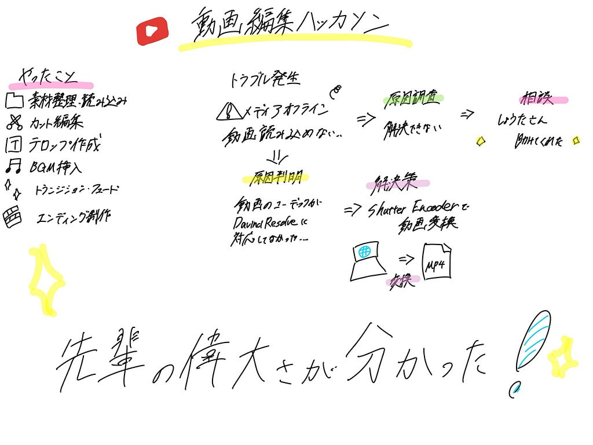

こんにちは！中溝です。研究室の3年生だけで、紹介動画をつくって、改めて先輩たちをすごいと感じました😭ずっと卒業して欲しくないです‥

中溝はオープニングを作り、ひまりはそれ以外全部やってくれました😭😭本当にありがとう😭

【撮影】

前回の授業で、撮影したのですが、みんなノリノリで参加してくれて楽しかったです😂こうさくがマネージャーのように色々サポートしてくれたことが個人的にはツボでした笑笑笑

【オープニング】

Davinchi の使い方に苦戦して、なかなか進めなかったため、iPadで制作しました。Chat GPT にフォントの入れ方など、色々聞きやりました。Google earth studio が頑張っても使えなかったのが悔しかったので、今度リベンジしたいです！

【その他の動画制作】

動画編集ソフトDaVinci Resolveを使用し、

* 動画素材の整理・読み込み
* \* 映像のカット編集
* \* テロップデザインの作成
* \* BGMの選定・挿入
* \* トランジションやフェードなどの演出
* \* エンディングの制作
* などといった動画編集全般を行いました。

制作中に発生したトラブル‥😭

今回の制作で最も苦労したのは、DaVinci Resolve上で動画が「メディアオフライン」と表示され、編集が中々スタートできなかったことです‥

自分で原因を調べても解決できず、しょうたさんに助けてもらいました。いつもありがとうございます泣

その結果、撮影した動画のファイル形式（コーデック）がDaVinci Resolveに対応していないことが分かりました。そのため、動画ファイル自体は存在しているにもかかわらず、編集ソフト上では正常に読み込めず、メディアオフラインと表示されていました。

この問題を解決するために、Shutter Encoderというアプリを使用して撮影した動画をDaVinci Resolveで扱える形式に変換し、その変換後の動画を再度読み込みました。結果として、メディアオフラインの問題を解消することができ、無事に編集を開始することができました。

【感想】

今回のハッカソンを通して、動画編集の技術だけでなく、ファイル形式やコーデックなど、編集前のデータ管理の重要性についても学ぶことができました！

初じめての3年生だけのハッカソンで難しいこともたくさんありましたが、無事おわってよかったです。4年生の偉大さを感じました！！いつも4年生方ありがとうございます😭😭

【グラレコ】

---

[【ハッカソン】](https://medium.com/furuhashilab/%E3%83%8F%E3%83%83%E3%82%AB%E3%82%BD%E3%83%B3-663e3bbc2415) was originally published in [Furuhashi(mapconcierge)Lab.](https://medium.com/furuhashilab) on Medium, where people are continuing the conversation by highlighting and responding to this story.
