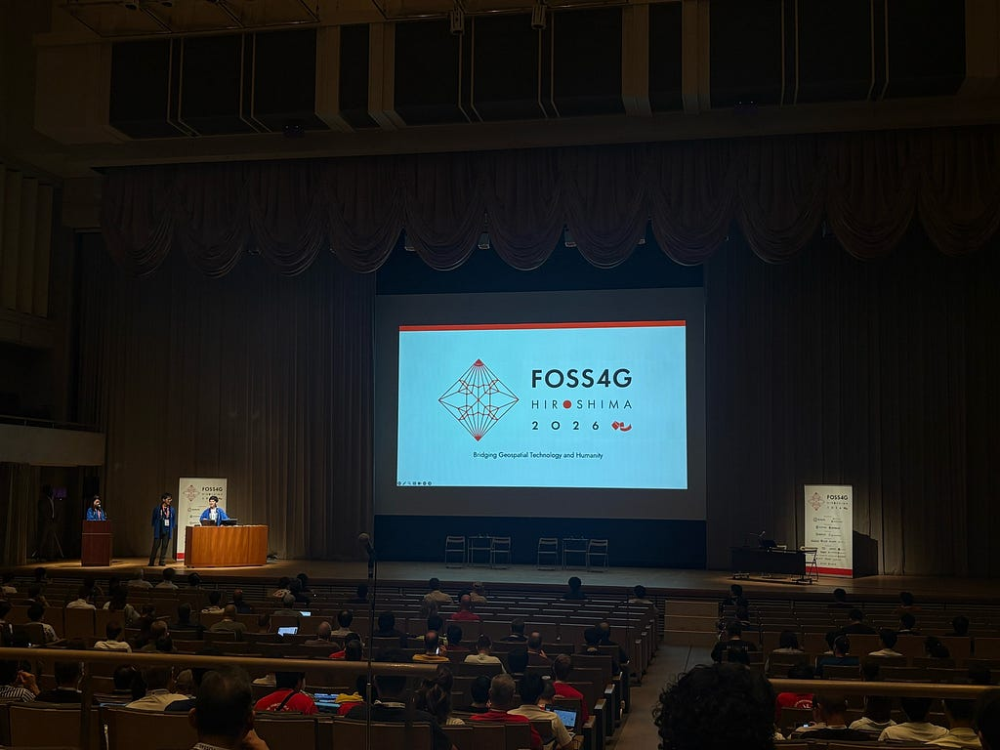
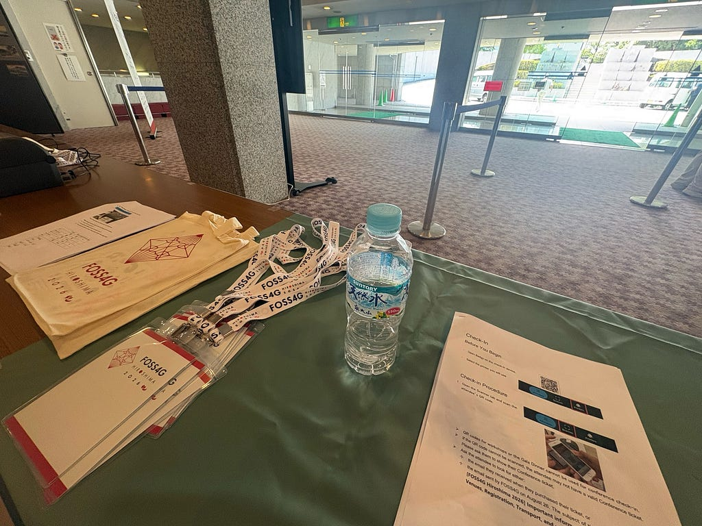

こんにちは、みわです！

あっという間に夏休みが明けてしまって凄く悲しいです…

今回私はFOSS4Gに参加するべく、広島に訪れました！

本来は一般での参加を予定していたのですが、ひなこさんのボランティアを手伝わせてもらうことになり、3日間ボランティアとして参加しました！ありがとうございます😿

3日間とも全く違う役割だったので、色んな角度からFOSS4Gを楽しむことができました。

初日は受付での仕事をしました。

1日目には、ひなこさんが登壇しているところを見ることができました。

古橋ゼミに入って初めての国際会議で、様々ない国の方に向けて自分の発表をしている先輩を見て本当に尊敬しました😭

1日目の終わりは日本の祭りをテーマにしたアイスブレイクが行われました。

盆踊りや広島のお好み焼きだけでなく、タコスやサンバなどグローバルなお祭りになっていてすごく新鮮でした。

2日目はタイムキーパーを行ったため、数名の発表を聞くことができました。

今の私には理解できない部分が多かったのですが、GISを使用したアプリ開発の話はどれも面白く、そのアプリを生み出すまでに多くの時間を費やしてきたことが感じ取れました。

以下がstravaの記録です！

---

[FOSS4G Hiroshima](https://medium.com/furuhashilab/foss4g-hiroshima-0779c538fb61) was originally published in [Furuhashi(mapconcierge)Lab.](https://medium.com/furuhashilab) on Medium, where people are continuing the conversation by highlighting and responding to this story.
