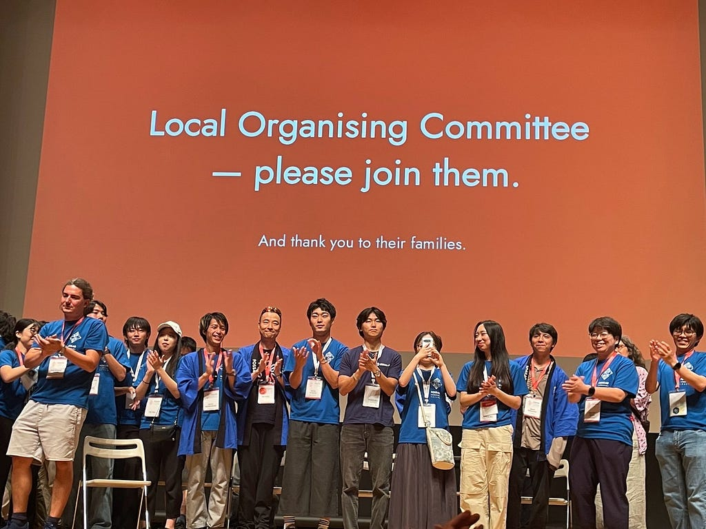
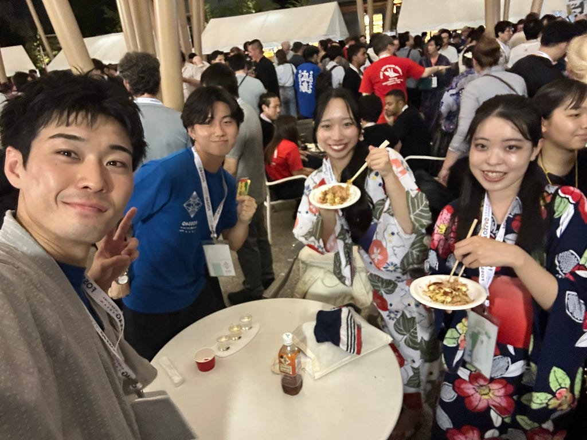

こんにちは！古橋研究室4年の荒川です。

今回は、8月30日から9月5日まで開催された[FOSS4G Hiroshima 2026](https://2026.foss4g.org/en/)にボランティアメンバーとして参加した際の活動報告を書こうと思います！

私は、8月31日から9月3日まで運営に参加し、受付やIce Breakerなど様々な業務に参加しました。

昨年はSotM Manilaに参加し、同じくボランティアとして活動しましたが、セッションの写真撮影が主な仕事だったため、FOSS4Gでは「今年は忙しいな！」と思いつつ、様々な経験ができて楽しかったです！

[9/3のStravaログ](https://www.strava.com/activities/20017100226)

複数日に参加していたため、Main Conference最終日の記録を共有します。この日は、セッションの部屋の照明調整が主な仕事で、手が空いている時間が多かったので、道に迷ってる人の対応や部屋の片づけ等に回りました。

ボランティアとして参加した4日間を通して、シフト表以外の仕事にも参加ずる機会が多く、「めっちゃ道案内したなあ」「みんな物無くしすぎじゃない？」というのが1番の感想です。

#### Ice Breaker楽しすぎ

2日目のIce Breakerの際の写真です！一応仕事中です！この会場が、セッションの会場から少し離れていたので、道案内や参加者限定エリアの門番（？）をやりつつ、ある程度落ち着いたらもういいよーとのことだったので、その後は全力で楽しむという仕事を遂行しました。

盆踊り、よさこい、サンバと、国際会議らしい様々な文化の交流が最高にカオスで楽しかったです！

今年は、発表申し込みはしなかったため、ボランティアに集中しつつもいくつかのセッションに参加しながら卒論の方向性についてじっくり考えることができました。去年もそうでしたが、イベントに参加して同じような研究をしている方々と意見を交換することで、刺激をもらえるし、古橋研以外にも知り合いができるのは本当に大きいなと感じました。

この業界の大きなイベントに参加するのはこれが最後かもなと思いつつも、何らかの形でGISを使った仕事をすることはあるだろうと思うので、今回の縁や知識は大切にしたいなと思います。

3年生へ

国際会議で古橋研が1番貢献できるのはIce Breakとか懇親会だと思ってます私は！知識や技術は自分たちより高い人だらけの環境なので、思いっきり吸収しつつ、楽しい場では思いっきり楽しんで、イベントを盛り上げて人脈を広げてくれい！来年の国際会議の参加レポート楽しみにしてます！

---

[国際会議ってやっぱり楽しいなあ](https://medium.com/furuhashilab/%E5%9B%BD%E9%9A%9B%E4%BC%9A%E8%AD%B0%E3%81%A3%E3%81%A6%E3%82%84%E3%81%A3%E3%81%B1%E3%82%8A%E6%A5%BD%E3%81%97%E3%81%84%E3%81%AA%E3%81%82-326fda1452c9) was originally published in [Furuhashi(mapconcierge)Lab.](https://medium.com/furuhashilab) on Medium, where people are continuing the conversation by highlighting and responding to this story.
