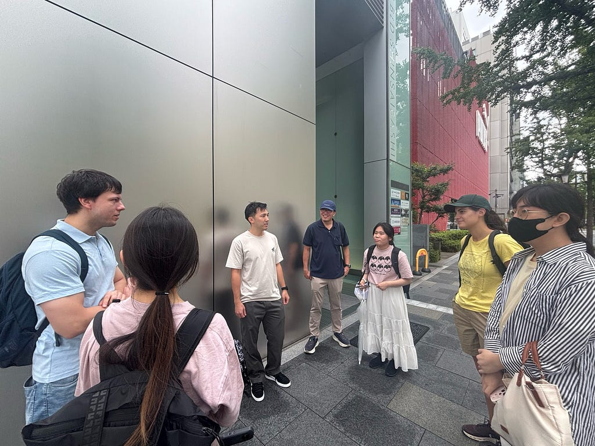
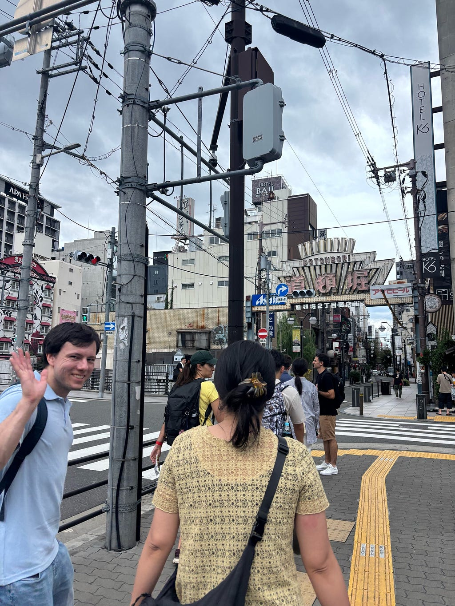
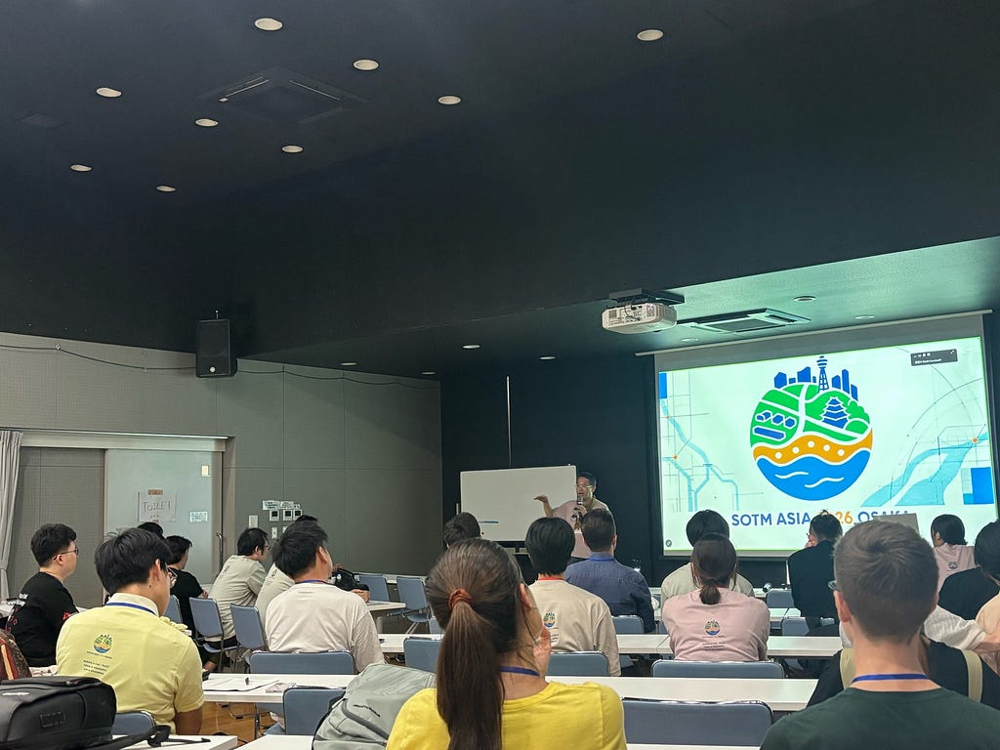
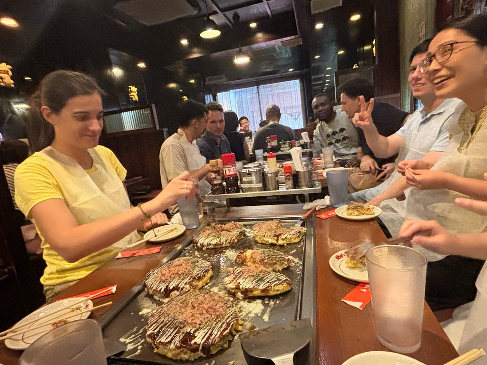
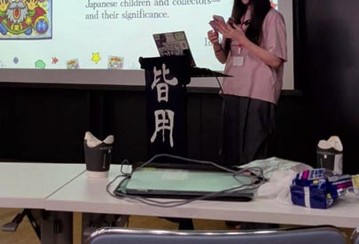
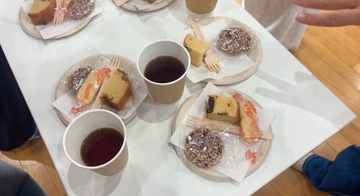
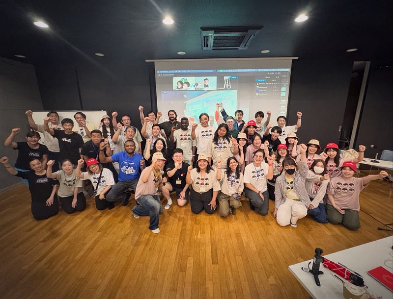
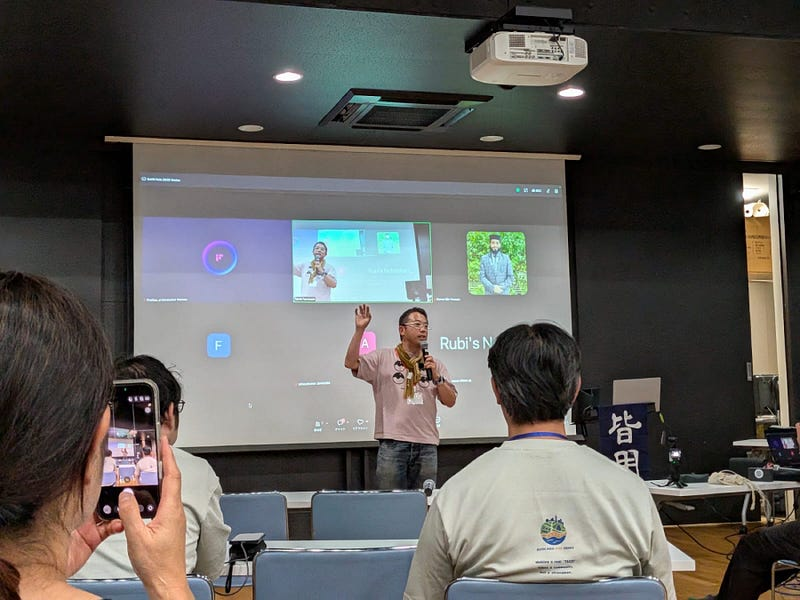

こんにちは、4年の稲田です。

今回は、9月6日から9月7日まで大阪で開催前・開催中にボランティアを行っていた、[State of the map Asia 2026](https://stateofthemap.asia/)についての報告です！

去年のオンライン参加とは異なり、今回は前泊して、3日間現地の運営側ボランティアとして活動しました！Mapping Partyでの誘導の補佐や古橋先生の補佐として、zoom参加の方へコメントでの案内やランチタイム中の発表などを行いました。

まず、**SotM開催1日目**についてです。

午前中はMapping Party Course1メンバーに加わり、ひなことふうかの運営の補佐を行いました。補佐の内容としては、外国から来た参加メンバーの出欠を確認して、スプレッドシートに記入したり、Wheelmapの使用方法に関する質問に答えながら歩いたりしました。

エリアを散策しながらWheelmapに入力！

Course1として巡ったルートは以下になります。

参加者が散らばりながら離れて動くことが多かったため、定期的に人数を数えるように気をつけたり、写真係として楽しそうな参加者たちを偏りなく撮れるように努めながら歩きました。

所々集合し、エリアに詳しいダイさんが難波に関する解説や名物、歴史、豆知識などを教えてくださったため、ただマッピングをして歩くだけでなく、大阪の地について知ることができるという体験価値もある素敵なパーティーになりました。

マッピング終了後は、参加者の皆さんとお好み焼きをいただいたり、Salon de AManToに戻ってからは、記録作業などをして過ごしました。また、午後のシフトとしては、SotMポスターをSalon de AManTo入口前に貼ったり、中崎町ホールの受付準備としてTシャツを並べたりしました。オープニング時には受付を担当しました。

たくさんの参加者の方々がオープニングに集まりました

次に、**開催2日目**についてです。

2日目は、中崎町ホール座長を勤めていた古橋先生の補佐として、zoom上で参加されている方々に向けて、次に誰がどのような発表を行うかをお知らせする役割をしていました。急遽公式サイトと異なる流れになった際には、先生の司会進行を聞き逃さないよう注意しながら地図関連企業・団体の方々の報告や発表を聞いていました。

ランチタイムには私自身も、古橋研究室が[ジオ展2026](https://www.geoten.org/)にて作成していたジオジオシールについて説明する[ライトニングトーク](https://canva.link/sg6c0xba7tsig61)を行いました。

> 振り返り

国際会議の運営側として参加するのは初めての経験でしたが、参加者の方々やAManToカフェの方々がとても優しく、スムーズに進んだと感じております。青学生としてこのような国際イベントに現地参加するのは最初で最後でしたが、社会人になってからも、今回参加者に積極的に話しかけたり説明したりした経験、目上の方々の前で発表した経験などを活かしていきたいと思います。

---

[SotM Asia 2026 Osaka](https://medium.com/furuhashilab/sotm-asia-2026-osaka-8fe5535d3860) was originally published in [Furuhashi(mapconcierge)Lab.](https://medium.com/furuhashilab) on Medium, where people are continuing the conversation by highlighting and responding to this story.
