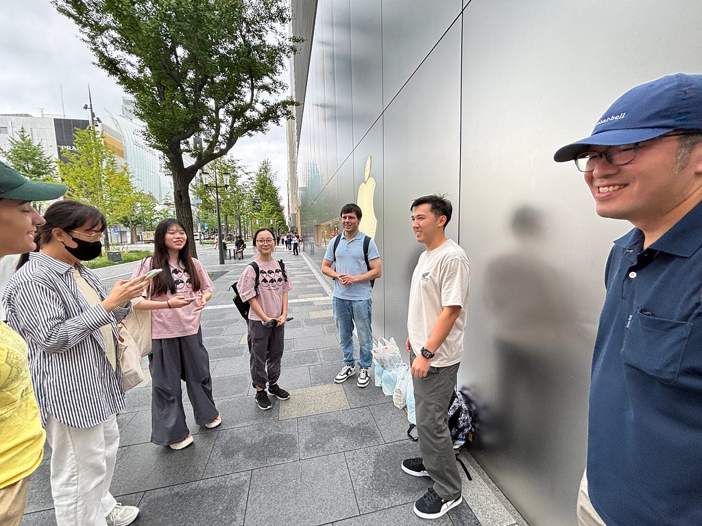
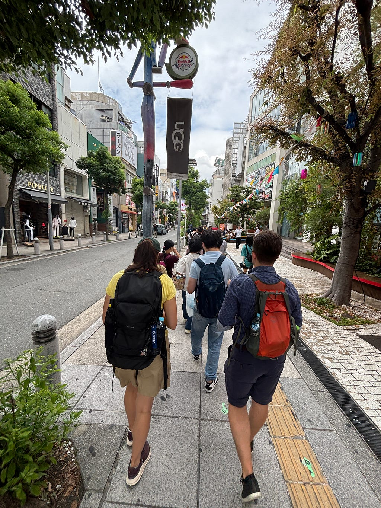
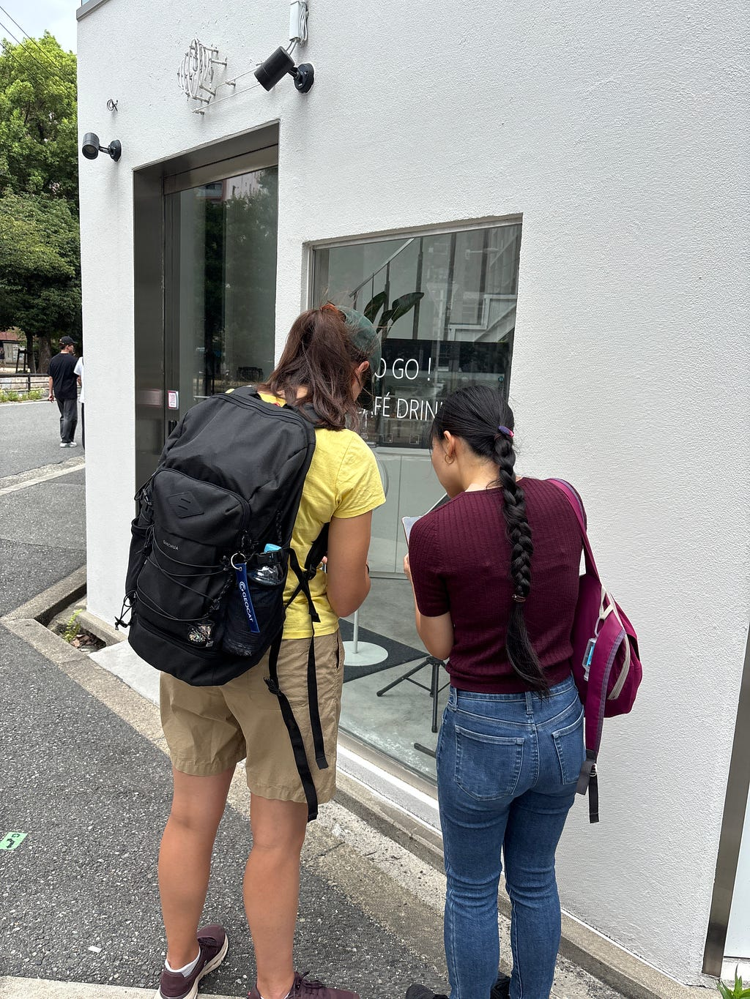
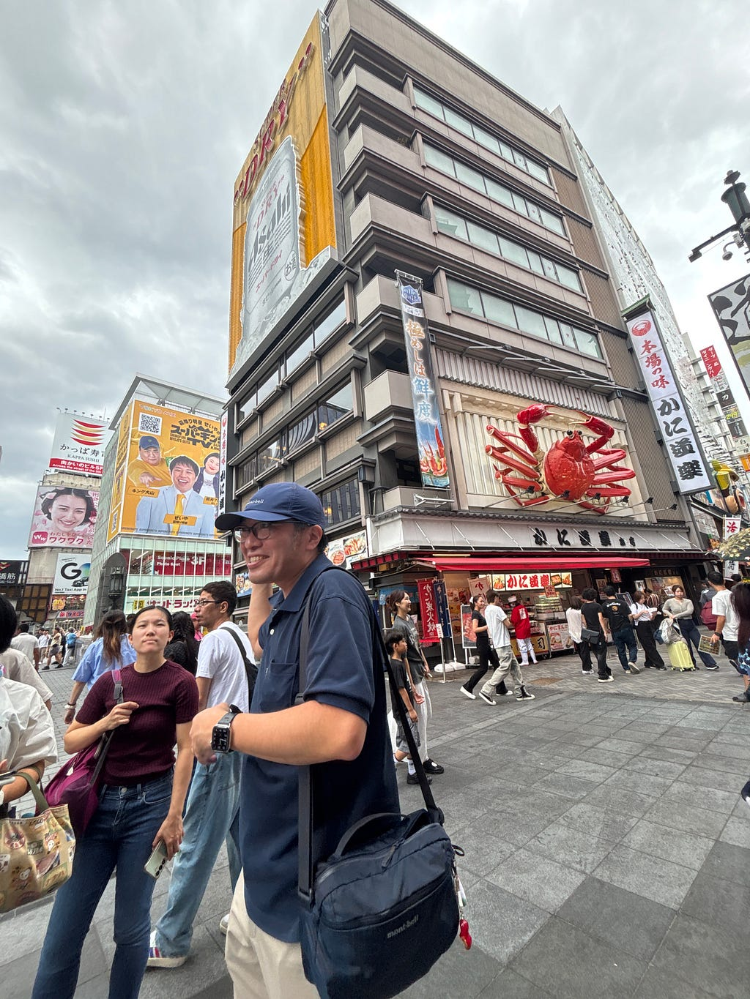
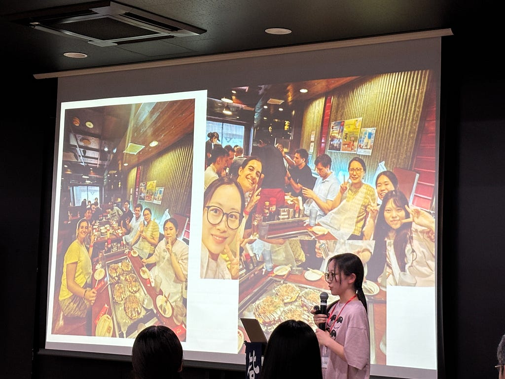
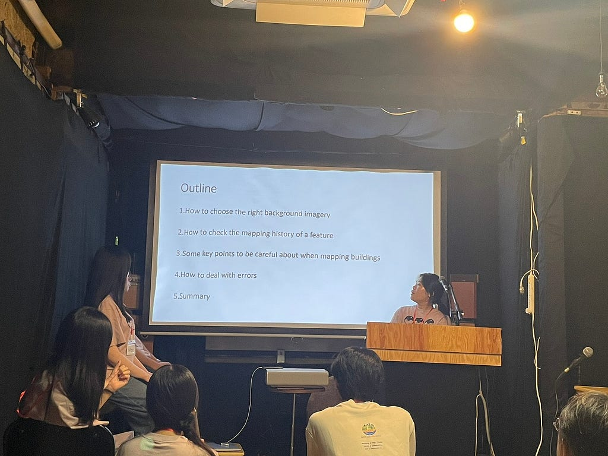

岡村です。SotM Asia 2026 Osaka を運営＆登壇者として参加したので報告をします！

#### **SotM Asia 2026 Osakaの概要**

開催日：2026年9月6日（日）～9月7日（月）  
会場：大阪府中崎町 [Salon de AManTo 天人](https://amanto.jp/cafe/)＆[中崎町ホール](https://www.nakazakichohall.com/)

AManToの方々の協力、TomTomの方々のご支援のもと、古橋教授はじめ私たち青山学院大学・古橋研究室のメンバーが主体となり、2日間にわたって開催した会議です。

1日目は、4種類のMapping PartyやCrisis Mappingを行い、参加者が実際に手を動かしながら学びを深めました。18:00からは受付を開始し、Keynoteをはじめ、Lightning Talk Sessionが行われました。  
 2日目は、Sessionがメインで行われました。

ホームページ：[State of the Map Asia 2026 Osaka](https://stateofthemap.asia/)

古橋教授はじめ、古橋研究室のメンバー数名で会議前日に集まり、AManToの方々と[Salon de AManTo 天人](https://amanto.jp/cafe/)で当日に向けた準備を行いました。

ここからは、私の活動スケジュールに沿って紹介します。

**一日目**

**Mapping Party：NANBA Wheelchair Mapping Party**

ひなこ主導のもと、4つのMapping Partyのうちの1つとして、大阪・難波エリアでNANBA Wheelchair Mapping Partyを開催しました。準備には苦労もありましたが、台風にも見舞われず、無事に当日を迎えることができました。

街歩きガイドのダイさんに難波エリアの歴史や特色を教えていただきながら、楽しくマッピングを進めました。使用したツールはWheelmap、Every Door、Mapillary、ノーマルカメラです。

流れとしては、まず今回の**NANBA Wheelchair Mapping Party**の概要を説明し、その後は街歩きガイドのプロフェッショナルであるダイさんに先導していただきながらマッピングしました。参加者の中にはEvery Doorを使い慣れている方も多く、参加者同士で助け合いながらマッピングする様子が見られました。

ひなこがとても引っ張って頑張ってくれていた企画で、街歩き自体もその後の発表もとてもよかった。。。ひなこお疲れ様！！！ありがとう！

Apple心斎橋に集合

街歩き風景

Every Doorの使い方を参加者同士で助け合い

ダイさんの説明とてもユニークでおもしろかった

Mapping Partyの後、参加者の方とお好み焼き！

**二日目**

午前中は受付を担当し、11時からはお昼ご飯に向けて、古橋研究室の他のメンバーやAManToの方々と一緒におにぎりを作りました。その後、参加者に配布したところ、味噌汁もおにぎりも人気でほぼ無くなりました！

その後は、AManTo Cafe 2階で登壇しました。

登壇の前後はタイムキーパーも担当しました。

[Salon de AManTo 天人](https://amanto.jp/cafe/)の２階

#### **会議を終えて**

数か月前からSotM Asia 2026 OSAKAに向けて、OpenStreetMap Wikiの編集Mapping Partyの準備を進めてきましたが、無事に終えることができました。

AManToの皆さんに温かく迎えていただき、とても心強かったです。

Mapping Partyを終えた後には、参加者の皆さんとOSMのデータ編集作業を行いました。ノーマルカメラで撮影した写真を見返しながら、OSM EditorやEvery Doorなど、OSMのアップデートに関する技術的なことも数多く学ばせていただき、大変貴重な機会となりました。

2日間はずっと自分の役割があったため、疲れを感じる暇もないほど充実した濃い時間でした。

古橋教授による会議のClosingでの謝辞にもありましたが、多くの方々のご協力があってこそ成り立っているのだと、身をもって実感する貴重な経験となりました。実際に**NANBA Wheelchair Mapping Party**では、ひなこ主導のもと企画を練り、ダイさんにご案内いただき、TomTomの方から差し入れをいただくなど、多くの方に支えられてこのイベントが成立していることを肌で感じました。この場をお借りして、改めて感謝申し上げます。

最後に、[Salon de AManTo 天人](https://amanto.jp/cafe/)さんの雰囲気がとても素敵で、築100年の歴史があるそうです。大阪に行かれる際は、ぜひ訪れてみてください！

#### Stravaの記録

Mapping Partyの前日にひなこと、もえでEvery Doorを試しに使いながら中崎町を散策しました。

[午後のウォーキング | ウォーキング | Strava](https://www.strava.com/activities/20042114286)

---

[ありがとう！State of the Map Asia 2026 OSAKA](https://medium.com/furuhashilab/state-of-the-map-asia-2026-osaka-9270d76ba38a) was originally published in [Furuhashi(mapconcierge)Lab.](https://medium.com/furuhashilab) on Medium, where people are continuing the conversation by highlighting and responding to this story.
