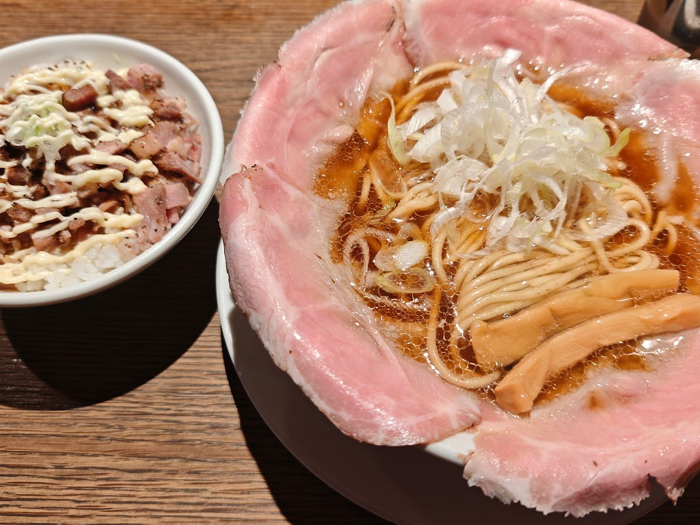
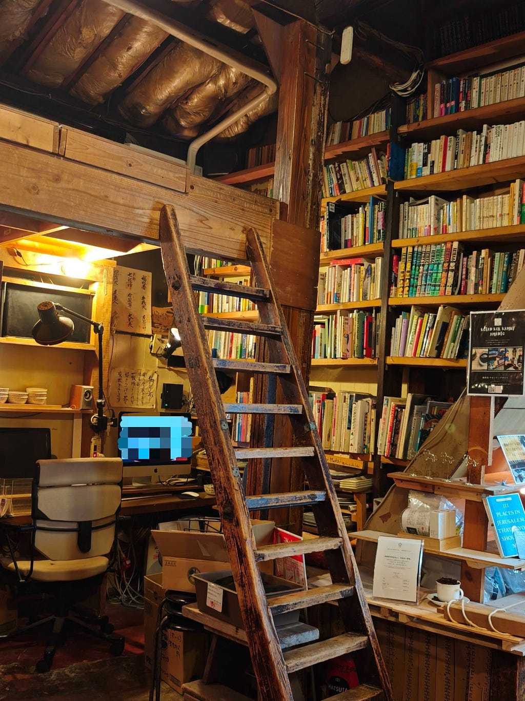
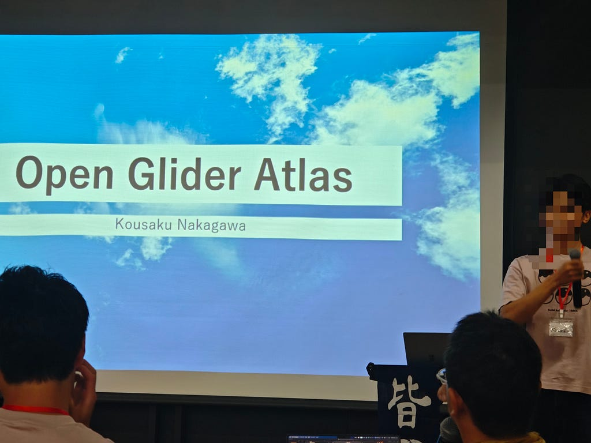
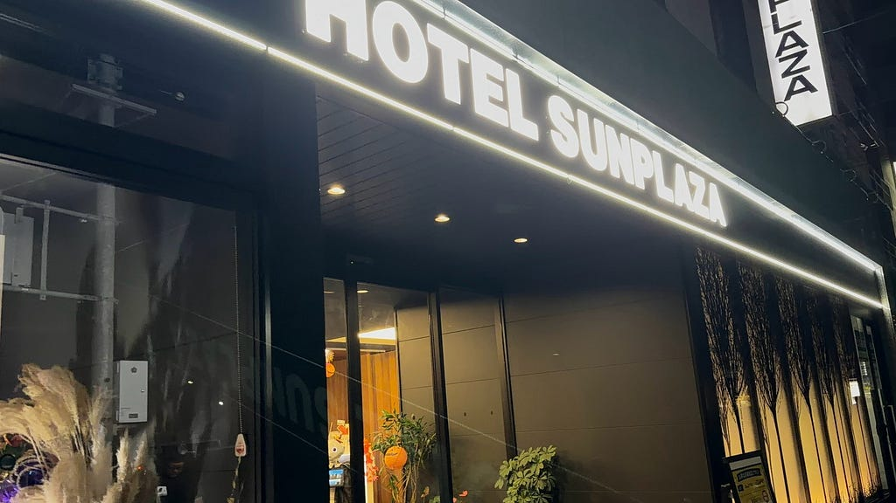
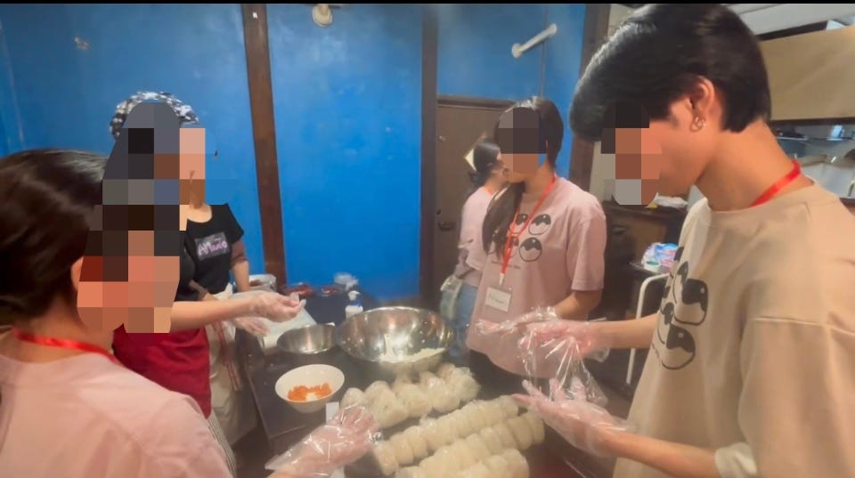
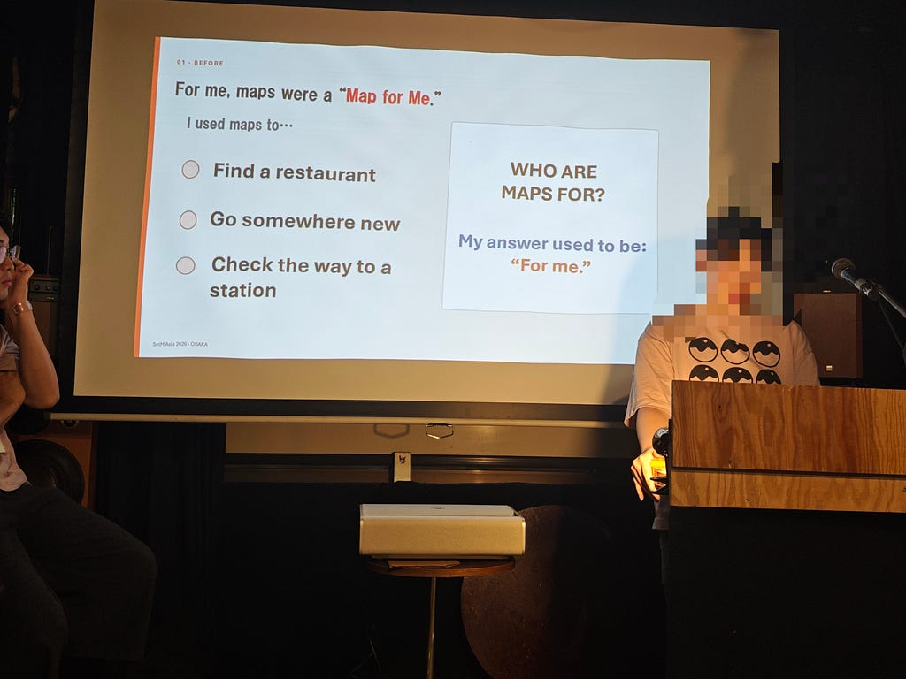

こんにちは。渡辺です。  
今回は State of the map Asia 2026 Osaka(以下、sotm)に運営、そして登壇者として参加してきました。  
その報告になります。

今回のSotmは9/6〜9/7の2日間、大阪の中崎町にて開催されました。  
本来は、参加者前日5日 午前10時の集合でしたが、私は就職活動との兼ね合いで、6日の午後からの参加が精一杯でした。申し訳ないです。

その為、一層力を入れて望む必要があると思っていたところ、なんと3年生で集合時間に間に合ったのは1人だけだったというニュースが。

大半が私と同じく6日からの参加ということで、一気に心が軽くなりました。

**1日目**  
朝9時頃に淵野辺を発ち、到着したのは12時半でした。折角大阪に来たのだから何か大阪らしいものを食べたいと考えていましたが、美味しそうなラーメン屋を発見し、自然と入店していました。

ラーメン大戦争 梅田店さん

しっとり系チャーシュー、あまりの美味しさに感動。

流石は天下の台所、大阪。

ラーメンさえ勝てないのかと思ったら、全然チェーン店でした。

さて、腹ごしらえをして向かったのは、  
今回2日間を通してお世話になる、

Salon de AManTo 天人 さん  
マッパソンやプレゼンの場所提供、そして寝床までをも提供して下さいました。

ありがとうございます。

古民家カフェらしく、雰囲気のある内装で落ち着きます。

Salon de AManTo 天人さん

ほかの皆は既に2階にいると上へ案内され、お茶でもしているのかなと覗いたら、そこでは外国の方も交えて、早速マッパソンの説明を行っていました。

私も参加し、18時に中崎町ホールの開演準備が始まるまでの間、ひたすら3年生皆でOSMマッピングを行いました。

その後、18時からは中崎町ホールの開演準備を行い、18時半に開演しました。  
そこでは、訪問者へ靴袋・ユニフォームを渡したり、名札記入の案内をしたりなどのタスクを行いました。

全体で参加者は70名程度でしたが、普段の授業とは雰囲気が異なるので、1人前に立って話すのは中々緊張しそう。

1日目の登壇者の中に3年生は1人だけ、中川君のみでした。彼は流暢な英語で物怖じせずに発表しており、すごい。

発表している中川君

この日は21時頃に終演となり、翌日もこの会場を続けて使用するため、特段片付けもなく、寝床であるホテルへと向かいました。

HOTEL SUNPLAZAさん

2日目  
この日は朝10時から夜6時まで、中崎町ホールでの発表が行われており、並行して午後にはAManToさんでも発表会が行われるという形でした。

午前中の多くは、割り振られた業務を共有した後、1日目と同じように中崎町ホールでの発表を拝聴し、同時に来訪者への案内を行いました。

そして時刻はお昼前に  
ここで私に割り振られた大きな仕事、おにぎりを準備するお手伝いをしに、AManTo2へ向かいました。そこには学校でしか見ない量のお米が。  
AManToの方が成形したものを、ラップに包んて具材ごとに仕分けする作業を行いました。  
そして出来上がったものを、雨が降っていたため、濡れないように注意しながら中崎町ホールへと運びました。

おにぎりを握りました

昼食は、AManTo,AManTo2, 中崎町ホールの3箇所に来訪者及び運営が分かれ、各自好きなところで、自由に頂くという形式がとられていました。

私はAManToへ向かい、自分で具材を選んで巻ける、手巻き寿司を頂きました。  
途中、始めてみる料理に困惑する外国人の方を助けるなどもしました。

良い雰囲気の空間で、周りとコミュニケーションを取りながお昼を頂けたのて、良いリフレッシュになりました。

その後はまた同じく中崎町ホールで発表を聴き、14時半にAManToへと移動しました。  
大部分の3年生と、1部の外国からのゲストの方で、中崎町ホールと同時並行で、AManToにてプレゼン会が行われるからです。  
私もそこで発表を行いました。

AManTo2階

なんと、他人の発表は撮っていましたが、私の登壇時の写真を頼んでおらず、私の写真はありません。

ゼミ論の構想発表を英語で行いましたが、質疑応答を交わす中でで新しい視点や、アドバイスを頂きました。  
ともかく、一旦自分の発表が終わり、安心です。

そして再度中崎町ホールへ戻り、終演時刻である18時まで、様々な方の発表を聴き、新たな発見を貰いました。

終演後は、机や椅子を片付け、床を拭き、来た時と同じ状態にして中崎町ホールを後にしました。

この日の夜は京都の実家に帰る予定で、終バスが非常に早いため、AManToで行われた懇親会には参加せず、帰宅させて頂きました。これにてStom は終了です。

まとめ  
発表準備なども含めドタバタの2日間でしたが、研究室への理解を深めると同時に、3年生とも仲を深める良い機会となりました。

今回はマッピングパーティーに参加していないため、家から中崎町のStravaを記録しました。

<https://strava.app.link/6HQnjUHwy6b>

---

[State of the map Asia 2026 Osaka参加レポート](https://medium.com/furuhashilab/%E3%81%93%E3%82%93%E3%81%AB%E3%81%A1%E3%81%AF-%E6%B8%A1%E8%BE%BA%E3%81%A7%E3%81%99-%E4%BB%8A%E5%9B%9E%E3%81%AF-state-of-the-map-asia-2026-osaka-%E4%BB%A5%E4%B8%8B-sotm-%E3%81%AB%E9%81%8B%E5%96%B6-%E3%81%9D%E3%81%97%E3%81%A6%E7%99%BB%E5%A3%87%E8%80%85%E3%81%A8%E3%81%97%E3%81%A6%E5%8F%82%E5%8A%A0%E3%81%97%E3%81%A6%E3%81%8D%E3%81%BE%E3%81%97%E3%81%9F-%E3%81%9D%E3%81%AE%E5%A0%B1%E5%91%8A%E3%81%AB%E3%81%AA%E3%82%8A%E3%81%BE%E3%81%99-5732d819a521) was originally published in [Furuhashi(mapconcierge)Lab.](https://medium.com/furuhashilab) on Medium, where people are continuing the conversation by highlighting and responding to this story.
