こんにちは、臼井です。

夏休みももう終わりまだ暑い日もありますが、秋の雰囲気が漂ってきました。涼しい日も多く、過ごしやすくて嬉しいです。

そんな中私は、9月6日、7日に開催されたState of the Map Asia 2026 Osakaに参加してきました！

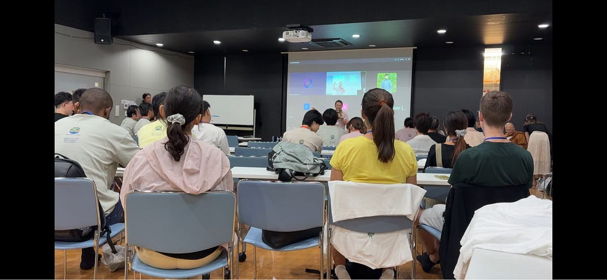

State of the Map Asiaを簡単に説明すると、誰でも自由に利用できるオープンデータの地図を作成するプロジェクトであるOpenStreetMap(OSM)のアジア地域における公式のカンファレンスです。

[State of the Map Asia 2026 Osaka](https://stateofthemap.asia/)

↑SotM Asia 2026の公式サイト

昨年はマニラでの開催でしたが、今年は日本の大阪で開催されました！

私は去年、オンラインでの参加だったので、実際に現地に行って国際会議に参加するのは初めてでした。ボランティアとして参加したので、今回はその報告を行っていきます！

まずは1日目………と行きたいところですが、前日から前乗りして準備を行ったのでまずは0日目(5日)を振り返ります！

今回の会場は、[中崎町ホール](https://omaps.app/_3gIz5dyPt/Nakazakich%C5%8D%20Hall)、[Salon de AManTo](https://omaps.app/83gIz5fMDs/Salon_de_AmanTo)の２つに分かれていました。中崎町ホールは開催1日目(6日)の夕方から準備ができるとのことだったので、まずはSalon de AManToでTシャツの仕分けをしたり、掃除をしたり、2日目(7日)に提供するおにぎりを試作したりしました。

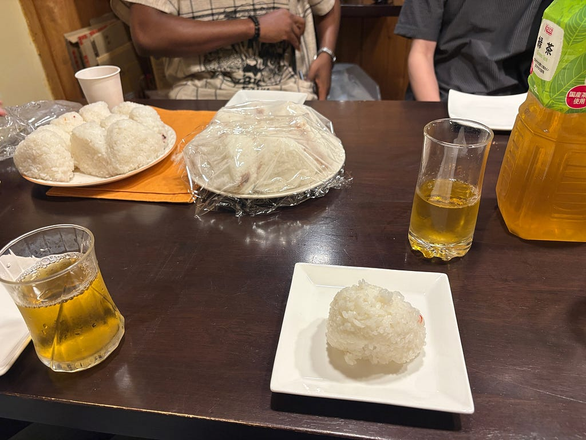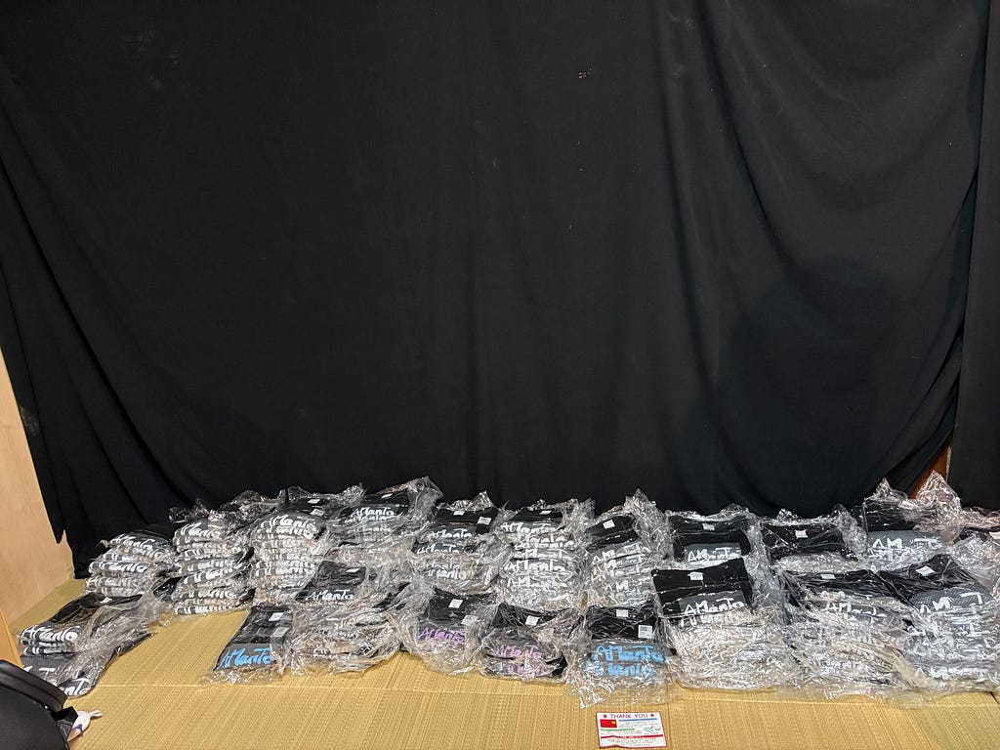

おにぎりと整理されたTシャツ

Salon de AManToは普段はカフェとして営業されていて、営業時間に訪れたときはお客さんが沢山いてとても繁盛していました。

次大阪に行ったときは客として訪れてみたいな……と思いました。

次は開催1日目(6日)の振り返りです。

一日目はMapping Partyを行いました。合計で4コースが用意されていましたが、私は古橋先生率いる山崎のコースに参加しました。

このコースでは山崎ウイスキーの蒸留所がある山崎に行き、OSMに載っていない暗渠をマッピングする作業を行うのが目標です。

*暗渠（あんきょ）とは……地表から見えないように蓋で覆われたり地下に埋められたりした水路のこと。逆に地表から見える水路を開渠（かいきょ）という。*

ウイスキーの蒸留所があるくらい水が綺麗で豊富な場所なので、暗渠もたくさんあり、その中にはまだマッピングされていない箇所もありました！

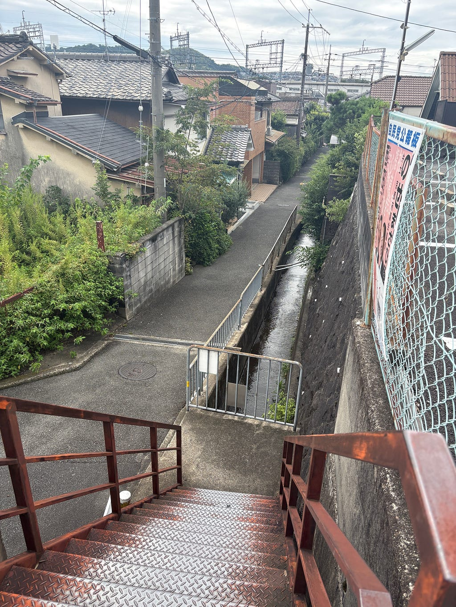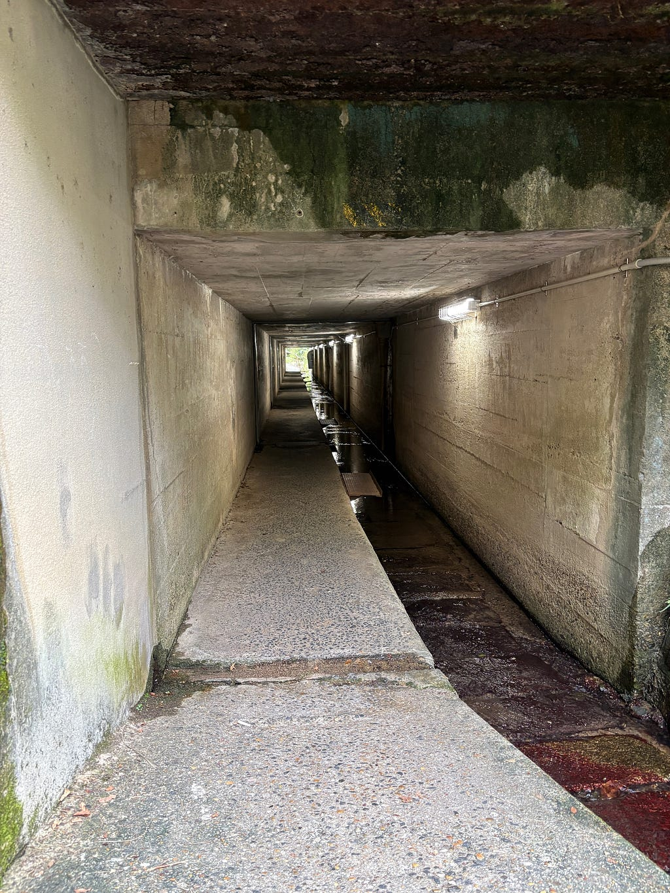

山崎で見つけた暗渠

もちろん山崎ウイスキー館でウイスキーも楽しみ……

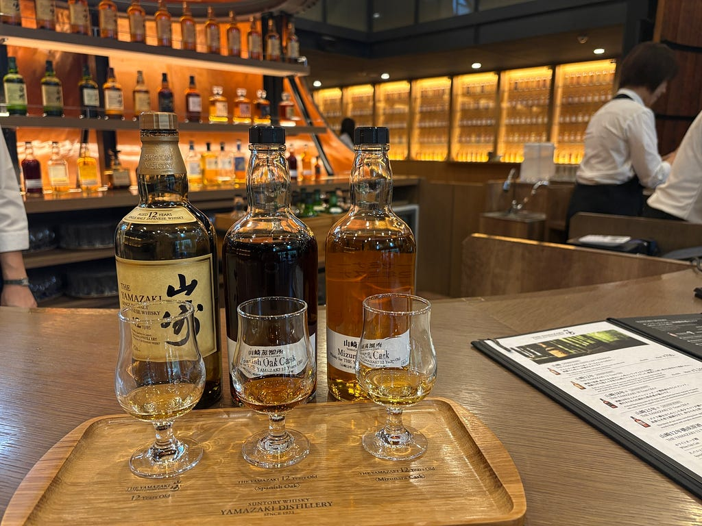

嗜みました

中崎町に帰ってきました！

一日歩き回ったのでとても疲れましたが、他の参加者の方々と話しながら山崎を歩くのはとても楽しかったです。

Stravaで記録した移動のデータは以下になります。

[山崎ウイスキー | Strava](https://www.strava.com/activities/20055781956)

その後は中崎町ホールに行き、受付の準備をしていよいよ開場！

この日は受付をしました。

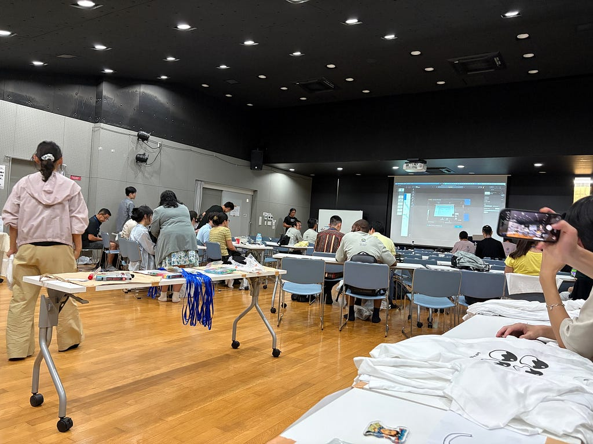

受付からの景色

講演が終わった後はSalon de AManToで交流会を行いました。

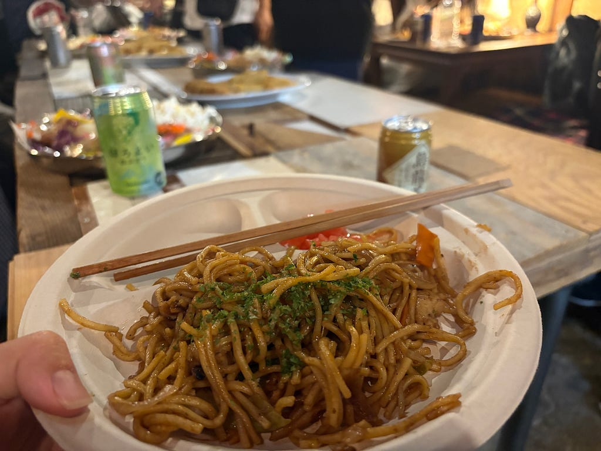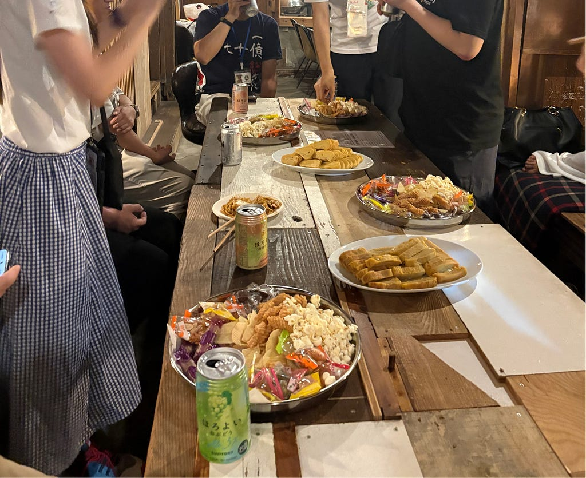

交流会の様子、やきそばが美味しくておかわりした

2日目(7日)は一日中講演が中崎町ホールとSalon de AManToで行われました。午前は中崎町ホールでタイムキーパーの役割を果たし、午後はAManToのスタッフの方の手伝いやケータリングの準備を行いました。

講演は聞いていて参考になるものも多くありました。

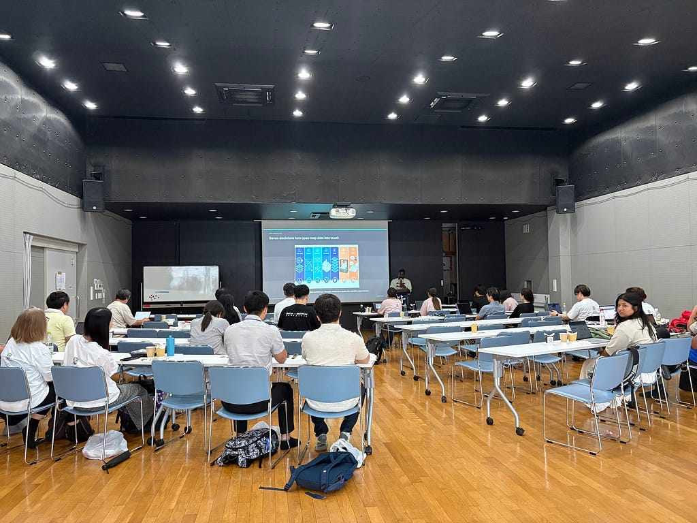

講演の様子

マジで食べ物の話しかしてない気がするんですが、提供される食べ物や飲み物(全面的にAManToのスタッフさんが用意してくださってます)が全部美味しくて最高でした。

お昼休憩の時間が長めにとられていたので、３種類用意されていたご飯をはしごしている参加者もいました。私もカレーと手巻き寿司を両方食べました！コーヒーブレイクに出たケーキも美味しかった……

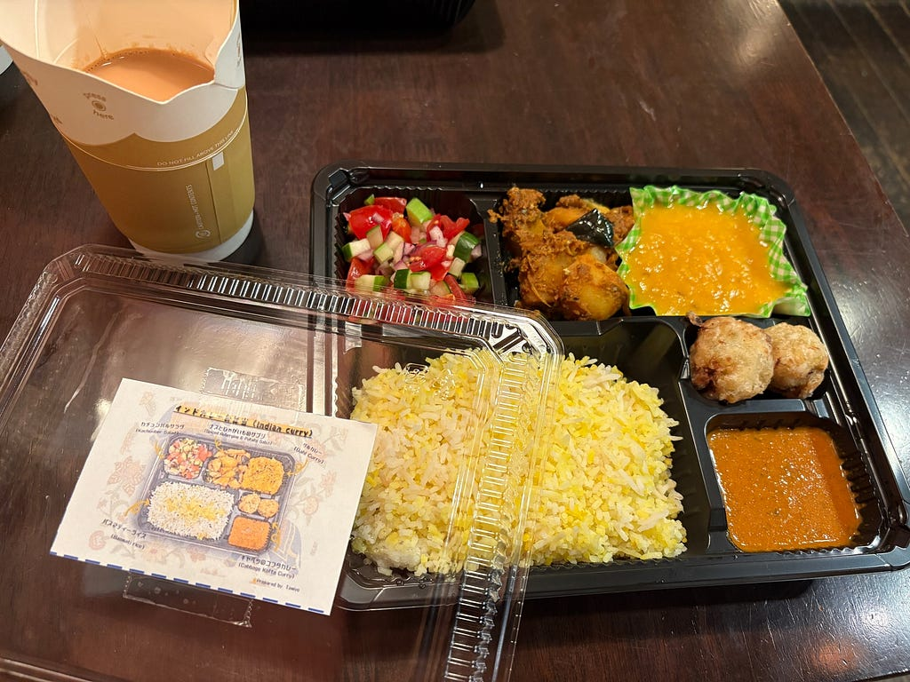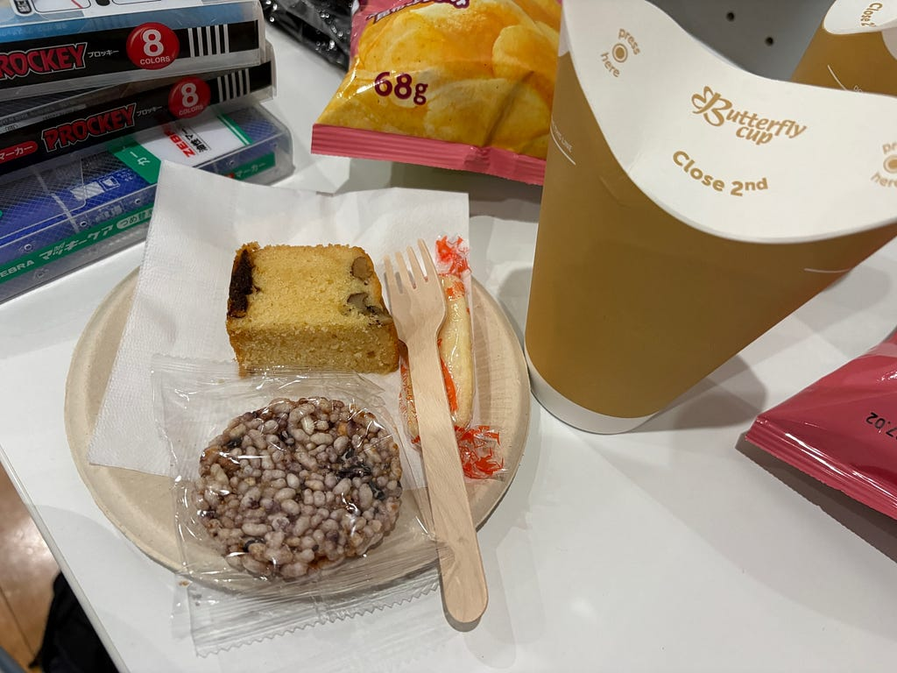

本格的なカレーとお菓子たち

以上です！

今回国際会議に現地参加してみて、現地参加だとオンラインとは違い、他の参加者の方と話すことになり仲良くなれる、コネクションを作れるのがいいなあと感じました。

古橋研としてイベントに参加するのは今後ないかもしれませんが、大学卒業後もなにかイベントに参加したときは見知った身内だけではなく、外部の人とも積極的にコミュニケーションをとるように心掛けたいなと思いました。

現3年生や未来の後輩にはイベントの現地参加を強くおすすめします！

---

[SotM Asia 2026 Osakaに参加しました！](https://medium.com/furuhashilab/sotm-asia-2026-osaka%E3%81%AB%E5%8F%82%E5%8A%A0%E3%81%97%E3%81%BE%E3%81%97%E3%81%9F-961a90d5ce72) was originally published in [Furuhashi(mapconcierge)Lab.](https://medium.com/furuhashilab) on Medium, where people are continuing the conversation by highlighting and responding to this story.
