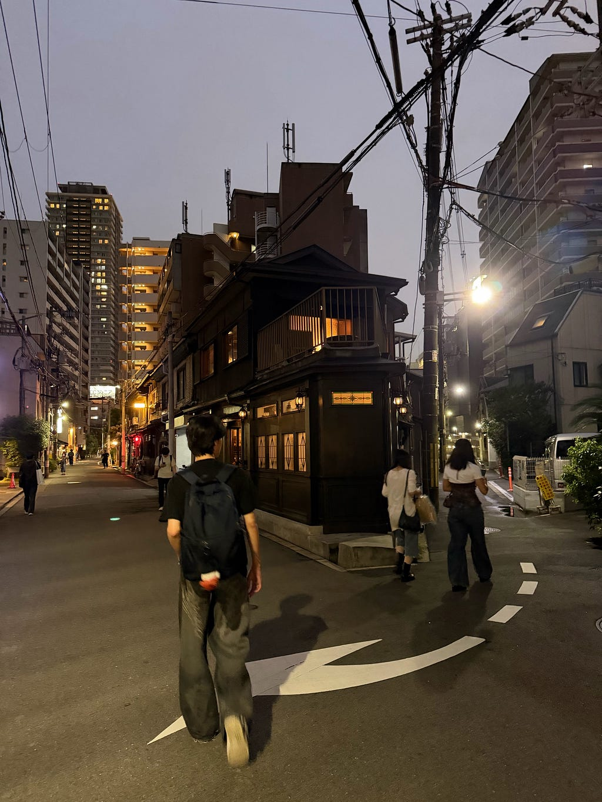
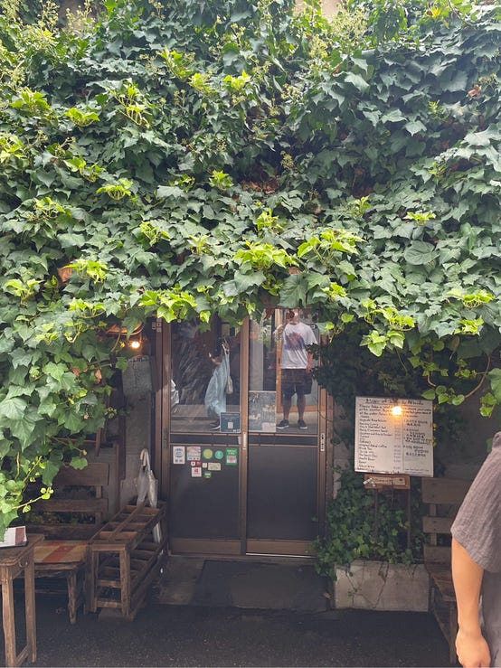
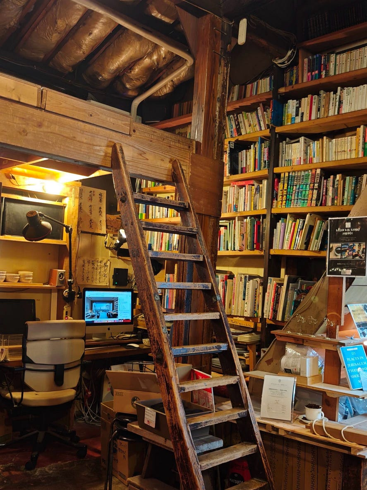
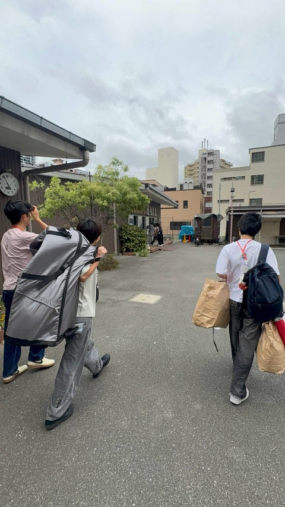
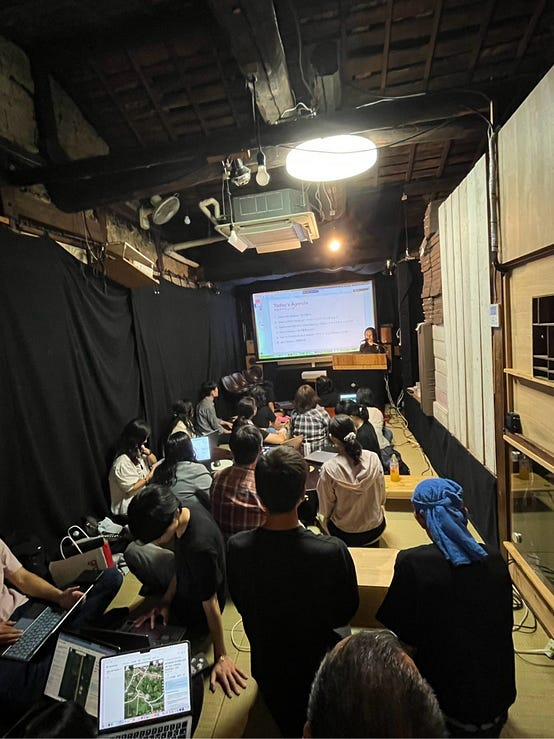
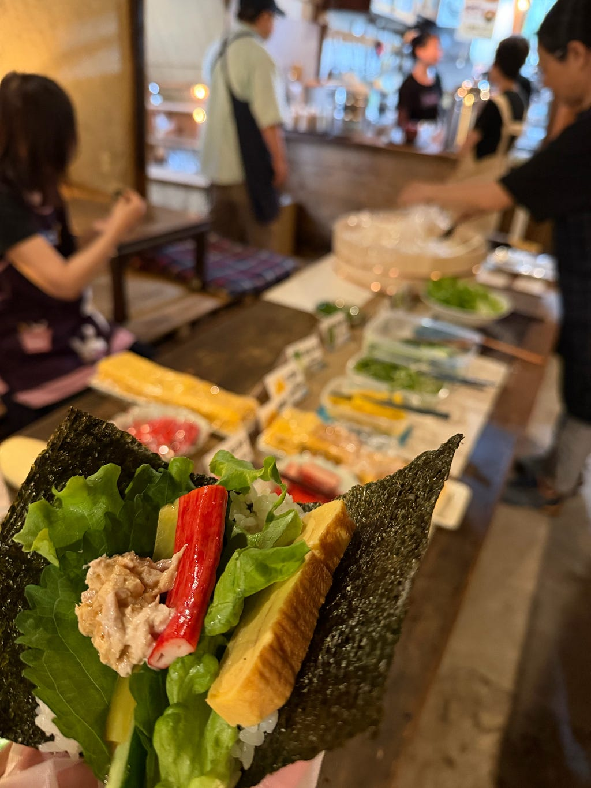
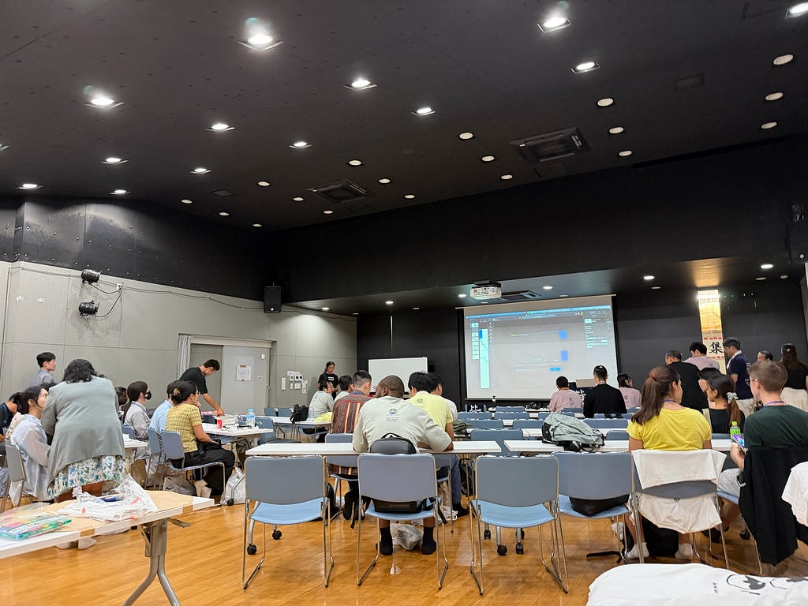
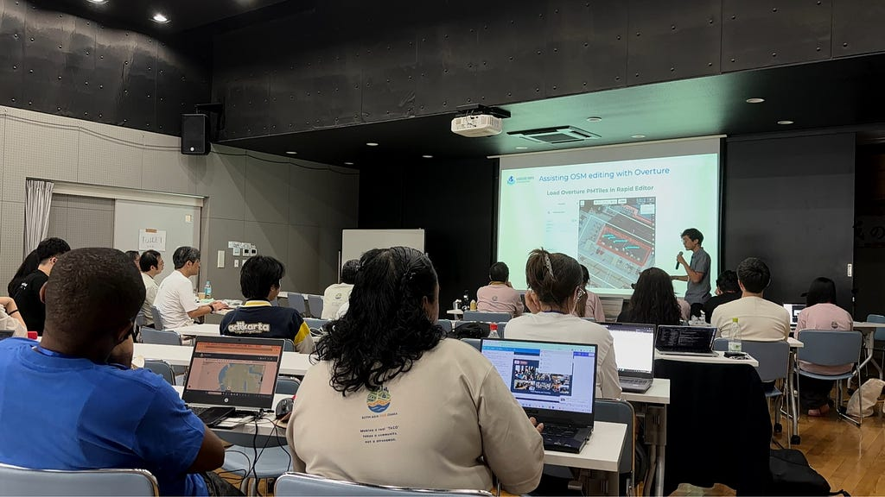

### ものごっつ趣深すぎまんねん！おいでやす中崎町やでほんまに、まにまに

⸻

1. 概要

2026年9月6日から7日にかけて、大阪府大阪市で開催された「State of the Map Asia 2026 Osaka（SotM Asia 2026 Osaka）」に参加しました。

今回私は、青山学院大学古橋研究室のメンバーとして参加し、中崎町ホールの運営と登壇による発表を行いました。

SotM Asiaについての概要、開催地域である中崎町とSalon de AManTo、2日間の活動、自分や他の登壇者による発表、今回の参加を通して得た成果や課題についてまとめます。

【イベント概要】

イベント名：State of the Map Asia 2026 Osaka

開催日：2026年9月6日〜9月7日

開催地：大阪府大阪市

会場：中崎町ホール、Salon de Amanto 天人

参加形態：現地参加

自分の役割：登壇 / 運営

公式サイト：イベント（https://stateofthemap.asia/）

Salon de AManTo（https://amanto.jp/cafe/）

⸻

2. SotMについて

State of the Map（SotM）は、OpenStreetMapに関わるマッパー、開発者、研究者、企業、行政、学生、コミュニティなどが集まり、OpenStreetMapに関する活動や技術、研究、地域課題について共有する国際カンファレンスです。

SotM Asiaは、そのアジア地域版として開催されてきました。2012年に東京でSotM Globalが開催されたことを一つの契機として、アジア各国のOpenStreetMapコミュニティ間の交流が進みました。2015年にはインドネシア・ジャカルタで第1回SotM Asiaが正式に開催され、その後、フィリピン、ネパール、インド、バングラデシュ、タイなど、アジア各地へ開催地が引き継がれてきました。

SotM Asiaでは、単なる地図編集だけではなく、

・OpenStreetMap

・人道支援マッピング

・防災・減災

・YouthMappers

・オープンデータ

・FOSS4G

・地域コミュニティ

・国際協力

など、様々なテーマがあります。

SotM Asia 2026 Osakaでは、国内外のOSMコミュニティだけでなく、YouthMappers、HOT、UN Mappers、GeoChicas、CrisisMappers Japanなど、さまざまなコミュニティとの協働も重視されています。

参照: https://stateofthemap.asia/

⸻

3. 中崎町とSalon de AManTo

今回のSotM Asia 2026 Osakaでは、大阪・中崎町とSalon de AManToが会場となりました。

中崎町は、古い町家や路地が多い地域で、地域コミュニティが残る地域です。Salon de AManToのような趣あるカフェや、古着屋が多く、観光客も多く見られました。

Salon de AManToは、中崎町を拠点として活動する地域コミュニティの場です。今回のSotM Asiaでは、単に国際会議を開催するだけではなく、地域拠点と連携し、市民主導の防災や地域コミュニティ、都市レジリエンスについて考える場としても位置付けられていました。

Salon de AManToのオーナーである天人さんの話の中で、中崎町周辺で火事が起きた際に、中崎町を囲うように居るお地蔵さん達が、木造建築が多く、消防車が入れる道が少ない中崎町を火事から守ったという歴史があることを知り、実際の中崎町の雰囲気とこの話で僕は中崎町loverになりました！

【中崎町の写真】

中崎町の様子

【Salon de AManToの写真】

Salon de AManToの外観

Salon de AManTo内部の様子

今回のSotM Asiaを通じて、OpenStreetMapの活動はオンライン上で地図を編集するだけではなく、実際の地域を歩き、地域住民と交流しながら情報を記録することも重要であると感じました。

⸻

4.スケジュール

Day 1　9月6日

10:00–18:00 Mapping Party

難波、東大阪、京都、山崎ウィスキー工場周辺の4箇所に別れて各テーマを知り、マッピング

13:00–18:00 Crisis Response Mapathon for Nepal/China （Same de AManTo）

18:00–18:30 受付開始

18:30–18:55 開始の挨拶など

18:55–19:30 講演

19:30–20:45 ライトニングトーク

20:45–21:00 お知らせ

21:00–23:00 Salon de AManToにてイベント

Day 2　9月7日

10:00–10:15 開会

10:15–10:50 講演

10:50–11:10 コーヒーブレイク

11:10–12:30 一般講演（中崎町ホールとSalon de AManToの2箇所）

12:30–14:00 お昼休憩

14:00–14:35 講演

14:35–15:55 一般講演/ライトニングトーク

15:55–16:15 コーヒーブレイク

16:15–17:30 ライトニングトーク

17:30–18:00 閉会

僕は1日目のクライシスマッピング、2日目の一般講演への参加と、運営の手伝いをしました

⸻

5. 1日目の活動記録

会場準備の様子

1日目は古橋ゼミで会場設営をしたり、入場案内などをしました。

Crisis Response Mapathon に参加したのですが、参加前の想像とは異なり、ほとんどの参加者がHOT Tasking Managerとは何か知らなかったり、初めてそれをインストールするような人も多く、驚きました。そんな人達とのコミュニケーションを通じて、HOT Tasking Managerとは何か、その用途は何かなどを再確認し、関心を持ってもらえるイベントだったのでとても貴重な時間を過ごせました。

Crisis Response Mapathonの様子

SotMについての説明や、天人さん、古橋先生などの開催者による挨拶、マッピングパーティの報告などがありました。

国際会議というフォーマルな場でありながら、会話や笑顔が多く、意外でした。

⸻

6. 2日目の活動記録

2日目は個人発表と、発表の進行関係の仕事、お昼休憩の準備などの活動をしました。

お昼休憩では手巻き寿司やお味噌汁などをSalon de AManToで提供しており、初めて手巻き寿司を作る人への説明や具材などについての説明を英語でしました。海外から来た参加者はかなり興味を持っていて、説明せずともシソが好きだからといってひとつの手巻き寿司に5つほどシソを入れていた方もいて、日本人として嬉しい瞬間がありました。

Salon de AManToの手巻き寿司

⸻

7. 自分の発表について

発表タイトル：Differences in the location where the municipality name is displayed

今回私は、OSMの市区町村のネームラベルの位置の違いについて発表しました。

OpenStreetMapを見ていると、例えばUSJがある、大阪市此花区のラベルは、此花区全体のおおよそ中心にあり、東京都渋谷区のラベルは、渋谷区役所と同じ地点にあり、大阪市北区中崎町のラベルは、特徴のない適当な地点にありました。これらのラベルの位置を統一するべきではないかという疑問から、この問題について調べ、発表しました。

発表では、初めに市区町村のネームラベルを地理的中心、行政的中心、その他に区別し、OSMのラベリングが統一されていないことを伝えました。次にそれらによって起こりうる問題についての説明をしました。問題として、❶距離分析などの数値に影響を及ぼす❷地点設定、検索への影響❸利用者に分かりづらい という3つを提案しました。ただし、もしかすると、❶の問題が起こらないように他の中心がデータに埋め込まれていたり、❷の問題が起こらないようにその地域のシンボル地点がナビゲーション時に表示されるようになっていたり、❸の問題が起こらないように地図アプリでは中心ラベルを変更しているかもしれない。そして、不統一によってむしろ利用者にとって、例えば山奥が地理的中心の時に行政的中心を採用し、行政が複数ある時などにはシンボル地点を中心にしているなど、分かりやすい工夫があるかもしれないと考えました。そのため、本当に中心ラベルの不統一は問題なのかと提議もしました。

そして、今回の発表では、この不統一が本当に問題なのか？、どのように中心ラベルを設定しているのか？、日本だけでなく、世界でも見られる現象なのか？、自分が考えたラベル分類や問題以外にも課題はあるのか？などの疑問が残りました。

発表資料：https://1drv.ms/p/c/31c75a0d70d3ec4a/IQC6Ei8SRTMGQKxxh-xclPDiAWIaxd8dugSLH8JWEEx1EmY

実際に発表してみると、日本人の参加者の方から、｢この問題について考えたこともなかった。確かに中心は違うけど、昔一斉にこのラベルをみんなで付けた時期があったからその時にズレたりしたのかもね｣といった感想をいただきました。

確かにこれらのラベルはきっと自動で付いたものではなく、人の手によってもつけられた可能性はあり、その時のルールや基準、それに対する活動者の理解の差によってこの問題が発生する可能性はあると感じました。

もし問題解決のためにルールを決めて統一したとして、それによって利用者が不便に感じてしまっては良くないし、そのルールや基準、利用者にとっての使いやすさという曖昧な観点などについての決定は、研究者や専門的な活動をしている方々からの意見が必要だとより一層思うようになりました。

⸻

8. 課題・反省・成果

中崎町ホールの様子

今回参加したことで、マッピングに関わる団体や人々との交流とそれらへの理解を深めることができました。また、自分で何かマッピングなどに関わることについて疑問を抱き、それをより多くの人に伝え、一緒の疑問を共有することができたことは成長を感じるきっかけになりました。また、国際会議はお堅いイメージがありましたが、今回参加したことで、学会をイメージするようなものだけでなく、交流会のような雰囲気の国際会議もあると知り、参加へのハードルが下がり、参加意欲が増したのは今後活きると思いました。ただ、イギリス、スリランカ、韓国、ネパールから来た方と1体1で話す機会や、自分の発表の時に英語力の低さを感じて絶望を感じました。英語第二言語の方がほとんどのはずなのに英語での発表がとてもスムーズで羨ましく何度も感じました。でも、古橋先生が2日間ずっと英語で発表や司会進行をしている姿を見て、古橋先生からの招待で海外から多くの人が集まっている状況を知って、勝手に勇気づけられました。実際、どんなに拙くても個人発表は英語で発表することができ、海外の方との会話も半分くらい聞き取れなくても雰囲気で乗り切ることができたり、発表も耳動かすのやめて目力3倍でスライド追っかけて理解するために頑張ることはできるということが分かり、数年前から比べると英語力上がってるかもと感じることができました。来年の国際会議参加までには、不安にならないくらいの英語力を身につけてやります。

⸻

Stravaの記録を撮り忘れてしまいました。普段のゼミ課外活動や外出時の記録取得を習慣にし、今後は記録の撮り損ねがないように注意します。事前に現地でしか取得できない情報はなにか、必要な情報はなにかを考えて、再調査や調査の回数を必要最低限にすることは、フィールドワークなどにおいてとても重要で、意識するべきことだと思います。同じことを繰り返さないようにこれらを徹底していきます。

---

[SotM Asia 2026 Osaka 参加レポート](https://medium.com/furuhashilab/sotm-asia-2026-osaka-%E5%8F%82%E5%8A%A0%E3%83%AC%E3%83%9D%E3%83%BC%E3%83%88-784e3b6fa053) was originally published in [Furuhashi(mapconcierge)Lab.](https://medium.com/furuhashilab) on Medium, where people are continuing the conversation by highlighting and responding to this story.
