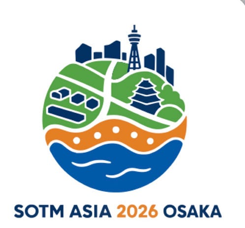
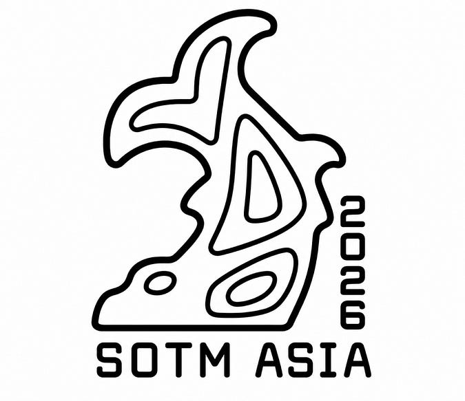
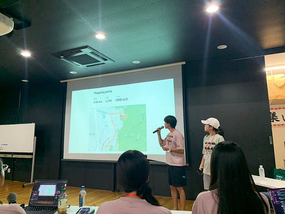

こんにちは、４年のモトヨシです。今回はSOTM Asia 2026に参加して行ったことをまとめていきます。

### ロゴ

恒例のZOOM会議をしている最中に、ロゴの話が出たので挙手して、制作させていただきました。

大阪らしさを象徴するたこ焼き、地図のデザイン、そして地球を合わせたデザインのこちらのデザインに決定しました。

採用はされませんでしたが、ボツ案としては大阪城のシャチホコを使ったこんな案もありました。

### エクスカーション

銀閣寺を観光し、後に哲学の道を南下するプランでした。  
道中で三浦さんにマイクロマッピングを教えていただき、銀閣寺では主にマイクロマッピングを行いました。  
マイクロマッピングとはOSM上にてベンチやゴミ箱などの細かい編集を行うことです。銀閣寺には変更点が非常に多く、それ単体としてエクスカーションが成り立つほどでした。

その後哲学の道を歩きました。哲学の道にかかる橋は、アキさんに事前調査してもらった通り、橋の名前の読み方に非常に多くの間違いがあり、周りの地名などを参考にしながらただして行きました。

### 発表

発表では今回のエクスカーションの意味、変更の前後がわかりやすいように比較しながら説明しました。半年間のエクスカーションの準備が完了し、非常に安堵しています。

### Strava

[Mapping party | Strava](https://www.strava.com/activities/20054901111)

---

[初めてのエクスカーションホスト！](https://medium.com/furuhashilab/%E5%88%9D%E3%82%81%E3%81%A6%E3%81%AE%E3%82%A8%E3%82%AF%E3%82%B9%E3%82%AB%E3%83%BC%E3%82%B7%E3%83%A7%E3%83%B3%E3%83%9B%E3%82%B9%E3%83%88-73d38552fa9f) was originally published in [Furuhashi(mapconcierge)Lab.](https://medium.com/furuhashilab) on Medium, where people are continuing the conversation by highlighting and responding to this story.
