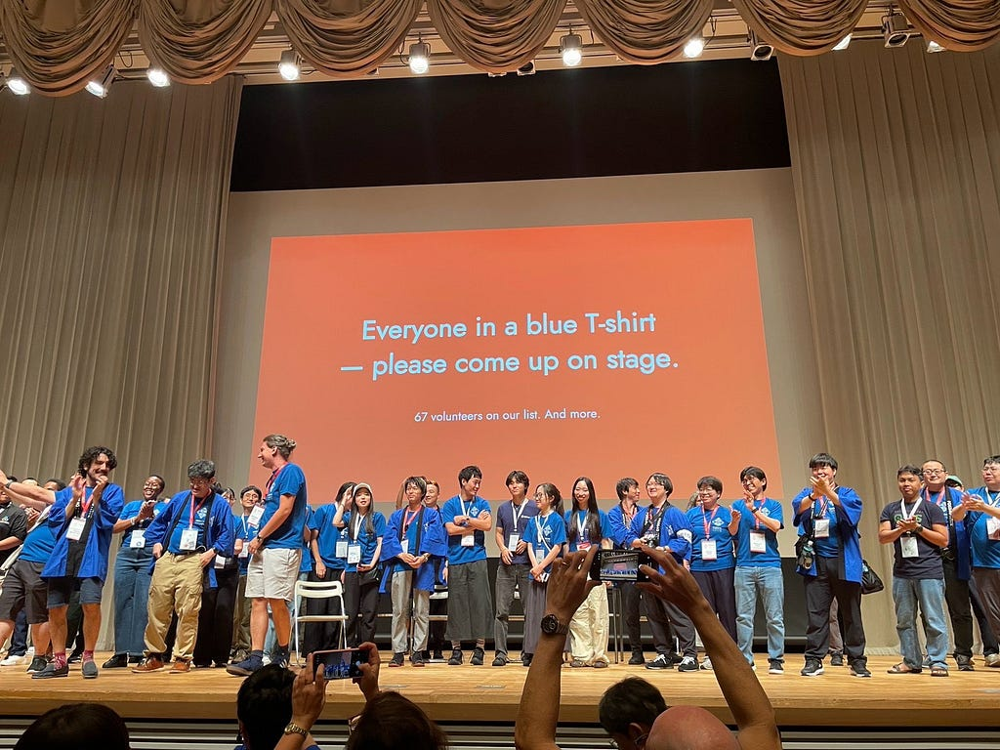
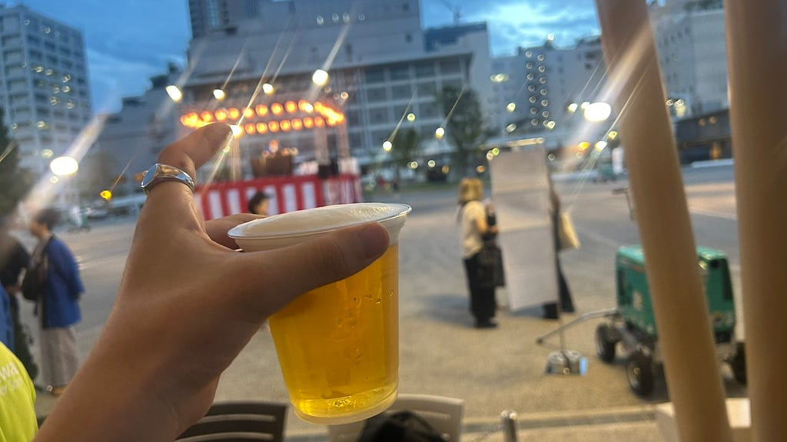
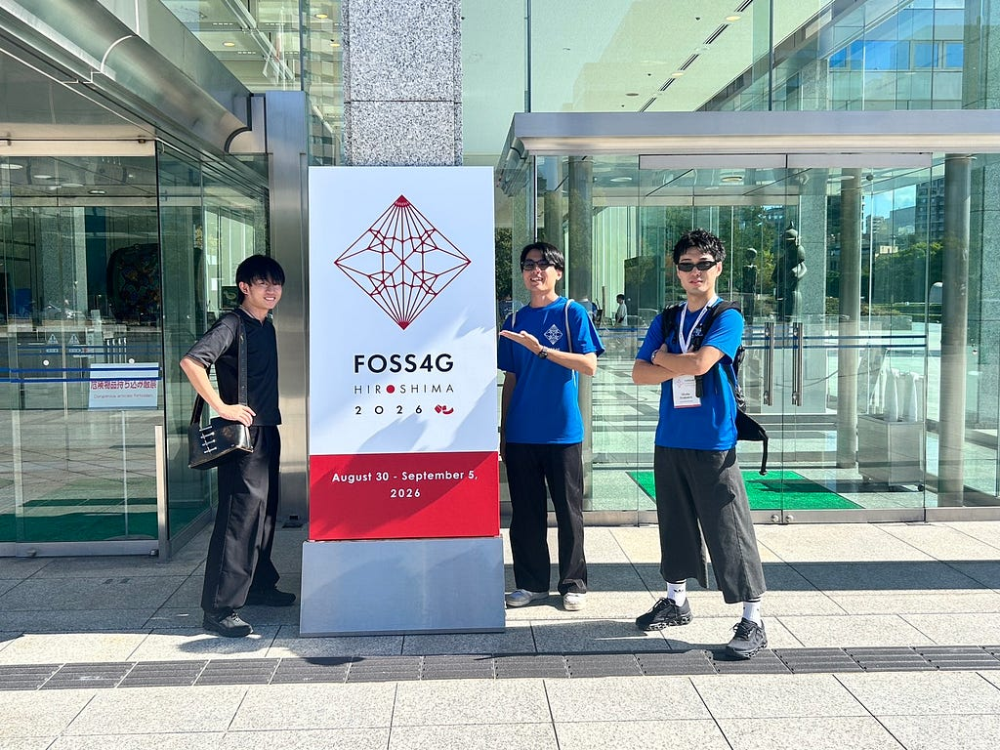
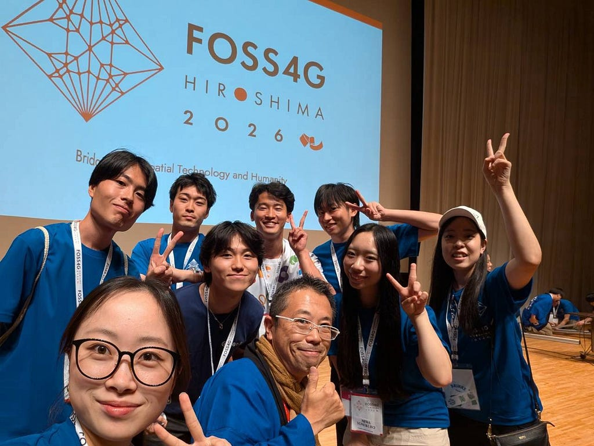
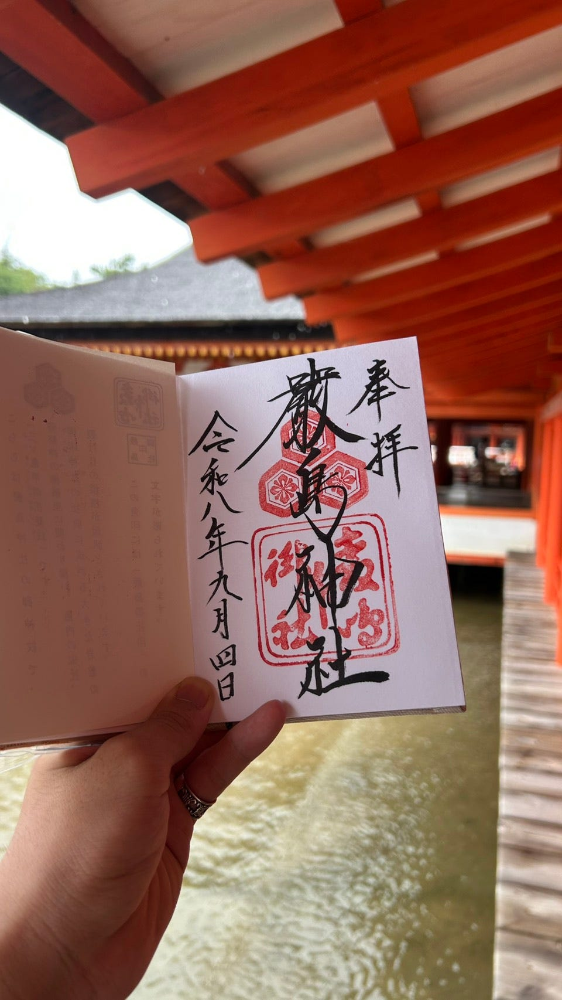
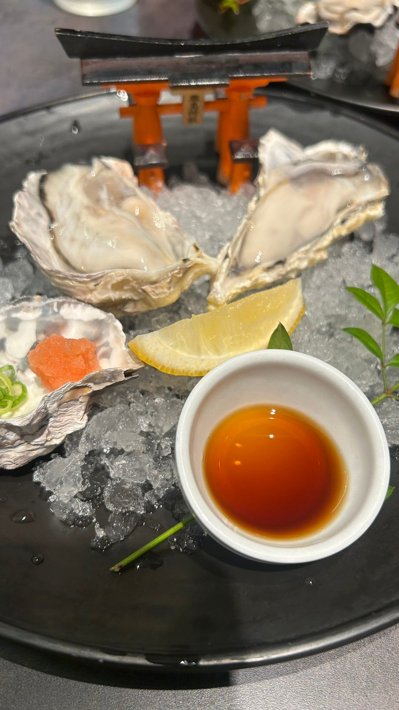

こんにちは、４年の井上です。この夏は災難の連続でなかなかにしんどかったのですが、最近はメルカリの出品の調子が良く、テンションが上がってきています。

さて、今回は2026年8月30日から9月5日まで開催された[FOSS4G Hiroshima 2026](https://2026.foss4g.org/en/)にボランティアとして参加してきたのでその様子をお伝えしようと思います。

> ***ボランティアの様子***

今回は去年のようにただの参加者ではなく、ボランティアとして参加しました。ボランティア中は主に受付、部屋の音響・照明調整、会場設営などを行いました。

参加する前は、時間に余裕あっていろいろなブースを見て回れるかと思っていましたが意外とやることがあったり、持ち場を離れられなかったりしたのでちょっぴり大変に感じました。その忙しさのせいか、このブログを書いているときに何かボランティア中の写真ないかな～と思って探しましたが、全然ない… 悔しいです。

ボランティアの仕事中は地味な作業が多かったので、自分たちの仕事がどれだけこの会議に貢献できているか分かりませんでしたが、最後に参加者みんなの前で拍手をもらい、ちゃんと貢献できていたのだなと実感することができました。

> ***ワクワクと出会い***

この会議中、一番楽しかったのはなんといってもIce Breakerでした。Ice Breakerでは一日目の夜に参加者の親睦を深めるために、食事をしながら踊ったりしました。

特に、みんなで輪になって踊った盆踊りは一体感が生まれ、人々の距離が近くなった気がしました。やはり伝統の力はすごいなと改めて関心しました。そして、ビールがうまい！ビールはもちろんおつまみとして出された”瀬戸内レモンスナック”みたいなやつが美味しかったので、広島に行く方がいたらぜひ買ってみてください。

また、ボランティア中に良い出会いもありました。受付業務をfedericaさんと行い、その中で空間情報に関する話から、イタリアの食文化の話まで様々な話を聞かせてもらいました。有意義な時間を過ごさせていただき、ありがとうございました！

ちなみに、この方は古橋先生がイタリア留学に行っていた際の研究室の方だそうでびっくりしました（笑）

> ***最後に***

今回はあまりセッションを見ることはできませんでしたが、それ以外で交わした会話やブース展示などからも今後の卒論の方針設計やGIS知識の勉強につなげることはできました。残りのゼミ生活で生かしていきたいと思います！

こうやってブログを書いていると、やっぱり、国際会議への参加は古橋研究室のどの行事よりも楽しく、有意義なものだなと感じました。今回のFOS4Gに関しても、GIS業界の世界的大物や、国のトップ官僚が参加していたりとこんなレベルの高い会議にオフラインで参加できる機会はそうそうないと思います。3年生はぜひ現地参加にこだわって国際会議に参加してもらえると嬉しいなと思います！

最後に、会議中に無料で入ることができた原爆資料館に行った際のStravaのログと、会議後に行った宮島での写真で締めくくりたいと思います。

※人生で初めて生ガキにあたりました。この夏の予定をぶち壊した牡蠣、お前だけは許さない

<https://strava.app.link/myajtsa0C6b>

---

[FOS4G Hiroshima参加レポート！！～牡蠣、お前だけは許さない～](https://medium.com/furuhashilab/fos4g-hiroshima%E5%8F%82%E5%8A%A0%E3%83%AC%E3%83%9D%E3%83%BC%E3%83%88-%E7%89%A1%E8%A0%A3-%E3%81%8A%E5%89%8D%E3%81%A0%E3%81%91%E3%81%AF%E8%A8%B1%E3%81%95%E3%81%AA%E3%81%84-2a1d50397acb) was originally published in [Furuhashi(mapconcierge)Lab.](https://medium.com/furuhashilab) on Medium, where people are continuing the conversation by highlighting and responding to this story.
