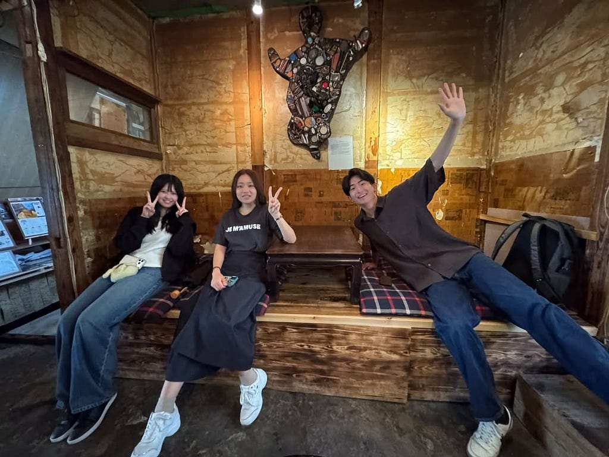
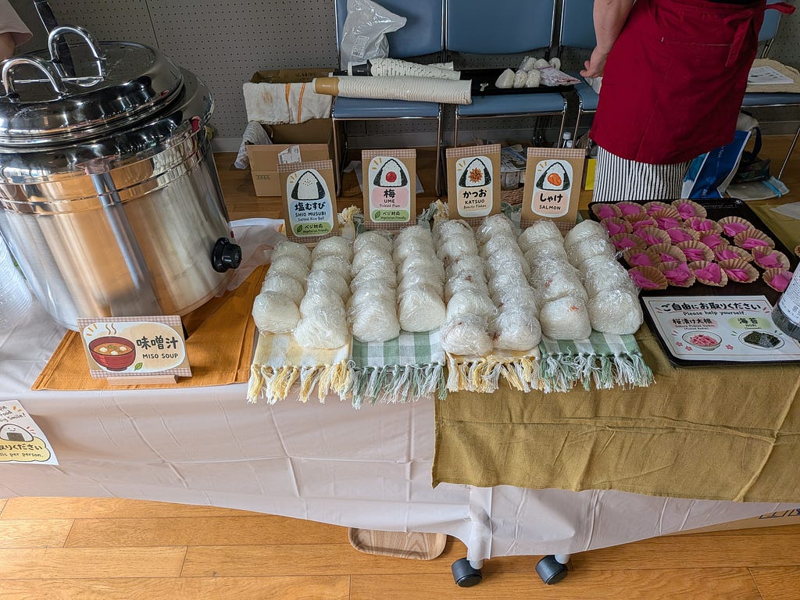
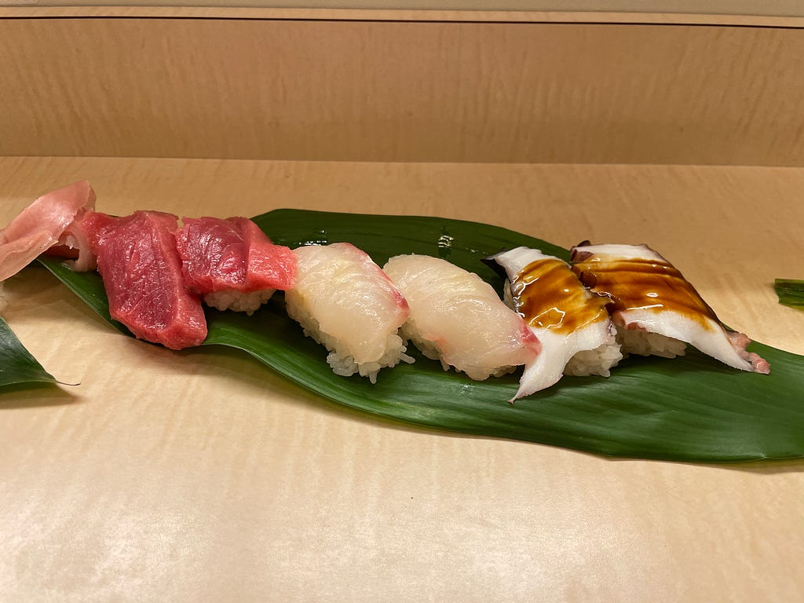
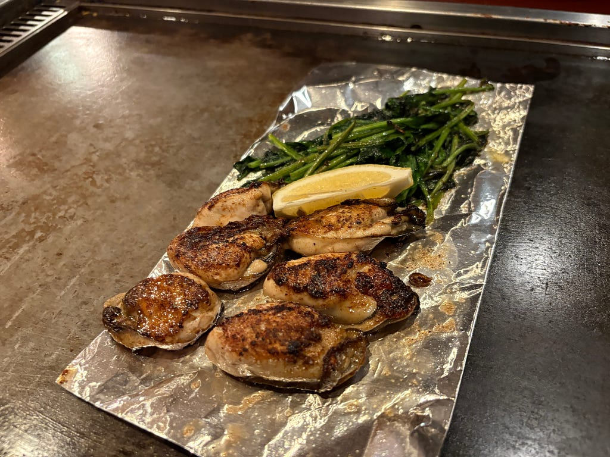
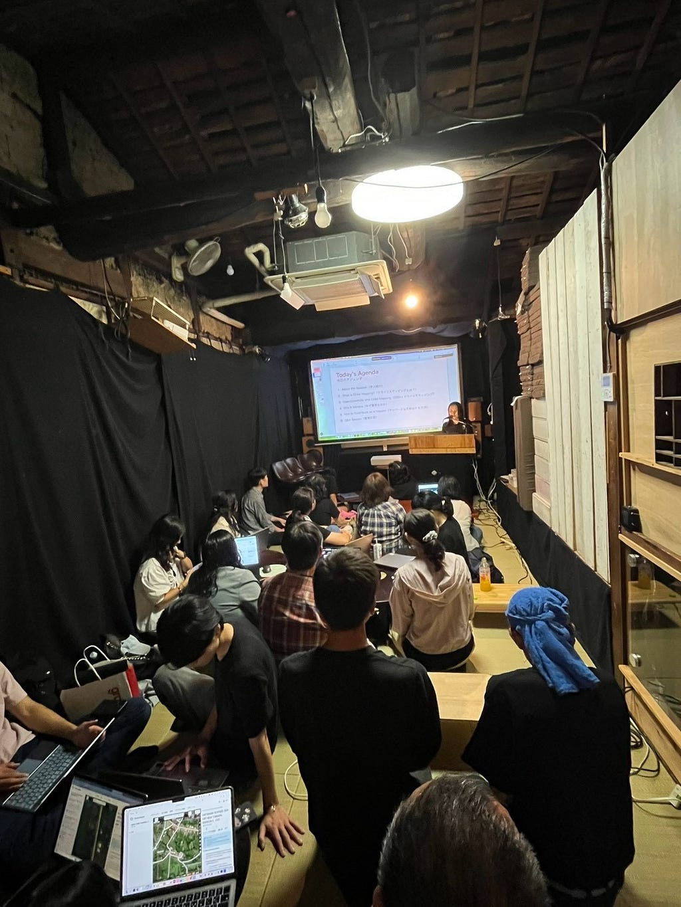
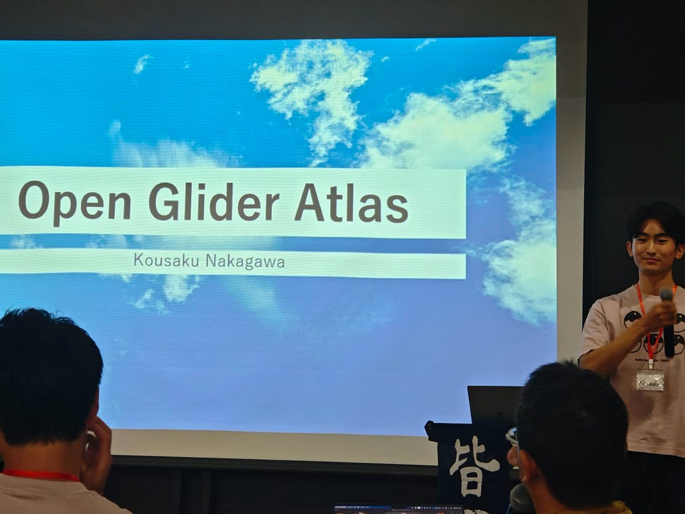

こんにちは、3年中川です！

今回は、2026年9月6日〜7日に大阪・中崎町で開催された **State of the Map Asia 2026 Osaka（SotM Asia 2026 Osaka）** に参加してきました！

SotM Asiaは、OpenStreetMap（OSM）に関わるマッパーや研究者、開発者、学生などがアジア各地から集まり、地図やオープンデータについて交流する国際カンファレンスです。

私は古橋研究室のメンバーとして、前日の9月5日から大阪入りし、会場準備や運営、Mapathon、そしてLightning Talkでの発表などに参加しました。

今回、私は部活動の用事で9/7での帰宅となりましたが、その2日間について振り返っていきたいと思います！

### Day0 9月5日

SotM Asiaの開催は9月6日からですが、古橋研メンバーは前日の9月5日から現地入りしました。

会場となったのは、大阪・中崎町にある **Salon de AManTo 天人**。翌日から多くの参加者が訪れるため、まずは会場の掃除や備品の準備などを行いました。

**Salon de AManTo 天人**

また、お昼には翌々日に参加者へ提供する「おにぎり」の試作も行いました。

[9/8に陳列されたおにぎりの写真]

具材や作り方などを確認しながら実際に作ってみました。国際カンファレンスの準備というと、受付や会場設営をイメージしていたので、まさか大阪に来てみんなでおにぎりを作るとは思っていませんでした（笑）。

準備が一段落した後は、あきさんおすすめの“回らない”お寿司屋さんへ。

[お寿司の写真]

せっかく大阪まで来たということで美味しいものを堪能し、その後はさらに鉄板焼き屋さんへ行きました。

[鉄板焼きの写真]

なんと！すべての夜ご飯を4年生の先輩方におごってもらいました♪イベント本番前日とは思えないくらいしっかり大阪の夜を楽しみ、0日目は終了です。

### Day1 9月6日

いよいよSotM Asia 2026 Osakaがスタートしました！

この日は午前中から、大阪・京都の各地に分かれて行われるMapping Partyに参加する予定でした。

しかし、宿泊していた宿でノロウイルスが広がっていたこともあり、私は午前中は宿に残ることにしました。

楽しみにしていたMapping Partyに参加できなかったのは残念でしたが、午後からはSalon de AManToで行われていた **Mapathon** に参加しました。

[Mapathonの写真]

Mapathonでは、参加者の皆さんと一緒に入門者向けの講習などを受け、さらに理解を深めました。

普段、大学の授業や研究室内でOSMを触ることはありますが、国内外から集まったさまざまなバックグラウンドを持つ方々と同じ場所でマッピングをするというのは新鮮な経験でした。

そして、この日の個人的な一大イベントが夜の **Lightning Talk（LT）** です。

### 初めて英語でLightning Talk！

今回のLightning Talkでは、古橋研究室の夏合宿で行ったゼミ論の構想発表をベースに、自分がこれから取り組みたい研究について英語で発表しました。

[発表している写真]

普段、日本語で発表することはあっても、多くの海外参加者がいる国際カンファレンスで英語を使って自分の研究について話すのは初めての経験でした。

発表前はかなり緊張していましたが、いざ始まってみるとあっという間でした。

そして何より嬉しかったのが、発表が終わった後に参加者の方から研究についてアドバイスをいただけたことです。

自分では考えていなかった視点から意見をもらうことができ、「発表して終わり」ではなく、これをきっかけに研究をさらに発展させられそうだと感じました。

今回いただいたアドバイスも取り入れながら、これから研究内容をさらに**ブラッシュアップ**していきたいと思います！

発表という大きな仕事を終えた後は、同期と串焼き屋さんへ…

英語での発表が無事に終わった安心感もあり、この日のご飯はいつも以上に美味しく感じました（笑）。

### まとめ

今回のSotM Asiaでは、会場準備や運営など、普段の大学生活ではなかなか経験できない活動に参加することができました。

その中でも特に印象に残っているのは、やはりLightning Talkで自分の研究構想を英語で発表したことです。

自分の考えていることを外部の方に伝え、それに対して意見をいただくことで、研究を進める上で新しい視点を得ることができました。

また、SotM Asiaには日本だけでなく海外からも多くの方が参加しており、OpenStreetMapという一つの共通点をきっかけに、国籍や年齢に関係なく交流している姿が印象的でした。

今回は運営側として参加する場面も多かったですが、イベントを裏側から支える経験も含め、とても濃い2日間になりました。

今回得た経験やアドバイスを、これからの研究活動にも活かしていきたいと思います！

---

[SotM Asia 2026 Osaka に参加してきました！](https://medium.com/furuhashilab/sotm-asia-2026-osaka-%E3%81%AB%E5%8F%82%E5%8A%A0%E3%81%97%E3%81%A6%E3%81%8D%E3%81%BE%E3%81%97%E3%81%9F-3f096dd1a370) was originally published in [Furuhashi(mapconcierge)Lab.](https://medium.com/furuhashilab) on Medium, where people are continuing the conversation by highlighting and responding to this story.
