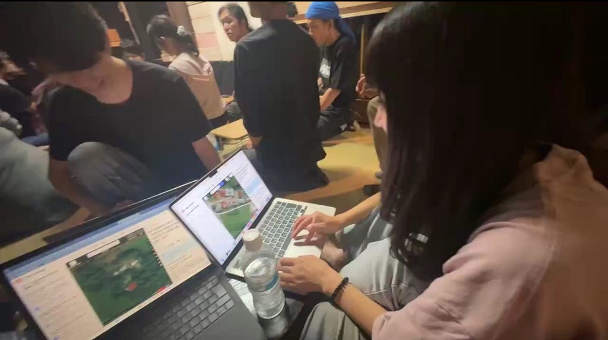
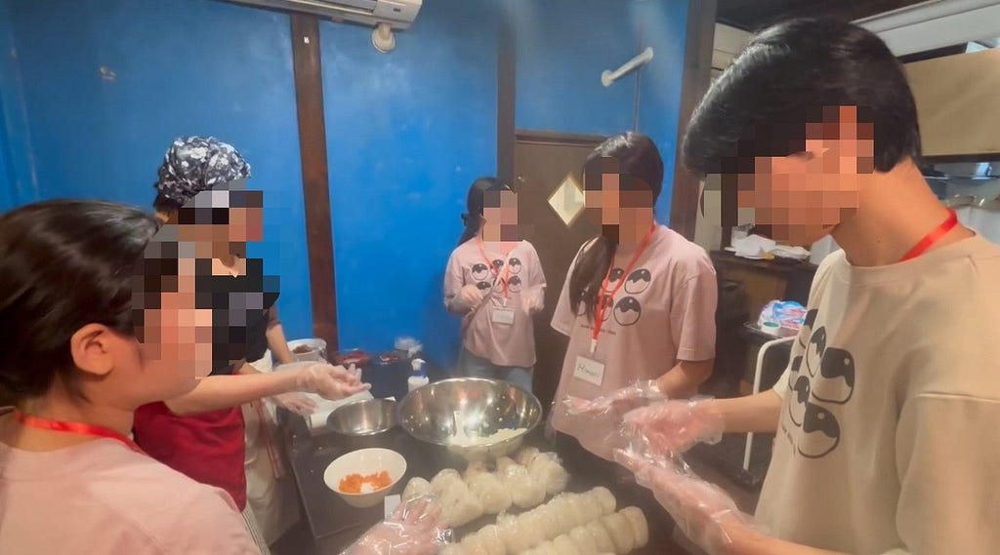

こんにちは！3年の加藤です。

2026年9月、State of the Map 2026 Osaka（SotM）に参加しました！夏休みの一大イベントだった国際会議も無事に終わり、いよいよ夏の終わりを感じています🍉

State of the Mapは、マッパーやオープンジオデータに関わる人々が集まる国際カンファレンスです。今回は古橋研究室のメンバーとして参加し、マッピングのサポートやイベントのお手伝い、Lightning Talkでの発表など、さまざまな経験をしました。

> 1日目：マッピングを通じた交流

1日目は、Salon de AmanTO 天人の方やイベント参加者の皆さんにOpenStreetMapのマッピング方法を教えるお手伝いをしました。

普段は研究室の活動でOpenStreetMapを利用していますが、今回は自分がマッピングの方法を教える側として参加しました。実際に一緒に手を動かしながらマッピングを行い、参加者の方々と交流することができました。あやめさんの解説を聞き、私自身改めてOpenStreetMapについての理解を深めることができました。

また、先輩方によるマッピングパーティーについての発表も聞きました。実際に街を歩き、参加者同士で交流しながら地図を作っていくMapping Partyの楽しさが伝わってきました。今回は参加できなかったため、次に機会があれば私自身もMapping Partyに参加したいです。

> 2日目：イベントのお手伝いとLightning Talk

2日目は、イベントで参加者の皆さんに提供するおにぎりをSalon de AmanTO 天人の方々と一緒に作りました。普段の研究室活動とは少し違い、イベントを支える側として準備にも関わることができました。

そして、Lightning Talkでは「Development of a WebGIS for Beginner Rental Boat Users」というテーマで、自分の研究について英語で発表しました。

英語での発表にはもともと苦手意識があり、さらに国際カンファレンスで発表するのも初めてだったため、とても緊張しました。それでも、自分の研究について英語で伝えるという貴重な経験になりました。

> 参加して感じたこと

今回SotMに参加して、普段研究室で利用しているOpenStreetMapが、世界中のさまざまな人によって作られ、活用されていることを実感しました。

また自分の英語力がまだまだ足りないと感じました。Lightning Talkでは原稿に頼る部分が多く、参加者との交流でも、自分の考えをその場で英語にして伝えたり、相手の話を聞いて会話を続けたりすることに難しさを感じました。一方で、実際に国際カンファレンスに参加したからこそ、自分に足りない部分を実感できたとも思います。

来年は今年より積極的に海外の参加者に自分から話しかけたいです。今回の経験を次につなげられるよう、研究だけでなく英語の勉強にも取り組んでいきたいと思います！

---

[初めての国際会議](https://medium.com/furuhashilab/%E5%88%9D%E3%82%81%E3%81%A6%E3%81%AE%E5%9B%BD%E9%9A%9B%E4%BC%9A%E8%AD%B0-e0db0288501d) was originally published in [Furuhashi(mapconcierge)Lab.](https://medium.com/furuhashilab) on Medium, where people are continuing the conversation by highlighting and responding to this story.
