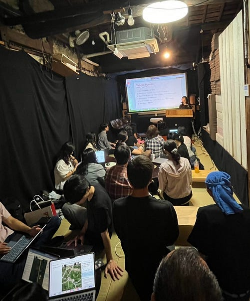
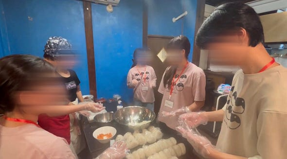
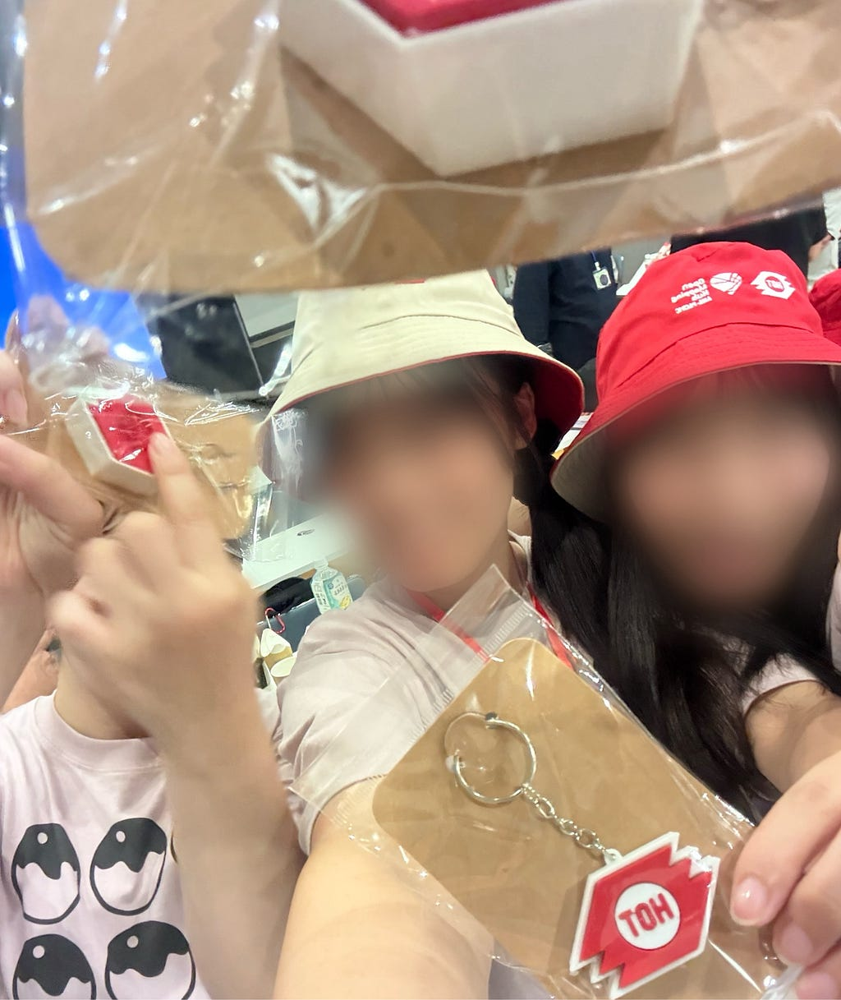
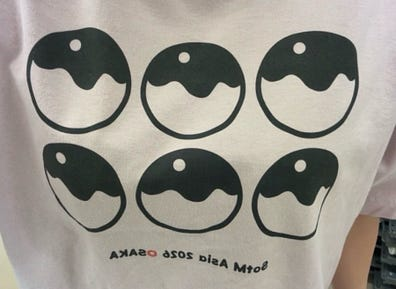

こんにちは！3年の野中です。

夏休みも終わって、最近は私の大好きなキンモクセイの香りをいろいろなところで感じられてとっても嬉しいです♪

今回は、9月6日から7日にかけて大阪で開催された「**State of the Map Asia 2026**」にボランティアとして参加してきました！

> **1日目**

1日目は、**Salon de AManTo** で、イベント参加者の方々に OpenStreetMap のマッピング方法を教えるお手伝いをしました。

まだ自分自身もOSMについて学んでいる途中ですが、人に説明することで、普段何気なく行っていた操作を改めて考える機会にもなりました。また、参加者の方々と交流しながらマッピングを行うことで、OSMがさまざまな人の協力によって作られていることを改めて実感しました。

夕方からは、**中崎町ホール**に移動して受付を行いました。参加者のみなさんにネームカードを作成していただいたり、Tシャツを配ったりしました。

> 2日目

2日目は、Salon de AManToの方々と一緒に、イベント参加者の皆さんに提供するおにぎりを作りました。

自分たちで作ったおにぎりをたくさんの方々が美味しそうに食べてくれているのを見て、とてもうれしかったです！

そして2日目の最大イベントは、**Lightning Talk**への登壇です。

古橋研究室で行ったゼミ論の構想発表をベースに、自分の研究について英語で発表しました。

私は人前に立つとなるとすごく緊張してしまうタイプで、さらに英語での発表だったため、発表前はとてもドキドキでした。ですが、いざ始まってしまえばあっという間に時間は過ぎていき、大きなミスもなく、無事発表を終えることができました。

発表後に、参加者の方から私の研究についてアドバイスとお褒めの言葉いただけたことがとても嬉しかったです！！！

> まとめ

今回、国際会議に運営側として参加するという貴重な体験ができてよかったです。初めての経験で最初は不安でしたが、Salon de AManTo の方々がとても優しく接してくださったおかげで、楽しい2日間を過ごすことができました。

今回の国際会議での経験を、来年の国際会議やこれからの研究室ライフで活かしていきたいです！

---

[SotM Asia 2026 Osaka 参加レポート](https://medium.com/furuhashilab/sotm-asia-2026-osaka-%E5%8F%82%E5%8A%A0%E3%83%AC%E3%83%9D%E3%83%BC%E3%83%88-65f46d038801) was originally published in [Furuhashi(mapconcierge)Lab.](https://medium.com/furuhashilab) on Medium, where people are continuing the conversation by highlighting and responding to this story.
