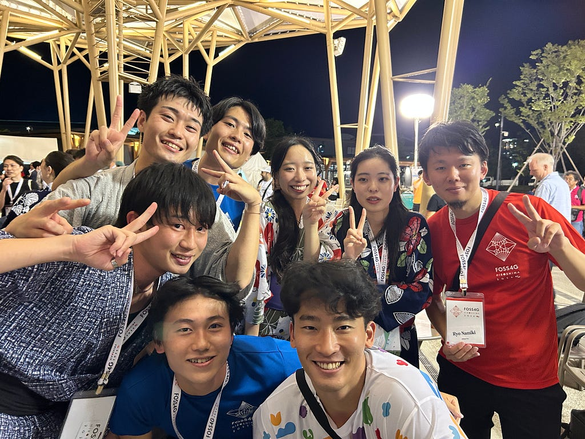
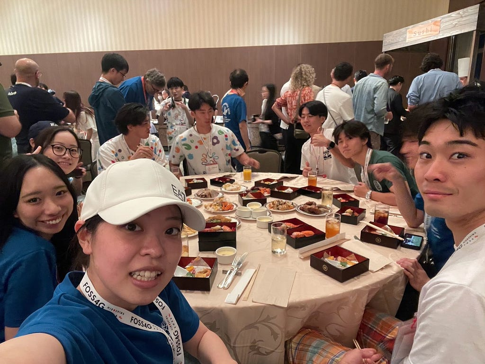
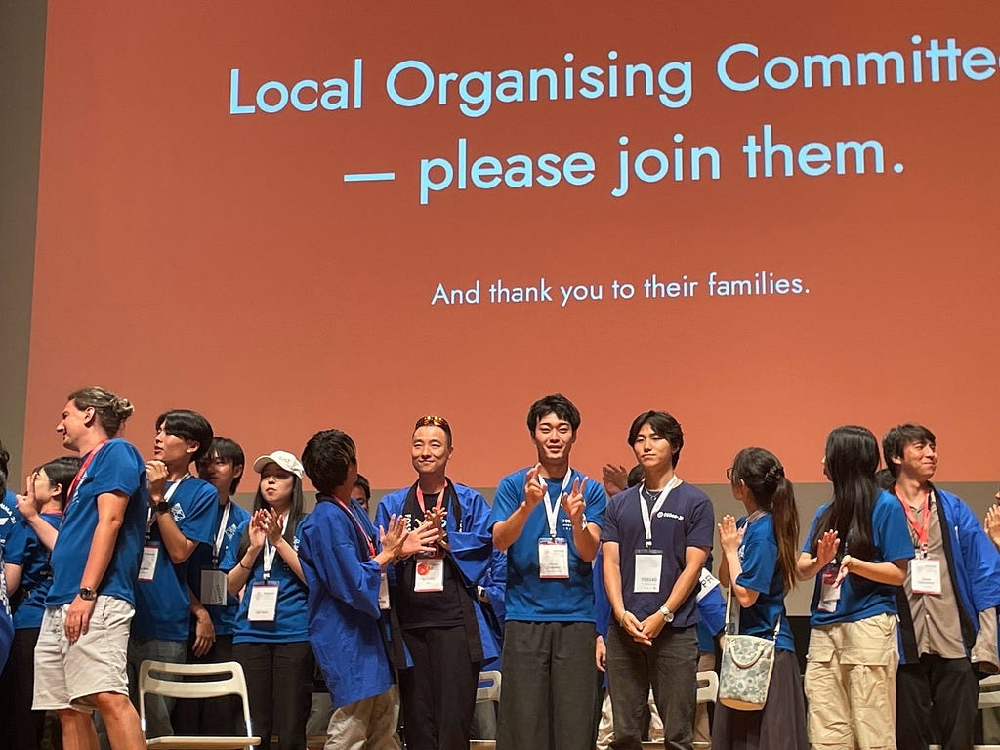
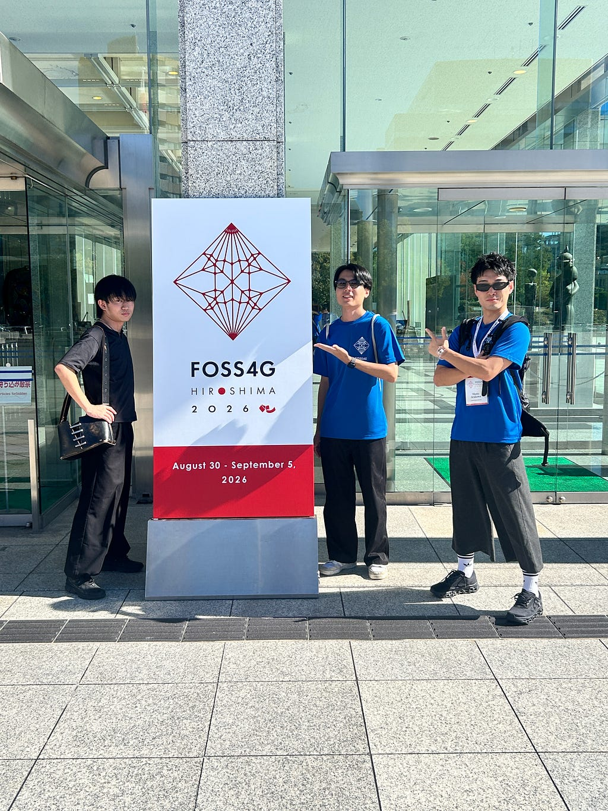
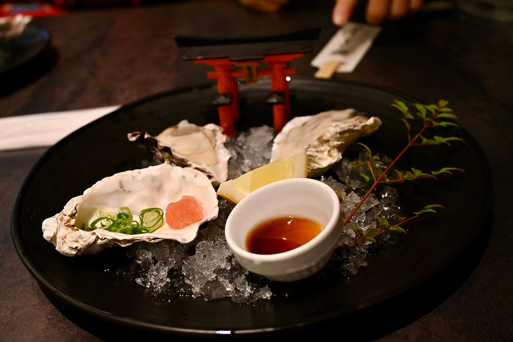
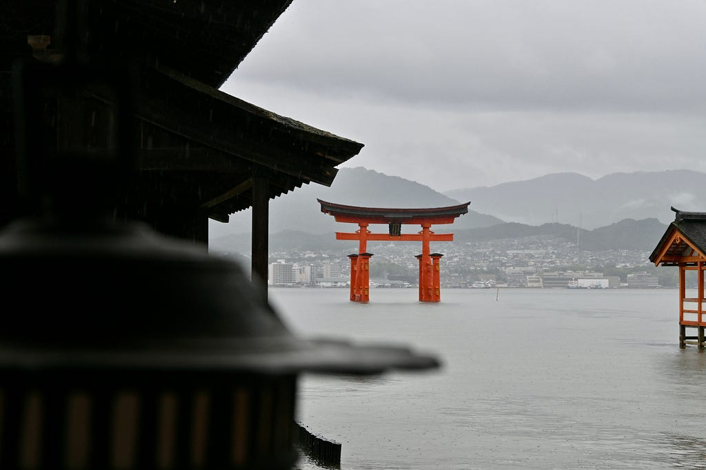

みなさんこんにちは！Mediumに記事を書くのが久々な気がする古橋研4年の加藤です！みなさんは今年の夏はいかがお過ごしてしたか？私は週一ペースでどこかしらに泊まりに行ったり、ライブに行ったり、バイトしたり、学生最後の夏休みを謳歌していました。疲れたけど。

そんなわけで今回はそんな僕の怒涛の夏休みのラストスパートにボランティアとして参加したFOSS4G Hiroshimaの参加レポートです。

**8/31 「お弁当配りニキ」**

自分自身ボランティアとして参加した1日目、会議自体はWorkshopの2日目はお昼休憩に来る参加者に対してひたすらお弁当を品出ししてました。限られた空間の中でお弁当を捌いていく中、続々とやってくる参加者たち、、これは気を抜いていたら品出しのスピードが追いつきません。ということで加藤少年謎のスイッチが入りました。アドレナリン全開で本気モードの品出し開始。あの時間は完全にゾーンに入っていたと思います。多分。そんなこんなで大きなトラブルなくお昼も終了。午後は本来、運営補助のシフトが入っていたのですが急遽キャンセルされたこともあり、少し足を伸ばして呉まで行ってきました。

呉のでっけーーーーーーーー船

**9/1 「受付ニキ」**

Main Conferenceのスタートです！ということでボランティア2日目は午後から会場の入り口で参加者の受付の予定だったのですが、お手隙の古橋研メンバーが最後の会場準備を手伝うことに。みんなで協力して部屋を整えました。そんなこんなで気づいたら本来のシフトの時間に。午後になると客足も落ち着いてきていたのでうまく休憩回しつつ受付の業務に勤しみました。

そしてこの日はIce Breakerが開催される日。シフトが終わったら早足でひろしまゲートパークへ。公園の中心には櫓が立ち構えており、その周りで盆踊りやよさこい、サンバなど世界中の踊りをみんなで踊り合いました。やっぱり音楽って世界共通言語だなあなんて思ったり。

**9/2 「進行アシスタントからのGala Dinner受付」**

Main Conference2日目は午後からphoenix hallの進行アシスタントを行いました。地元広島の高校生が国際会議で発表している姿を横から拝見し、一生懸命に頑張っているみんなに心動かされました。そのあとは休憩なしでGala Dinnerの受付業務へ。これはもう僕の得意分野ですよ。イベントバイトで培った力を存分に発揮させていただきました。（ご飯もおいしかった！）

**9/3「音響・照明」**

といきたいところなのですが、Gala Dinner中に携帯の充電アダプターが欠けてスマホの中に入り込み充電ができなくなってしまった。。。ということで朝イチで修理屋に駆け込み治してもらいました。。。。。。。

ということでシフトは他のみんなにお願いしました。みんなマジでありがとう。

> **振り返って**

今回は去年参加したSOTMとは違い、4日間裏方に回って会議を支える側に回ったのですが、このような大規模なイベントを成功させる難しさという点に改めて気付かされました。一人でも誰か欠けていたらここまで成功していなかったかもしれない、参加者全員が協力しながら０から作り上げたものであると感じました。大変だったけどやりがいを感じた充実した4日間でした！

裏方に回った4日間だったためセッションはそこまで参加することはできなかったのですが、今回学び、刺激に受けたことを卒論制作などの残り半年のゼミ生活に活かしていきたいと思います。

> **余談**

宮島で食べた生牡蠣にあたり、大阪で無事死亡。SOTM Asiaを欠席し意識朦朧になりながら一人で先に帰ったとさ。

諸悪の根源

晴れてたらなぁ、、、

---

[楽しかったFOSS4GHiroshimaと呪われた大阪](https://medium.com/furuhashilab/%E6%A5%BD%E3%81%97%E3%81%8B%E3%81%A3%E3%81%9Ffoss4ghiroshima%E3%81%A8%E5%91%AA%E3%82%8F%E3%82%8C%E3%81%9F%E5%A4%A7%E9%98%AA-3c3b5d92c1c3) was originally published in [Furuhashi(mapconcierge)Lab.](https://medium.com/furuhashilab) on Medium, where people are continuing the conversation by highlighting and responding to this story.
