こんにちは！

3年の藤原です！

9月6日から7日にかけて、大阪で開催された「[State of the Map Asia 2026 Osaka（SotM Asia）](https://stateofthemap.asia/about.html)」参加しました。SotM Asiaは、OpenStreetMap（OSM）に関わる人たちがアジア各地から集まり、地図やオープンデータについて知識や活動を共有するイベントです。国内だけでなく海外からも多くの参加者が集まっていました。

SotM Asia 2026は大阪の中崎町で開催され、今回、私は主にスタッフとしてSalon de AManToの方々と協力しながら参加しました。初めは、とても緊張してしまい、ガチガチでしたが、皆さんが優しく接してくれたおかげで、すぐに緊張は解けました。会場の設営や案内、昼食準備など裏方作業を通して、多くの方とお話しする機会も多く、また一緒にマッピング作業などもできました。

#### 開催日初日

開催初日は、古橋研のOGであるあやめさんと一緒にCrisis Mapping Mapathon の準備を行い、海外の方へ向けた会場説明の看板や案内を担当しました。途中、エクスカーションの会場を間違えて来られた方の対応など、初めてのこともありましたが、むしろイレギュラーなことが面白かったです。また、古橋研のOGの方と会うことがなかったので、今回初めてあやめさんとお話をできたのも、フィールドワークならではだったと思います。初日で気づいた1番重要なことは、「自分の頭で考えて行動に移す」だったと思います。忙しくて誰も指示はできないし、ボッーとしてるだけじゃ何の役にも立てない。ただ自分の出来ること、やらないといけないこと、求められていることを考えながら行動を徹底していた日でした。自分で仕事を探しに行くガッツが1日目だけで身についたと思います。

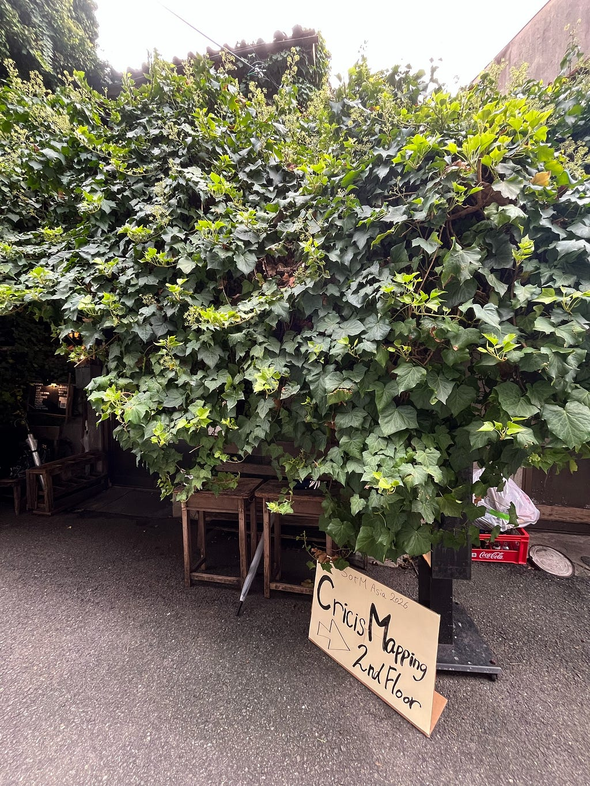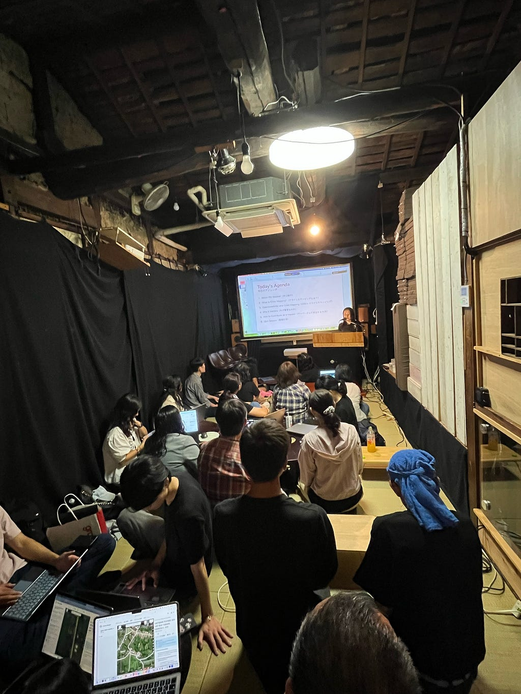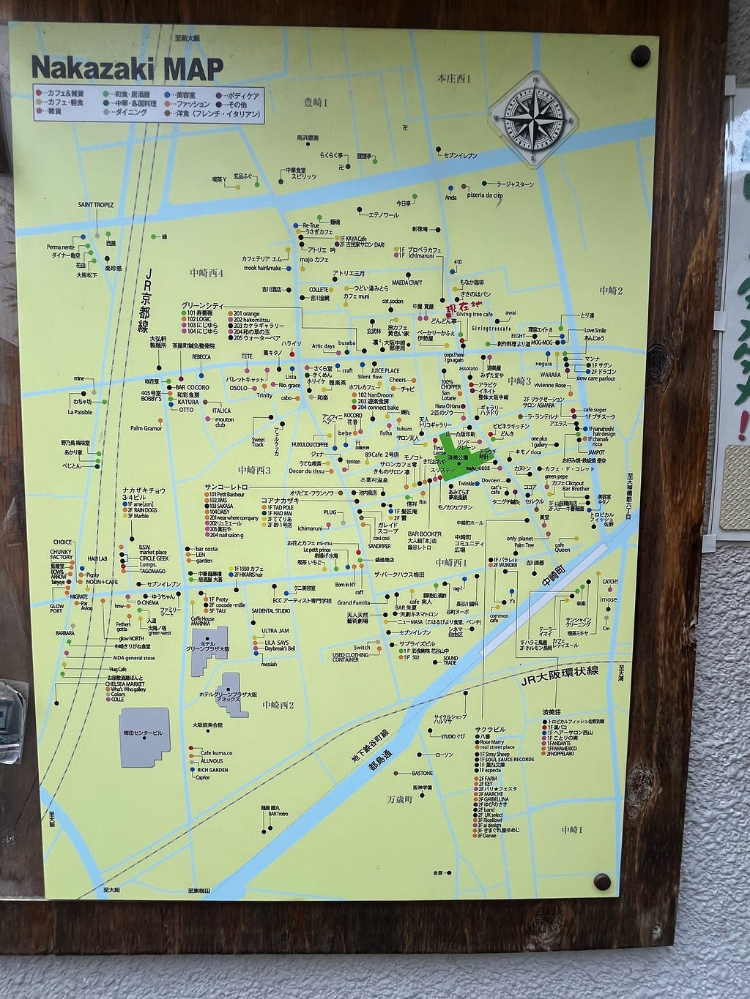

#### 開催2日目

2日目はあいにくの曇り空からのスタート。

この日はランチタイムに向けた準備で大忙し。昨日の反省点や改善点などを踏まえて運営をしていくことに。そして、この日は青学生が多数参加するLightning Talkもあり、みんなそれぞれが自分の役割の責任が重大でした。

午前のカンファレンスを終えると、ランチタイムになり、手巻き寿司体験やカレー、お弁当などが用意されており、参加者の方々は日本の文化や食事を楽しみつつ交流を深めていました。私たち学生スタッフも手巻き寿司のやり方などを説明したりと貢献することができたのではないでしょうか。

ランチタイムが終わると、いよいよLightning Talk のスタートです。自分の発表だけでなく、先輩方や同期たちの発表、ゲストの方の発表など学べることが沢山ありました。

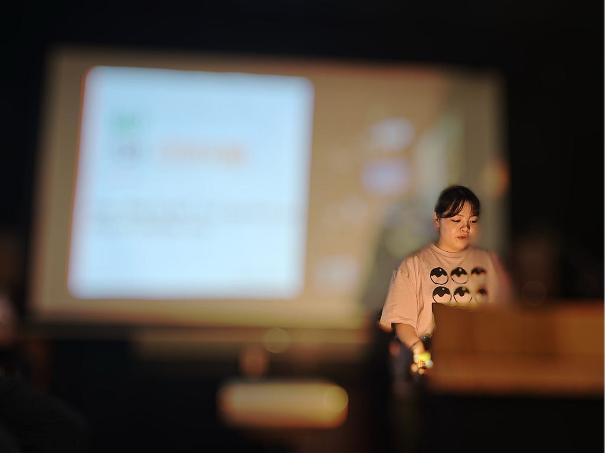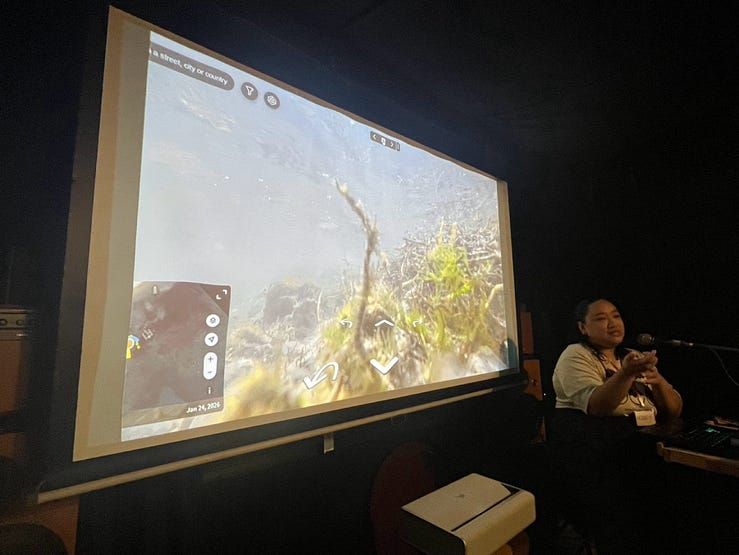

そして、イベントも終盤に入っていきました。

#### 振り返ってみて

多くの方々が参加し、意見交換などを行なっているところを実際にみると、今までよりも、より深く近づくことができました。当初は、初国際会議ということもあって緊張と不安でいっぱいでしたが、終わりを迎えると達成感のようなものも感じられました。そして楽しさも感じられ来年の国際会議も楽しみです！

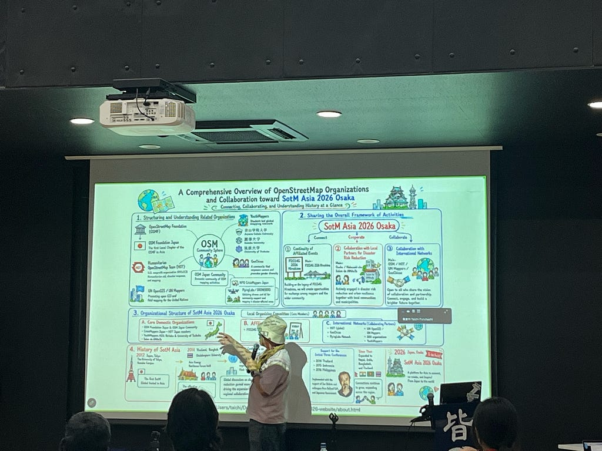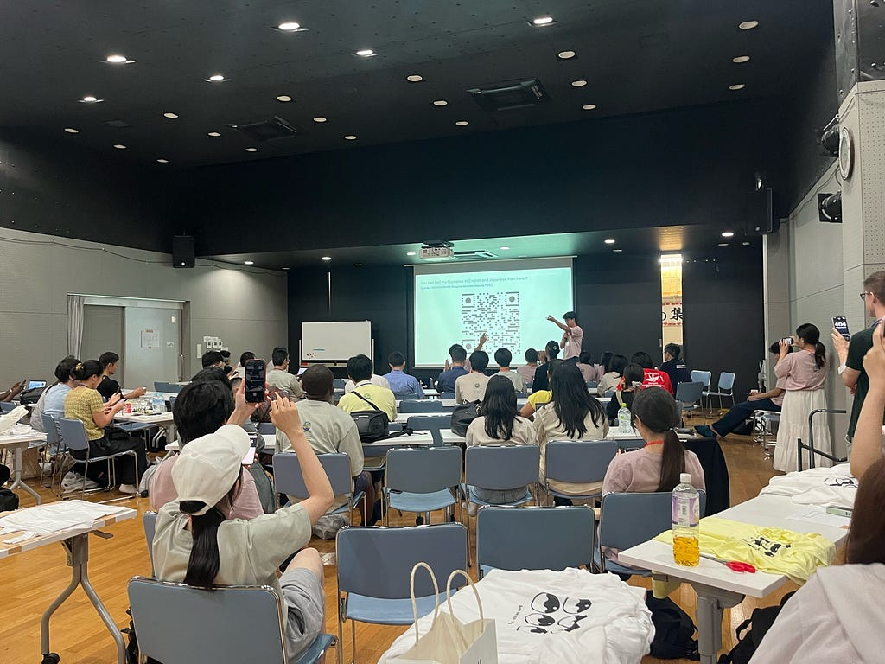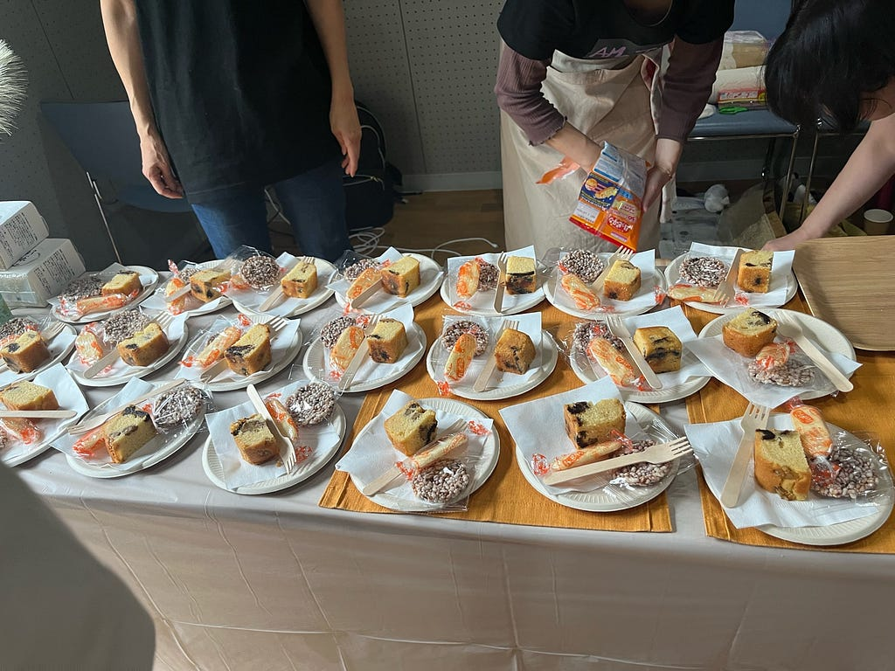

#### その後

大阪をかるーく観光して帰ろうとしたら、大雨で新幹線止まって帰るのにめちゃくちゃ時間がかかりました。笑。

ツリーハウスに続き、帰りは一筋縄で帰れないなーなんて思ったりして、ゆったりな後日談でした。

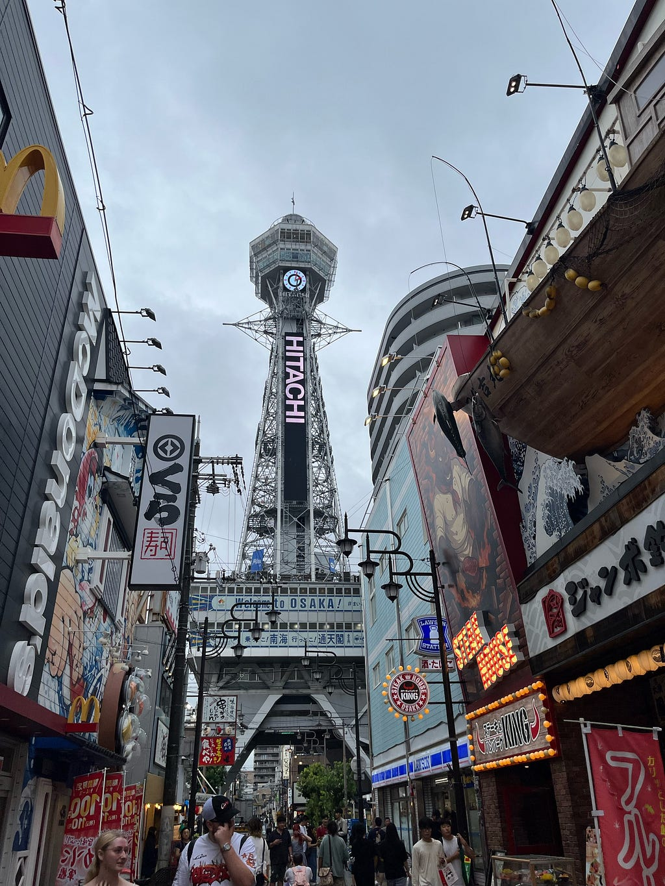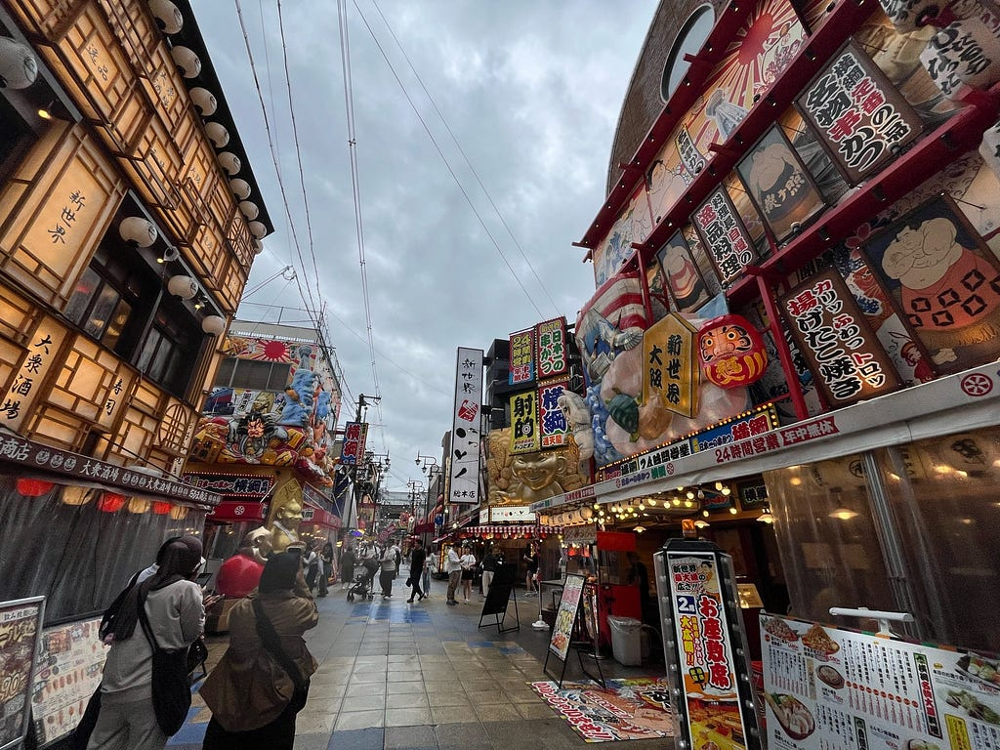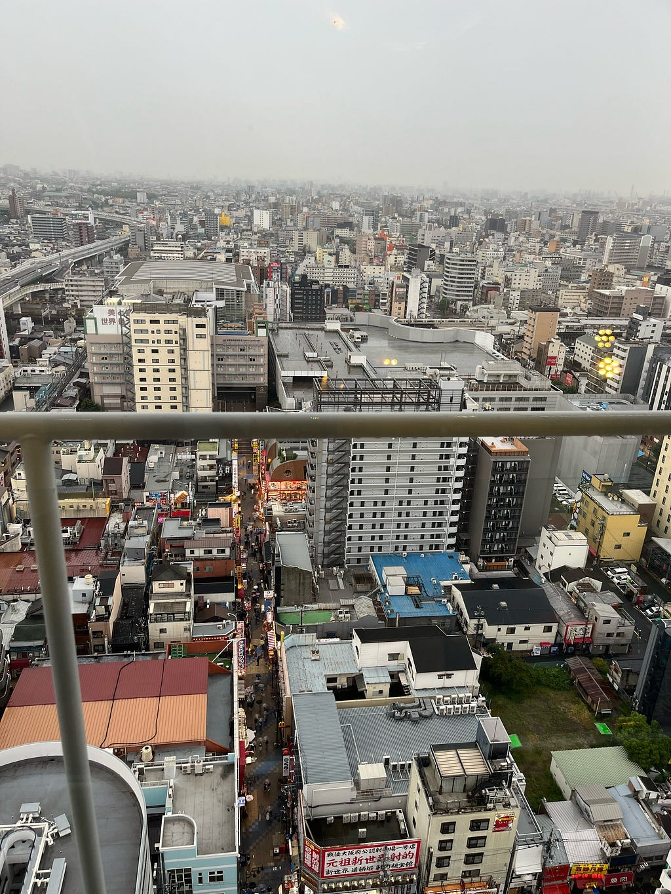

---

[SotM Asia 2026に初参加してきました！](https://medium.com/furuhashilab/sotm-asia-2026%E3%81%AB%E5%88%9D%E5%8F%82%E5%8A%A0%E3%81%97%E3%81%A6%E3%81%8D%E3%81%BE%E3%81%97%E3%81%9F-43f333892742) was originally published in [Furuhashi(mapconcierge)Lab.](https://medium.com/furuhashilab) on Medium, where people are continuing the conversation by highlighting and responding to this story.
