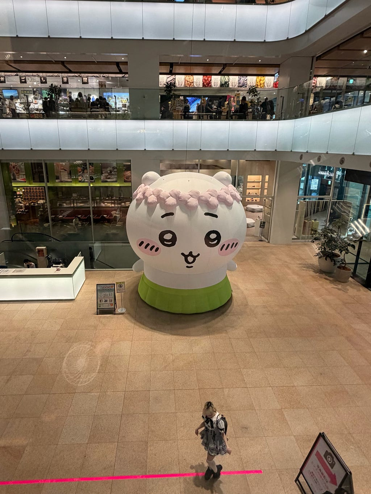

SotmAsiaOsaka2026参加レポート  
English below

こんにちは！古橋研究室3年の愛甲です。

2026年9月6日〜7日の日程で、State of the Map 2026 Osaka（SotM）に参加しました！

今回は古橋研究室のメンバーとして、運営のお手伝いや発表を行うボランティア枠での参加でした！もちろん発表もします。

まず最初に、今回のSotMでは、事前の連絡を十分に確認できておらず、運営ミーティングに参加できませんでした。

自分自身の確認不足で、準備を進めていた皆さんに迷惑をかけてしまったことを、この場でも改めてお詫びしたいです。

> 1日目：会場設営とクライシスマッピング

SotM初日は、お昼頃に大阪・中崎町に集合しました。

研究室のメンバーと一緒に会場設営を行い、会場に来てくださった参加者の方への案内など、イベント運営のお手伝いをしました。

これまでSotMのようなイベントには参加者として関わることが多かったのですが、実際に会場を準備したり、参加者を迎えたりする側に立つことで、一つのイベントが多くの人の準備によって成り立っていることを改めて感じました。

その後は、ネパールで行われているクライシスマッピングについてのレクチャーに参加しました。

改めて、災害時に地図やOpenStreetMapがどのように活用されているのかを知ることができ、自分自身も研究室で防災やマッピングに関わっているため、非常に興味深い内容でした。

一方で、今回のSotM期間中は以前から続いていた腰の椎間板ヘルニアの症状が強く出てしまいました。

薬を服用しても痛みが十分に収まらず、副作用も重なり、1日目も途中から会場にいることが難しくなってしまったため、皆さんに事情を伝えて早退させてもらいました。

> 2日目：オンラインでの発表

2日目も腰の痛みが改善せず、会場へ行くことができませんでした。

せっかく大阪まで来てSotMに参加しているのに、運営の仕事を十分に手伝うことができず、研究室の皆さんには本当に申し訳ない気持ちでした。

また、今回は自分自身も発表を行う予定だったため、参加できないことへの焦りもありました。

そこで古橋先生に相談したところ、発表スケジュールを調整していただき、最後の時間帯にオンラインから参加する形で発表させていただくことになりました。

会場に直接立って発表することはできませんでしたが、自分が現在考えている研究・制作の構想について、オンラインという形でもSotMの場で発表することができました。

急な変更にもかかわらず対応してくださった先生や、会場で運営していた研究室の皆さんには本当に感謝しています。

> 今回のSotMを振り返って

今回のSotMは、自分が想像していた形で最後まで参加することはできませんでした。

会場設営や運営、参加者との交流、さまざまな発表など、本来であればもっと経験したかったことがたくさんあります。

特に、2日目を丸一日休むことになり、運営を担っていた研究室の皆さんに仕事を任せる形になってしまったことは申し訳なく感じています。

それでも、体調について理解してもらい、発表時間まで変更してもらい、最終的にはオンラインから発表する機会を作っていただきました。

自分一人では参加を続けることができなかったからこそ、今回のSotMではイベントの内容だけでなく、周りの人に支えてもらうことのありがたさも強く感じました。

短い時間ではありましたが、会場でクライシスマッピングについて学び、SotMという国際的なコミュニティの場に実際に関わることができたことは、自分にとって貴重な経験でした。

次にSotMへ参加するときには、今回できなかった分まで、発表を聞いたり、多くの参加者と話したり、運営にももっと積極的に関わったりしたいと思っています。

最後になりますが、今回体調面でたくさんご迷惑をおかけしたにもかかわらず、支えてくださった古橋先生、研究室の皆さん、そしてSotMの運営に関わった皆さん、本当にありがとうございました！

### English Ver

Hello! I’m Tomoya Aiko, a third-year student in the Furuhashi Laboratory.

In September 2026, I participated in State of the Map 2026 Osaka (SotM)!

I joined the conference as a member of the Furuhashi Laboratory, helping with event operations as a volunteer and also giving a presentation.

First of all, I would like to apologize for missing an organizational meeting before the event because I failed to properly keep up with the communication beforehand.

It was my responsibility to check the information more carefully, and I am sorry to everyone who had already been working hard to prepare for SotM.

> Day 1: Venue setup and crisis mapping

On the first day of SotM, we gathered around noon in Nakazakicho, Osaka.

Together with other members of the laboratory, I helped set up the venue and guided participants who arrived at the event.

I had attended events like SotM mainly as a participant before, so being on the organizing side this time gave me a new perspective. It made me realize how much preparation and cooperation from many people are required to make an event like this possible.

Later, I attended a lecture about crisis mapping activities in Nepal.

It was very interesting to learn once again how maps and OpenStreetMap can be used during disasters, especially because I am also involved in disaster-related mapping and geospatial projects in my laboratory.

Unfortunately, during SotM, the symptoms of a lumbar disc herniation that I had already been dealing with became much worse.

Even with medication, the pain did not improve enough, and I was also experiencing side effects. Eventually, it became too difficult for me to remain at the venue, so I explained the situation to everyone and left early.

> Day 2: Presenting online

Unfortunately, my back pain had not improved by the second day, so I was unable to return to the venue.

I felt especially sorry because I had come all the way to Osaka to participate in SotM but was unable to contribute as much as I had hoped to the event operations.

I was also scheduled to give a presentation, so I was worried that I might not be able to present at all.

After speaking with Professor Furuhashi, however, he kindly rearranged the presentation schedule and allowed me to present online in the final time slot.

Although I could not stand in front of the audience at the venue, I was still able to share my current research and project ideas with the SotM community online.

I am very grateful to Professor Furuhashi and everyone at the venue for accommodating such a sudden change.

> Looking back on SotM

This SotM did not go the way I had originally imagined.

There were many things I had hoped to experience more fully, including event operations, conversations with participants, and listening to various presentations.

I especially feel sorry that I had to miss the entire second day and leave much of the work to the other members of the laboratory.

At the same time, everyone was very understanding about my condition, and I was even given the opportunity to present online after my schedule was adjusted.

Because I could not continue participating on my own, this experience made me appreciate not only the SotM community itself, but also the support of the people around me.

Although my time at the venue was limited, learning about crisis mapping and being able to take part in an international OpenStreetMap community was still a valuable experience for me.

The next time I participate in SotM, I hope to make up for what I could not do this time by listening to more presentations, talking with more participants, and contributing more actively to the event itself.

Finally, I would like to thank Professor Furuhashi, everyone in the laboratory, and everyone involved in organizing SotM for supporting me despite the inconvenience caused by my health condition.

Thank you very much!

---

[初初初:国際会議参加](https://medium.com/furuhashilab/%E5%88%9D%E5%88%9D%E5%88%9D-%E5%9B%BD%E9%9A%9B%E4%BC%9A%E8%AD%B0%E5%8F%82%E5%8A%A0-69ecccdddf2a) was originally published in [Furuhashi(mapconcierge)Lab.](https://medium.com/furuhashilab) on Medium, where people are continuing the conversation by highlighting and responding to this story.
