お久しぶりです！ドローン部4年山﨑です。  
FOSS4G Hiroshima 2026に参加してきましたので、その報告をさせていただきます！  
タイトルがつまらないと言われたので、変えました。

#### **活動記録**

ガラディナーに向かっているバスで、先生から突然「Stravaとってる？」と聞かれた時は冷や汗ものでした。すっっっっっかり忘れて、ご飯楽しみ〜とか思っていた。危ない危ない  
 AKIRA・アキさん・みわに伝えると、、みわは前日に既に記録しているとのこと😎  
びっくりだ、偉い！！！  
9.7キロを24分で行く俊足を他のStrava Userに見せつけて進みます

[FOSS4GHiroshima\_GalaDinner | Strava](https://www.strava.com/activities/20002771246)

#### 山﨑は何をしてたの？

FOSS4Gにはインターン先の会社がスポンサーを務めていたので、勉強出張みたいな感じで参加させていただきました。  
主な業務は  
・Work Shopのお手伝い  
・会議を楽しむこと  
・タイムキーパーと司会進行ボランティア

です！！！

#### 感想

普段はリモートで働いているため、Zoomサイズの名前と顔しか知らない人、なんなら話したことも無い人がほとんどで、一応Eukaryaの服を着ているから同じなんだろうなぁってくらい一致してない状態での参加！

沢山話しかけてみました！

普段担当している仕事内容や、どうやってここに辿り着いたのか、日本と外国で暮らすことの違いなど、会議で発表されている内容ももちろん勉強になったのですが、色々な人と話せたことが一番良かったと自分としては思いました。

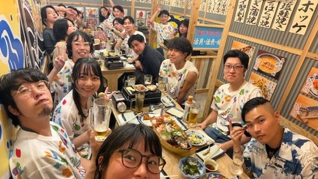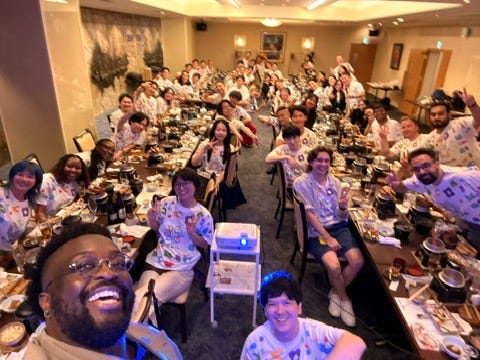

初日のご飯会（業務時間中）

この写真は  
Eukaryaの人たちとのご飯会に、突然、外からウェイウェイ〜みたいな感じに参加してきた来年の[FOSS4G Bristol](https://2027.foss4g.org/about/foss4g)の実行委員会の人  
ドイツ人だけど、イギリス住んでいる時間の方が人生で長くなったよーみたいなことを言ってた気がする

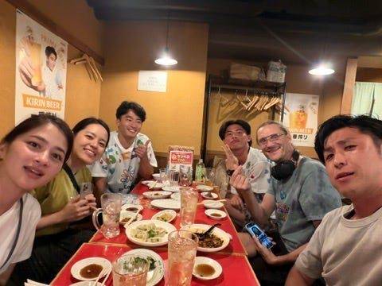

（業務時間中）

#### まとめ

めっちゃハードスケジュールだったけど、久しぶりに広島に住んでいる友達に会えたり、[**エニタイム**](https://www.anytimefitness.co.jp/anacrowneplazahotelhiroshima/)を使いまくったりと満喫できた😏

[**お好み焼き**](https://maps.app.goo.gl/cN4whtSMR6ZhPTM66)と[**スイカバー**](https://www.lotte.co.jp/products/brand/suikabar/)美味しかった😋

Eukaryaの共有アルバムを見ていると  
ちょくちょくアキさんが出てくきます😱  
どこまで参加しているんだ

みんなお疲れ様〜〜☺️

#### おまけ

テキパキと仕事をこなすArakawa・Akiraなどなど  
一番左は寿司担当大臣として３番手を守っているArakawa  
真ん中はどうしようもなくなったAkira  
一番右は急な事態にも臨機応変に対応しているようなArakawaだ  
どれも自体の深刻さを物語っていると思い抜粋させてもらった🙃

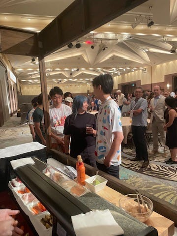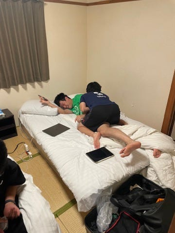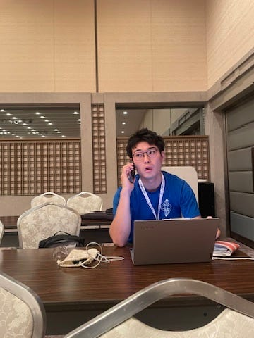

🍣👐👨‍💻

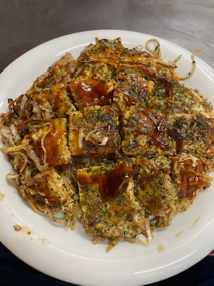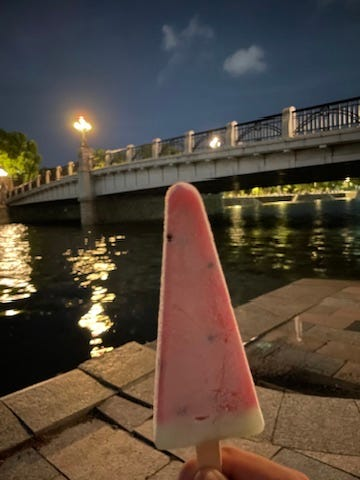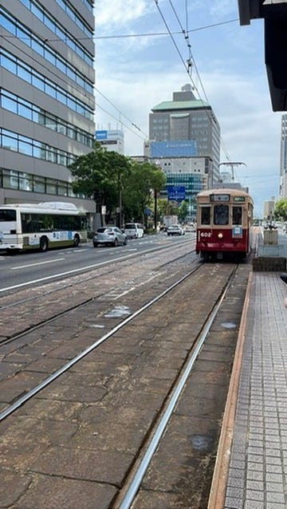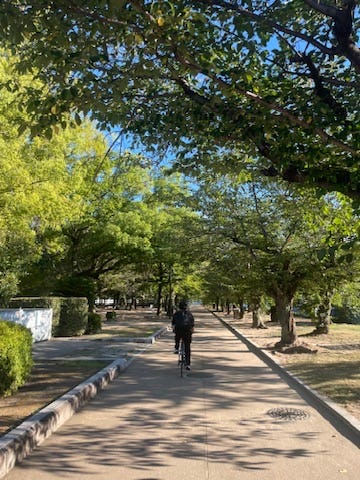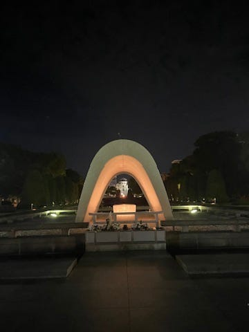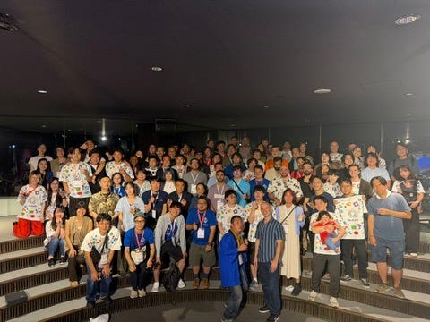

---

[食べて寝て走って元気満々国際会議](https://medium.com/furuhashilab/foss4g-hiroshima-2026%E5%8F%82%E5%8A%A0%E6%97%A5%E8%A8%98-e897e27c1f4b) was originally published in [Furuhashi(mapconcierge)Lab.](https://medium.com/furuhashilab) on Medium, where people are continuing the conversation by highlighting and responding to this story.
