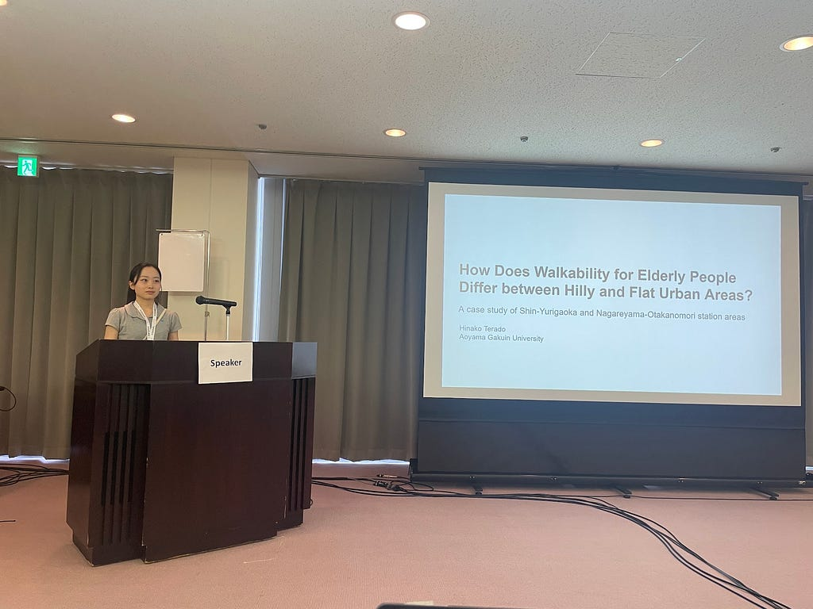
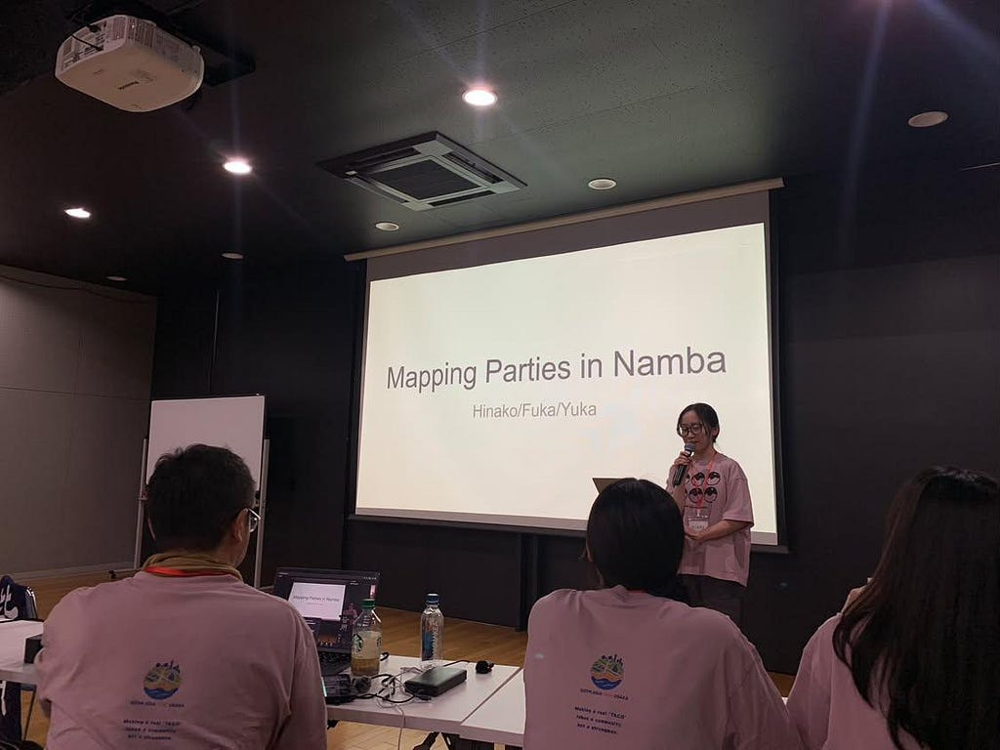
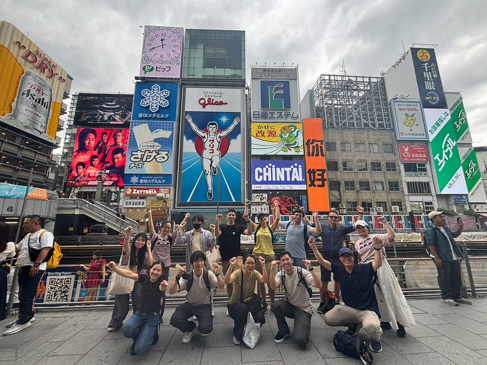
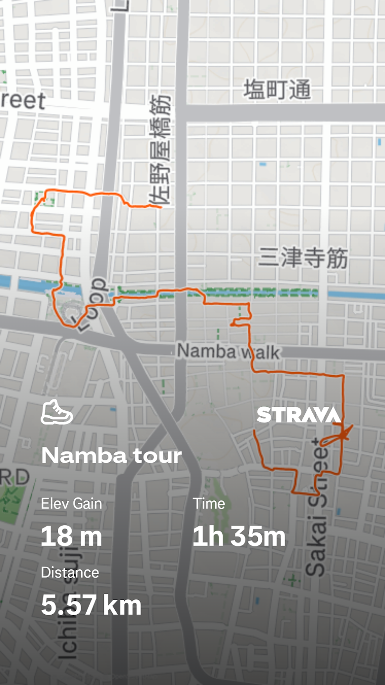

### 参加会議の概要

#### **FOSS4G Hiroshima 2026**

2026年8月30日〜9月5日に広島で開催された、オープンソース地理空間技術に関する世界最大級の国際カンファレンスです。テーマは **「Bridging Geospatial Technology and Humanity」**。GIS、地球観測、オープンデータ、都市・防災、人道支援などをテーマに、世界各国の開発者・研究者・実務者が集まり、ワークショップ、研究発表、コミュニティスプリントなどが行われました。

#### **State of the Map Asia 2026 Osaka（SotM Asia）**

2026年9月6〜7日に大阪・中崎町で開催された、OpenStreetMap（OSM）のアジア地域カンファレンスです。アジア各国を中心とするマッパーやコミュニティが集まり、OSMの活用、人道支援マッピング、オープンデータ、Civic Tech、防災・地域レジリエンスなどについて知見を共有しました。

### **なぜ参加したのか**

FOSS4GはFree and Open Souse Software for Geospacialというオープンソースの空間情報に精通した学者や企業の方が多く集まる世界最大の国際会議で私も発表したい！という思いから論文を書いて提出した。

Academic Trackで私が関係した論文が２本採択された！

一つは、卒業研究である高齢者にとって歩きやすい道を都市の街路ネットワークと勾配で評価した。始めは、テーマが固まらなかったが、都市空間を定量的に評価する手法と研究対象地がマッチしたことから試行錯誤をしながら研究を進めた。その中で、GISツール（QGIS）はたくさん使い基礎から応用まで鍛えることができた。

もう一つは古橋先生との共同研究で、ミラノの教会の向きについての研究だ。私は主にOSMで教会の入口が不足していた場所がいくつかあり、Mappilaryの画像を利用して入力作業を行った。また先生の検証を評価するために、実際に教会の向きを測るWebページを作り妥当性検証を担当した。最初は教会の向きについて調べ、どのように測れば良いかわからずQGISで手順を確認しつつ、それを元にAIを利用して詳細なプロンプトを投げてWebページは作った。

### **発表**

#### How Does Walkability for Elderly People Differ between Hilly and Flat Urban Areas?

A case study of Shin-Yurigaoka and Nagareyama-Otakanomori station areas

目的：勾配のある新百合ヶ丘駅と比較的平坦で新しい流山おおたかの森駅でSpace Syntaxを利用して街路ネットワークと勾配を重ね合わせて高齢者にとって歩きやすい道を定量的に抽出し、現地調査で実際の歩行環境と照合して評価する。

質問・コメント：

* Space Syntaxの計算方法について
* 流れがありふれた研究になってしまっていて勿体ない。

<https://medium.com/media/f5cac071aa1aff1ec71229e3591e10b3/href>

#### **印象に残った発表**

#### Digital Transformation in Railway Infrastructure-**“How JR West Democratized Geospatial Data to Tackle the Technical Succession Crisis”: Hirofumi Hayashi(Speaker)**

JR西日本が直面している人手不足・熟練職員の退職による技術継承問題に対して、GISを使って鉄道インフラ情報を共有しやすくした事例

#### **Scaling Open 3D City Models: Implementation and Validation of an AI-driven Automated Generation Tool “AI City Model Maker beta version”: Realglope(Masahiro Shinoda)**

PLATEAUの3D都市モデルを、画像・DEM・点群とAIを使って建物・道路・都市設備・植生まで自動生成／更新する研究

#### **A Pipeline for Low-Cost Wide-Area 3D Mapping Using LiDAR-Equipped Mobile Devices and Open Data: Ryosei Ueda(大阪公立大学大学院)**

iPadなどのLiDAR搭載モバイル端末で取得した複数の点群をRegistrationしてつなぎ、オープンデータを使ってGeoreferencingし、低コストで広域3Dマップを構築する研究

#### **国際会議だからこそ得られたこと**

私が修士で研究したいことは国際会議で似たような感じで発表していた。企業で行なっているようなことは、研究で行ったとしても勝てないので、様々な事例や論文を読んだ上で自分なりの独自性を出すことが重要だと感じた。また3D関連の研究が多い印象があった。

コミュニティの雰囲気は去年のフィリピンと似た感じで、古橋研究室に入らないと体験できない世界だと改めて実感した。久々にGIS業界の雰囲気を感じることができて楽しかった。

今回出した卒業研究は、力を入れて取り組んだが、本当に研究したいことかわからない状況であり、その結果、コメントの指摘があった。私自身も面白い研究ではないと感じつつ締め切りに合わせる必要があり今回の結果に至ったと思う。

しかし、この研究があり、本当にやりたいことは何かと考えるきっかけにもなったのでゆっくりではあるが、修士での研究内容を具体化し始めている。次、国際会議で発表する機会があれば、わかりやすく自信を持った内容の発表ができるように頑張りたい。

### State of the Map Asia 2026 Osaka

SotM Asiaでは、アジア理解の授業としてMapping Partyの企画を行った。私は、ふうかさんとなんば街歩きツアーを企画し、Wheel Chairのマッピングを行った。

Mapping Partyとしての結果は、10名の方に参加していただき企画としては成功したイベントになったと思う。一方で、マッピングイベントではありつつ、街歩きツアーの要素を追加したことでマッピングに注力できない状況になってしまった。

Mapping Partyではあまり広範囲を対象とせず、ゆっくりと話しながら行うようで、広範囲の移動ルートを設定したことが今回のイベントの課題出であった。しかし、最後は残った参加者さんと一緒にお好み焼きを食べ、交友を深めることができたと思う。

その後の成果発表では、FOSS4Gでのスクリプトガン読み問題を活かして、スクリプトは見ず、自分の言葉で説明するようにした。辿々しい英語ではあったが、FOSS4Gでの課題をSotMで実践できる機会がありとても良い経験になったと思う。

<https://medium.com/media/f3d76637a40a9b409e6263fc99d47056/href>

### まとめ

１週間という長い期間、国際会議に参加し、様々な感情や経験をすることができて有意義な時間を過ごすことができた。FOSS4Gでは論文の発表やISPRSへの掲載、Travel Grantsの選出、出会いなど、大きな成果を得ることができた。SotM Asiaでは、Mapping Partyの企画から運営までを経験し、非常に良い体験だった。大学最後の年に、このような経験をすることができてとても良い思い出ができ、大きな成長に繋がると思う。

### Strava

[Namba tour | ハイキング | Strava](https://www.strava.com/activities/20055066361)

---

[FOSS4GとSotM Asia 2026 Osakaで発表してきた](https://medium.com/furuhashilab/foss4g%E3%81%A8sotm-asia-2026-osaka%E3%81%AB%E5%8F%82%E5%8A%A0%E3%81%97%E3%81%A6%E3%81%8D%E3%81%BE%E3%81%97%E3%81%9F-680c1124f8b1) was originally published in [Furuhashi(mapconcierge)Lab.](https://medium.com/furuhashilab) on Medium, where people are continuing the conversation by highlighting and responding to this story.
