こんにちは！

佐藤愛妃です！[FOSS4G Hiroshima 2026, Japan](https://2026.foss4g.org/ja/) 、[State of the Map Asia 2026 Osaka](https://stateofthemap.asia/)にボランティアとして、いって参りました！超、楽しかったです（ピース）

FOSS4Gではボランティアスタッフとしてイベント運営を支え、SotM Osakaでは登壇者として発表するという、異なる立場からコミュニティに関わる貴重な機会になりました。

### FOSS4G Hiroshima 2026

📍開催地

* [夕方のウォーキング | Strava](https://www.strava.com/activities/20002774164)

#### 🚌 広島までのバス移動 野生の古橋先生があらわれた！

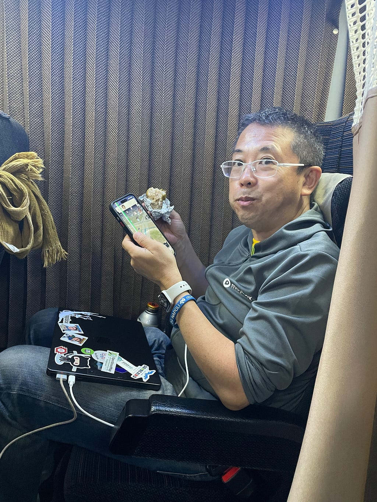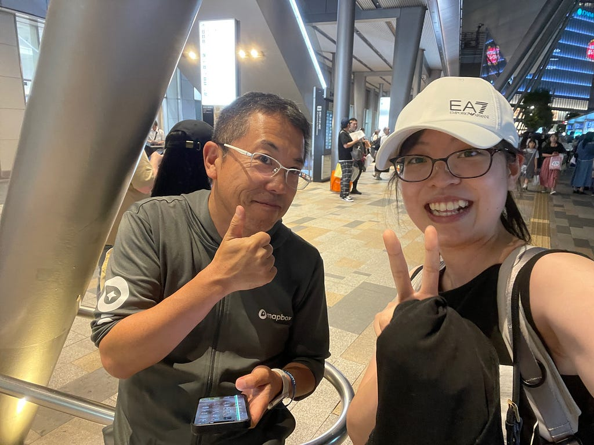

まさかの夜行バス乗り場でレアポケモン古橋先生と遭遇。我らがボスとまさかの席まで隣だった。ランダム席で隣は引き強すぎる笑笑

海老名SA名物のメロンパンラスト一個ゲットしたぜ。

#### 🙋 ボランティア活動

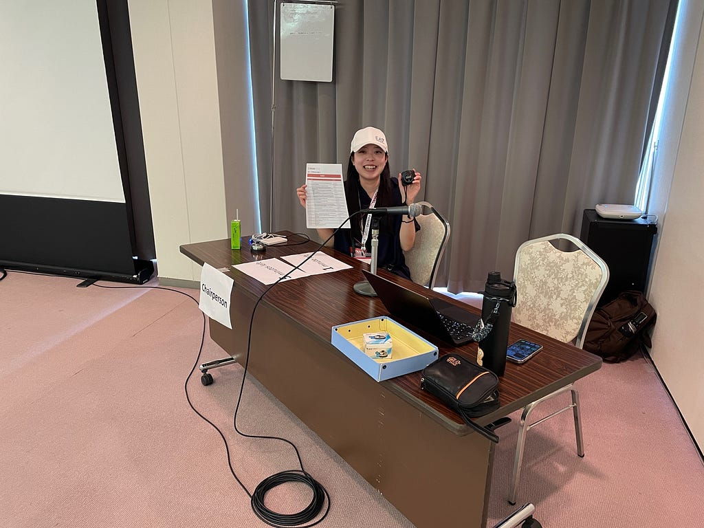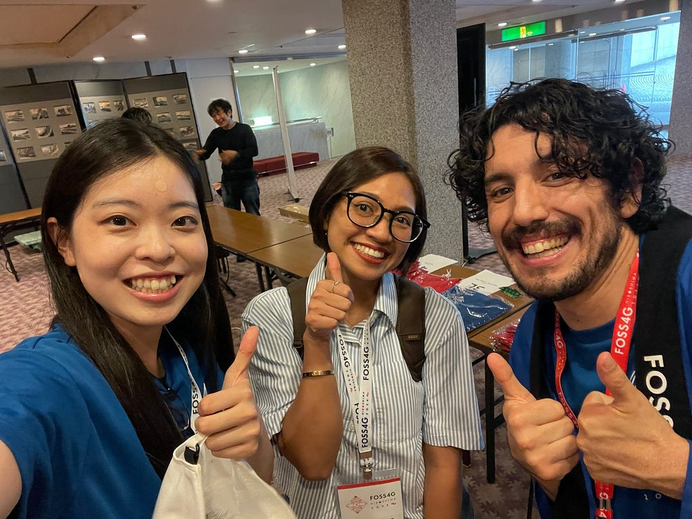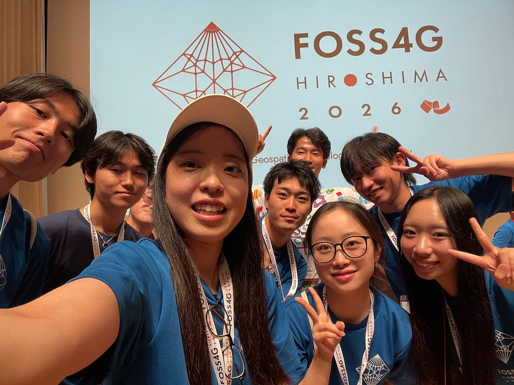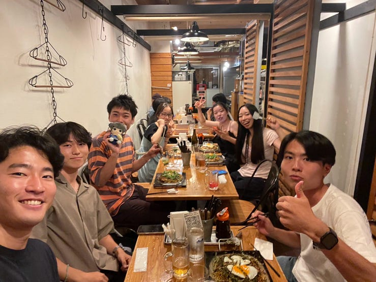

印象に残ったのは、照明で入っていた部屋でまさかのChair失踪したとき。ピンチヒッターでSession Chairに入った。まあまあ良くあるらしい。まじか笑

ちなみに、最終日は登壇者も帰ってしまっていた。びっくり。

#### ☕ 昼休み・交流&🌙 懇親会

仲良くなったお茶、駒沢大学の地理学専攻のお姉さま方とこんど女子会開くことになりました。10月のどこかで決まったら声掛けます。なかなか日程合わず調整中。来てね✌

### SotM Osaka 2026

### excursion@Kyoto,Ginkakuji

全員日本人でした笑笑 古橋先生の旧友（青学でも授業持ってる三浦先生です）現る。

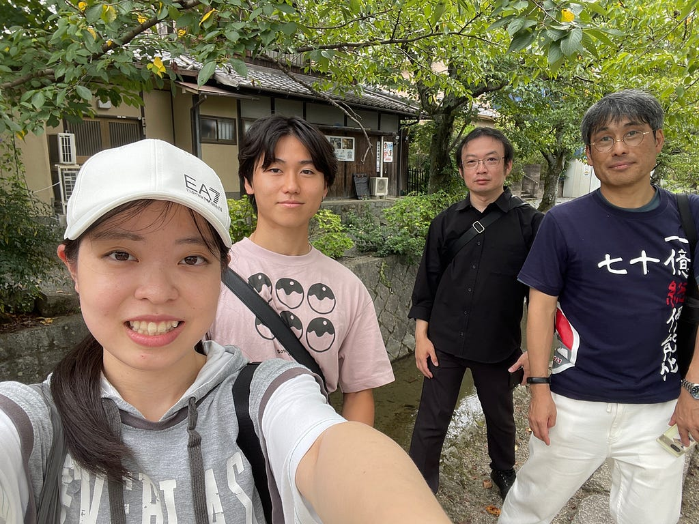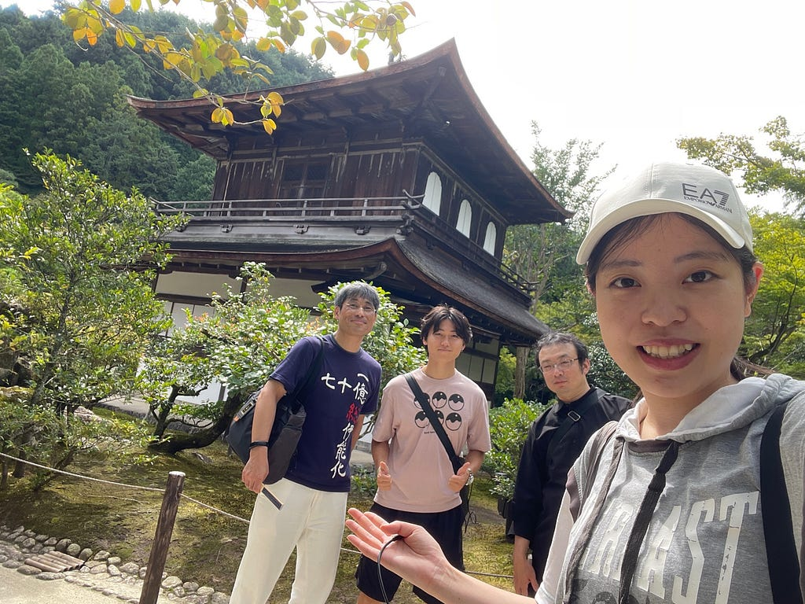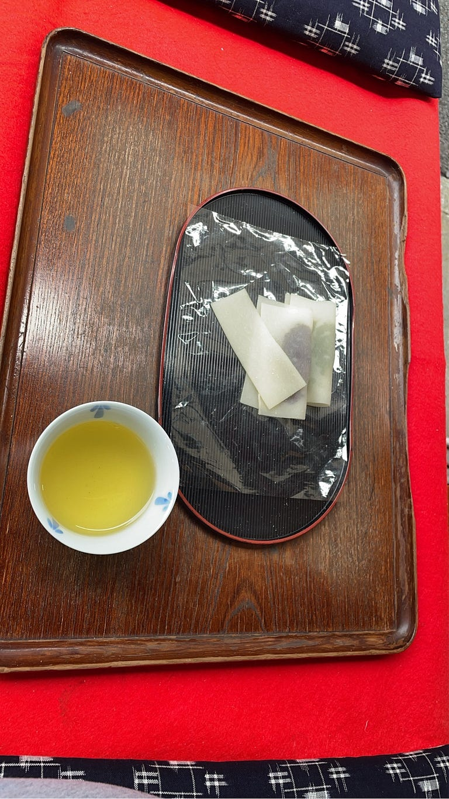

発表もしました。本吉顕ありがとうよ。

[マッピングパーティー2026 | Strava](https://www.strava.com/activities/20054962697)

橋の名前が本当に読めなかった。「若王子橋→みゃくおおじはし」日本語って難しいね。

AManToさん、ありがとうございました！

#### 🌎打ち上げ：ゆるにば（ゆるいユニバ）🌎

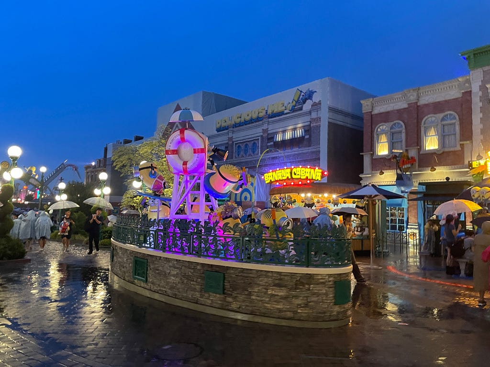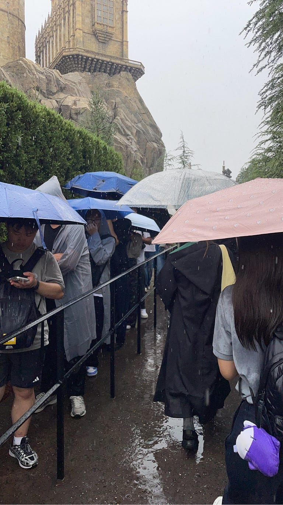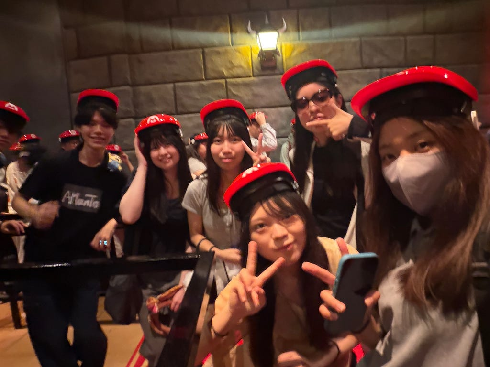

早起きしたり、走ったり、急いだり全部禁止のユニバ。ゆるいよー、びっくりするくらいゆるくて楽しかった。主催者が私なので激ゆる。

ちなみに、団体行動しつつシングルライダーで乗車したよ。待ち時間半分にできた。ハリポタとマリオ、ミニオン楽しかった。

#### ✌ Thanks ✌

みんな、ありがとう

お好み焼きおいしいね

呉にも行った

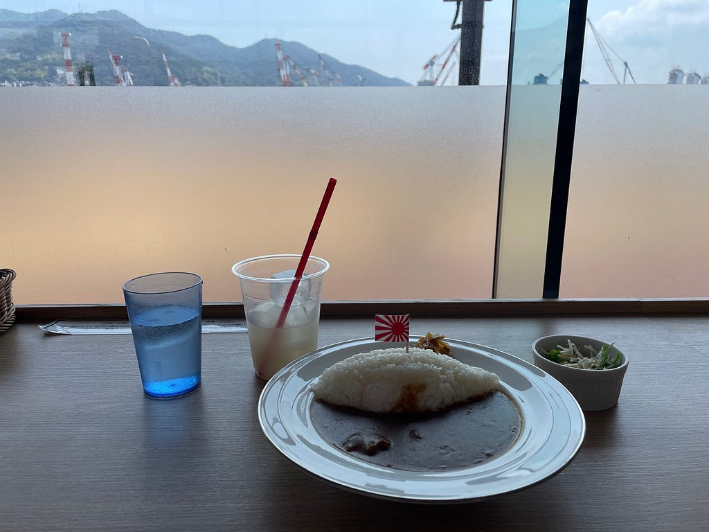

---

[お好み焼きはしご旅～FOSS4G2026広島＆SotM Osaka 2026～](https://medium.com/furuhashilab/%E3%81%8A%E5%A5%BD%E3%81%BF%E7%84%BC%E3%81%8D%E3%81%AF%E3%81%97%E3%81%94%E6%97%85-foss4g2026%E5%BA%83%E5%B3%B6-sotm-osaka-2026-789e710f00d2) was originally published in [Furuhashi(mapconcierge)Lab.](https://medium.com/furuhashilab) on Medium, where people are continuing the conversation by highlighting and responding to this story.
