お疲れ様です！  
実は自分、FOSS4GIS Hiroshimaだけでなく、SotM Asia 2026 Osakaの運営もしてたのです🤭

#### なぜすることになったか

大学必須の留学プログラムに行かなかったため、4年生の前期にアジアを理解しようという講義（アジア理解）を受けることに。

担当は各生徒が所属するゼミの先生→古橋先生

ってことでSotM Asia 2026 Osakaの運営チームになりました🙃  
チームメンバーは  
**Hinako、Fuka、Akira、Rito、Aki**です。

#### 何をしたのか

私たちの担当はエクスカーションの運営になりました！！  
みんなで特定のものに対してマッピングパーティを行いました  
何をマッピングするのか悩みに悩んだ末

**ポケモンのマンホールをマッピングしてみよう**となりました

幸いなことに東大阪市にあるポケふた（マンホール）はまだマッピングされてない！！  
そしてさらなる課題としてポケふたを登録する際のルールが統一されてないこと

#### **ここが問題！！！**

* **タグの不統一**:同じ種類の対象(デザインマンホール)なのに tourism=artwork だったり man\_made=manhole だけだったり、ノードごとにバラバラ
* **man\_made=manhole 単体だとレンダラーで表示されない**:Organic Maps/Maps.Meで実際にラベルが出ないことを確認
* **artist\_name の誤用**:自治体(発注者)を artist\_name に入れてしまうケースがある
* **英語名の付け方が不統一**:キャラ名の英語表記(現行の一般的な名前 vs 古い吹替名)がバラバラ
* **複数キャラのポケふたの扱い**:1ノードに複数キャラをどう入れるか未整理

#### **入力必須ルール**

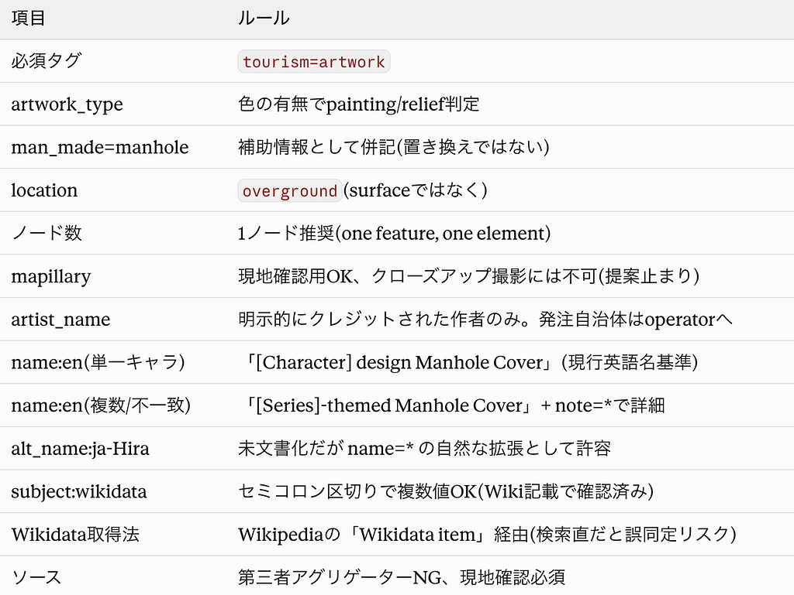

[**こちらにファイルがあります**](https://drive.google.com/drive/folders/1z7s1L4A4ZUiw5rAqGoyfuEpbPFRJQtix?usp=sharing)

#### 実際のエクスカーション

参加者は２名！初めてだったので、そんなに多くならなくてホッとしました。  
参加してくれた人にはポケモンシールを贈呈して、ポケモンの名前で呼び合うことでより、ポケモンの世界に入り込んだマッピングパーティの完成！

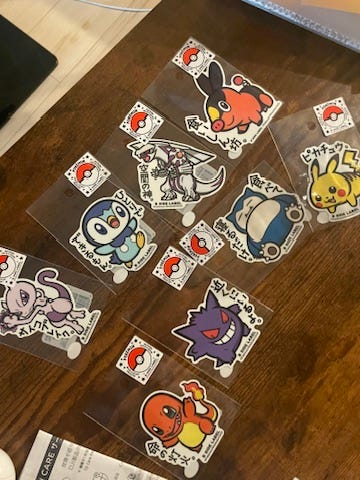

参加者の方の方がマッピングパーティーの経験が豊富だったため、教わることがたくさん👏

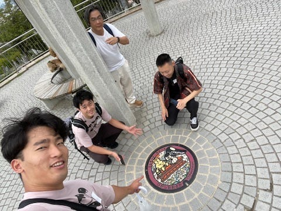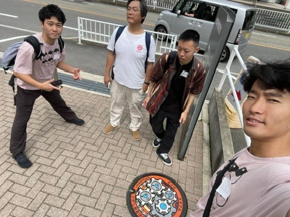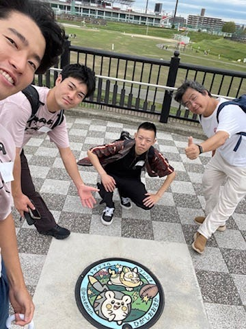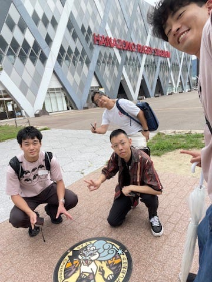

ポケふただけでなく、自動販売機、古墳、神社などなど、たくさんマッピングを行いました。

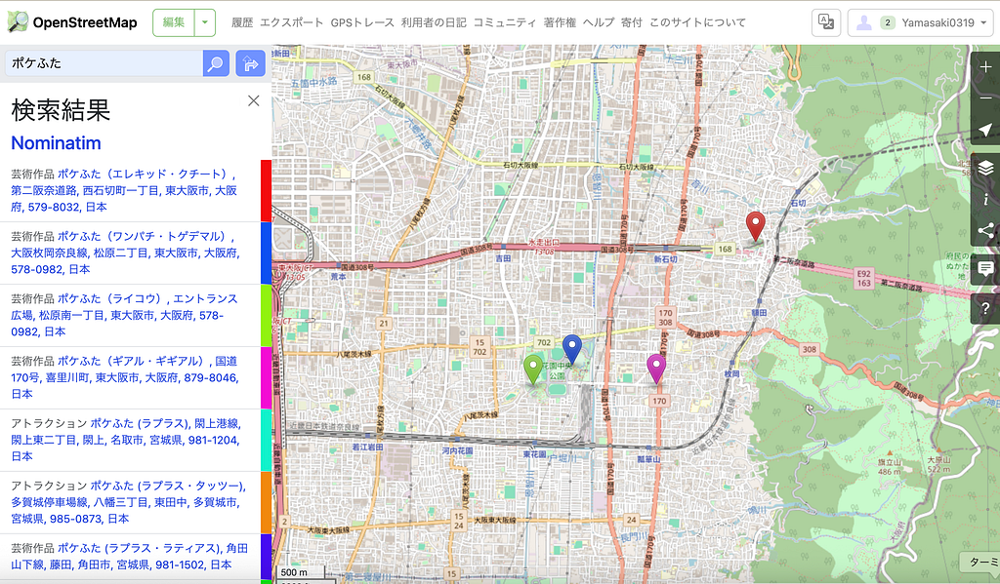

マッピングしたポケふた

実際にマッピングしたポケふたのリンクを１つ[**こちらに**](https://www.openstreetmap.org/node/9518474845#map=19/34.667721/135.640229)

#### **芸術作品として登録した理由**

**tourism=attraction にしなかった理由(意味的正確さ)**

* attraction は自然物・人工物問わず非常に幅広い対象を含む語で、意味的に緩すぎる
* ポケふたは「観光名所」というより「公共アート作品」という認識の方が実態に合う
* Zunyuさんもこの「分類としての正確さ」を理由に artwork を選んでいた

**tourism=artwork にした理由(表示問題の解決)**

* そもそもの発端は、man\_made=manhole 単体(+manhole=yes)だとOrganic Maps等でラベルが表示されないという実務上の問題
* Gillesさんの町田・芹ヶ谷公園での編集(man\_made=manhole→tourism=attractionに変更、コメント「Changed feature type so it would show up on maps.」)が、この表示問題を裏付ける一次証拠になった
* で、「attractionでも表示は直るけど、意味的にはartworkの方が正確」という2つの基準を天秤にかけて、artwork\_type等で表示も担保できることを確認した上で artwork を採用した

#### エクスカーションの感想

個人的には洪水対策などで段々とわざと浸水するように設計している  
東大阪市花園ラグビー場周辺がテンション上がりました

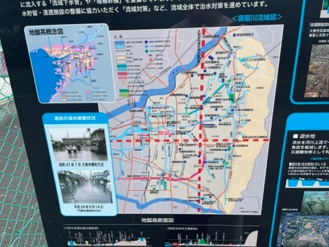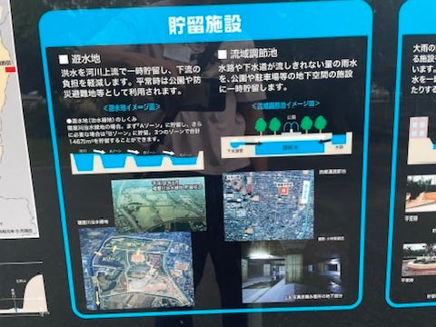

#### 全体の復習

国際会議を運営して、エクスカーションを自分で計画して実行するという貴重な経験を通して、計画を立てることや、時間や人をマネージメントすることの難しさを痛感しました。  
その分、無事に終わった後の達成感を味わえてよかったです。

#### 感謝

ポケふたのガイドラインを作成する際に協力してくださった  
Gillesさん、Zunyuさんに改めて感謝をして終わりたいと思います。  
ありがとうございました。

#### おまけ

運営が忙しく、大阪を満喫できてない！！ってなり  
飛行機の時間が迫る中、一気に食べたため、飛行中は少し気持ち悪くなったりしちゃったり😵美味しかった😋

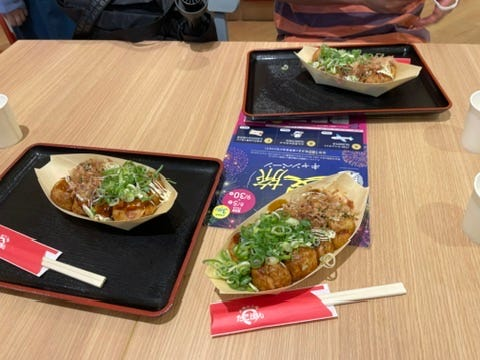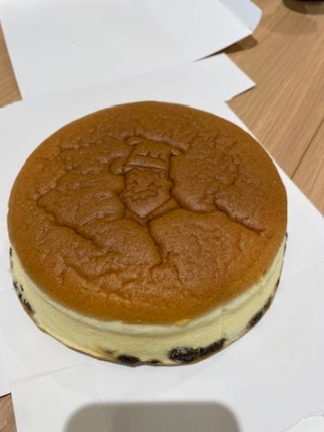

---

[ポケふたマッピング！！](https://medium.com/furuhashilab/%E3%83%9D%E3%82%B1%E3%81%B5%E3%81%9F%E3%83%9E%E3%83%83%E3%83%94%E3%83%B3%E3%82%B0-f4a449658f94) was originally published in [Furuhashi(mapconcierge)Lab.](https://medium.com/furuhashilab) on Medium, where people are continuing the conversation by highlighting and responding to this story.
