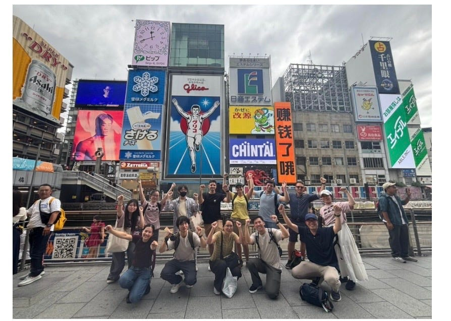
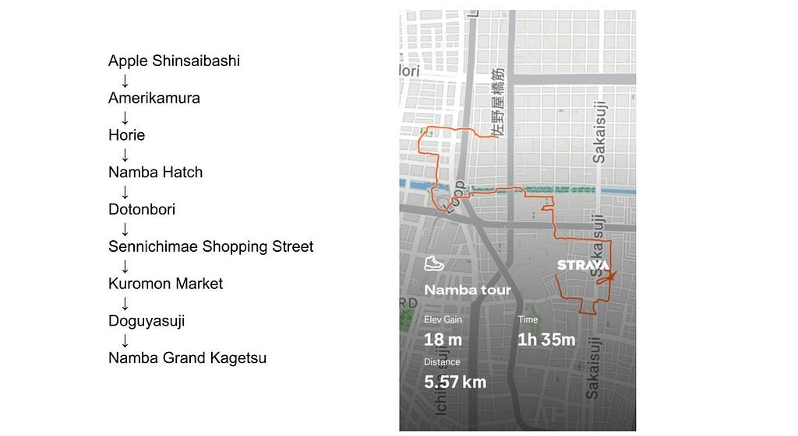
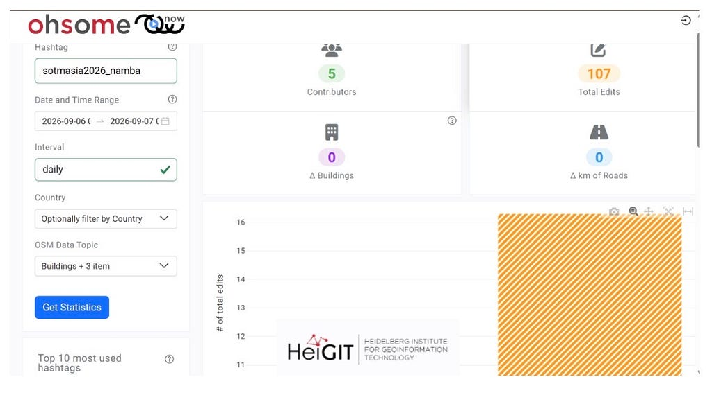

#### State of the Map (SotM) Asia Osaka 2026の開催に合わせて、ひなことNamba Mapping Partyを実施しました。

・[GitHub](https://github.com/sotm-asia/sotm-asia-2026-website/issues/13)  
・[ひなこの活動報告書はこちらから](https://medium.com/furuhashilab/sotm-asia-2026-osaka-%E3%81%AE%E5%A0%B1%E5%91%8A-edf1753fb066)

#### 1.イベントの背景と目的

本イベントの主な目的は、参加者が大阪の街の魅力を肌で体感しながら、バリアフリー情報をオープンデータとして記録・更新することです。特に、飲食店や施設における店舗の段差、スロープの有無、入口のアクセシビリティ情報の収集に重点を置きました。

* 開催日時: 2026年9月6日 10:00集合
* 集合場所: アップル心斎橋 前

#### 2. 参加者規模と属性

募集定員20名に対し、当日は計10名の参加者が集まりました。

* 日本人参加者: 5名
* 海外からの参加者: 5名

SotM Asiaならではの国境を越えた多様なコミュニティメンバーが集まり、国際色豊かな雰囲気のなかでマッピングをスタートしました。

#### 3. マッピングルートと現地調査

現地調査では、アップル心斎橋を起点に大阪の多様なエリアを徒歩で走破しました。

【巡回ルート】 アップル心斎橋 → アメリカ村 → 堀江 → なんばHatch → 道頓堀 → 千日前商店街 → 黒門市場 → 道具屋筋 → なんばグランド花月

* 歩行距離: 約 5.57 km
* 所要時間: 約 1時間35分
* 獲得標高: 18 m

若者文化の発信地であるアメリカ村や堀江から、観光客で賑わう道頓堀、食文化を支える黒門市場や道具屋筋まで、難波周辺の魅力を再発見しながら調査を行いました。

#### 4. 使用ツールと現地でのリアルな使い勝手

現地では、目的に応じて複数のデジタルツールやスマートフォンアプリを使い分けました。

* Wheelmap: 店舗や施設のバリアフリー情報（車椅子の対応状況やスロープの有無など）の入力。
* EVERY DOOR: 店舗属性（営業時間、電話番号、決済方法など）の追加・編集。
* Mapillary & Panoramax: 街頭のストリートレベル写真の撮影・位置情報紐付け。

#### 5.現地で得られた定性的な気づき・エピソード

実際に街を歩きながらデータ入力を行う中で、ツールごとの特性や運用の難易度が浮き彫りになりました。

歩行中の入力難易度: スマホで店舗属性を詳細入力する EVERY DOOR は、歩きながらの操作が想像以上に難しいことがわかりました。一方で、スマートフォンの標準カメラやMapillaryによる写真撮影は、移動中でも比較的スムーズに活用できました。

* データ入力には「立ち止まること」が不可欠  
  正確な属性入力やバリアフリー状況の確認には、安全な場所で立ち止まって作業を行う必要があります。
* 参加者同士の相互サポート  
  初心者へのフォロー体制が課題となる中、参加者の中に Every Door の操作に熟練した方が数名いたため、操作方法を教え合いながら協力して入力作業を進めることができました。

#### 6.データ分析と定量的成果

本イベントで実施された編集作業は、共通ハッシュタグ #sotmasia2026\_namba を付与してOpenStreetMap（OSM）にアップロードされました。編集分析ツール（ohsome now）による統計結果は以下の通りです。

* 集計期間: 2026年9月6日 〜 2026年9月7日
* 貢献者数（Contributors）: 5名
* 総編集数（Total Edits）: 107件
* データ更新の傾向: 建物形状（0件）や道路網（0 km）の新規作成ではなく、既存店舗や施設のバリアフリー情報・属性データ（POIデータ）の拡充に特化した質の高い編集が行われました。

#### 7.学びと今後の課題・展望

今回のマッピングパーティーを通じて、今後のイベント運営に活かせる重要な気づきが得られました。

1. 集団移動の規模とグループ分け  
   今回は10名規模での移動でしたが、都市部の信号待ちなどで列が途切れてしまう場面がありました。10名程度であっても1つの集団で動くのは難しいため、今後は3〜5名程度の小グループに分けて行動する運用が望ましいこと。
2. 初心者のサポート体制の充実  
   今回は熟練参加者の自主的なフォローに助けられましたが、事前のレクチャータイムを設けるなど、初心者が迷わず参加できる仕組みづくりが必要であること。
3. 撮影とデータ入力の役割分担  
   移動中は「写真撮影（Mapillary等）」を中心に捉え、立ち止まったタイミングや立ち寄りスポットで「属性入力（Every Door / Wheelmap）」を行うような、メリハリのある調査プロセスの構築が効果的であること。

---

[SotM Asia Osaka 2026: 難波エリアでのMapping Partyの活動報告](https://medium.com/furuhashilab/sotm-asia-osaka-2026-%E9%9B%A3%E6%B3%A2%E3%82%A8%E3%83%AA%E3%82%A2%E3%81%A7%E3%81%AEmapping-party%E3%81%AE%E6%B4%BB%E5%8B%95%E5%A0%B1%E5%91%8A-86334589be24) was originally published in [Furuhashi(mapconcierge)Lab.](https://medium.com/furuhashilab) on Medium, where people are continuing the conversation by highlighting and responding to this story.
