こんにちは、臼井です。

大学がついに本格的に始まり、今週から週報を書くことになりました……。

我々デザイン部では、前期はYouTubeに上がっている動画を参考にBlenderでカービィを作り、モデリングを学んできました。

いずれはアニメーションにも挑戦したい！と考えていたので、今回からはアニメーションを付ける方法について実際に手を動かしながら学んでいきます。

今回は、モデリング、アーマチュア、スキニングの作業を進めていきます！

参考にした動画は以下になります。

<https://medium.com/media/10798361d23af5ddb8866638f33fad0e/href>

前回の週報で動画の内容を簡単にまとめたので良ければそちらもどうぞ。

[アニメーションを付ける方法を学ぼう！【デザイン部１週報】](https://medium.com/furuhashilab/%E3%82%A2%E3%83%8B%E3%83%A1%E3%83%BC%E3%82%B7%E3%83%A7%E3%83%B3%E3%82%92%E4%BB%98%E3%81%91%E3%82%8B%E6%96%B9%E6%B3%95%E3%82%92%E5%AD%A6%E3%81%BC%E3%81%86-%E3%83%87%E3%82%B6%E3%82%A4%E3%83%B3%E9%83%A8%EF%BC%91%E9%80%B1%E5%A0%B1-ef5c3d94f2f3)

**ちはな**

私は事前に動画を視聴し、記事にまとめていたこともあって今回の作業はスムーズに終わらせることが出来ました。

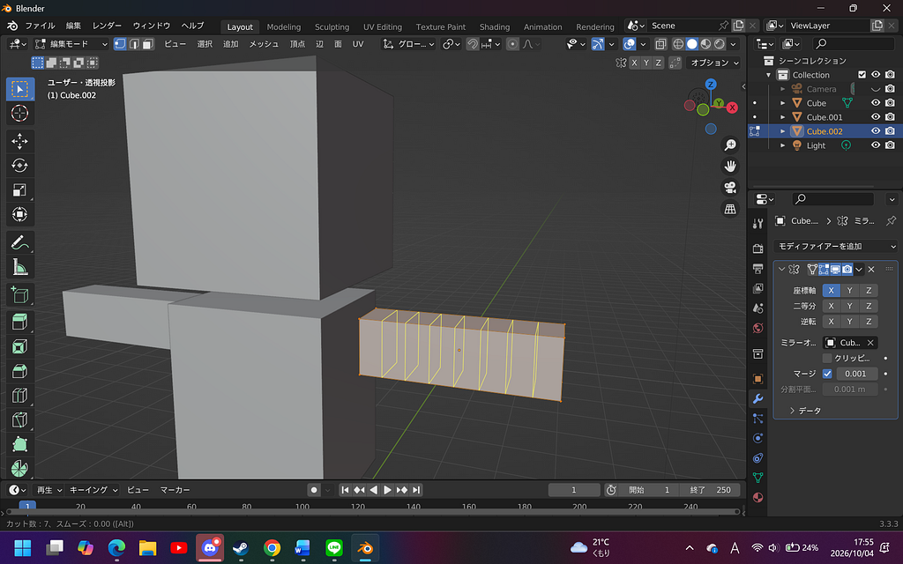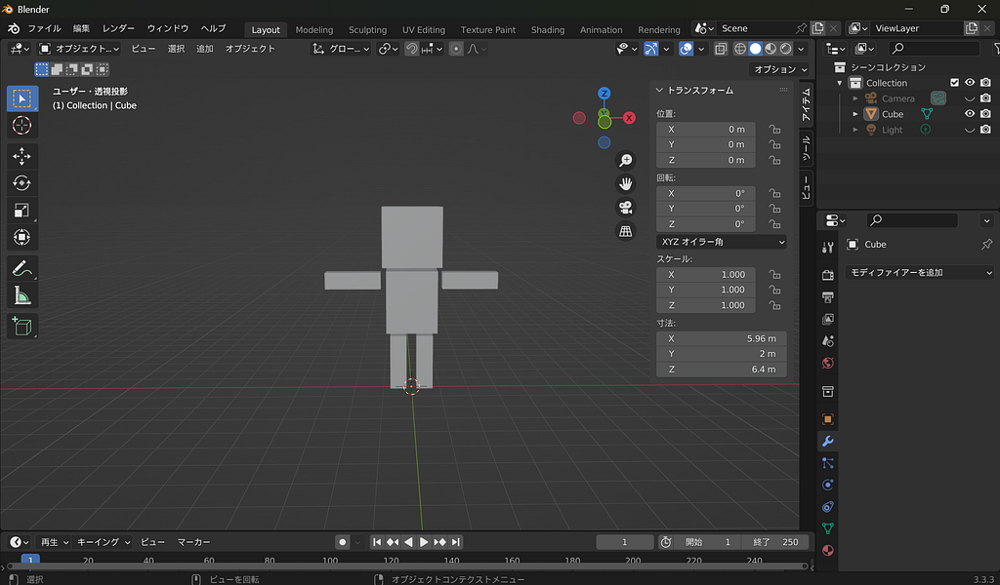

モデリングの様子

モデリングの際にはしっかりメッシュを分割する、トランスフォームを値が0になるようにリセットする、全体を統合するといったポイントを押さえて作業を行いました。

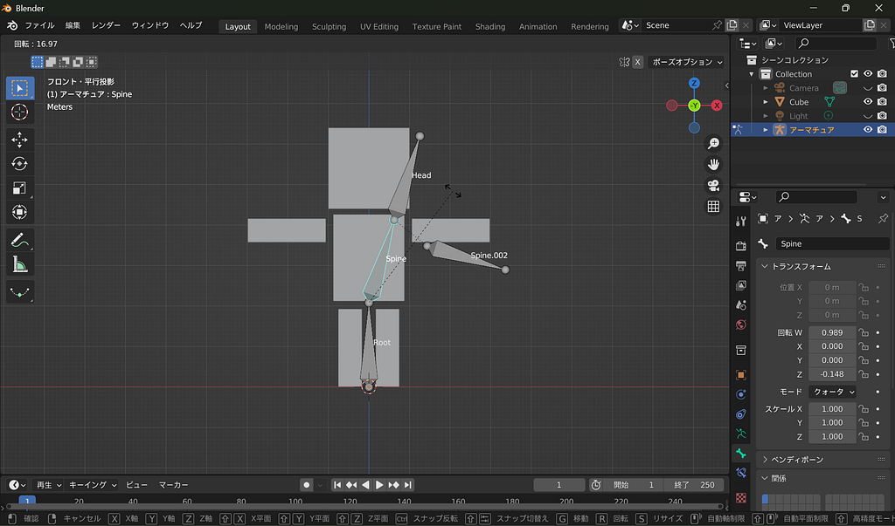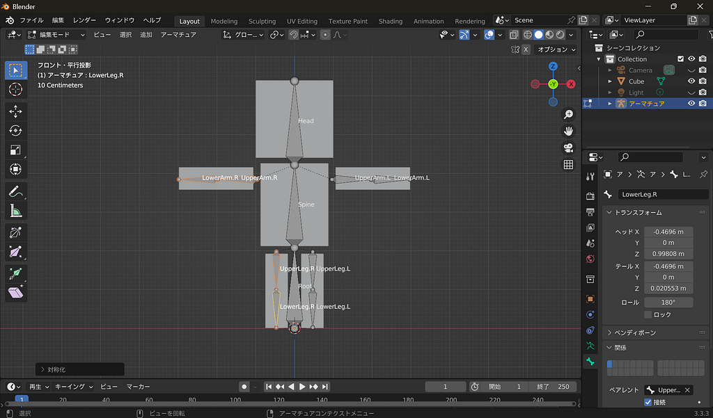

アーマチュアを作る作業

アーマチュアを作る段階では親子関係を確認しながら進め……

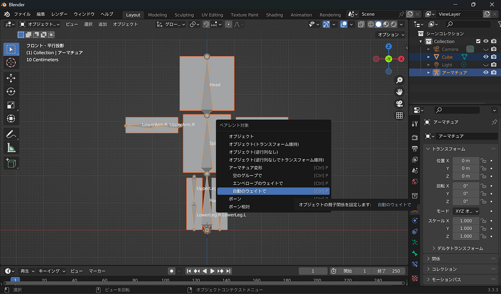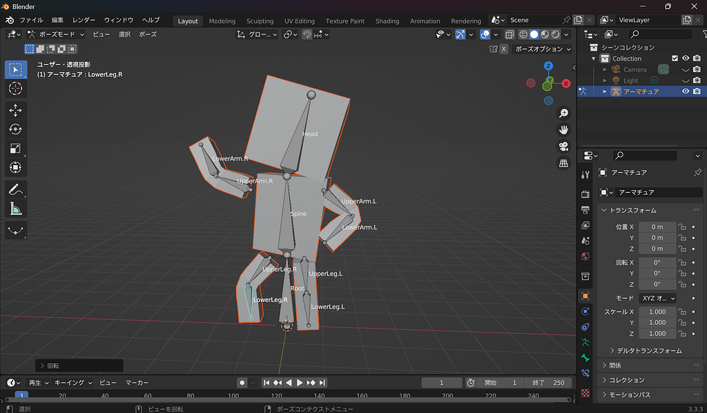

スキニングの様子

スキニングは自動で終わらせたので楽々完了！最後にはポーズも取らせてみました。

ポーズを取らせてみると分かりやすいのですが、自動でスキニングを行ったので、意図しない動きをしてしまっているパーツがあります。(腕や脚につられて胴が動いている)

これについては次回、ウエイトペイントで調整していきます！お楽しみに。

**みあ**

前期のカービィ作成が終わってからBlenderを触っていなかったので、基本操作からまた覚え直しでした。継続が大切だなと身に沁みて感じます。

一つの部分を動かしたときに、どの部分まで連動して動いてほしいかを考えながら設定するのが面白かったです。自然な動きにするためには、骨を入れるだけでなく、それぞれの動きのつながりを意識する必要があることが分かりました。

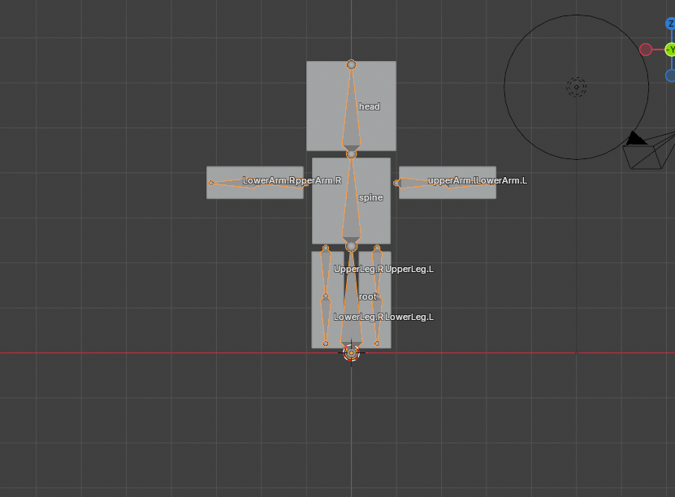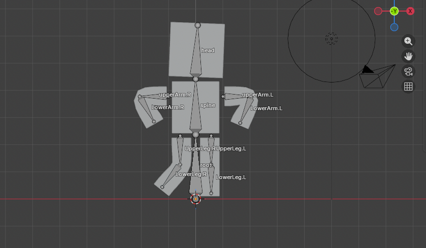

**みひろ**

アーマチュア作成時のポイントを以下のようにまとめました！

①アーマチュアを追加する前に、モデルの位置・向き・中心軸を確認する

→最初のボーンをモデルの中心に配置する！

<やり方>

選択→crt+A→全トランスフォーム

②ボーンはヘッド(根本)を関節の位置に置く

→※ボーンはヘッドを中心に回転する

③「親子関係」を意識。

→※ボーンAと押し出して新しく作ったボーンBは、「親子関係」と呼ばれ、親を動かせば子は動く。逆に、子を動かしても親は動かない！！

<スキニングの仕方>

オブジェクトモード→モデルを選択→shiftを押しながらアーマチュアを選択→crt+Pで自動のウェイトを選択

アーマチュア作業中

スキニング完成

かのこ

後期1発目の今回は、前期でやったモデリングに動きをつけるための作業だったのですが、前期ぶりのBlender ということでかなり操作を忘れているところもあり、基本操作の復習も踏まえて今回は作業しました。

アニメーションをつけるのは初挑戦だったので、初めて出てきた単語をまとめます。

・アーマチュア　キャラクターの骨格のこと。

・ボーン

骨格を形成する骨のこと。根本の丸い部分をヘッド、先端の丸い部分をテールという。キャラクターの関節の位置にヘッドを置く。

・ポーズモード

キャラクターに動きをつける時に使う。　＊骨格を作る時は編集モード。

・リグ

キャラクターを動かすための仕組み全般のこと。

・リギング

リグを作る作業のこと。

・スキニング

骨とモデルの動きを関連づける作業のこと。

モデリングやアーマチュアの作業は特に苦戦するところもなく、クリアすることが出来ました。

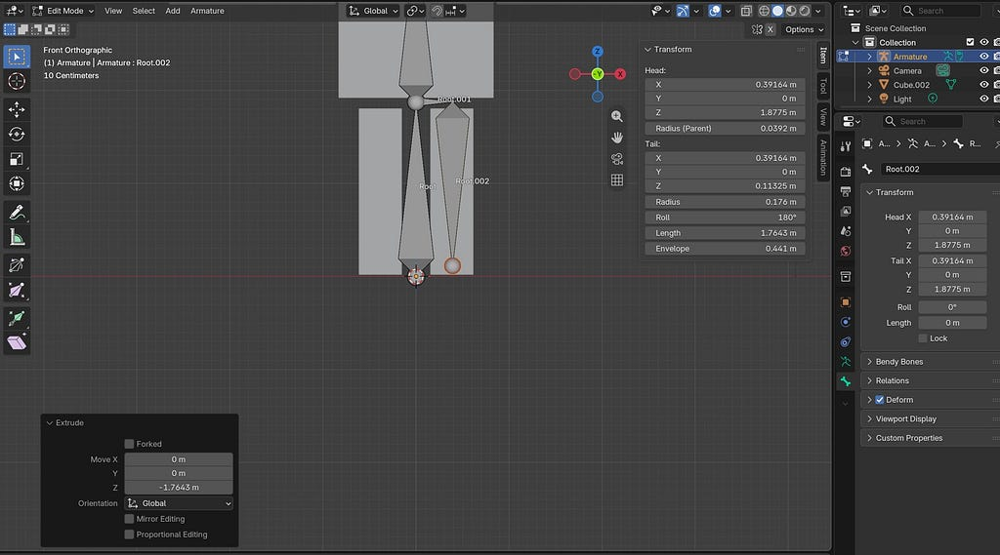

ボーンを増やして骨格を作っていく

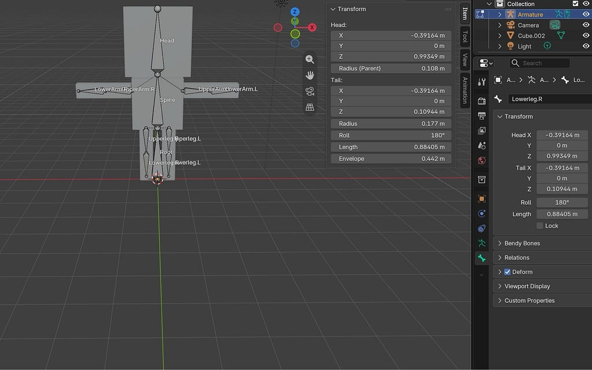

アーマチュア完成

スキニング作業では、自動ウェイト選択をしたいのに、表示されない問題が起きました。動画を再度視聴してみると、モデル選択→Shift を押しながらアーマチュアを選択するという順序だったのですが、この順序が逆になってしまったことでアーマチュアとして認識されなかったのが原因でした。

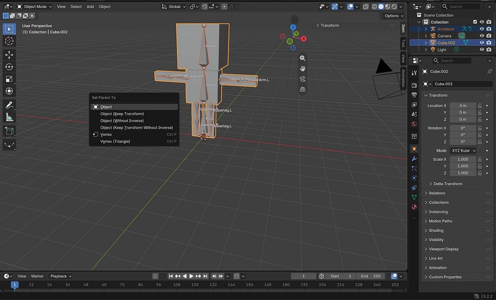

自動ウェイトの欄が表示されていない

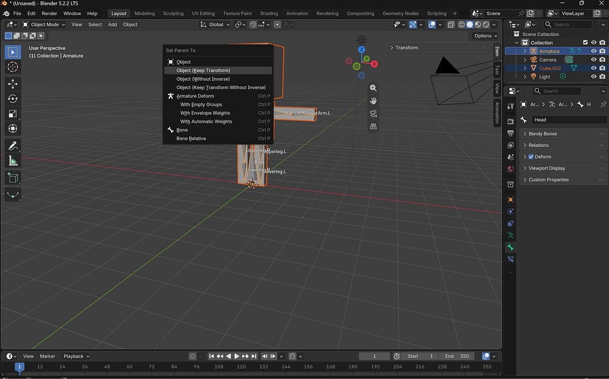

モデル→アーマチュア選択を正しく行うと表示された

そして、今回のところまでの完成形がこちらになります！

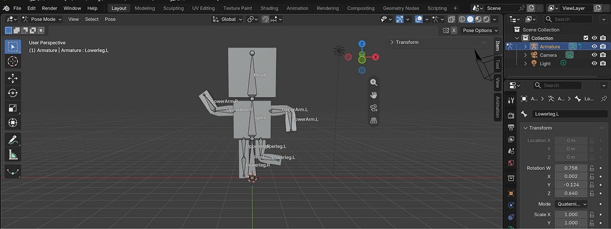

いかがだったでしょうか。

まだキャラクターにポーズを取らせただけですが、アニメーションを付ける作業が近づいてきている感じがして楽しいです。

次回はアニメーションを付ける作業もやる予定なので今からワクワクしています！

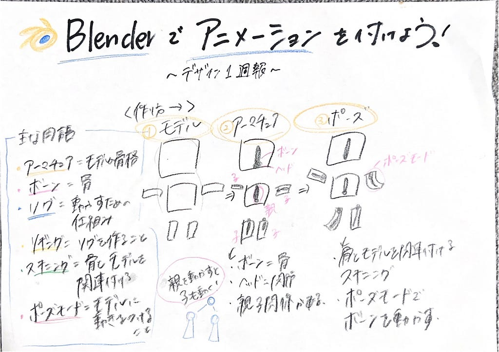

---

[Blenderでアニメーションを付ける方法について学ぶ！Part１【デザイン１週報】](https://medium.com/furuhashilab/blender%E3%81%A7%E3%82%A2%E3%83%8B%E3%83%A1%E3%83%BC%E3%82%B7%E3%83%A7%E3%83%B3%E3%82%92%E4%BB%98%E3%81%91%E3%82%8B%E6%96%B9%E6%B3%95%E3%81%AB%E3%81%A4%E3%81%84%E3%81%A6%E5%AD%A6%E3%81%B6-part%EF%BC%91-%E3%83%87%E3%82%B6%E3%82%A4%E3%83%B3%EF%BC%91%E9%80%B1%E5%A0%B1-bcaba50123c2) was originally published in [Furuhashi(mapconcierge)Lab.](https://medium.com/furuhashilab) on Medium, where people are continuing the conversation by highlighting and responding to this story.
