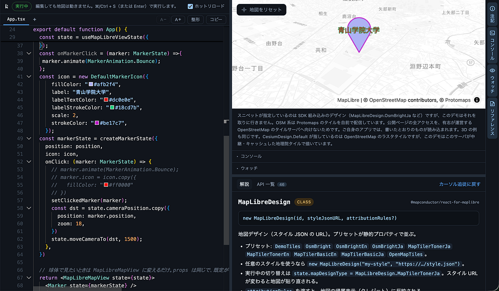
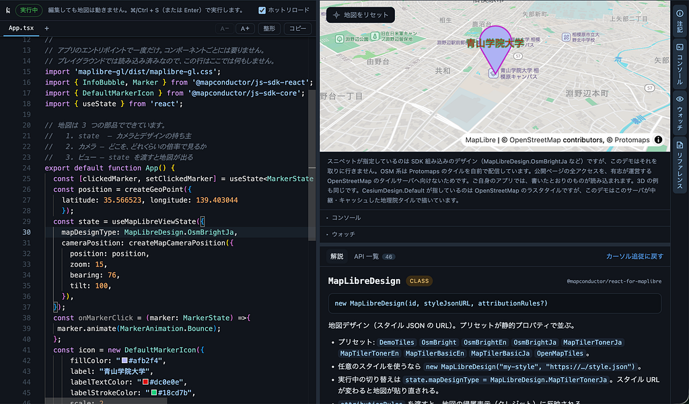
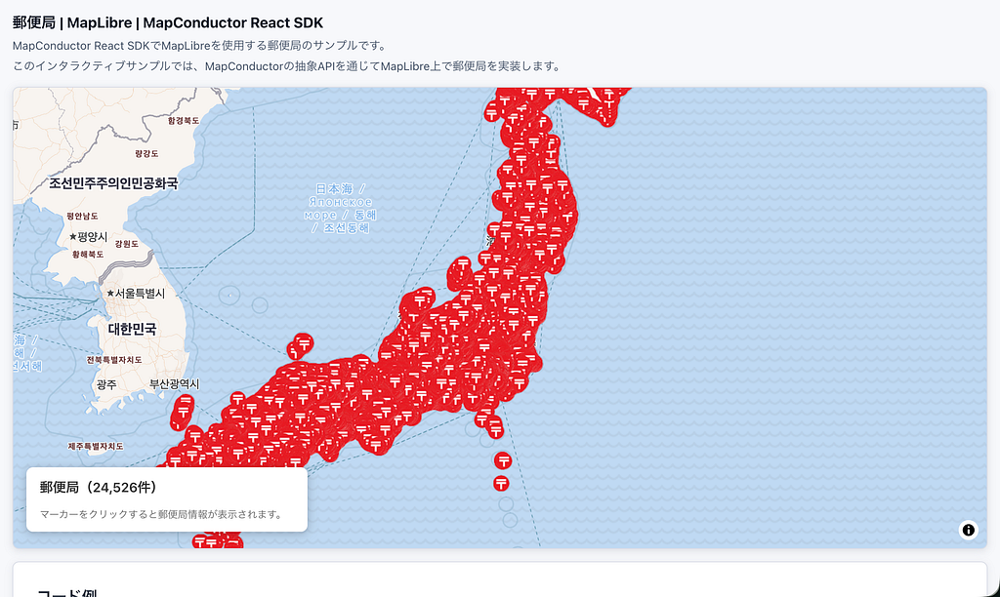

みなさんこんにちは！4年の方の加藤です。横瀬の方から失礼します。2週連続でネタがないので掴みは省きます！！！！！！！！！

唐突ですがみなさんweb地図作ってますか？MaplibreだったりGoogle MapsだったりArcGISだったり色々ありすぎだし、各々のプロバイダごとにコードの書き方が違ったりして嫌になっちゃいますよね。

そんなあなたに！MapConductorを使えば一刀両断！複数の地図SDKを、同じ書き方で扱えるようにすることであなたの悩みも消え去ります！

そんなMapConductorのハンズオンが2026年9月17日に、青山学院大学青山キャンパスのつくまなラボで開催されました。私も参加させていただいたハンズオンの参加レポートです。

> **そもそもMapConductorとは**

MapConductor は、主要な地図SDK を単一のAPIで扱う統一地図SDKです。15のプロバイダに対応し、いまも増え続けています。差し替えてもアプリケーションのロジックは書き換えません。地図機能を持つアプリのコードは、たいてい特定の地図 SDK に深く結びついています。乗り換えたくなったときに書き直すのは地図まわりだけでは済まず、画面のロジックにまで及びます。MapConductor は、その結びつきを 1 枚の共通 API に置き換えます。

まずは様々な地図SDKがある中で、それぞれのSDKによってコードの書き方が異なること。そんな中でMapConductorとはどういうものなのか、MapConductorを使うことでどのような効果が発揮されるのかを教えていただきました。


例えば、Google MapsではこのアイコンのことをMarkerと呼んでいますが、ArcGISだとPointと呼んでいたり、地図においては基本的なものでもSDKのにより微妙に呼び方が異なっているのです。そういう違いをMapC onductorがその差分を共通化してくれるのです。

> **手を動かしてみよう**

概要を理解したところで、次に実際に手を動かして理解してました。

MapConductorを使って実際に地図上にMarkerを出す方法、そのMarkerに色をつけたり、文字を書いてみたり、基本的な使い方を教えていただきました。



地図デザインもすぐ変えられる

基本的な書き方を教えていただいた後は、MapConductorのDemoサイトを使って実際の使用例を体現的に教えていただきました。



例えば、全国約25,000件ある郵便局も、一件ずつ

```
<Marker />  
<Marker />  
<Marker />  
...
```

みたいな感じで何万件も並べると莫大な処理が発生してしまいますが、ここでは

```
<Markers states={postOfficeMarkers} />
```

と配列で渡すことで処理を軽くすることができるのです！

今回このようなハンズオンに参加してみて、そもそも実際に地図SDKごとに性格が異なり、その性格の違いで生まれる差分をMapConductorが解消してくれるということ。そして、MapConductorが単なるラッパーではなく、仮想的な地図SDKとして足りない機能を自分で描いて埋めるため、プロバイダを変えても見た目と挙動が揃うということを学びました。

実際に卒論でも応用できそうな内容だなと感じたので、今回の内容を踏まえつつ方向性を考えていきたいと思います！


---

[MapConductor ハンズオンに参加した件](https://medium.com/furuhashilab/mapconductor-%E3%83%8F%E3%83%B3%E3%82%BA%E3%82%AA%E3%83%B3%E3%81%AB%E5%8F%82%E5%8A%A0%E3%81%97%E3%81%9F%E4%BB%B6-e27eb375ab67) was originally published in [Furuhashi(mapconcierge)Lab.](https://medium.com/furuhashilab) on Medium, where people are continuing the conversation by highlighting and responding to this story.
