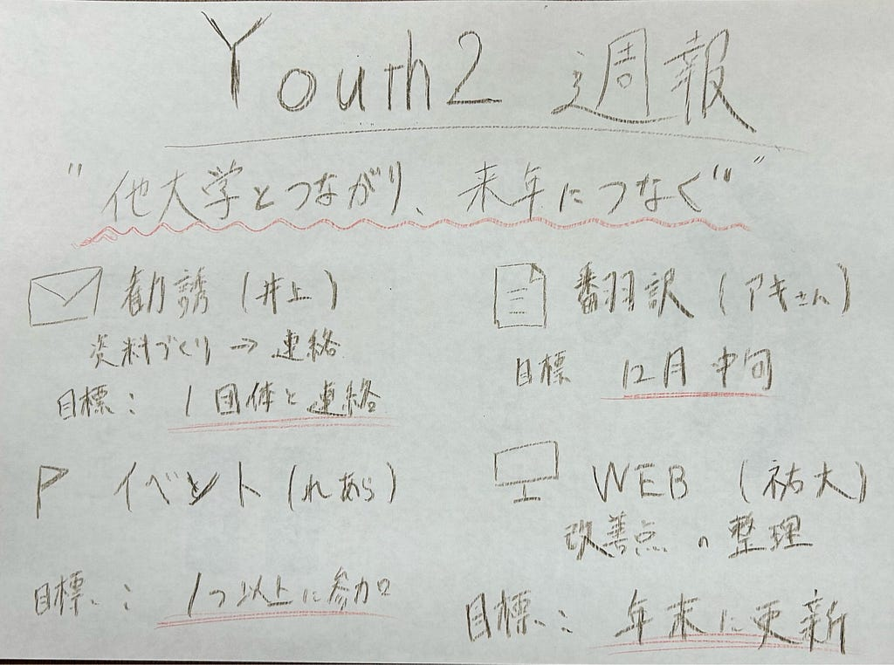

こんにちは、4年の井上です。先日、サッカー日本代表久保建英選手と、福原遥ことクッキンアイドルまいんちゃん(⁉)のご結婚が発表されました。おめでとうございます！私たちの幼少期を彩ってくれたまいんちゃんの結婚相手が、あのスペイン人というのはなんだかとても不思議な感覚がします。

さて、今週の週報では後期の活動目標と、計画を紹介します。後期の目標は、「**他大学とのつながりを広げ、来年以降も継続して活動できる土台をつくること」**で、

「他大学への勧誘」「翻訳作業」「イベント参加」「WEBページの更新」

後期も上の4つを柱に活動します。

> ***他大学への勧誘｜担当：連成***

他大学の学生団体などにYouthMappersの活動を知ってもらい、参加や連携について相談できる関係をつくります。

まずは勧誘文面と説明資料を作成し、相談候補を確定します。説明資料では、YouthMappersの概要に加え、AGUでの活動や、参加によってできることを分かりやすく伝える予定です。

後期中は、**少なくとも1団体と具体的な相談を行い、来年の交流や活動につながる次の行動を決めること**を目指します。

> ***翻訳作業｜担当：アキさん***

翻訳はアキさんを中心に進めます。最初に現在の進捗を確認し、残っている作業を洗い出します。その内容をもとに作業を割り振り、資料ごとの完成期日を設定します。

12月中旬までを目安に、今期の対象として決めた範囲の翻訳と確認を終えられるように進めます。担当者が訳した文章を共有し、用語の統一や読みやすさも確認します。

完成した訳文に加えて、よく使う用語や作業上の注意点をまとめ、来年以降の翻訳でも活用できるようにします。

> ***イベント参加｜担当：れあら***

YouthMappersに関連するイベントを調査し、**後期中に少なくとも1つ参加するイベントを確定して、参加手続きを行います。**

開催日や内容、参加方法を確認し、チームの活動に役立つものを選びます。参加に向けた準備や手続きは、必要に応じてほかのメンバーも協力します。

イベントを通じて得たつながりも、来年の交流や他大学との連携につなげていきたいと考えています。

> ***WEBページの更新｜担当：祐大***

WEBページは、**年末に1回更新する予定**です。まずは現在のページを確認し、情報の分かりやすさや掲載内容について改善点を洗い出します。

そのうえで、更新する項目を決め、後期の活動報告や掲載に必要な原稿・写真を準備します。YouthMappersに関心を持った人が、私たちの活動や問い合わせ方法を理解できるページを目指します。

> ***まとめ***

勝手に割り振った担当ですが、約半年頑張りましょう（笑）

まずは、**来週に後期中の各担当のスケジュールを確定**します。再来週から本格的に動き出すので応援よろしくお願いします！

グラレコ

---

[【Youth2 週報】](https://medium.com/furuhashilab/youth2-%E9%80%B1%E5%A0%B1-a69374c97033) was originally published in [Furuhashi(mapconcierge)Lab.](https://medium.com/furuhashilab) on Medium, where people are continuing the conversation by highlighting and responding to this story.
