デザイン部2の3年米久保です！

デザイン部2では夏休み前までに取り組んでいたアニメーションにもう一度取り組みます。

前回から少し時間が空いているため、3人がどの作品を作るかまとめてみました！

ゆうかさん➡️ガチャガチャ

もえさん➡️月とうさぎ

みわ➡️雨

以下は、各自の進捗報告です！

【ゆうかさん】

私は前回と同様、アニメーションに向けたガチャガチャのパーツづくりを進めました！

今週の成果としては、

① ハンドルやコインを入れる部分の作成

②ガチャガチャのプラスチック質感や透明、赤などの色作り(マテリアル設定)

今回難しかったのは、前回と同じように、ガチャガチャのコイン入れなどにベベルをかける作業(角を削ってリアルにする)(ctrl＋b)です。

ベベルをかけた際に変な影ができた時、重み付き放線というモディファイアを使用すると影がなくなり元のように綺麗になると分かりました。

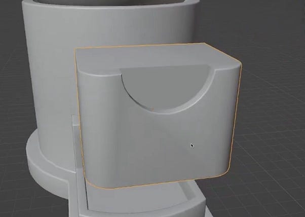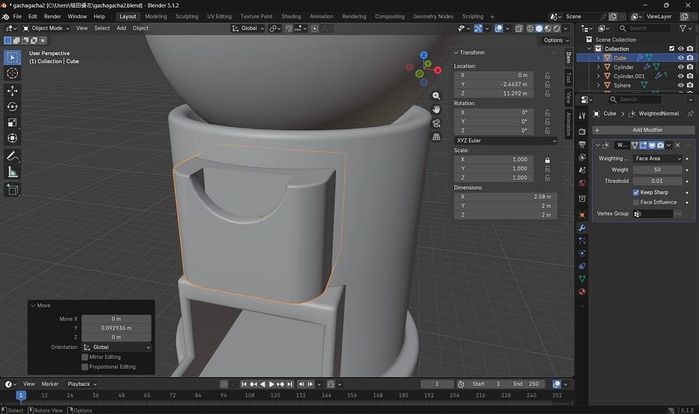

三角形の変な影がなくなり綺麗に！✨

また、ガチャガチャの色付けにおいて、動画内では透明にするためにBlender3.5バージョンのスクリーンスペース反射機能が使われていましたが、私が使用していたBlender5.1.2のバージョンではその機能がなくなっていたため、同じような質感にするにはどうしたら良いかGoogleで調べました。結果、現在のバージョンでは、他の設定は動画と同じようにしつつ、レイトレーシングにチェックを入れることで透明になると分かりました。

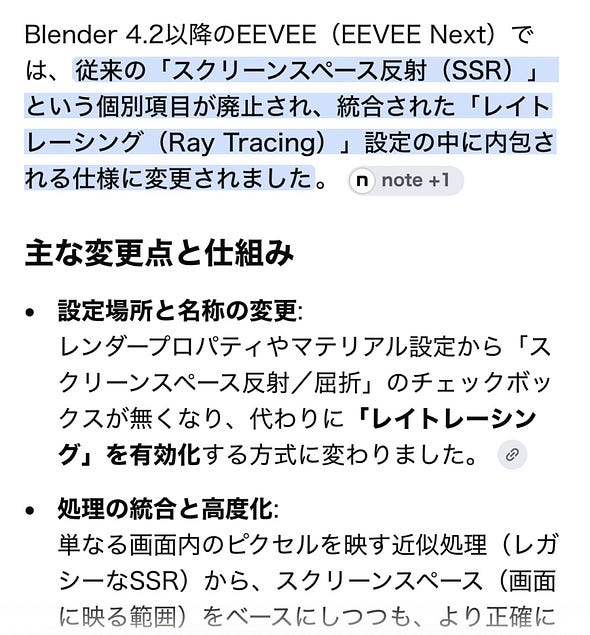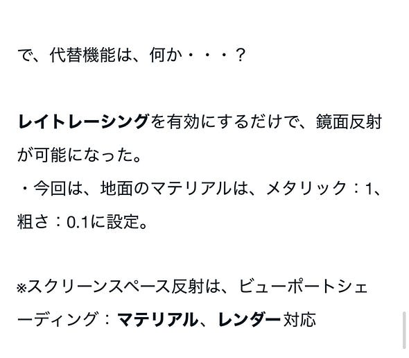

Googleで検索！

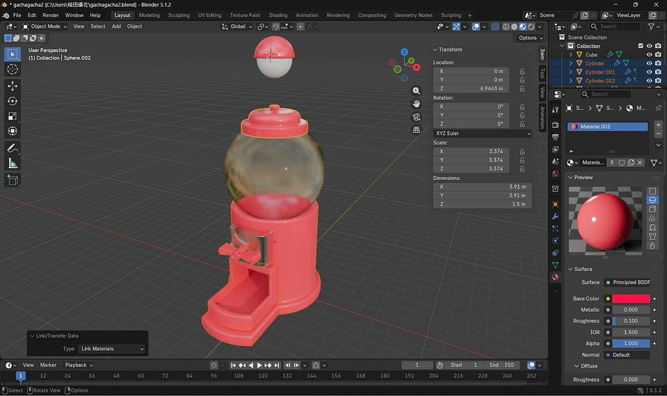

プラスチックのような質感にすることができた

今回このようなハプニングはありましたが、現バージョンでは無くなってしまった機能も、改良されて新しい名前になっているようなので、GoogleやAIに質問しながら進めるとすぐに前のバージョンにあった機能の代わりを探せると感じました。

来週はガチャガチャカプセル16個の複製とそれぞれの色付けの部分から完成までいきたいです！そして、次回からはガチャガチャ以外のアニメーション探しもはじめていこうと思います。

【もえさん】

今回は、うさぎの顔や耳のパーツを制作して、うさぎを完成させました。

耳の内側に重ねるパーツを複製して、丸みや厚さを調整しながらぷっくり見えるようにしました。

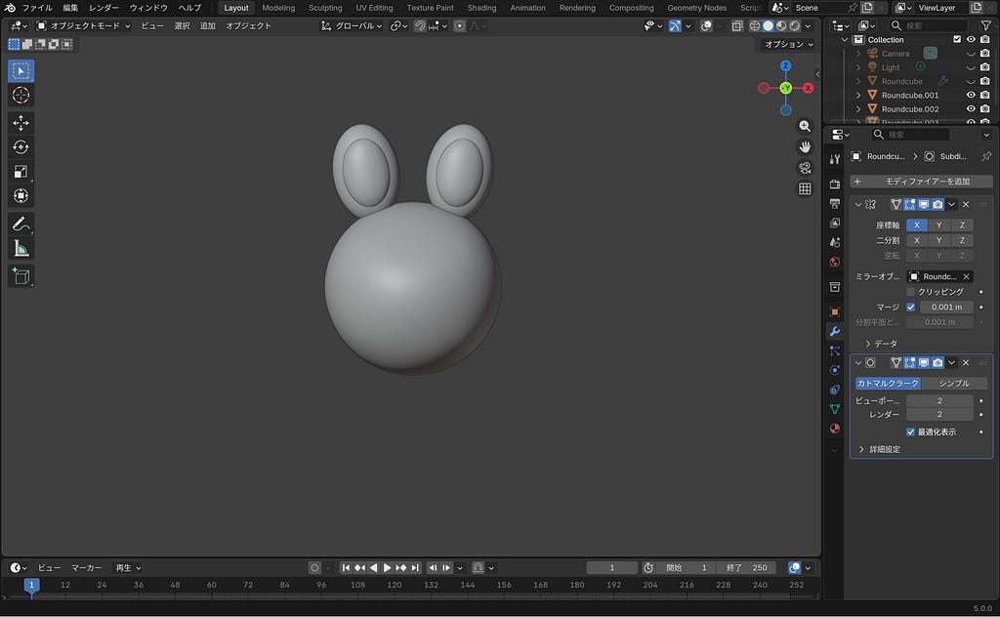

今回1番難しかったのは、うさぎの表情です。垂れ目の角度や、目と口の位置関係を何度か修正しながら眠そうな顔にすることができました。

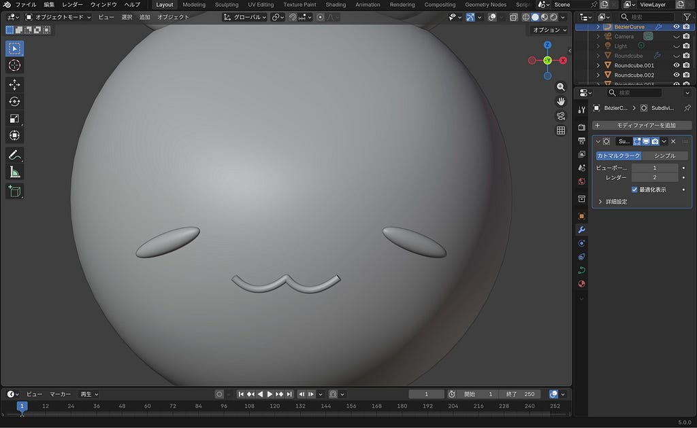

眠そうな顔

口の曲線はベジェ曲線を使用しました。以前制作したりんごのヘタの部分でも使用しましたが、前回よりもスムーズに動かすことができた気がします。

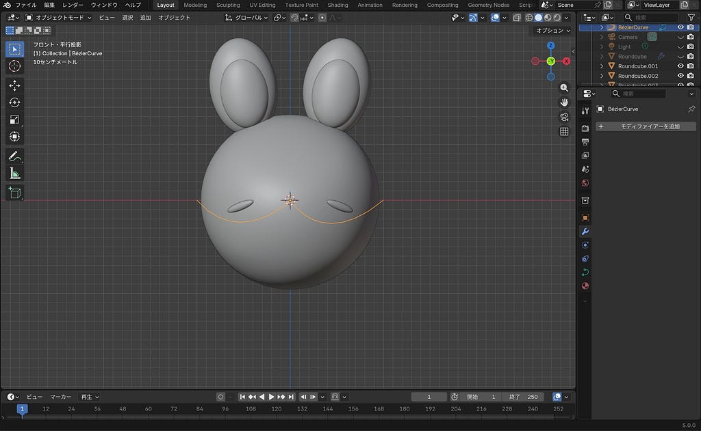

ベジェ曲線

また、正面からだけでなく様々な角度からみて丸みを帯びた形になるようにしました。プロポーショナル編集で、顔の下の部分が少し潰れるようにしました。

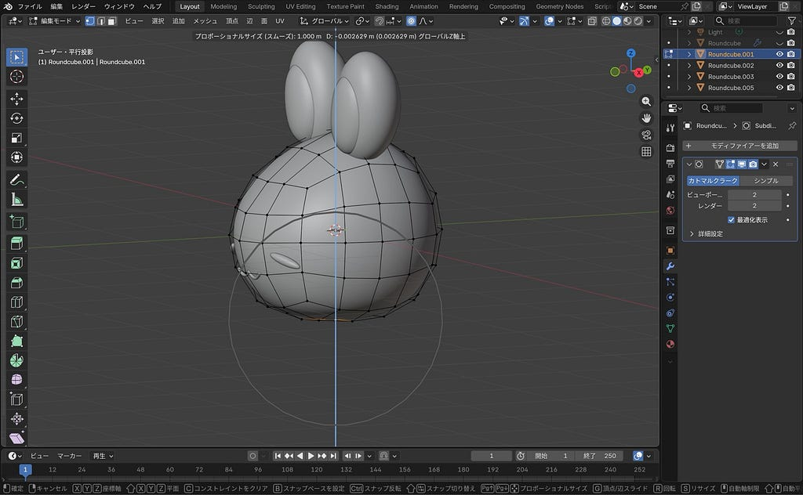

次回は、今回完成したうさぎを、以前制作した月の上に乗せるところからスタートしたいと思います。

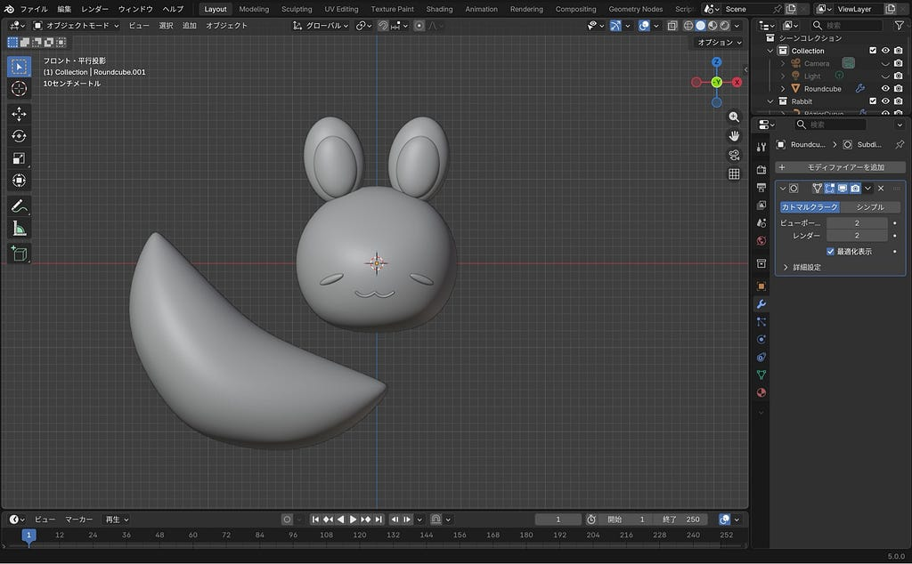

【みわ】

前回の工程（地面のマテリアル設定）から、今回は雨粒のマテリアル設定に移りました。

工程に入る前の状態がこちらです⬇️

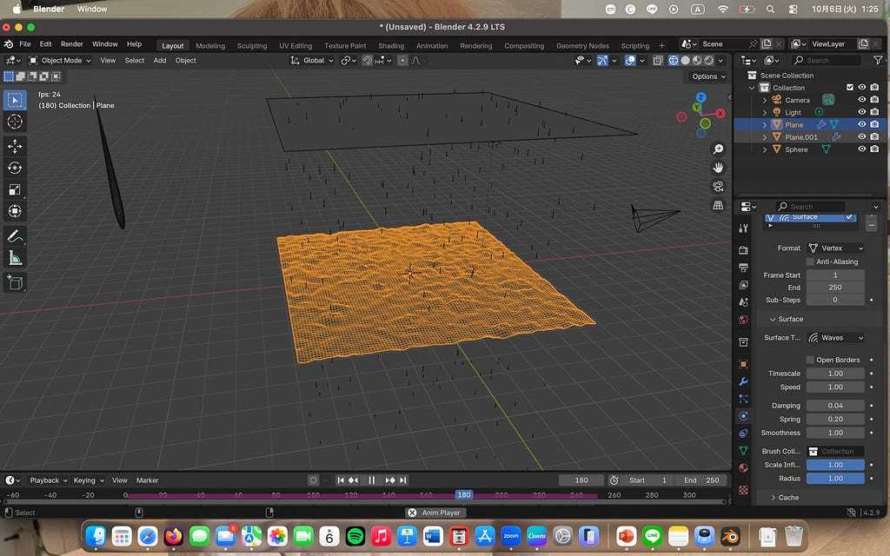

1. 雨粒のマテリアル設定

まずは雨粒に透明感とガラスのような質感を作りました！

工程➡️雨粒オブジェクトの既存ノードを削除し、「グラスBSDF」を追加して接続することで雨粒特有の透明感と光を通す質感を再現

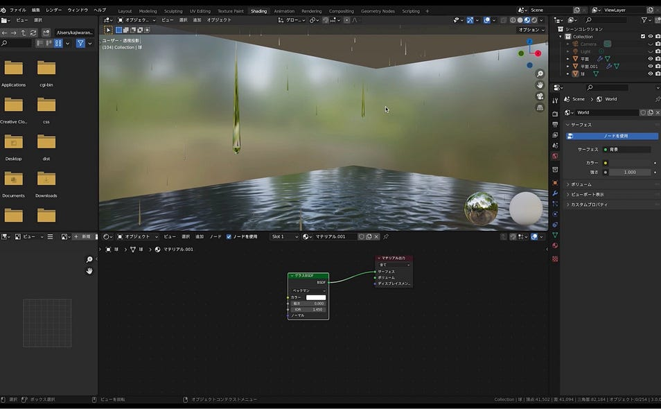

2. 背景の設定

360度に夜景の背景が反映されるようにすることで、よりリアルに雨が降る街を表現しました！

工程➡️ワールドプロパティで「環境テクスチャ」を追加し、夜景画像を読み込む

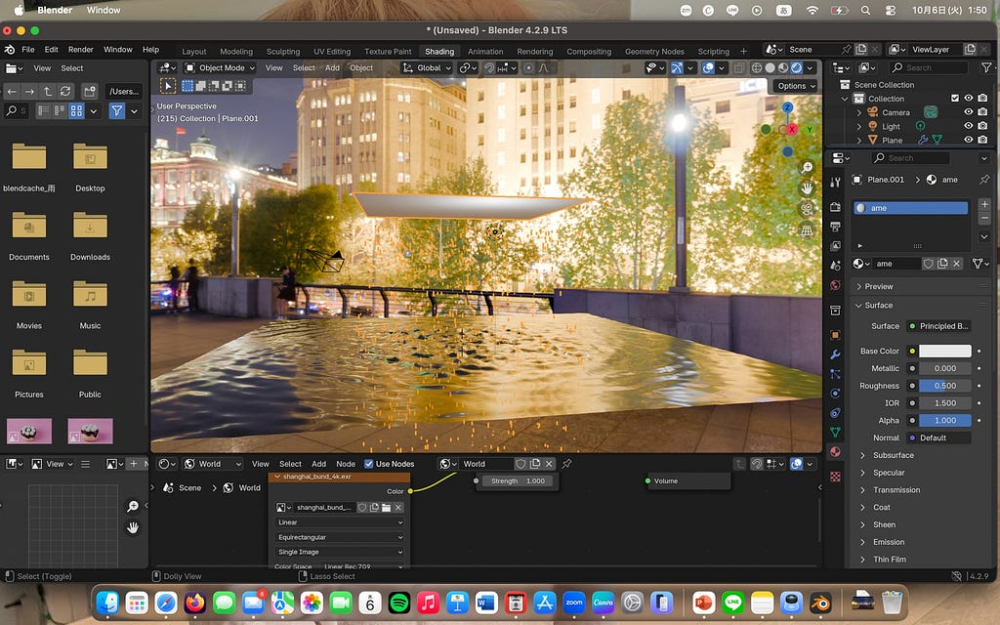

今回背景で使った360度写真は、Poly Havenから引用したものです。

ライセンス的な問題が気になり調べてみたところ、商業的な仕事を含め、どのような使用目的であっても利用可能であり、クレジットや帰属を与える必要もないとのことでした！

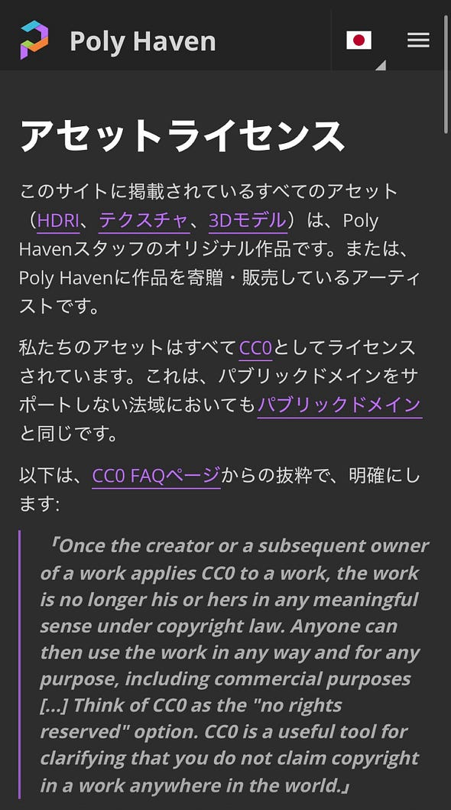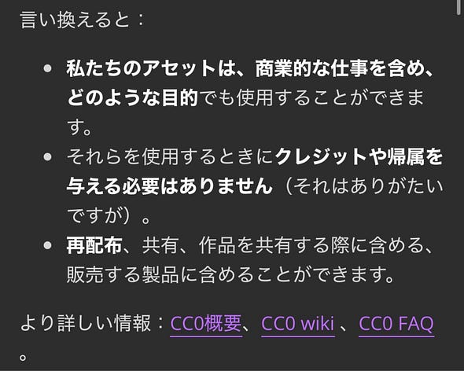

3D業界を盛り上げるために行なっているらしいので、これからもBlenderと共に上手く活用していきたいです。

3. カメラ構図と背景の回転調整

最後に、今回はカメラの画角を決定するところまで行いました。夜景が見える部分を背景にしたかったので、画角を移動させ、カメラワークを決めてみました。

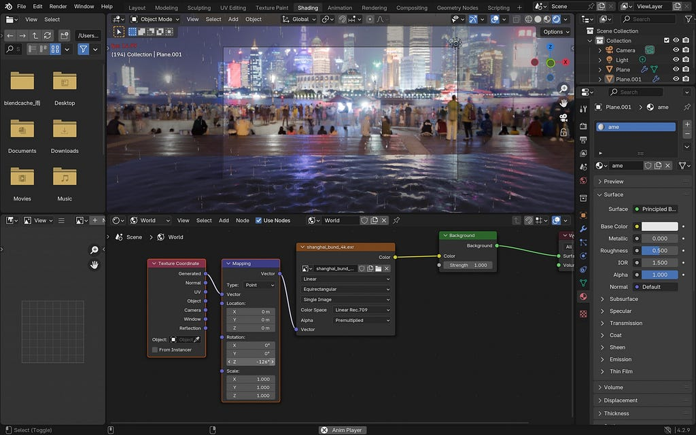

今回作成したアニメーションは、来週には終わる予定なので、よりリアルな雨を表現するため、細かい仕上げ作業に入りたいと思います！初心者でも、雨をこんなにも簡単に表現できることに驚いたと同時に、アニメーションならではの新たな技術を得られてとてもやりがいのある課題でした。

次回は仕上げ作業と、他のアニメーションでの勉強をスタートさせたいです。

> まとめ

今回も各自で出来る限り、課題に取り組みました。

課題の難易度的にもばらつきがあるため、全く同じタイミングで完成にはならないかもしれませんが、今回もお互いのアニメーション作品から新たな知識を得ることができました。また、Blenderの機能が変わり、動画と同じようにならない部分もありましたが、解決方法を模索しながら完成に近づけていこうと思います！

次回も個々の作業になりますが、アニメーションの完成まで見届けて頂けると幸いです🍀

> グラレコ

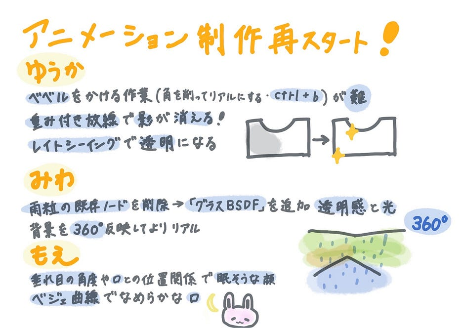

もえ

---

[アニメーション制作を再スタート▶️✨](https://medium.com/furuhashilab/%E3%82%A2%E3%83%8B%E3%83%A1%E3%83%BC%E3%82%B7%E3%83%A7%E3%83%B3%E5%88%B6%E4%BD%9C%E3%82%92%E5%86%8D%E3%82%B9%E3%82%BF%E3%83%BC%E3%83%88-%EF%B8%8F-a8f8ef61ebc0) was originally published in [Furuhashi(mapconcierge)Lab.](https://medium.com/furuhashilab) on Medium, where people are continuing the conversation by highlighting and responding to this story.
