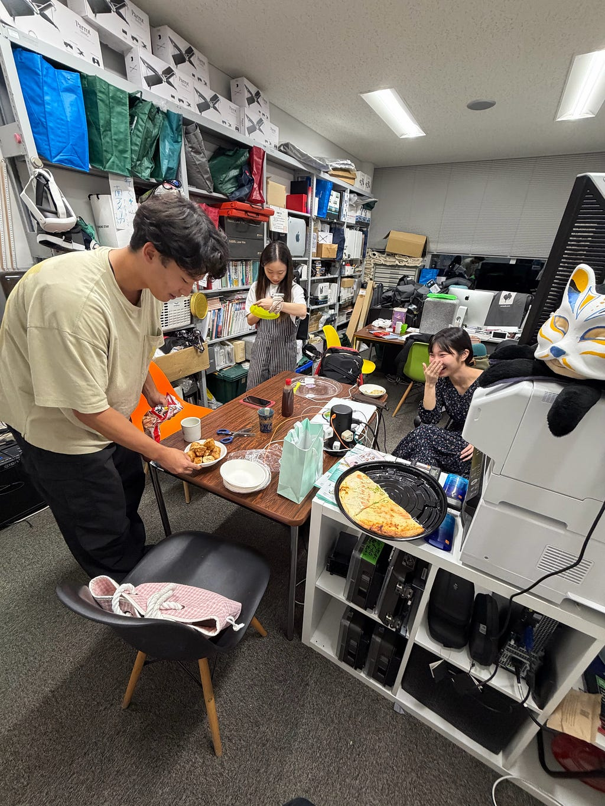
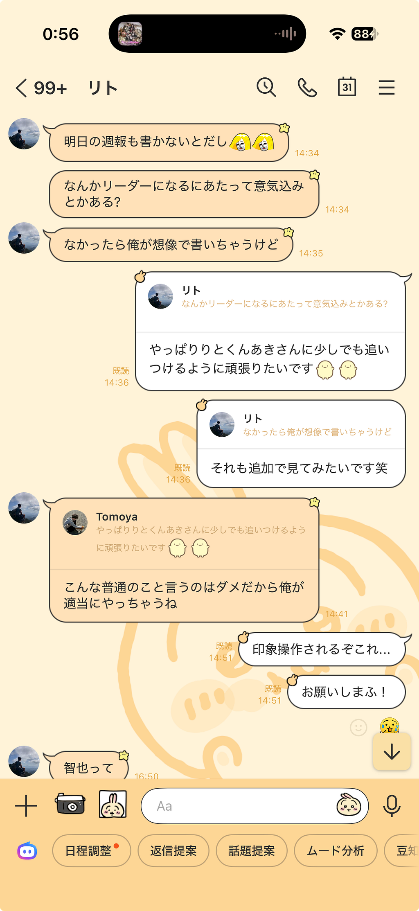
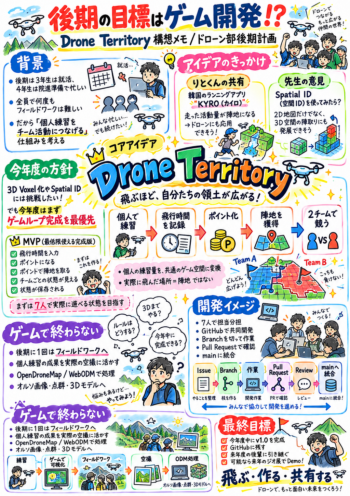

こんにちは！ドローン部2の愛甲です！

夏休みも終わり、もう寒くなってきました。みなさんインフルも流行っているので手洗いうがい頑張りましょう。

金曜日の点灯式の後の研究室の様子

あっという間に夏が終わってしまい、とても悲しいです。  
音楽が大好きな自分はその季節にハマってた曲でプレイリストを作ってるので興味ある人この夏のプレイリスト見てみてください↓  
(今年の夏一番聴いたのはDaichi YamamotoとJJJのガラスの京都っていう曲

<https://music.apple.com/jp/playlist/%E3%81%AA%E3%81%A4/pl.u-oZyl3MgFGzKAAJW>

さてさて、ドローン1の週報ではりとくんが素晴らしいリーダー誕生の裏側をお届けしてくださいました。

「ドローン部のアプリ開発に関して話したかったのですが  
智也さんが率いるドローン部２が全部話すからと指示が降りたので  
話す内容を絞り出したのです😭」っていってるけど俺に全部押し付けてるのみんなにバラしちゃうよりとくん😢

真面目に答えたらダメとかいってきたのにリトくんの記事見たらバカ真面目みたいな目標になってて。やっぱりいじめだよこれは、、、

#### 後期の目標はゲーム開発!?

そんなことはさておき、早速後期どんなことをしていくのかお話ししましょう。

後期のドローン部について、ここ最近ずっと「何を目標にするのがいいんだろう」と考えていました。

みんなから最初に出ていた案は、大きく分けると2つ。

1つ目は、横瀬など実際のフィールドにみんなで行き、ドローンで空撮をして、撮影した画像をOpenDroneMapやWebODMで処理する活動。

もう1つは、研究室でClaude CodeやCodexなどのAIコーディングツールを使える環境が整ってきたこともあり、ドローンやGISと組み合わせたWebアプリを開発してみる活動です。

できることならどっちもやりたい。

ただ、後期のスケジュールを考えると、そこまで簡単ではありません。

3年生は就職活動が本格化してきて、りとくんあきさんも大学院進学に向けた準備があります。

全員で予定を合わせて何回もフィールドワークに行く、という活動は現実的にはかなり難しそうです。

そこで途中から、

**「みんなで集まれる回数が少ないなら、個人練習を中心にして、その個人練習をチーム活動につなげるのは？」**

と考えるようになりました。

#### 個人練習をどうやって「部の活動」にする？

ドローンは、結局飛ばさないと上手くなりません。

ホバリング、対面飛行、8の字飛行、撮影など、全員で集まる日だけ練習するより、各自が少しずつでも飛ばした方が操縦技術は上がると思っています。

ただ、個人練習には一つ問題があります。

**一人で練習していると、ドローン部としての活動が見えづらい。**

誰がどのくらい練習したのか分からないし、自分が練習したことがチームにどう貢献しているのかも見えません。

そこで考えたのが、

**「ドローンの練習をゲーム化できないか？」**

という案です。

現在ドローン部は7人いるので、2チームに分かれて、それぞれが個人で行ったドローン練習の時間をポイントにする。

そして、そのポイントを使って地図上の陣地を広げていく。

最初はそんなかなり単純なアイデアでした。

#### りとくんからもらった「走って陣地を取るゲーム」というヒント

この案を話していたところ、りとくんから、

**「韓国に、走ったところが陣地になるゲームがあるらしい」**

という話を教えてもらいました。

調べてみると、韓国発の **KYRO** (カイロ)というランニングアプリがかなり近い事例としてありました。

<https://kyro.team/>

KYROは、GPSでランニングルートを記録し、走ったコースがループを作ると、その内側のエリアが自分の領土になるというゲームです。

さらに、他の人の領土を奪ったり、クルーで一緒に領土を広げたりする要素もあります。

つまり、

**「運動の記録を、そのまま地図上のゲームに変換している」**

ということ。

これを見たときに、

「さすがりとくん、これ、今回のアイデアに使えそう！」

と思いました。

ただしKYROとは違って、Drone Territoryでは実際に飛んだ場所そのものを陣地にする必要はありません。

大学周辺で自由にドローンを飛ばせるわけでもないし、全員が同じ場所で練習するわけでもないからです。

そこで、

**実際の飛行場所とゲーム上の陣地は分離する。**

家で飛ばしても、屋内で飛ばしても、適切な手続きをして屋外で飛ばしても、その「練習量」を共通のゲーム空間に反映する。

この形が今のところ一番現実的だと思っています。

りとくんからKYROのような事例を教えてもらったことで、単なる「飛行時間ランキング」ではなく、

**「活動量を空間として可視化する」**

という方向がかなり具体的になりました。

#### 「飛ぶほど、自分たちの領土が広がる」

このアプリのコンセプトは、

**「飛ぶほど、自分たちの領土が広がる。」**

です。

ドローンを飛ばす  
↓  
飛行時間を記録する  
↓  
ポイントを獲得する  
↓  
チームのポイントになる  
↓  
そのポイントを使って陣地を獲得する  
↓  
2チームで競う

という流れです。

個人でやった練習が、自分だけの活動記録ではなく、

**チーム全体の成果として目に見える。**

ここを一番大事にしたいと思っています。

例えば、

「あと10分飛べば次のマスを取れる」

「今週相手チームに抜かれたから少し練習しよう」

みたいな動機が生まれたら面白い。

ゲームを作ることそのものが目的というより、

**個人練習を続けたくなる仕組みを作ること、そして将来のドローン部、もしくは世間の人にも使ってもらえるもの。**

がこのアプリの本当の目的です。

#### 先生から出てきた「空間ID」というアイデア

そして、この企画について先生とも話したところ、

**「空間IDを使ってみるのはどうか」**

という意見をいただきました。

ここから、この企画が一気に「地図上の2D陣取り」から「3D空間の陣取り」に広がっていきました。

最初、自分の中ではMapLibreでB棟周辺にグリッドを表示して、そのマスを取り合うくらいのイメージでした。

でも考えてみると、ドローンは地面の上を移動するものではなく、

**3次元空間を飛ぶものです。**

だったら、

「地面のマスを取るゲームより、空間そのものを取るゲームの方がドローンらしいのでは？」

という話になりました。

そこでりとくんに解説してもらったのが **Voxel（ボクセル）** です。

教室などの3D空間を、小さな立方体のブロックに分けます。

例えば、

Voxel (x, y, z)

という形で管理して、

Team AがこのVoxelを持っている、Team Bがその上のVoxelを持っている、といった形で立体的に陣取りをする。

そうすると、

**「土地を開拓するゲーム」ではなく「空間を開拓するゲーム」**

になります。

先生から空間IDという視点をいただいたことで、

Drone Territoryの「ドローンだからこそ3D空間を使う」という特徴がかなり見えてきました。

#### ただし、空間IDを最初から全部実装するのは危ない

空間IDというアイデアはかなり面白い。

ただ、ドローン部のLINEで話していくうちに、

**「これ、今年度中に本当に完成するの？」**

という不安も出てきました（笑）。

なので現段階では、ゲームの基本ロジックはもっとシンプルにして、

Voxel (x, y, z)

のような独自の整数グリッドを使う。

そして各Voxelに、

* 所有チーム
* 取得した人
* 取得日時
* 必要ポイント
* Spatial ID

などを属性として持たせる形がよさそうだと考えています。

つまり、

**ゲームそのものはシンプルなVoxelで動かして、Spatial IDは将来的な拡張性を持たせるために利用する。**

という考え方です。

「空間IDを使わないとゲームが動かない」構造にはしたくありません。

#### 実際に飛んだVoxelを取れたらもっと面白い？

さらに話していると、

「じゃあ、本当にドローンが飛んだ空間をそのまま取得できないの？」

という話にもなりました。

例えば教室を3D Voxelに分割して、

ドローンが実際に、

(3.2m, 2.1m, 1.4m)

の位置を通過したら、

その位置に対応するVoxelを取得する。

これができたらかなり面白いです。

ただ、ここで問題になるのが、

**「室内でドローンの位置をどう取得するのか」**

という部分です。

屋内ではGNSSを使った正確な位置取得が難しいため、

* AprilTag
* UWB
* 外部カメラ
* VIO

など、室内測位の技術が必要になります。

これは研究テーマとしてはかなり面白そうですが、今年度のゲーム完成には明らかに重すぎます。

なので、

**実際の飛行位置とVoxelを連動するのは将来案。**

今年度は、

**練習して得たポイントを使って、自分でVoxelを選んで取得する。**

ここまでで十分だと思っています。

#### じゃあ実際どこで飛ばすの？

ここも大きな問題です。

ドローン部だからといって、大学のキャンパス内で自由にドローンを飛ばせるわけではありません。

全員で同じ場所に集まれる回数も少ない。

なので実際の練習については、

* 自宅など安全な屋内環境
* 大学内で許可された環境
* 適切な申請をした屋外
* フィールドワーク

など、それぞれの環境で行った練習を対象にすることを考えています。

つまり、

**飛ぶ場所はバラバラでも、ゲームの中では同じフィールドで戦う。**

この形です。

これなら、忙しい後期でも個人練習を続けられます。

#### DJIの飛行ログも使える？

もう一つ考えているのがDJIの飛行ログです。

最初のMVP(Minimum Viable Product)では、

「今日は10分飛びました」

と手入力するだけでもいいと思っています。

ただ将来的には、DJI側の飛行ログを読み取って、

**実際の飛行記録 → 飛行時間 → ポイント**

まで自動化できればかなり面白い。

そうなれば、

* 飛行時間
* 飛行回数
* 使用機体
* 飛行距離
* 練習内容

なども活動記録として残せそうです。

ただし、ここでも機体差という問題があります。

高性能なドローンを使っている人だけが有利になるゲームにはしたくありません。

なので最初は、

**1分 = 1pt**

くらいの単純なルールから始める。

その上で実際に7人でプレイしてみて、

「3人チームと4人チームで差が出る」  
「機体によって練習難易度が違う」  
「ただ長時間飛ばせば勝ちになっている」

といった問題が出てきたら補正する。

最初から完璧なポイント制度を考えるより、

**実際に遊んでから変える。**

この方がいいと思っています。

#### とはいえ、全部やったら絶対終わらない

ここまでアイデアを広げていくと、

3D  
空間ID  
DJIログ  
室内測位  
MapLibre  
Supabase  
OpenDroneMap  
ゲーム設計

と、かなり盛りだくさんになりました。

自分でも、

「これ全部やったら絶対終わらないな」

と思っています（笑）。

先輩からも、

**「多少妥協するところはあっても、今年度中に完成させた方がいい」**

という意見をもらいました。

これもかなり重要だと思っています。

大きな夢だけ残して未完成のまま後輩に、

「続きよろしく！」

と渡すより、

**今年度でちゃんと遊べるv1.0を完成させる。**

その上で、

3D化  
空間ID  
DJIログ  
室内測位

などを来年度以降に拡張してもらう。

この方が、引き継ぐ側も圧倒的に入りやすいと思います。

#### 今年度のMVP

そこで、今年度はMVPをかなり絞ります。

Drone TerritoryのMVPは、

**飛行時間を入力  
→ ポイントになる  
→ ポイントで陣地を取る  
→ チームごとの陣地が見える  
→ 状態が保存される**

ここまで。

具体的には、

* ユーザーを登録できる
* 2チームに所属できる
* 飛行時間を入力できる
* ポイントが計算される
* ポイントを使って陣地を取得できる
* チームごとの所有状態が見える
* 他の端末でも同じ状況を確認できる
* ページを閉じても記録が残る
* 7人で実際にゲームとして遊べる

ここまでできれば、

**Drone Territory v1.0完成**

としたいです。

#### 開発自体もドローン部の活動にする

今回もう一つやってみたいのが、

**GitHubを使った7人での共同開発です。**

Claude CodeやCodexが使えるようになったからこそ、

「AIにアプリを全部作ってもらう」

ではなく、

**AIを使いながら、人間同士でどう開発するか**

も経験したいです。

GitHub上で、

Issue  
↓  
Branch / Fork  
↓  
開発  
↓  
Commit  
↓  
Push  
↓  
Pull Request  
↓  
Review  
↓  
Merge

という流れを実際に回していきます。

担当についても、

* MapLibre・陣取り
* DJIログ・飛行時間データ
* UI・ゲームルール
* GitHub・README・全体統合

などに分ける予定です。

完全に分業するというより、それぞれが主担当を持ちながら、お互いのIssueやPull Requestを確認して進める。

これ自体も、後期で身につけたいスキルの一つです。

#### OpenDroneMapももちろんやりたい

アプリの話ばかりしていますが、ドローン部なので実際のフィールドワークもやります。

後期に全員でフィールドワークへ行けるのは、おそらく1回程度。

だからこそ、その1回に普段の個人練習の成果を持っていきたいです。

空撮したデータをOpenDroneMapやWebODMで処理して、

* オルソ画像
* 点群
* 3Dモデル

などを作る。

つまり、

**個人練習  
→ Drone Territoryで可視化  
→ 操縦技術向上  
→ フィールドワーク  
→ 空撮  
→ OpenDroneMap / WebODM**

という流れです。

ゲーム開発と実際のドローン活動が別々ではなく、つながる形にしたいです。

#### 最後はジオ展でDemoするとかも面白い！？

りとくんに言われた、「アウトプットの場所がないようじゃ無理か、アウトプットはね、しとかないと。」さすがりとくん。まだまだ自分の中で抜けてる視点がたくさんあるなあとか思いながら、じゃあどこがいいかなって思った時、ジオ展で発表とかも面白いんじゃないかって思って。

* Webアプリ公開
* GitHub公開
* README・開発資料
* Mediumで開発記録
* 7人でのプレイテスト
* OpenDroneMapの成果
* 後輩への引き継ぎ

などを残します。

そして個人的には、

**来年のジオ展でDrone TerritoryをDemoしたい。**

と思っています。

来場者の前で、

「ドローンを練習するとポイントが増えて、そのポイントで空間を取れるんです」

と実際に操作して見せられたら、かなり面白いと思います。

特に先生からいただいた空間IDのアイデアまで発展させて、3D空間のVoxelがチームごとに色分けされていたら、かなり展示映えしそうです。

#### 一人で考えていた企画から、みんなのアイデアが入った企画へ

今回この企画を考えていて面白かったのが、

最初は自分の中で、

**「飛行時間を記録するアプリを作れないかな」**

くらいの案だったことです。

そこから、

面白いねっていってくれる人がいたり、りとくんからKYROのような「活動を陣取りに変える」事例を教えてもらい、

先生から「空間IDを使ってみる」というアイデアをいただき、

みんなから「今年度中にちゃんと完成させた方がいい」「初心者に触ってもらうこと自体が引き継ぎ改善のチャンスになる」という意見をもらい、

少しずつ今の形になってきました。

まだ完成形は全然見えていません。

むしろ今でも、

「2Dで完成を優先するべきか」  
「3Dまで挑戦するべきか」  
「ゲームとして本当に面白いのか」  
「7人が継続して使ってくれるのか」  
「どこまでを今年度の完成条件にするのか」

かなり迷っています。

でも、これも含めて後期の活動だと思っています。

最初から完璧な仕様を決めるのではなく、

**作る  
→ 使う  
→ 意見をもらう  
→ 失敗する  
→ 改善する  
→ 公開する**

を繰り返す。

そして最後には、

**「Drone Territory v1.0完成しました！」**

と言えるところまで持っていきたいです。

後期のドローン部、ドローンを飛ばすだけではなく、ゲーム開発まで始まりそうです。

どうなるか自分もまだ分かりませんが、かなり楽しみです。

P.S.  
りとくん、当たりつよくなったとかいってるけど全然そんなことないです。壊れたイヤホン、れあらと3Dプリンターで作るから待っててね❤️

GPT-5.6 Sol

---

[ドローン部は後期何やるのって](https://medium.com/furuhashilab/%E3%83%89%E3%83%AD%E3%83%BC%E3%83%B3%E9%83%A8%E3%81%AF%E5%BE%8C%E6%9C%9F%E4%BD%95%E3%82%84%E3%82%8B%E3%81%AE%E3%81%A3%E3%81%A6-d50dd92a7fe8) was originally published in [Furuhashi(mapconcierge)Lab.](https://medium.com/furuhashilab) on Medium, where people are continuing the conversation by highlighting and responding to this story.
